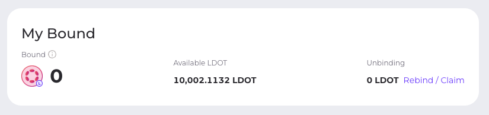

# Validator Candidate Guide

To become an LDOT validator, candidates must bond LDOT as insurance. Once 10,000 LDOT is bonded, the validator becomes eligible for voting in the Validators section. This bond can be slashed, therefore proceed only if you fully understand the risks. Eligibility does not guarantee selection as only the top 16 validators, chosen by LDOT nominators, are included in the active set.

### How to Start a Candidate

1. Visit [https://apps.acala.network/ldot/candidates](https://apps.acala.network/ldot/candidates) or select the Candidates tab within the Liquid Staking tab on the Acala dApp.&#x20;

<figure><figcaption></figcaption></figure>

1. Click Add Candidate, enter your validator address, the amount to bind, (minimum of 1000 LDOT) and click Submit.&#x20;

<figure><figcaption></figcaption></figure>

3. Confirm your bounded amount.&#x20;

<figure><figcaption></figcaption></figure>

### How to Bind or Unbind

1. Visit [https://apps.acala.network/ldot/candidates](https://apps.acala.network/ldot/candidates) or select the Candidates tab within the Liquid Staking tab on the Acala dApp.

<figure><figcaption></figcaption></figure>

2. Click Add/Remove on your active validator or validator candidate.

<figure><figcaption></figcaption></figure>

3. Select the Add tab if you wish to bind or the Remove tab if you wish to unbind.

<figure><figcaption></figcaption></figure>

4. Submit and confirm your transaction. _Note: the unbinding process takes 14 days._&#x20;

### How to Rebind or Claim

1. Visit [https://apps.acala.network/ldot/candidates](https://apps.acala.network/ldot/candidates) or select the Candidates tab within the Liquid Staking tab on the Acala dApp.

<figure><figcaption></figcaption></figure>

2. On the My Bound section, select Rebound/Claim

<figure><figcaption></figcaption></figure>

3. With the Rebind tab active, the timers of your active unbounding transactions are displayed, you may choose to select the transactions you wish to rebind.

<figure><figcaption></figcaption></figure>

4. With the Claim tab active, you can see the claimable LDOT that has completed the unbounding period.&#x20;

<figure><figcaption></figcaption></figure>

5. Rebind or Claim your tokens and confirm the transaction with your wallet.&#x20;
