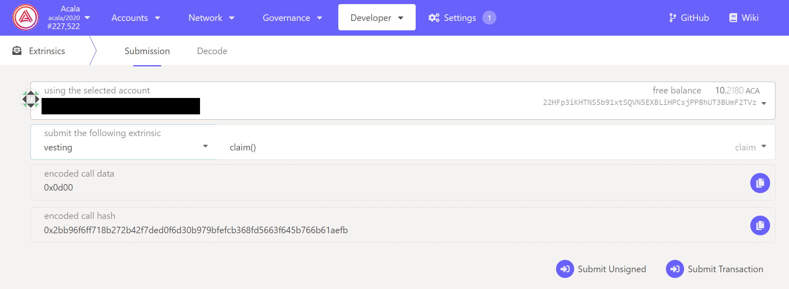

# Balance Type and Vesting

## Balance Types

On Acala there are the following steps balance types

* **Transferrable Balance**: as the name suggests, this balance can be used for transfers, paying fees and performing any actions on-chain.
* **Locked Balance:** this balance is frozen, depending on the scheme, it could be locked for a certain period of time before being transferrable, or it could be vested where a portion of the balance gradually becomes transferrable, or a combination of these. The tokens are released lazily, meaning you are required to perform a `claim` transaction to obtain it. The guide for claiming vested tokens is in the next section.
* **Total Balance:** is the sum of transferrable balance plus the locked balance. The entire balance can be used for governance operations such as voting.&#x20;

## Check & Claim Vested Tokens

### On Polkadot App

Go to the, [Polkadot App - Acala Parachain - Accounts section](https://polkadot.js.org/apps/?rpc=wss%3A%2F%2Facala-rpc-2.aca-api.network%2Fws#/accounts) and expand the balance of your account. If there's a vested (locked) balance, it will be displayed.


Go to the `Developer - Extrinsics` section, use the account that you want to claim the vested balance. Select `vesting` then `claim()` in the `submit the following extrinsics` filed, then click the `Submit Transaction` button to complete the process.



### Check Vesting

Go to the `Developer - Chain state` section, select `vesting` then `vestingSchedules()` , then select your account, then click the `+` button to see what vesting schedule it has.


Below is an example result

* `start`: the tokens are locked until **Polkadot block #**
* `period`: release period e.g. release every block or every 432,000 block as in the example
* `periodCount`: how many vesting periods
* `perPeriod`: how much to release each period

```
[
  {
    start: 13,795,200
    period: 432,000
    periodCount: 12
    perPeriod: 100 ACA
  }
]
```
