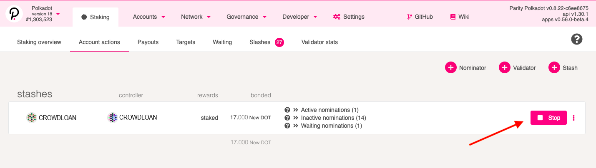
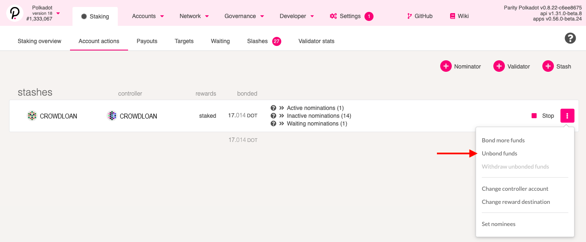

# Unstaking Your DOT Tokens on Polkadot.{js} Extension

You will need to unstake your DOT tokens prior to contributing to the crowdloan module. For recently unstaked DOT tokens, Polkadot has a delayed exit period (28 days), which serves as a cooldown. After the 28 day period has ended, you can claim your DOT and contribute them to the Acala crowdloan.

## Step 1: Stop nominating (staking)

1.Open [Polkadot{.js}](https://polkadot.js.org/apps/#/explorer) and connect to the Polkadot network. Then in the navigation bar at the top of the page, click on the `Network` dropdown and select `Staking`.

2\. Click on `Account actions` in the white sub-header towards the top of the screen. Then click `Stop` (towards the right of the screen) on the account that you’d like to unstake.

3\. Click `Sign and Submit` in the bottom right corner to authorize the transaction. Your browser extension will prompt you to enter your password and sign the transaction. You have now stopped nominating, but your tokens remain bonded.

## Step 2: Unbonding

4.To unbond your tokens, click on the ellipses (three dots) on the right-hand side of the page and click `Unbond funds`.

5\. Enter the amount you’d like to unbond and then click `Unbond`. Sign and submit the transaction.

6\. If done successfully, there should be a clock icon next the amount you requested to be unbonded. You can hover over the icon to see how much longer until the tokens are fully unlocked, which is approximately 28 days.

## Step 3: Claiming

7\. Once the 28 days have passed, return to `Account actions`, click on the three ellipses, and select `Withdraw unbonded funds`. This will make your DOT transferable. Note that even  though it says “withdraw,” your DOT won’t be leaving your account.

8\. Sign and submit the transaction.

9\. You can return to `My Accounts` and select the dropdown next to balance to see that your DOT are now transferable. You can now contribute to the Acala crowdloan.\
