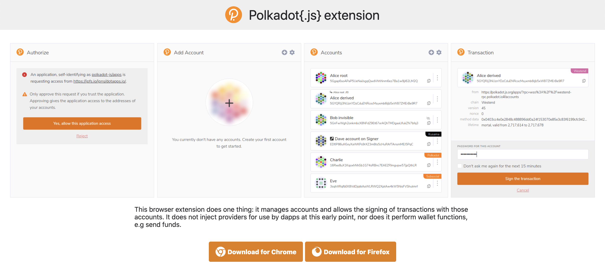
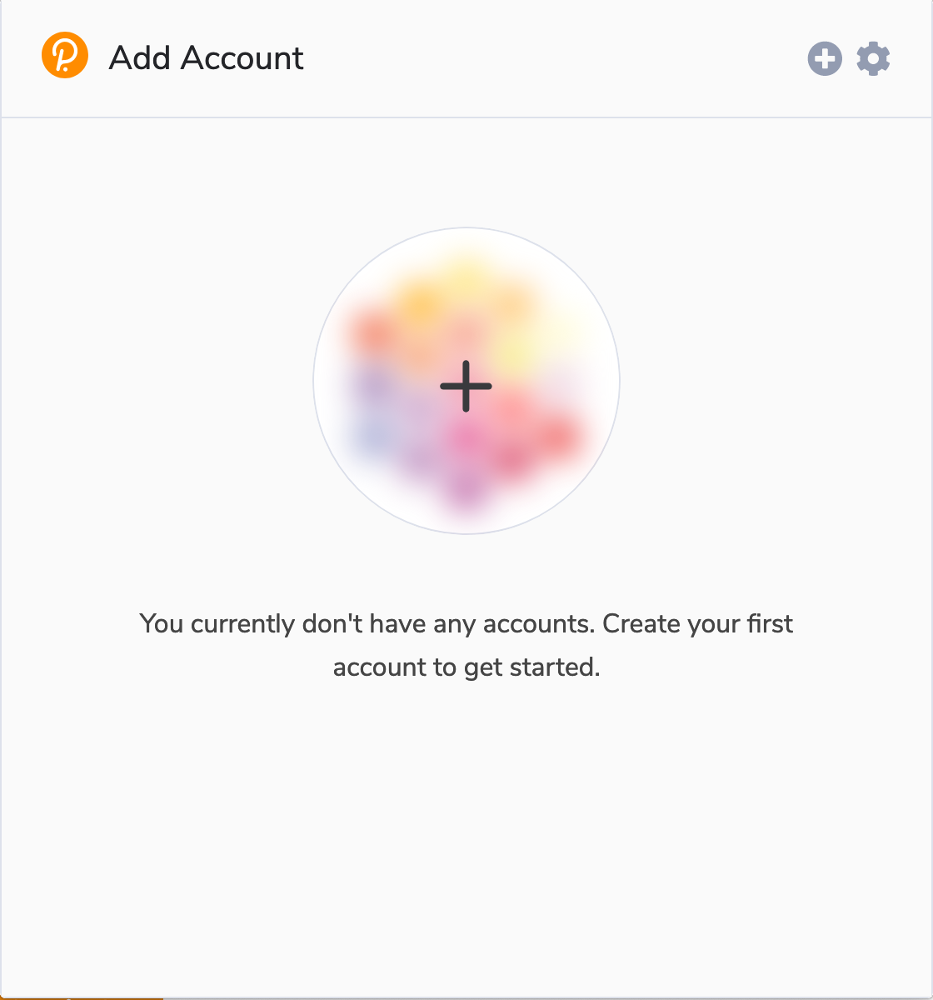
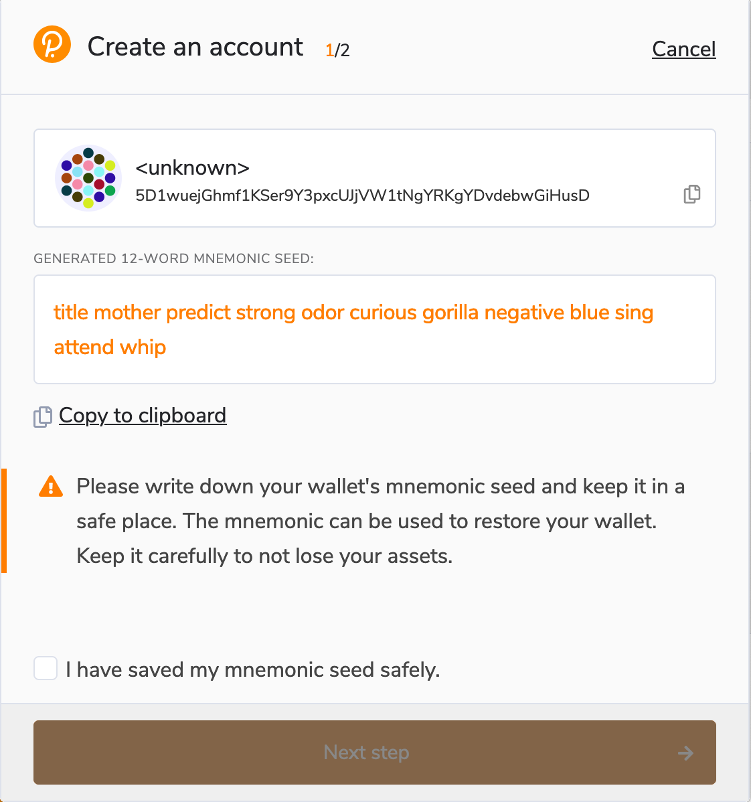
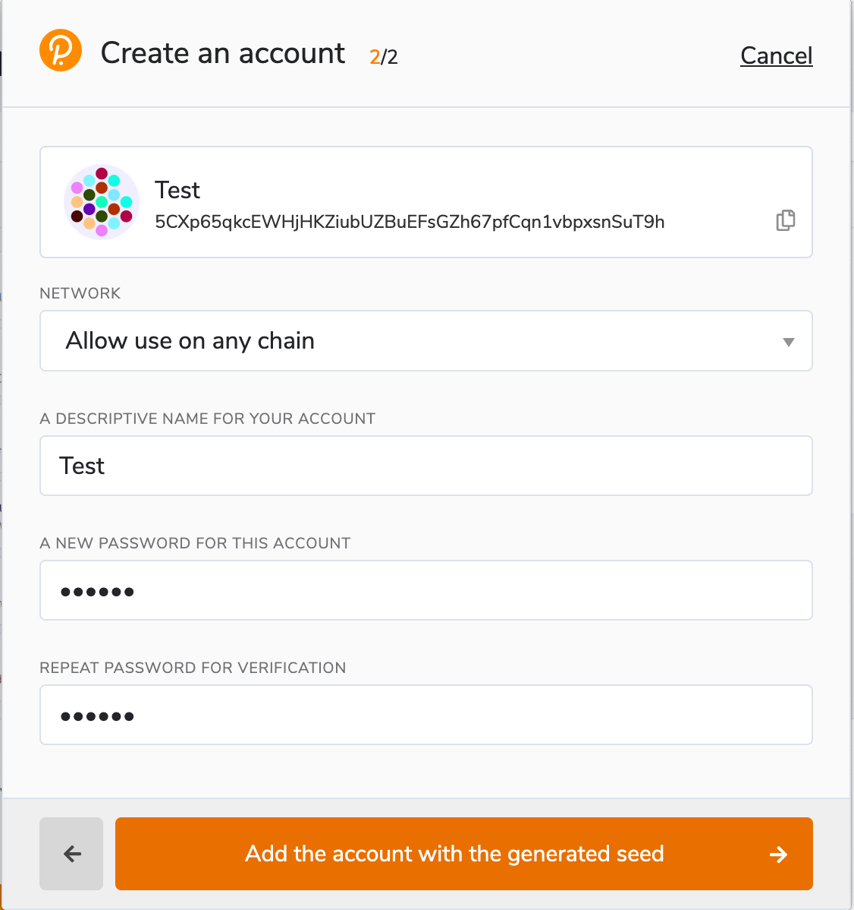
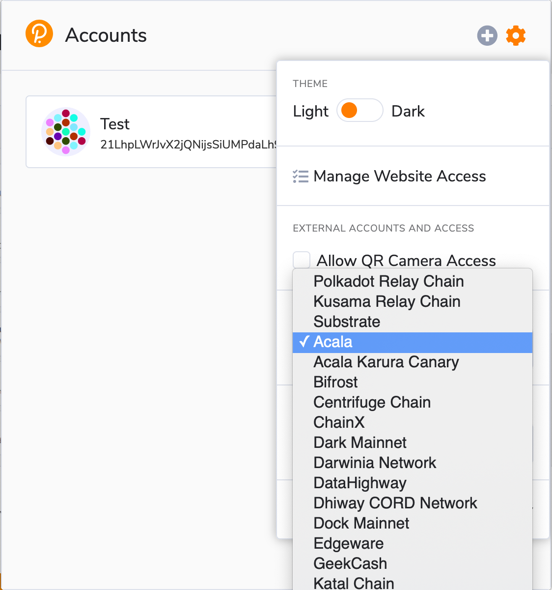
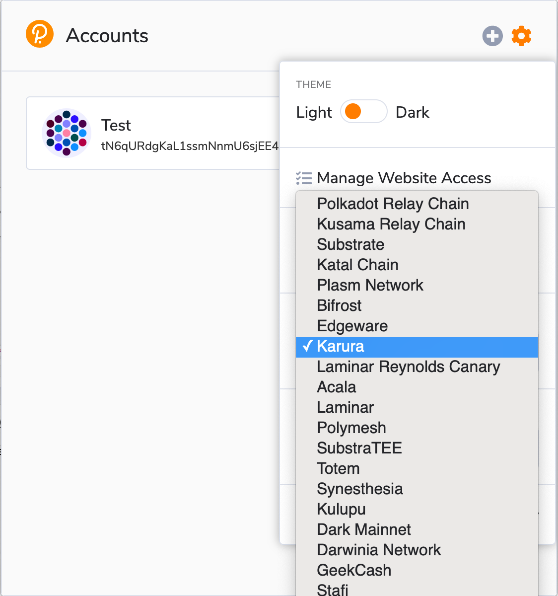
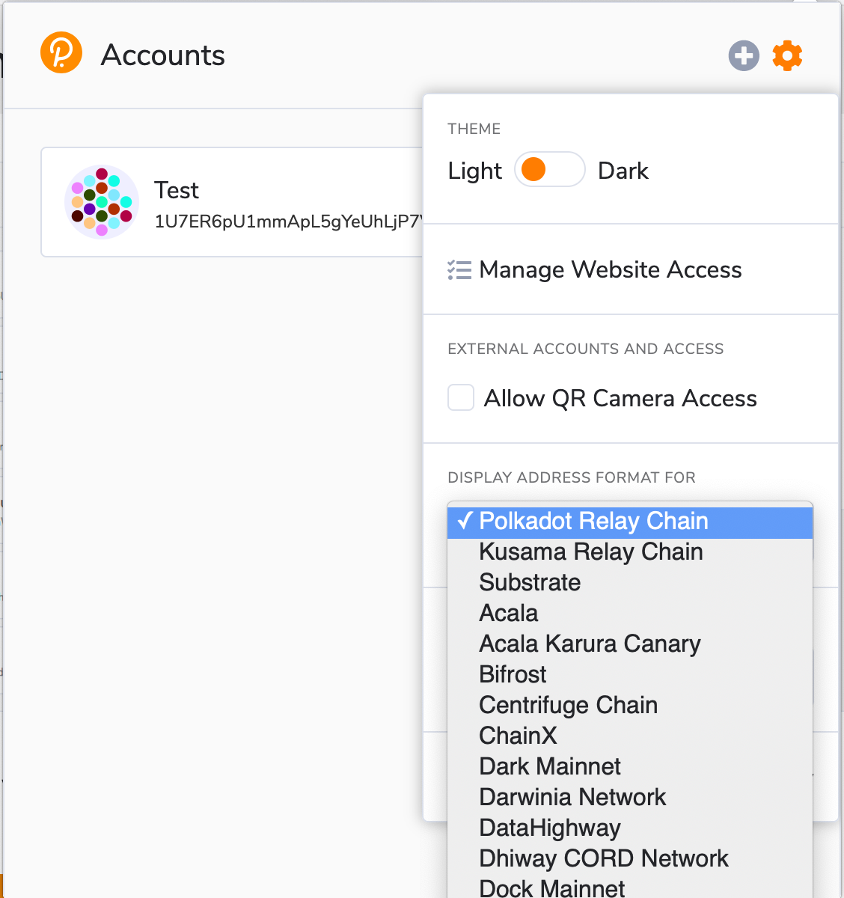
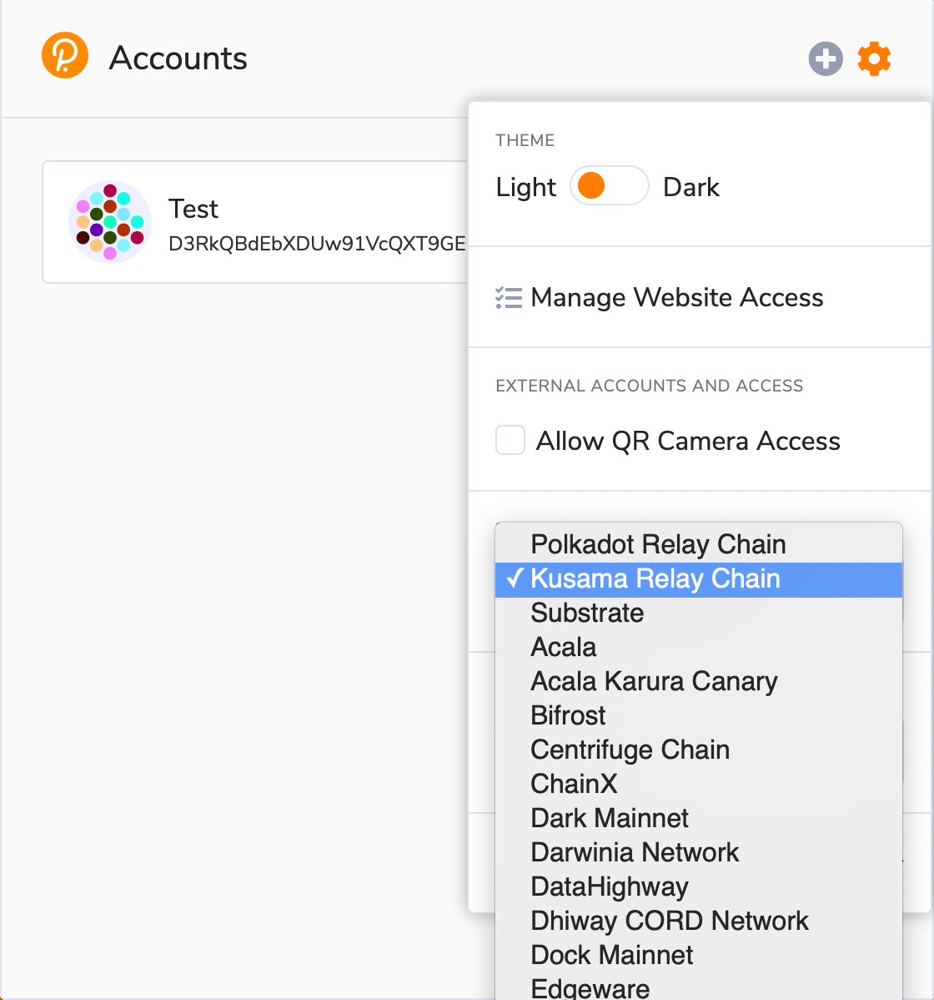

# Acala Account

This document covers the basics of Acala, Karura, Polkadot and Kusama account addresses.

## Address Format

Acala and Karura use the Substrate-based chain address format SS58. Read more [here](https://wiki.polkadot.network/docs/en/learn-accounts).

* Acala addresses usually but not always start with the number 2.
* Karura addresses could start with a small letter like l, r, p, q, o...
* Polkadot addresses always start with the number 1.
* Kusama addresses always start with a capital letter like C, D, F, G, H, J...
* Generic Substrate addresses start with 5.

## Existential Deposit

Karura uses an [_existential deposit_ (ED)](https://wiki.polkadot.network/docs/learn-accounts#existential-deposit-and-reaping) to prevent dust accounts from bloating state. If an account drops below the ED, the state of this account will be removed from the blockchain to preserve scarce on-chain storage resources. The balance on this account will be removed and donated to the Treasury. You still retain access to the account, but it no longer has an on-chains state.

**Transfers:** when you transfer an amount from account A to account B

* if after the transfer, account A's balance is below ED, it will be removed. So make sure to leave enough balance on account A to keep it alive.
* if account B has no balance, and the transfer amount is below ED, account B would be as if never receive any amount, because its state would be removed from the chain. So make sure to send enough amount to keep a fresh account alive.

**Swap**: when you swap token A for token B, if token A balance then falls below ED requirement, then the transaction might fail. Anyone can build a front-end using acala.js SDK to facilitate this transaction and check ED for you, but you shall always be aware of it.

**Claim rewards**: when claiming LP tokens or other rewards, if the balance is below ED requirement after the claim, then the balance might be wiped.

ED applies to all supported token accounts, and each type of token account e.g. DOT account has its own ED requirement, meaning if DOT account balance is lower than ED, then your DOT balance may get wiped, while all other balances won't be affected.

Any transactions that change the balance of a particular token e.g. swap, then you shall be aware of its ED requirement. Here's the list of ED requirements for currently available tokens on Karura:

* ACA ED: 0.1 ACA
* aUSD ED: 0.1 aUSD
* DOT ED: 0.01 DOT
* LDOT ED: 0.05 LDOT

You can verify the existential deposit of ACA by checking the chain state for the constant `balances.existentialDeposit`

([ED Runtime Code](https://github.com/AcalaNetwork/Acala/blob/35078ea2b2d0e3a3937a075c54d94c77faea2f36/runtime/acala/src/lib.rs#L752-L754))

([ED SDK](https://github.com/AcalaNetwork/acala.js/blob/master/packages/sdk-wallet/src/utils/get-existential-deposit-config.ts))

## Account Generation&#x20;

Before the network is live, and during the initial launch period, below is the only recommended method for generating an Acala and Karura account:

* Polkadot{.js} Browser Plugin&#x20;

## Polkadot{.js} Browser Plugin&#x20;

### Install the Browser Plugin

The browser plugin is available for both [Google Chrome](https://chrome.google.com/webstore/detail/polkadot%7Bjs%7D-extension/mopnmbcafieddcagagdcbnhejhlodfdd?hl=en) (and Chromium based browsers like Brave) and [FireFox](https://addons.mozilla.org/en-US/firefox/addon/polkadot-js-extension). Download the plugins [here](https://polkadot.js.org/extension/).

### Create Account

Open the Polkadot{.js} browser extension by clicking the logo on the top bar of your browser. You will see a browser popup not unlike the one below

Click the big plus button or select "Create new account" from the small plus icon in the top right. The Polkadot{.js} plugin will then use system randomness to make a new seed for you and display it to you in the form of twelve words.

You should back up these words as [explained here](https://wiki.polkadot.network/docs/en/learn-account-generation#storing-your-key-safely). It is imperative to store the seed somewhere safe, secret, and secure. If you cannot access your account via Polkadot{.js} for some reason, you can re-enter your seed through the "Add account menu" by selecting "Import account from pre-existing seed".

### Name Account & Password

The account name is arbitrary and for your use only. The password will be used to encrypt this account's information. You will need to re-enter it when using the account for any kind of outgoing transaction or when using it to cryptographically sign a message.

Note that this password does NOT protect your seed phrase. If someone knows the twelve words in your mnemonic seed, they still have control over your account even if they do not know the password.

### Set Address for Acala Mainnet

Now we will ensure that the addresses are displayed as Acala mainnet addresses.

Click on "Options" at the top-right corner of the plugin window, and under "Display address format for" select "Acala".

**Your address's format is only visual** - the data used to derive this representation of your address are the same, so **you can use the same address on multiple chains**.&#x20;

You can copy your address by clicking on the account's icon.

### Set Address for Karura Mainnet

Click on "Options" at the top-right corner of the plugin window, and under "Display address format for" select "Karura".

**Your address's format is only visual** - the data used to derive this representation of your address are the same, so **you can use the same address on multiple chains**.&#x20;

You can copy your address by clicking on the account's icon.

### Set Address for Polkadot Mainnet

Click on "Options" at the top-right corner of the plugin window, and under "Display address format for" select "Polkadot".

**Your address's format is only visual** - the data used to derive this representation of your address are the same, so **you can use the same address on multiple chains**.&#x20;

You can copy your address by clicking on the account's icon.

### Set Address for Kusama Mainnet

Click on "Options" at the top of the plugin window, and under "Display address format for" select "Kusama".

**Your address's format is only visual** - the data used to derive this representation of your address are the same, so **you can use the same address on multiple chains**.&#x20;

You can copy your address by clicking on the account's icon.

### Convert Address for different chain formats

You can use the [Subscan Address Transform tool](https://polkadot.subscan.io/tools/ss58\_transform) to convert your address between the different chain formats.

Enter any address in the input box on the left-hand side, then click **`Transform`** button, you can see address formats for all chains on the right-hand side.

## **Polkawallet**

### **Install Polkawallet App**

Download the Polkawallet app via [its official website](https://polkawallet.io). The app is available through the Apple App Store for iOS devices, Google Play for Android devices, and as Android APK.

### Create Account

1. Click on the "Create Account" button.

2\. A new screen will appear explaining the importance of recording your mnemonic phrase in a safe place. Click the "Next" button.

‌3. Your mnemonic phrase will appear. Write the mnemonic on a piece of paper and store it somewhere safe. Click on the "Next" button.

4\. Confirm your mnemonic by entering the words in the correct order. Click on the "Next" button when completed.

### **Name Account & Password**

Name your account and create a strong password (at least 6 characters). Click on the "Next" button when completed.

Your wallet is now set up! The screen will default to the Polkadot network. You can determine which network you're connected to by looking at the grey text under the account name. In the case of this screenshot, it says "Polkadot."

### Set Address for Polkadot Mainnet

1. Click the menu button on the top-right corner.

&#x20;

2\. In the opened menu select the Polkadot logo, then press on the appeared address on the main screen.

&#x20;

### Set Address for Kusama Mainnet

1. Click the menu button on the top-right corner.
2. In the opened menu select the Kusama logo, then press on the appeared address on the main screen.

### Set Address for Acala Mainnet (Coming Soon)

### Set Address for Karura Mainnet (Coming Soon)&#x20;

&#x20;

### &#x20;
