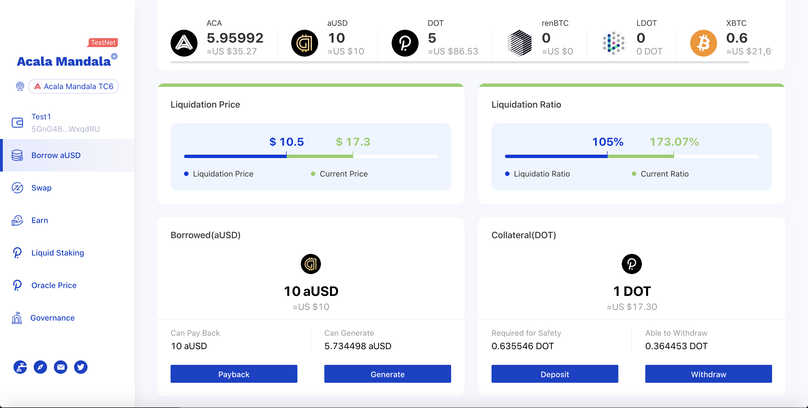

# Try Acala DApp

Try Acala's DeFi Suite on the ETHDenver live testnet

* Set up Polkadot{js} extension (Metamask for Polkadot), and create an account [here](https://wiki.polkadot.network/docs/en/learn-account-generation#polkadotjs-browser-plugin)
* Use this [Get Started guide](https://wiki.acala.network/learn/get-started) to use the applications. Bear in mind ETHDenver DApp and Nodes are different as specified below.
* [Dapp](https://acala-dapp-git-update-acalanetwork.vercel.app/): this deployment connects to the same network (TC6) used for ETHDenver hackathon&#x20;
* [ETHDenver Nodes](https://wiki.acala.network/learn/get-started/public-nodes#latest-ethdenver-nodes)

When first landing on the DApp website, you'd be asked to Upload metadata, click `Upload` and sign the transaction in the Polkadot{js} extension prompt. The extension doesn't have the latest changes of EVM deployment yet - you're in this really early!&#x20;

 (1) (1) (1).png>)

