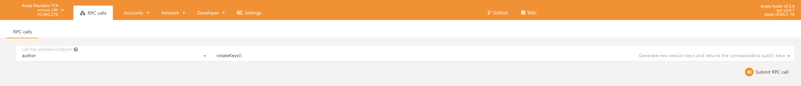
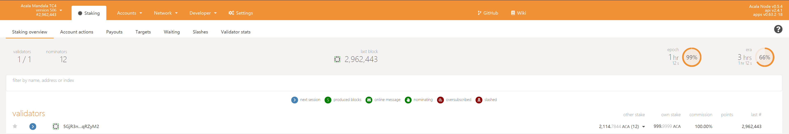

# Node Validator

### Run a Validator \(Acala\)

#### Initial Set-up

The most common way for a beginner to run a validator is on a cloud server running Linux. You may choose whatever VPS provider that your prefer, and whatever operating system you are comfortable with. For this guide we will be using **Ubuntu 18.04**, but the instructions should be similar for other platforms.

The transactions weights in Acala were benchmarked on standard hardware. It is recommended that validators run at least the standard hardware in order to ensure they are able to process all blocks in time. The following are not _minimum requirements_ but if you decide to run with less than this beware that you might have performance issue.

**Standard Hardware**

For the full details of the standard hardware please see [here](https://github.com/paritytech/substrate/pull/5848).

* **CPU** - Intel\(R\) Core\(TM\) i7-7700K CPU @ 4.20GHz
* **Storage** - A NVMe solid state drive. Should be reasonably sized to deal with blockchain growth. Starting around 80GB - 160GB will be okay for the first six months of Acala, but will need to be re-evaluated every six months.
* **Memory** - 64GB.

The specs posted above are by no means the minimum specs that you could use when running a validator, however you should be aware that if you are using less you may need to toggle some extra optimizations in order to be equal to other validators that are running the standard.

#### Install & Configure Network Time Protocol \(NTP\) Client

[NTP](https://en.wikipedia.org/wiki/Network_Time_Protocol) is a networking protocol designed to synchronize the clocks of computers over a network. NTP allows you to synchronize the clocks of all the systems within the network. Currently it is required that validators' local clocks stay reasonably in sync, so you should be running NTP or a similar service. You can check whether you have the NTP client by running:

_If you are using Ubuntu 18.04 / 19.04, NTP Client should be installed by default._

```text
timedatectl
```

If NTP is installed and running, you should see `System clock synchronized: yes` \(or a similar message\). If you do not see it, you can install it by executing:

```text
sudo apt-get install ntp
```

ntpd will be started automatically after install. You can query ntpd for status information to verify that everything is working:

```text
sudo ntpq -p
```

> _WARNING_: Skipping this can result in the validator node missing block authorship opportunities. If the clock is out of sync \(even by a small amount\), the blocks the validator produces may not get accepted by the network. This will result in `ImOnline` heartbeats making it on chain, but zero allocated blocks making it on chain.

#### Synchronize Chain Data

**Note:** By default, Validator nodes are in archive mode. If you've already synced the chain not in archive mode, you must first remove the database with `acala purge-chain` and then ensure that you run Acala with the `--pruning=archive` option.

You may run a validator node in non-archive mode by adding the following flags: `-unsafe-pruning --pruning OF BLOCKS>`, but note that an archive node and non-archive node's databases are not compatible with each other, and to switch you will need to purge the chain data.

You can begin syncing your node by running the following command:

```text
./acala --pruning=archive
```

* Bond the ACALA of the Stash account. These ACALA will be put at stake for the security of the network and can be slashed.
* Select the Controller. This is the account that will decide when to start or stop validating.

  First, go to the [Staking](https://console.acala.network/#/staking/actions) section. Click on "Account Actions", and then the "Validatior" button.

* **Stash account** - Select your Stash account
* **Controller account** - Select the Controller account created earlier
* **Value bonded** - How much ACA from the Stash account you want to bond/stake. Note that you do not need to bond all of the ACA in that account. Also note that you can always bond _more_ ACALA later. However, _withdrawing_ any bonded amount requires the duration of the unbonding period. On Kusama, the unbonding period is 7 days. On Acala, the planned unbonding period is 28 days.
* **Payment destination** - The account where the rewards from validating are sent.

#### Set Session Keys

> **Note:** The session keys are consensus critical, so if you are not sure if your node has the current session keys that you made the `setKeys` transaction then you can use one of the two available RPC methods to query your node: hasKey to check for a specific key or hasSessionKeys to check the full session key public key string.

Once your node is fully synced, stop the process by pressing Ctrl-C. At your terminal prompt, you will now start running the node.

```text
./acala --validator --name "name on telemetry"
```

You can give your validator any name that you like, but note that others will be able to see it, and it will be included in the list of all servers using the same telemetry server. Since numerous people are using telemetry, it is recommended that you choose something likely to be unique.

#### Generating the Session Keys

You need to tell the chain your Session keys by signing and submitting an extrinsic. This is what associates your validator node with your Controller account on Acala.

**Option 1: AcalaJS-APPS**

You can generate your Session keys in the client via the apps RPC. If you are doing this, make sure that you have the AcalaJS-Apps explorer attached to your validator node. You can configure the apps dashboard to connect to the endpoint of your validator in the Settings tab

Once ensuring that you have connected to your node, the easiest way to set session keys for your node is by calling the `author_rotateKeys` RPC request to create new keys in your validator's keystore. Navigate to Toolbox tab and select RPC Calls then select the author &gt; rotateKeys\(\) option and remember to save the output that you get back for a later step.



**Option 2: CLI**

If you are on a remote server, it is easier to run this command on the same machine \(while the node is running with the default HTTP RPC port configured\):

```text
curl -H "Content-Type: application/json" -d '{"id":1, "jsonrpc":"2.0", "method": "author_rotateKeys", "params":[]}' http://localhost:9933
```

The output will have a hex-encoded "result" field. The result is the concatenation of the four public keys. Save this result for a later step.

You can restart your node at this point.

#### Submitting the `setKeys` Transaction

You need to tell the chain your Session keys by signing and submitting an extrinsic. This is what associates your validator with your Controller account.

Go to [Staking &gt; Account Actions](https://console.acala.network/#/staking/actions), and click "Set Session Key" on the bonding account you generated earlier. Enter the output from `author_rotateKeys` in the field and click "Set Session Key".

Submit this extrinsic and you are now ready to start validating.

#### Validate

o verify that your node is live and synchronized, head to [Telemetry](https://telemetry.polkadot.io/) and find your node. Note that this will show all nodes on the Acala network, which is why it is important to select a unique name!

If everything looks good, go ahead and click on "Validate" in Acala UI.

* **Payment preferences** - You can specify the percentage of the rewards that will get paid to you. The remaining will be split among your nominators.

Click "Validate".

If you go to the "Staking" tab, you will see a list of active validators currently running on the network. At the top of the page, it shows the number of validator slots that are available as well as the number of nodes that have signaled their intention to be a validator. You can go to the "Waiting" tab to double check to see whether your node is listed there.



The validator set is refreshed every era. In the next era, if there is a slot available and your node is selected to join the validator set, your node will become an active validator. Until then, it will remain in the _waiting_ queue. If your validator is not selected to become part of the validator set, it will remain in the _waiting_ queue until it is. There is no need to re-start if you are not selected for the validator set in a particular era. However, it may be necessary to increase the number of ACA staked or seek out nominators for your validator in order to join the validator set.

### Secure Validator

#### VPN Installation & Configuration

We will use Wireguard to configure the VPN. Wireguard is a fast and secure VPN that uses state-of-the-art cryptography. If you want to learn more about Wireguard, please go [here](https://www.wireguard.com/). Before we move on to the next step, configure the firewall to open the required ports.

```text
# ssh port
ufw allow 22/tcp
# wireguard port
ufw allow 51820/udp
# libp2p port (Note: Only public node is required))
ufw allow 30333/tcp
ufw enable
# double check the firewall rules
ufw verbose
```

**1. Install Wireguard**

```text
# install linux headers
apt install linux-headers-$(uname -r)
add-apt-repository ppa:wireguard/wireguard
apt-get update # you can skip this on Ubuntu 18.04
apt-get install wireguard
```

**2. Generating Keys**

There are two commands you will use quite a bit when setting up Wireguard; `wg` is the configuration utility for managing Wireguard tunnel interfaces; `wg-quick` is a utility for starting and stopping the interface.

To generate the public / private keypair, execute the following commands:

```text
cd /etc/wireguard
umask 077
wg genkey | sudo tee privatekey | wg pubkey | sudo tee publickey
```

You will see that two files, `publickey` and `privatekey`, have been created. As may be guessed from their names, `publickey` contains the public key and `privatekey` contains the private key of the keypair.

**3. Configuration**

Now create a `wg0.conf` file under the `/etc/wireguard/` directory. This file will be used to configure the interface.

Here is a `wg0.conf` configuration template for the **validator**.

```text
[Interface]
# specify the address you want to assign for this machine.
Address = 10.0.0.1/32
# the private key you just generated
PrivateKey = 8MeWtQjBrmYazzwni7s/9Ow37U8eECAfAs0AIuffFng=
# listening port of your server
ListenPort = 51820
# if you use wg to add a new peer when running, it will automatically
# save the newly added peers to your configuration file
# without requiring a restart
SaveConfig = true
​
# Public Node A
[Peer]
# replace it to the public node A public key
PublicKey = Vdepw3JhRKDytCwjwA0nePLFiNsfB4KxGewl4YwAFRg=
# public ip address for your public node machine
Endpoint = 112.223.334.445:51820
# replace it to the public node A interface address
AllowedIPs = 10.0.0.2/32
# keep the connection alive by sending a handshake every 21 seconds
PersistentKeepalive = 21
```

> Note: In this guide, we only set up 1 peer \(public node\)

You need to do the previous steps \(1 and 2\) again in your **public node** but the `wg0.conf` configuration file will look like this:

```text
[Interface]
Address = 10.0.0.2/32
PrivateKey = eCii0j3IWi4w0hScc8myUj5QjXjjt5rp1VVuqlEmM24=
ListenPort = 51820
SaveConfig = true
​
# Validator
[Peer]
# replace this with the validator public key
PublicKey = iZeq+jm4baF3pTWR1K1YEyLPhrfpIckGjY/DfwCoKns=
# public ip address of the validator
Endpoint = 55.321.234.4:51820
# replace it with the validator interface address
AllowedIPs = 10.0.0.1/32
PersistentKeepalive = 21
```

**4. Test-Connection**

If everything goes well, you are ready to test the connection.

To start the tunnel interface, execute the following command in both your `validator` and `public node`.

```text
wg-quick up wg0
​
# The console would output something like this
#[#] ip link add wg0 type wireguard
#[#] wg setconf wg0 /dev/fd/63
#[#] ip -4 address add 10.0.0.1/24 dev wg0
#[#] ip link set mtu 1420 up dev wg0
```

> Note: If you are not able to start Wireguard or getting any errors during start, restart the computer and run the above command again.

You can check the status of the interface by running `wg` :

```text
# Output
 interface: wg0
  public key: iZeq+jm4baF3pTWR1K1YEyLPhrfpIckGjY/DfwCoKns=
  private key: (hidden)
  listening port: 51820
​
peer: Vdepw3JhRKDytCwjwA0nePLFiNsfB4KxGewl4YwAFRg=
  endpoint: 112.223.334.445:51820
  allowed ips: 10.0.0.2/32
  latest handshake: 18 seconds ago
  transfer: 580 B received, 460 B sent
  persistent keepalive: every 25 seconds
```

**5. Configuring your Sentry Node and Validator**

**P2P Networking**

Nodes will use [libp2p](https://libp2p.io/) as the networking layer to establish peers and gossip messages. In order to specify nodes as peers, you must do so using a `multiaddress` \(`multiaddr`\), which includes a node's `Peer Identity` \(`PeerId`\). A validator node will need to specify the `multiaddr` of it's sentry node\(s\), and a sentry node will specify the `multiaddr` of it's validator node\(s\).

**Multiaddr**

`multiaddr` - A `multiaddr` is a flexible encoding of multiple layers of protocols into a human readable addressing scheme. For example, `/ip4/127.0.0.1/udp/1234` is a valid `multiaddr` that specifies you want to reach the 127.0.0.1 IPv4 loopback address with UDP packets on port 1234. Addresses in Substrate based chains will often take the form:

```text
/ip4/<IP ADDRESS>/tcp/<P2P PORT>/p2p/<PEER IDENTITY>
```

* `IP_ADDRESS` - Unless the node is public, this will often be the ip address of the node within the private network.
* `P2P_PORT` - This is the port that nodes will send p2p messages over. By default, this will be 30333, but can be explicitly specified using the `--port` cli flag.
* `PEER IDENTITY` - The PeerId is a unique identifier for each peer.

**PeerId**

 starting the node to see the identity printed as follows:

```text
./acala --validator
```

```text
2020-09-03 16:08:05.098 main INFO sc_cli::runner  Acala Node
2020-09-03 16:08:05.098 main INFO sc_cli::runner  ✌️  version 0.5.4-12db4ee-x86_64-linux-gnu
2020-09-03 16:08:05.098 main INFO sc_cli::runner  ❤️  by Acala Developers, 2019-2020
2020-09-03 16:08:05.098 main INFO sc_cli::runner  📋 Chain specification: Local
2020-09-03 16:08:05.098 main INFO sc_cli::runner  🏷  Node name: Alice
2020-09-03 16:08:05.098 main INFO sc_cli::runner  👤 Role: AUTHORITY
2020-09-03 16:08:05.098 main INFO sc_cli::runner  💾 Database: RocksDb at /tmp/node01/chains/local/db
2020-09-03 16:08:05.098 main INFO sc_cli::runner  ⛓  Native runtime: acala-504 (acala-0.tx1.au1)
2020-09-03 16:08:05.801 main WARN sc_service::builder  Using default protocol ID "sup" because none is configured in the chain specs
2020-09-03 16:08:05.801 main INFO sub-libp2p  🏷  Local node identity is: 12D3KooWNHQzppSeTxsjNjiX6NFW1VCXSJyMBHS48QBmmGs4B3B9 (legacy representation: Qmd49Akgjr9cLgb9MBerkWcqXiUQA7Z6Sc1WpwuwJ6Gv1p)
```

Here we can see our `PeerId` is `12D3KooWNHQzppSeTxsjNjiX6NFW1VCXSJyMBHS48QBmmGs4B3B9`.

Lastly, we can also find the `PeerId` by calling the following RPC call from the same host:

```text
curl -H "Content-Type: application/json" -d '{"id":1, "jsonrpc":"2.0", "method": "system_localPeerId", "params":[]}' http://localhost:9933
# Output
{"jsonrpc":"2.0","result":"12D3KooWNHQzppSeTxsjNjiX6NFW1VCXSJyMBHS48QBmmGs4B3B9","id":1}
```

**Setting Validator and Sentry Peers**

Start the validator with the `--valdiator` and `--sentry-nodes` flags:

Start your sentry with `--sentry` flag:

```text
# Sentry Node
acala \
--name "Sentry-A" \
--sentry /ip4/10.0.0.1/tcp/30333/p2p/VALIDATOR_NODE_PEER_ID
```

Start the validator with the `--valdiator` and `--sentry-nodes` flags:

```text
# Validator Node
acala \
--name "Validator" \
--reserved-only \
--sentry-nodes /ip4/SENTRY_VPN_ADDRESS/tcp/30333/p2p/SENTRY_NODE_PEER_ID \
--validator
```

You should see your validator has 1 peer, that is a connection from your sentry node. Do the above steps to spin up few more if you think one sentry node is not enough.

> Note: You may have to start the sentry node first in order for the validator node to recognize it as a peer. If it does not show up as a peer, try resrtarting the validator node after the sentry is already running.

### How to Upgrade Your Validator

Validators perform critical functions for the network, and as such, have strict uptime requirements. Validators may have to go offline for periods of time to upgrade the client software or the host machine. This guide will walk you through upgrading your machine and keeping your validator online.

The process will take several hours, so make sure you understand the instructions first and plan accordingly.

#### Key Components

**Session Keys**

Session keys are stored in the client and used to sign validator operations. They are what link your validator node to your Controller account. You cannot change them mid-Session.

**Database**

Validators keep a database with all of their votes. If two machines have the same Session keys but different databases, they risk equivocating. For this reason, we will generate new Session keys each time we change machines

#### Steps

You will need to start a second validator to operate while you upgrade your primary. Throughout these steps, we will refer to the validator that you are upgrading as "Validator A" and the second one as "Validator B."

**Session N**

1. Start a second node and connect it to your sentry nodes. Once it is synced, use the `--validator` flag. This is "Validator B."
2. Generate Session keys in Validator B.
3. Submit a `set_key` extrinsic from your Controller account with your new Session keys.
4. Take note of the Session that this extrinsic was executed in.

**It is imperative that your Validator A keep running in this Session.** `set_key` only takes effect in the next Session.

**Session N+1**

Validator B is now acting as your validator. You can safely take Validator A offline. See note at bottom.

1. Stop Validator A.
2. Perform your system or client upgrade.
3. Start Validator A, sync the database, and connect it to your sentry nodes.
4. Generate new Session keys in Validator A.
5. Submit a `set_key` extrinsic from your Controller account with your new Session keys for Validator A.
6. Take note of the Session that this extrinsic was executed in.

**Again, it is imperative that Validator B keep running until the next Session.**

Once the Session changes, Validator A will take over. You can safely stop Validator B.

**NOTE:** To verify that the Session has changed, make sure that a block in the new Session is finalized.

