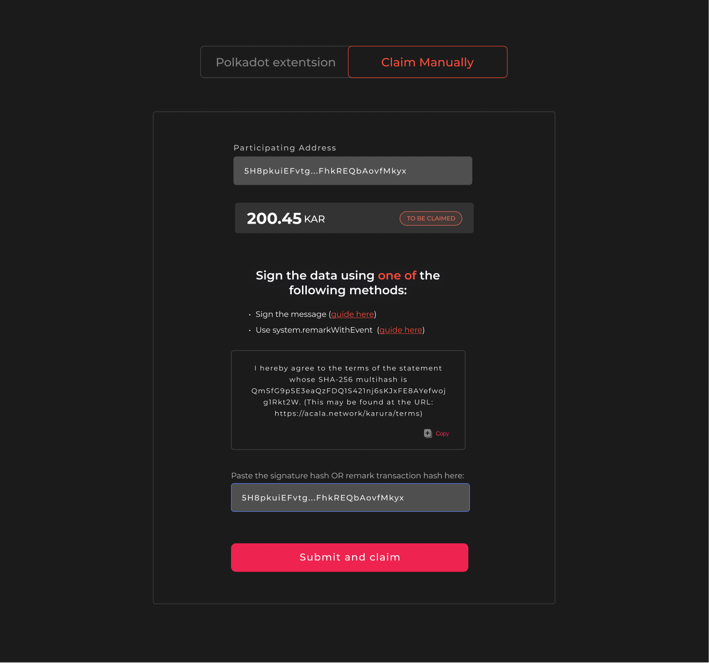
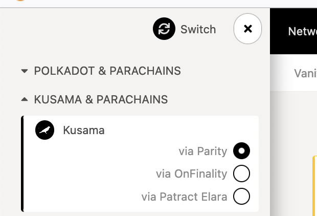
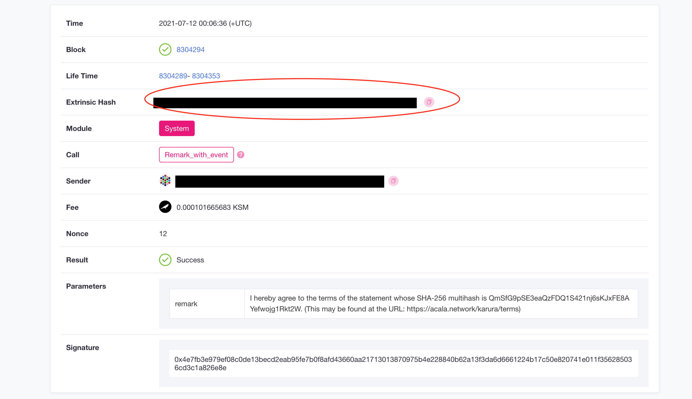

# Claim KAR

**🔔 Claim Service is back online now. Please claim your KAR ASAP.**

If you participated in Karura crowdloan from channels other than the officially supported ones, you will need to read and agree to our Terms and Conditions to claim your tokens. You can check if you need to claim KAR [here](https://distribution.acala.network/).

## Using Polkadot{js} Extension

You can navigate to the Claim Website from the Distribution site or directly [here](https://distribution.acala.network/claim). Connect your Polkadot{js} Extension, **using the same account that participated in the crowdloan event,** and follow the prompts to complete the process.&#x20;

It requires you to use the extension to sign a message, but it does not cost any transaction fees. Once the process is completed, it may take up to 48 hours for distribution to be scheduled.&#x20;

## Manual Claim

You can navigate to the Claim Website from the Distribution site or directly [here](https://distribution.acala.network/claim). If you did not participate in the crowdloan event with the Polkadot{js} extension, then select `Claim Manually` and **enter the address you used to participate in the Karura crowdloan**.



There are two ways to claim

1. Send a System Remark on Kusama with a specific message OR
2. Use Sign and Verify to sign the specific message

Below are the guides for how to use either to claim.

### Using Sign and Verify

You can go to the [Polkadot App - Developer - Sign and Verify](https://polkadot.js.org/apps/#/signing) (using either Polkadot, Kusama, or Karura are all fine). Sign and Verify merely signs the message and requires no transaction cost.&#x20;

1. You must select **the same account that was used in the Karura crowdloan**.


2\. In the `sign the following data` field, copy and paste in the required message to sign (shown on the Claim website).

```
I hereby agree to the terms of the statement whose SHA-256 multihash is QmSfG9pSE3eaQzFDQ1S421nj6sKJxFE8AYefwojg1Rkt2W. (This may be found at the URL: https://acala.network/karura/terms)
```

3\. Sign, copy the hash and paste it back to the Claim website to complete the process


Once the process is completed, it may take up to 48 hours for distribution to be scheduled.&#x20;

### Using System Remark

If you are unable to use Sign and verify to sign the message e.g. you used a proxy account to participate or the agency (e.g. wallet) you used to participate in the crowdloan does not have a sign and verify facility, then you can send a System Remark on the Kusama chain to claim KAR.&#x20;

1. Log onto the [Polkadot Apps - Kusama](https://polkadot.js.org/apps/#/explorer), **you must switch to the Kusama App.**&#x20;



2\. Go to the `Developer-Extrinsics` section


3\. You must select **the same account that was used in the Karura crowdloan**.

In the `submit the following extrinsic` field, select `system` then `remarkWithEvent(_remark)` in the drop-down menu


4\. In the `_remark: Bytes` field, enter the message required to sign. Copy and paste in the required message to sign (shown on the Claim website).

```
I hereby agree to the terms of the statement whose SHA-256 multihash is QmSfG9pSE3eaQzFDQ1S421nj6sKJxFE8AYefwojg1Rkt2W. (This may be found at the URL: https://acala.network/karura/terms)
```

5\. And click `Submit Transaction` button.


6\. Enter your password and sign the transaction. Note that you’ll be required to pay a small fee to initiate the transaction, so make sure you have some funds in your account.


7\. Your remark transaction has been submitted onto Kusama. You can view the signed remark on [Kusama Subscan Explorer](https://kusama.subscan.io/). Paste in your Kusama address used for sending the transaction.


8\. You’ll see the `system(remark_with_event)` in your transaction history. Click on the corresponding `Extrinsic ID`


9\. Copy the `Extrinsic Hash`



10\. Paste the Extrinsic hash back to the Claim website to complete the process

Once the process is completed, it may take up to 48 hours for distribution to be scheduled.&#x20;

