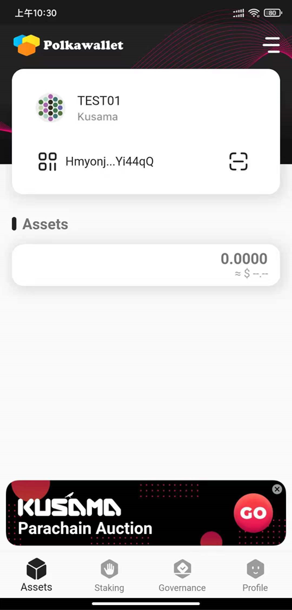

# How to Crowdloan

Crowdloan is a permissionless event, so you can make your own judgement on how you'd like to participate. We recommend the following ways to participate:

1. Participate via [Karura official website](https://acala.network/karura/join-karura) using Polkadot{.js} browser extension. Use a referral link to get an extra 5% bonus. Wallet setup guide [here](ksm-address/create-new-ksm-account.md).&#x20;
2. Participate via partner exchanges.
3. Participate via partner mobile wallets.

## Via Karura Official Website

### Check Prerequisites&#x20;

* [ ] I have installed the [Polkadot.js browser extension](https://polkadot.js.org/extension/).
* [ ] I have KSM in my Polkadot.js account.
* [ ] My KSM has been ‘unbonded’. [Click here](ksm-address/unstaking-your-ksm/) for instructions on unbonding if you’re staking KSM in Polkadot.js, or find the unstake/unbond option in your mobile wallet.

### **Connect Polkadot{js} Extension Wallet**

Once you have connected the Polkadot{js} extension wallet, you shall see your KSM balance, and contribution amount to Karura if any.

### Read and Accept Terms & Conditions

To participate in the crowdloan, you must read and accept the terms and conditions. You are required to sign with the account used to participate in the crowdloan, but it will not cost you anything.

### Contribute to the crowdloan

Enter‌ the KSM contribution amount. For every KSM contributed, you will receive at least 12 KAR.

If you use the referral link, you can get an additional 5% .&#x20;

There may be other bonus programs depending on the time you join the crowdloan.

### **Submit Contribution**

Click the `Submit Contribution` button to submit your contribution to the Kusama Relay Chain. This may take a few seconds while Kusama finalizes your transaction.

### **Post Submission**

You can contribute multiple times with the same account. Do share your great contribution on social to help us make history together!&#x20;

## Via Polkawallet

### Switch to Kusama Network

You shall see KSM balance once switched. Click the Kusama Parachain Auction banner at the bottom of the screen.

### Read and Accept Terms & Conditions

To participate in the crowdloan, you must read and accept the terms and conditions. You are required to sign with the account used to participate in the crowdloan, but it will not cost you anything.

### Contribute to the crowdloan

Enter‌ the KSM contribution amount. For every KSM contributed, you will receive at least 12 KAR.

If you have a referral code, enter it to receive an additional 5% bonus. Click `Submit`

There may be other bonus programs depending on the time you join the crowdloan.

### Submit Contribution

Click `Contribute` button, this will submit your contribution to the Kusama Relay Chain. This may take a few seconds while Kusama finalizes your transaction.

### **Post Submission**

You can contribute multiple times with the same account. Do share your great contribution on social to help us make history together!&#x20;
