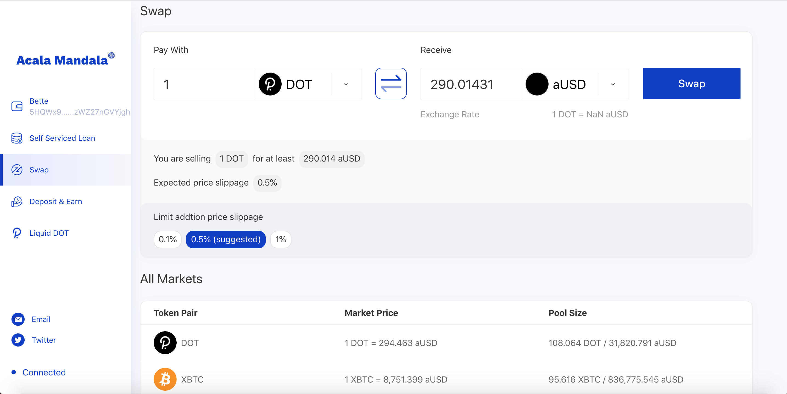
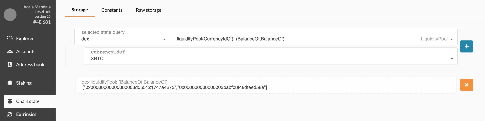
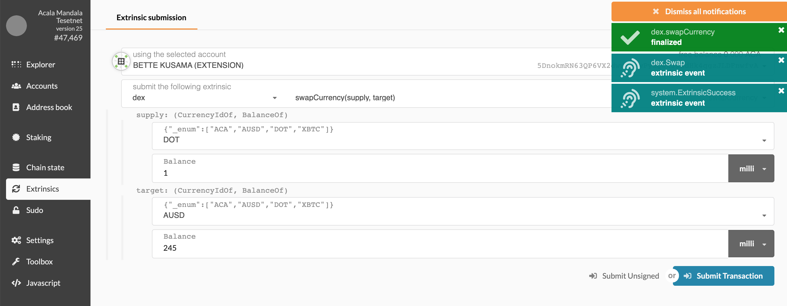

# DeX

* [Overview](https://wiki.acala.network/learn/basics/dex#overview)
* [Guide](https://wiki.acala.network/learn/basics/dex#guide)
  * [Via Acala App](https://wiki.acala.network/learn/basics/dex#via-acala-app)
  * [Via Polkadot UI](https://wiki.acala.network/learn/basics/dex#via-polkadot-ui)
    * [Check Exchange](https://wiki.acala.network/learn/basics/dex#check-exchange)
    * [Swap](https://wiki.acala.network/learn/basics/dex#swap)

## Overview

The Acala DeX protocol is inspired by Uniswap, but built as a runtime module as part of the Acala Substrate chain to serve the aUSD community. Each liquidity pool contains a balance of two tokens, and the exchange rate is simply the amount of one token divides that of the other. Users enjoys instant token swap without the need for an order book, whereas liquidity provider could supply liquidity of the two tokens in a pool to earn a fee.

Refer to [Deposit & Earn](https://wiki.acala.network/learn/basics/deposit-and-earn) for liquidity provider returns.

## Guide

1. Check Exchange Rate
2. Swap Tokens

### Via Acala App

### Via Polkadot UI

#### Check Exchange

Use `Chain state` -&gt; `dex` -&gt; `liquidityPool` to check the amount of aUSD and the amount of selected token in the pool Convert the hex value to number.

* number of DOT tokens `0x00000000000000003d055121747a4273` as `4397009815327097459`
* number of aUSD tokens `0x000000000000003babfb8f48dfeed58e` as `1100750556691660985742`
* exchange rate \(DOT to aUSD\) = number of aUSD tokens / number of DOT tokens = 250

#### Swap

Use `Extrinsics` -&gt; `dex` -&gt; `swapCurrency` to swap tokens.

* `Supply` is the token you pay
* `Target` is the token you want to buy, target price also covers for slippage

