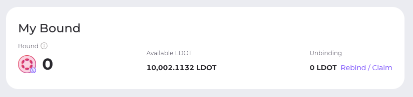

# Contribution & Rewards

## AirDrops

You can now check your airdrop KAR & ACA balances on [https://apps.acala.network/wallet](https://apps.acala.network/wallet). The balances are recorded on-chain in the `airdrop` module, which will be used to allocate real tokens upon Karura Canary network and Acala mainnet genesis.

Learn more about ACA & KAR tokens [here](https://wiki.acala.network/learn/economics/aca-and-kar).

Festival-goers and contributors, have fun, learn & break things, behold & catch the candies 🎁

## Mandala Festival Season 4 🎉🍬🔥

Building Acala is a community effort, and Mandala Fest then becomes a celebration of this growing community and the wealth of possibility that awaits us all in building web3. All past festival-goers would have a chance to claim Acala & Karura Halloween themed badges.  
These collectibles don’t have a monetary value nor a market, they are our mere way of honoring our shared experience and saying thank you. Newcomers to the community who complete required tasks would also have a chance to claim these collectibles.  
Here’s what the festival looks like and the rewards:

* Part I \(31-October-2020 to 06-November-2020 \| Award Pool: 2,000 ACA + 2,000 KAR\): Welcome Newcomers — complete required transactions to qualify.
* Part II \(31-October-2020 to 13-November-2020 \| Award Pool ≈ 30,000 ACA + 30,000 KAR\): Thank You — reward claim by qualified past festival participants
* Part III \(31-October-2020 to 13-November-2020 \| Award Pool: 3,000 ACA + 3,000 KAR\): Bounties — bugs, better memes, stickers or else

### Season 4 Halloween Give-Back Get Started

* Get started with Acala including creating a wallet and obtain test tokens [here](https://github.com/AcalaNetwork/Acala/wiki/1.-Get-Started)
* Check out these guides to use [Honzon stablecoin](https://github.com/AcalaNetwork/Acala/wiki/2.-Honzon-Stablecoin), [Acala Dex](https://github.com/AcalaNetwork/Acala/wiki/3.-DeX), and [Homa staking derivative](https://github.com/AcalaNetwork/Acala/wiki/7.-Homa-Liquid-DOT).
* Check out guides on cross-chain trading with Laminar and Ren [here](https://github.com/AcalaNetwork/Acala/wiki/T.-Cross-chain-DeFi)
* Check out these guides on Laminar [synthetic asset](https://github.com/laminar-protocol/laminar-chain/wiki/2.-Synthetic-Asset) & [margin trading](https://github.com/laminar-protocol/laminar-chain/wiki/3.-Margin-Trading)
* Results are published [here](https://github.com/AcalaNetwork/Acala/wiki/W.-Contribution-&-Rewards)

### Season 4 Full Schedule and Rules

#### Season 4 Part 1: Welcome Newcomers

Duration: 31-October-2020 to 06-November-2020 \(one week\)  
Award Pool: 2,000 ACA + 2,000 KAR

* All qualified users will share the reward pool
* All rewards will be recorded and published
* Note these rewards are lucky draws, not guaranteed

Participation Rules:

* Get test aUSD from the faucet, fees are payable in aUSD
* Users completing three meaningful transactions will be rewarded

Meaningful transactions include:

* Use DeX to swap tokens
* Use DeX to provide liquidity and transfer LP Tokens to another account
* Use the Self Service Loan service to collateralize for Acala Dollar \(aUSD\)
* Use Homa protocol to get staking derivative LDOT
* Transfer aUSD to Laminar Chain, and use it either for synthetic assets or margin trading
* Mint renBTC and use it in the above activities

#### Season 4 Part 2: Thank You

Duration: 31-October-2020 to 13-November-2020 \(two weeks\)  
Award Pool ≈ 30,000 ACA + 30,000 KAR

Participation Rules:

* Each account which participated Mandala TC2/TC3/TC4 can get 1 ACA + 1 KAR（If all testnet you participated, you will get 3 ACA + 3 KAR ）
* The nonce of each Mandala TC2/TC3/TC4 account must greater than or equal to two
* All rewards need be claimed in Acala Dapp
* You can see the rewards in your wallet Airdrop account

#### Season 4 Part 3: Bounties for Bugs, Sticker & Emojis sets \(Throughout the Festival\)

Duration: 31-October-2020 to 13-November-2020 \(two weeks\)  
Award Pool: 3,000 ACA + 3,000 KAR  
Please allow one week from your submission for our review.  
Participation Rules:

**Bug Bounties**

Find bugs for the following repos:  
[https://github.com/AcalaNetwork/Acala](https://github.com/AcalaNetwork/Acala)  
[https://github.com/AcalaNetwork/acala-dapp](https://github.com/AcalaNetwork/acala-dapp)  
[https://github.com/polkawallet-io/polkawallet-flutter](https://github.com/polkawallet-io/polkawallet-flutter) \(Acala part\)

* Bugs are judged on significance and severity by the Acala Engineering team and are awarded roughly based on the levels [here](https://github.com/AcalaNetwork/Acala/wiki/W.-Contribution-&-Rewards#runtime-bug-bounty)
* Please include your Acala Mandala Address in the Github issue for easy prize distribution

**Stickers & Emojis sets**

* Rewards are not guaranteed for this category
* Feel free to submit Acala/Karura themed Sticker & Emoji sets
* Sticker & Emoji sets selected for our Discord channels will receive rewards
* Please include your Acala Mandala Address in the submission

### Season 4 Prize Giving

#### Season 4 Part 1 Prize Giving: Welcome Newcomers

No. of Qualified Users: 4,712 \(&lt; 5,000\),  
Lucky Draw: 60%,  
Number of lucky accounts: 2,827,  
The reward for each lucky account: 0.7 ACA, 0.7 KAR.  
List of winning accounts: [Google List](https://docs.google.com/spreadsheets/d/1iSlG5trQnyOR5uzsT7puOsIODiWm7HfZtAi3ys4ietg/edit?usp=sharing)

#### Season 4 Part 2 Prize Giving: Thank You

Claim candy information within the valid time frame \(Not included in the activity time not claimed\):

The number of accounts that have claimed candy: 11,635  
Claimed candy reward: 13,739 ACA + 13,739 KAR  
List of claimed candy: [Google List](https://docs.google.com/spreadsheets/d/18comqh2wg6d-NNFb-HFetaToiPSkrS59wt1OmeGyxcQ/edit?usp=sharing)

#### Season 4 Part 3 Prize Giving: Bounties for Bugs

| Repos | BUG level | Issue link | Address |
| :--- | :--- | :--- | :--- |
| acala-dapp | bug-c | [\#273](https://github.com/AcalaNetwork/acala-dapp/issues/273) | 5HpLku5nX1Qqr2jUHDXH7rMBB5UVD7gJubNzVijvg6JhJJ9Q |
| acala-dapp | bug-c | [\#277](https://github.com/AcalaNetwork/acala-dapp/issues/277) | 5HdRwpyhpLNMiFRtEFL7JyhvkSLNSJGVDnQ1GcnVgTQr5smP |
| acala-dapp | bug-c | [\#281](https://github.com/AcalaNetwork/acala-dapp/issues/281) | 5HHECGnb51XLhPzWWUqumWxb9KwTARmcunxMXvkyNCqRqDX3 |
| acala-dapp | bug-c | [\#282](https://github.com/AcalaNetwork/acala-dapp/issues/282) | 5HnB6WGwGFZU87ViXYhVxxPEKS1K8r2QTQnvSPg9tWqVApxY |
| acala-dapp | bug-c | [\#284](https://github.com/AcalaNetwork/acala-dapp/issues/284) | 5FUaMCA9TSiJUdUAyAuLgUF5ZMhrvKQsHXZKhFiJMgWpZSyq |
| acala-dapp | bug-c | [\#294](https://github.com/AcalaNetwork/acala-dapp/issues/294) | 5CUpyz4irvybSgdZpuPJAFi2ApDqzp8QtfUgR7vWtagFcHGn |
| acala-dapp | bug-c | [\#295](https://github.com/AcalaNetwork/acala-dapp/issues/295) | 5EFDkXjzsyarcuLV1tDCE93wMjqxYxZyZn7qVh9soufPt2Ho |
| acala-dapp | bug-c | [\#316](https://github.com/AcalaNetwork/acala-dapp/issues/316) | 5CB6bxLb9jDna7tAeJMAMRaFDsSjRhiEvwFJJpRDCLXBE55o |
| acala-dapp | bug-c | [\#283](https://github.com/AcalaNetwork/acala-dapp/issues/283) | 5FUaMCA9TSiJUdUAyAuLgUF5ZMhrvKQsHXZKhFiJMgWpZSyq |
| polkawallet-flutter\(Acala part\) | bug-c | [\#191](https://github.com/polkawallet-io/polkawallet-flutter/issues/191) | 5HnB6WGwGFZU87ViXYhVxxPEKS1K8r2QTQnvSPg9tWqVApxY |

#### Season 4 Part 3 Prize Giving: Sticker & Emojis sets\(Throughout the Festival\)

Sticker submission link: [https://discord.gg/WYjDeZDTPN](https://discord.gg/WYjDeZDTPN)

| Address | Reward |
| :--- | :--- |
| 5D7qE641LNgeL4fQxkLrwZPoqMavhGXbWN21DhoMf6iWqBAb | 5 ACA + 5 KAR |
| 14XszikzVEgp1kbL5uRsdn1F3vXkaowLub9KcFMVhqiBBgcy | 5 ACA + 5 KAR |
| 5DQ1AvYrLy3ZsYrUKeaY4CZZWBFatLKrZ3sjAfdm1oGtSQJX | 5 ACA + 5 KAR |
| 5DUUgntu8Atyu2xkk1GjhBBxLryC6CRovHzVcWzFALjHsjQF | 5 ACA + 5 KAR |
| 5EHiBbDEhb71TAJFBpGD7URArSA137CHKh4srJR1zkkRbBLz | 5 ACA + 5 KAR |

## Mandala Festival Season 3 🎉🍬🔥

### Season 3 Prize Giving

#### -Week 1: User Participation

No. of Qualified Users: 10,525 \(&gt;5,000\),  
Lucky Draw: 20%,  
Number of lucky accounts: 2105,  
Reward for each lucky account: 9.5 ACA, 9.5 KAR.  
List of winning accounts: [Google List](https://docs.google.com/spreadsheets/d/1RRJfDDpigMsiFKocTrkurJrG43f4d163WjErWErfdNQ/edit?usp=sharing)

#### -Week 2: Trading Competition

As of 10th Aug, the top 10 traders are as follows, they will share the reward pool. Congrats for all winners! Also well done on everyone who has participated, there will be more yield farming opportunities once Acala is live, and your effort will be rewarded 🎉

| \# | Top Trader Address | Profit Margin 100% |
| :--- | :--- | :--- |
| 1 | 5G6ud7FEZZuFXtGX7rG9Vpq1w575w6NHkEQfzGZpKdaDbFGo | 504.9 |
| 2 | 5Dd8SGx5FyYxCgJtUC3MWdqCPB9QiAADVHWTy9ztVxqLaT1Y | 274.9 |
| 3 | 5HgXhg8HBUZQmCPumRMztC9vsKYk1CWfzmRUZJVaXnEDMEVS | 262.8 |
| 4 | 5E1rKcxMf2fqrZh1J3UgBKTGxuvAz8Y699THMtxMXeg5nDv4 | 215.3 |
| 5 | 5CRwrzRYhnUw2uSZvTy6h4dogYQYx7bV6sNnkTocpanBSt3T | 204.8 |
| 6 | 5DfM8dtKWwURKjpQBopS6GudCr9qRYq1KgBHVCmbmKkqdMeR | 199.1 |
| 7 | 5FPBkZKmB7UCnEyJF78cpW9nczUyUMgn5vhesHBnfoptfsdC | 198.4 |
| 8 | 5GzkBJDZLhpaqfHq6sbB82L7tiGCcBVwd8LjxhPAT72PSdRk | 198.2 |
| 9 | 5EKsrAsRAfQM9wyR9sRFVqNcwQCLQyVBjLMuSr2GqYE9JPUh | 193.4 |
| 10 | 5FhA3c1pw2zwnJRxNQSQfv8nYMpNNSopgSuLc5bZ2MVX6vTC | 170.9 |

#### -Week 3: Black Thursday Simulation

Number of winners: 200  
The reward for each lucky account: 20 ACA + 20 KAR

| Winner Address |
| :--- |
| 5C5SQQH3cGCHjat3gQ1naELHWQLGRuiRGpCYfe1rrLMZuNWY |
| 5C8c6AkPdo83jvNvvrB1jnTi4rfkuLp7H5ziuLTDsT42gntN |
| 5CB3wjdK7a71arTf27oXoLVQR9fvDAwikPMC7AHptCYRadVR |
| 5CccLc64WB2hwWorqg92A4S5y9fwAiAdbAKLRY5obDskA26N |
| 5CcjG2MnkAMWzTzdFU3hVnDhuxf9D7yoA7dcXmJYenSMAxzW |
| 5CDGLUhq1uFbjdic7WBMP9BeFmEwkWdm5sy4wQzgewu6zLLN |
| 5CDJND47a1NSjyx3cBxztY6rcXc8WcWeRecnjRF13gP2TGfV |
| 5CDp3rjzgrXfiJNMUK4JbpsMMTnPbXK5YCBC756ZGC8uQyFf |
| 5CGADrJ1Yc9aTaDGGQ5WYMDpiwHdxdunj23b2KCdDHcm8kAi |
| 5CGQPCeg9wDQJBRU9NpoQbV1yCHnCakejg2FousPxjaUaNDz |
| 5ChYSYTom6BLoXBfJhrpzcADd5PpBxvbUuyHqArzatKfzMJy |
| 5CiJReWwBbtX7t9vEmsqwgRHH9JegTG1m5w8gZMnAsvsBDRc |
| 5Ckg6bSerNfQLk5mazUnZ4rbWP2x8fjzNgT6ceAfPHXDL5tv |
| 5CMb7ZxVdBCijk1pAy2UQxtBfsi6nVM1fcpjpcfpMR32hUsd |
| 5CmBPNRJE7onTbsRrJq5zHFt7xHQQ9enoUx7x8WtuA3YsSbj |
| 5CMcAipQEFvQv8XWPtTkWPcAnJAJrQLRiVAVNtpRGbtDngVf |
| 5CoEECmREJW5TsvsC9bhhDPvcUTLbpfsprmae9hkHRfKYchT |
| 5Coiddko324JRzZpr7yKMEhXhhmEEZS1PL3bW3zuydiiyj1G |
| 5CqjU44RL4bpwmTQhNoeiA5QS2qEzqVbNv2KqkAonk2f1MjT |
| 5CqtjpcREcpPiJDhtdfdpCPm7rVDobEMb2fy6n8oWEfj2RAS |
| 5Cr1RxQ1qZuXrtr9w6Gd5VxFnoammWEmcLByZRdvVorm2DMG |
| 5CRsL3X5DYsvRZRG35FoqopTUzDKktzsG2ZpDDHVznAdhHjR |
| 5CSDymnTbuW54PCiXJtYsZbw3bZp75RVRVdyhfbDmEq4dX5c |
| 5Ct8CDacSNanB6NXkdtkCLreQMwE5PR3taGUUwSaS8KZ6d77 |
| 5CtasrgEkbisry55oK4WVRZwEN9tKvLypJKXuKAbF9T5yUg8 |
| 5CtS7BM64fpvw5rwvwMs2ADEdUxSGfP3UgQAXoX3S91QKaFo |
| 5CUMfUy5KASogbyNDdWvoNAe8TZ9cMGqSzeWS4R9WH5gyVJW |
| 5CwH4XaupdCLdZqg9VwHPgxwE13J6v41p7f4jsWGf8H8KJ4y |
| 5CXgWqJC9akm2gmmN7YD1EewLCmr9Z3HmM56aYDvwof5opRD |
| 5CXii7ZFZ4Fcj5v22thivJNNyDKt2FS9H3m1wWL3GRdWgz1n |
| 5CXuDA4NNP6w2Y6NYG4MTMK1mNixjyr1vnhNqf2eFrr8HnX7 |
| 5D1uoLbkdopC8SWtzs9kq7tfyYg48p9dJTzWqW2jvybjXbAS |
| 5D1vzT24fxPvGkkaRuEHLD3pLeNBakHuLfRksZ1yEGjddoPL |
| 5D2c1W5FGN1gR2JHEAAqTMmLPRG8KWNuyprw6gTPVavBnFQZ |
| 5D54bkBy4S8618H8BLLQhC7jzWiWRYds2iyA1ShWRrqansSb |
| 5D7Bh9iXwPTgvcuJsvhBMdyBkQwhXZenM1hxTcXPZ8pvniu4 |
| 5DAEqUAxncr5k4jcNqhn3MAk4ws8ni8k9dX9Dg4Fgf76gbSD |
| 5DaLr2t4ZzKtdDQ1m5Qf83Gwe5AbjPJLqaRCWeDGqkj3mBpR |
| 5DCdzuRtU1TK81X6FtY8SFbVhhEuCUMtggw7bJTTpG73MWnm |
| 5DCg23FGDYuGw52A9xWYHH2Qx4UrNHJUdWhZHsnMZ1BEGsHA |
| 5DD7KrBrLMPZr2GdqHUzJLUFHd83tyoudT4Gmvj8kEKz2Pnr |
| 5DeeT5CanCJtRfpdPpbhTE6CPojCTkzWf6n2mpAmgcBJPah8 |
| 5DJBW33de9ERCFg3tMVvPtYypS6YMHiP9dxocg13MDworvmT |
| 5DjuLGE8hXjGeyySChdUsLTLb5XkQs9g4QHpnnKC5Ctzecuy |
| 5DkuUCmz4Ydx4QyCeikezwWHxq5iMrEtvttsYKxvWpDetHRU |
| 5DkwphVMnrfCVFhfQgqzpDzoAKpyDVn72sHrAjMdMRutKPUW |
| 5DLJhbcn9SXE12r5JDW8tLBKTkgvD3ULAsPc54mtDfwsHeM9 |
| 5DMRE6xoiey3GV9gw2ZQiojXo7NydvvmiTGY7V2AoUXjc9LM |
| 5DnV2mGEL2TqipM4vCeQxgLYD5umaHdRGnbh8Xoz3UXJQQS9 |
| 5Dnyp5ZimHYnpV49yZjmCd1e6XAtvo9QYyiXjzMko1WkhtmN |
| 5DqWqLZJe2XZF1jSPkngxW5q5ppMYcWkN6MJw9X1aoW1YHYK |
| 5DqYYDu1wunTTNx3oYuLAZ8JG7ADqNMJqHBDWSK7wDzTuqsW |
| 5DRvDgPEsH9FGTkyQ323fnUg22ZUNJ5CjDVDJhEe1wuFwx3g |
| 5DsdVGJD2WNYyxHFD5qoXVoDrahXKqqooTA8xuTMFFmqZYD2 |
| 5DSLfBLuiQQvNsqWiweW9p4KtF1wCkjJUusSMcJt5SDHUW8c |
| 5DUtFupSAYyQCSq8bmeUQYNg2xHnuRubG1xFoMqtr3ai12ZZ |
| 5DVGjNBSNpTQAXjthsYh2sbYJCoc8eu2MfxntGcyYsgFRuLr |
| 5DwKZrbKEEqYHECNkYGbqXbdGgNCcT78KEFUS8c2sSpaKjjJ |
| 5DXV14EXkVDgoL32XHNZtsrk15QGQZxi2kdAdfQEE9tz5b4X |
| 5Dy2oAaRyqtjZcEXYCvCxo4eKw9wmBJqm7HomGiDv5riDF6f |
| 5DZbMRWJV9m5xWjMRfwtA19PGP2bKBKKhUeTyv9CPq1jvNvk |
| 5DZs7c4aD3EkzYoGujUp5fLyzBFD2GM4EDmmxBwN4msqYeWY |
| 5E1oYNJG1drkFBZc6TXFGfrCBx6ufEuVMbGaNsDMhDb2o5q2 |
| 5E6tn8PRo6psdTiisnvXbzQCfBychyqaDCC8uV4CoZKV2YQG |
| 5E7Eemxv5rwRedbGbBiCoJo31i3HgHREoVkmLa4ShYPhDzxw |
| 5E7sF34tLuJYdDaKMaAVb7APBS9KPJQdtBRvqUTDVaF1miiy |
| 5E9uMyb8udLgLjWJpsDnnthwRMwUfC7GqzKRMN2rA3hEZ72U |
| 5EA3xgxrp7STTKwarjFC6etpZFmRJmJxsJ34wnKPhE77Fezj |
| 5EA9BTvzziittbDdBk5jfktxsZDtfZ2LffDNLkv4M4iMs4Mg |
| 5EAPa5UX3FbC81msUXZkV7dYv2tqw1kniZGEVSgy9cmtUGD2 |
| 5EbpVkQhZcCVqNJdMFyHcf28nKgMiXJQ8vDLFvbHvB7Z4xmh |
| 5ECCEtRk8Sa5F92QEMq4ovX9pLbXCXMRKGFhj9Stkq66incg |
| 5ECfKYuCFCDLP7dTC9afVmbEybrYfBQ36ikwCXYfbRHj6eqg |
| 5EcgE8Gd4tcycjeCTkDbHCoPYYUaaeWFtj8b6jBuHrsFotY9 |
| 5ECzzmd2tBECJinysQAdxPraig5hq4TSoduwy65wowpZpndR |
| 5EDAyEEbsM9hqCpAhNswMe3xYRSxpEbmFRUevVekXqorzybN |
| 5EF7pepHEUMgTWFGBqqfDYbv85FkrU6gSVs3ejB5guQAnH5V |
| 5EHffteKBAi8EdvDAaqRTX8DokWCBYogEi2DsK4BUtUqE3t8 |
| 5EhNjKbKxZZYNvqUtnfH7GNyjuztcRyNbTMTb1LYbvrQLGXb |
| 5EHNX2vpAh2ZN6dfNvkr1shDKqSu6FiiY81Xz8QGUtkbUTaj |
| 5ELcnYTbHC6A1DHg5xwXtRkvUDmLCKm365JWkhBCnyKnnxt8 |
| 5Eo1U11i3b7NZcGbCSxxz3cqiZd11h34nYPGQiaytAvB37Zy |
| 5Epk8XmMU3VCEu7HC22kCLwHaSi5YKJQLgHF1rGN949qFBxE |
| 5ES9fyfV56kkEP1qazNzN1S6YwbSTfFWp2Q3i4QG4eyT2Ng8 |
| 5ESAv67AGRXr6wky8mfF7hUCKTKSDz5pTp97Su2xAFZ58YDx |
| 5EsdPnjVwT1FjwEdbqQbSJSZkKv6WGR8w7woyqf4vySLUuef |
| 5ESF68P8kxP577vfeKNbBvDdyyTbinTLbsP5WVFfADTyhQF7 |
| 5ESGSwJhe7oihCJdMnHoyw5AsitTdd36wFNavum6Jxc9KkhE |
| 5EskBzCLMU5cM7D5jp4GAK2WKe28vo8j8sAZFo27TUoHwwYn |
| 5EsUoB6DmJyX7y9KDyjNHspK7Cs263xTgDGz1sLrirc4KTpT |
| 5Et2gX3hioDAhdaziqfswo9MeK4REQC6VJedHPju4s6KEea3 |
| 5EUaKBPyXMXvJKokHCDRxvjAnvYiLWX7jM6LRMYfxwsG1zT7 |
| 5EUhyN2i6Adh6NnYzeBERpQDANfJwxrWH6Nox78jnParsRyN |
| 5EuvTF7TAY98AgKPqxCD4cVVMFhjFB1WeiiDCNuWSYkUJWby |
| 5EWzRzRSJ52FgTbdxRHMwxRVgHUE14LQhwZeh6NT9LUr197a |
| 5EX41ALzBGbhbkGHXT4stJ2bVWF4axCNKQA9RniaR9Bx6dR4 |
| 5ExsBG3eAuRPF4eCSxDQvMXF6uVVkTbeaVJ5rFEQhB7LjUbu |
| 5EZMEd5bNFs1Czw8JP9DcLWBfMehvopipfBbeSJ3JUTRiWtD |
| 5F1kLosiWXQn4C7TEX4Zy8fkRdHTLvKugkEM3JHZr7zR5M6W |
| 5F1mcCMJX8vW3VpsNWBZi13DCBGsECgiUqRiLNveTJn8tc1d |
| 5F1V1pLHDetngC7uAKDSqpAE42NR9nz6f6Dxvjm4sbMHNNeT |
| 5F3rYPmFB53XttPd8Zq9QqPxMFDUuVqDx4zjVjmqy6n4Ve4M |
| 5F3vSWoxpyeTNrUqyRZ4EkihosmoPJMGEgKAZiGE9WXWFhcY |
| 5F7f3kQxSSxpEjHHGdXZ2oFdCfy1EthTU4oVbqdhnn4THJvo |
| 5F9cnDyCs4CT9K8Y1vUdkc3iox4eMATyF1PqEbfbzpzEuJmC |
| 5F9v9Dh833m7GHznA8yxuVnGN3FdcrqtU8B9fqsFojMZQday |
| 5FByN4TX9Mh8YBeLocr7WDQCQ6da5Rjf4vq8j7HbHZQ9gkpk |
| 5Fc86bWmXQ6BrxVuEf3AMr2KHrbQWTE3zRYeNo7YGSGNVkav |
| 5Fc8Bm7cdEqV52TFjpQcRSf782iru348wQs25T7Eb8qUbkWX |
| 5FekmPiN3BRjZFFZTL6B19DvWks9wSFmPt2GjpGuo2UX1oWW |
| 5FeobeFfTqkRo8FcxfK4PM8dyroKvo7evgX8G4Xq6GbULgBp |
| 5Ff46r7kSwe7Wmc6mD81PQ3bz9596ztJQrwPt92ibZAfT1TG |
| 5FF99759ko3ZGEwVyheGfCvU3a1U428KYA2qKDgqyfRRyV7i |
| 5FfAwy8MXtACXy9ZzTXGvr6vpMF5DkAHcPCxmA4bVx4f65WD |
| 5FFEZ4e3wBT9Nq1gvYbCgZteybRSHMVMzjnkHGQ9uMVq4VcH |
| 5Fgc53zVCZ5QneUX1ShgZnKB6GB49CHyCP5CnKukEWHnJYTe |
| 5FhAyh4dCATKKNc6pycp3FDEvFdcDpqLM7hye9N6ZQ31n82e |
| 5FHook4GYvTQh7ZUY1QsNVmGN1DxGhWDZkk47ypnM4Uj6XP7 |
| 5FHSQfVcfVQ4kQPbbXKU26hJhy6mvF8sjybmkKtbDLpKCcmF |
| 5FhWwJJ79QvYcXr7Hw745r4GbyAW6qhrJogkED9GLPd72GkJ |
| 5FKmWyV3jEC32UCTMuEdot7WQM3LUe5n8kFG7zHeAPiC5khc |
| 5FkN95SMDSyo95gcfAUMwD4mfhjHr4qjqQ1edXmifs9WB2Wi |
| 5FKxaskGiQrRkJY8fmwwYfnt3T8iRfqiNzWJkwHimMAiEaZC |
| 5FLPVDd25MHFaErAThUGgbkcVzZe6dn1HH1dPkNGHCRzesML |
| 5FLWVLV3GPXhffAWLNuzMM1SKJA71pkSHzxegq68g7PzEbre |
| 5Fn8ytY7CW8fhMGSxKcG8PBr1A2t8MbYBtizPXtet8bVQKeX |
| 5FNuxCpDvTfiwcxgcgqo1oKJGkFwXQkmRcgBCcezNvub5hHg |
| 5FNZUvf4o5eyeNjxEfRTZ5535yeJnHgGHpeAUWU5C6a2HSbF |
| 5FP7Ko5aqW7xNTVASk6cqLdKCsafiefeeoCPLHFDukSmpMfo |
| 5FPCh4QTAQ7fJBFggHY67Lbz3i8Hodt5VdipfDTfxQ54cw6Z |
| 5FqTYBzGTZ481A5Tw1P2LJns7GDAkLBdpQiQjyoAx2TD9irE |
| 5FsYjqYG5arYv83wEjzFQ2VQfzum9t5RVQHuiDAssj9Q6vJ3 |
| 5FW7heMz9BjDLetkwYVs61NzFaCo3Xj473fQyQVw1sHFCFA5 |
| 5FxKdMEYJyqLAZMCGfU6m5UBAqggXsWbwRsAbQSFkakb9xC3 |
| 5FxQoRf1YRB9ZZoq6Xbx4KJyhir8KtVwBiRKAmvyuxJx1cKL |
| 5FYf5E6isLJ57mBCs9XHswFR5GjEG43ddE7tvF5xj5ZtgTpb |
| 5FyQ2nKuX9RGtshigu2y4rVXuN8HMBLz1SWZMA7ik7YgWwYH |
| 5FySKeAoxa9XoyhmQiqWHKZHpNSUauEjXxB1NNzuZe5bAaEB |
| 5FYsPvBvRxkLoUwpPD9wJxqaYPoVhdiovSPhuQWVjopEbM7M |
| 5G3habEPHywTzvEZGS7yJsUpPuhabkXAxkn9jv2bCh4z4hJr |
| 5G3hZZRkhzkZ6VyWB7UbFHUi5HLe9o5X6TBUcCWQwLBPD4bZ |
| 5G6AUvijXNoVr3wZTXjYMg6xMaii6LirGDsLdJhV1UauVzq2 |
| 5G7J1DGiQCRuKpSBStck1eJRZzq27uBenJTQJuzpLtJPJ4Zv |
| 5G9QQdiNAGXqFPrnhkprbY9iYY2etfbkqA1ZUXkmRSyc5pM4 |
| 5G9WDNRN1ztDWPfcPeGx2Va8aQxmrzDJxGWCugfUYHAunbK8 |
| 5GBqcBdAYSmiLKt1463AGUAfk1eis6yURBSSxtnxrUgfKVJT |
| 5GBsexiz2Cvdh3MsxdkDL5jYL178XwvnvK5LnZbfUA9QZBsE |
| 5GCUzxsXBqKw4mHcq6uXLvQniSb64ogXssKedvtZ5Bq96jeC |
| 5GEvwZvZGLTKYJanTxDcAdwqLzERXiRJSe5CMRrbvWykp2KK |
| 5GGjEWiwHE3q4rdK8FJ3oBEgTjrYuncTzQ8qiidGaBeU85Jc |
| 5Ggkr7PbDv5oQDgsTT6TF6YYJA39YYCHZdGTyDc3jfaDBwWt |
| 5GhPYXN73ML5meMJKoYHrsFGRH3VDH6Set1ENRBKnZf7gyvq |
| 5GhSXup19dSPrJBv6T7aSHD3hwKihSNf4U2aNWmEd188PXTb |
| 5GjiwyFXKUnxNRMsc8SAQGaUxpwW9UczNFafD1SCtKZoMdbu |
| 5GKrJF6m8oW5SrvJYH2LksjtCRZUM6HrkbzuUnx4mc7bANpJ |
| 5GKTAMU9PTVjeMbwiT8i3umtf1bEBp314cFGcGpuTb4Fw3Aa |
| 5GL5S829ACcHHyUPmofuc8rTZxinWxPDmhPR4UMj2ghjyy8D |
| 5GMvp5okVesv3JHxNA21SeFbXtMMtwy6EmPvtN5HpHLUuRCy |
| 5GNSwbXVkk2ZtQrwKSDi8ikAg1dHhtqXgL4MsSuBeCcdkzs9 |
| 5GppZzPjcCSwpxArzCKAjpcEUnRZnLkfAUApmdcFZWG3Cfza |
| 5Gq4EDReGUDnMiY7UN6CAgq1qN2mz3dkVgZN3PrDF9gk158k |
| 5Grk1M8uWgWD7Dm7vvbuAxSwyqR6s2cB8EykgRZi9sCKtrbr |
| 5GrnNToStJHU3Dr9j1G1eExotL68L6fMKgJzLJvC8g5DpR8v |
| 5GrxeYVFV26xM8BKgTJ6LgoYezfBpq5cM4dN4okV37JxkVny |
| 5GRYTPdyq7fizkJ1MwiMdLnBnpetqYH4t6nDwrWSsEFZG8tA |
| 5GrzfEwHwfstmvWUBTi4BEfRWKmgmyTkXynhTbGNh5o9j46H |
| 5GW7F2dB4s9maZEL5mbTie6s4FwgdkKDhgvagdwHNH1EHbYL |
| 5Gy82AD4imcUxmHLK12vbScvS6MvzsS9sPTc17egPJ4v2Vuq |
| 5H1gfcTekfVRM81CwgTEBWJgW2hBqzfeJspb1jYVr3uEqwPb |
| 5H3P3MAt5DESm9ixLarn1VMdGSergF7WbfpMX7MghpZb62b9 |
| 5H3Sq1HXiQepCBdAcgnrKS4BMJzJU1Q1khGQxzRFrdwtx696 |
| 5H4SRrwYfTUXTe41LTGLBioDmcSgTdS7aLLvkXzAFY4aNjNW |
| 5HdcZBYv8Evk8XUbxKPnKG7CmC1odwmTv7NRt9ghCumZ8tqc |
| 5HE8YAYM7cVEBm8iJ7BrAULy535UZaQDgaJbD6gFtiwJAM1Y |
| 5HgAFiXN8HhhETQVJW4E64pn5qki9GJhEZUi1rDX2jYDuNXt |
| 5HGwTFxnH78CcTgKqxVkFe7cQE6KteVkQezxHFqMwv6rT5B9 |
| 5HHC1f96qebeBWiLGj8Uwmv2xD1hfjVmt5P7f6PScM8bSCYm |
| 5HHKVxC3VrBs1h3d4mNtdoZ4DULC2HLp3PnBnJkQKgXnfsPN |
| 5HHMpRWexQWhMMMeV433Dt7ThgXBwo1pjs2M4AcDjUaFQmKb |
| 5HjLts9JryK3huW5MtmfjUSacirbbZHQXmC13UNxjNpQSQmX |
| 5HK7MdumTL8uNV5hMk6z7XTkQA5xDZ15phnngR9aLGLPXko6 |
| 5HKMPQYa1Bpre7fyGxLcnB6LKhTZkY6hMd5vjXFANNzFYLQ1 |
| 5Hn7ed8VRW5D8d6MDz7YRhC2J9fpZX7c3nkafe4jNxZcrHXb |
| 5HNi2g4R7vefffJxrSN3mHXGa96Lof26AJwhoNut86MuBJJv |
| 5HNosDRqJNao5ewuXvYE8z88554ffDpZvEm4KbZCTFdAD3XH |
| 5Hp4X46LACzqDorZkeEgSds4Fqd8nQAAQmftNKvZktn3WPrn |
| 5Hpi9rYJV1ULKDWBYGa74xPXRi7Kaf89eB3PGW5P8FK7trU8 |
| 5HptHBL5acE3T3n5kfvDnJwYHo9UrpB2L5j7pBUKqbfSeBw1 |
| 5HQWx9SXXDUGfLNjuhcYXAwzuKBDnTmvuz33zWZ27nGVYjgh |
| 5HU3qwWwvfKZo5tp6Cwk169AKCwDHugBK2LfXYfDy94KSmmV |
| 5HVcH8j3v4T64UYvRpUTwkDKTR36tpgftg2yF5XdwxvSyLWQ |
| 5HWYa6e1BjfNoGBJWCWidVt3CwJRPFsBuq3c46GLuJ4Myq5k |
| 5HYbbvJ5BYMdFe5fSomWaeEgMWURG6PisraJMNbPTFYqSjBo |
| 5HYEJRV5S13TDDSRKSWUafRsvRMzS4PGTWh5DQwEz2oSHyLZ |
| 5HYwJ2AYfsPAAgecnEXj8qqRLuBmQiqYWmZexZL6TVgg2xxQ |
| 5CPQoDqdzt1ggeaVzuJyK2WYnTV2s7XDoPE1eKSrLVdHrHfg |
| 5HjhTLGk5V6HXuwjpdbHMWUXc5LH3rMtLKpcqSn8Z5x8xLUS |
| 5HnJRCcbFaTjaYhmhTiNavSStkxRAmeX2EiEJq2vSnN5Q4TJ |
| 5CCdo3gfsnjg8WCTChrB4jQKXNncfbSN3H9NhNVqfD7EjNmz |
| 5DqFgUVwGMGurJrJJTbtFA3U6HS6ezomTHnpbREKbnKjD9md |

#### -Blog Bounty \(Throughout Festival\)

| Link | Mandala address |
| :--- | :--- |
| [https://medium.com/@gafaruzb70/acalanetwork-%D0%B3%D0%BE%D1%82%D0%BE%D0%B2%D0%B8%D1%82%D1%81%D1%8F-%D0%BA-%D0%B7%D0%B0%D0%BF%D1%83%D1%81%D0%BA%D1%83-51124b71aefb](https://medium.com/@gafaruzb70/acalanetwork-%D0%B3%D0%BE%D1%82%D0%BE%D0%B2%D0%B8%D1%82%D1%81%D1%8F-%D0%BA-%D0%B7%D0%B0%D0%BF%D1%83%D1%81%D0%BA%D1%83-51124b71aefb) | 5DCdUUZSEsdB3JBwdyQsKjEwdjWLyVajJaeki66M5YhGYWyK |
| [https://medium.com/@Fanniee/polkadot-%EC%83%9D%ED%83%9C%EA%B3%84%EC%9D%98-%EC%A4%91%EC%9A%94%ED%95%9C-%ED%94%84%EB%A1%9C%EC%A0%9D%ED%8A%B8-acala-8a3be713bd42](https://medium.com/@Fanniee/polkadot-%EC%83%9D%ED%83%9C%EA%B3%84%EC%9D%98-%EC%A4%91%EC%9A%94%ED%95%9C-%ED%94%84%EB%A1%9C%EC%A0%9D%ED%8A%B8-acala-8a3be713bd42) | 5DZpD7NqtPAitsdZVsjuMjyvicTfcudr1oFfHMUUqLhS9u77 |
| [https://medium.com/@nguynlongthnh\_89762/learn-the-basics-of-acala-network-you-should-know-d8b1e13a13f4](https://medium.com/@nguynlongthnh_89762/learn-the-basics-of-acala-network-you-should-know-d8b1e13a13f4) | 5DqZSHwqts1Dmyg4qPQUMj3H2tQVBtWvDJ3hd32gUJTBgEoL |
| [https://www.youtube.com/watch?v=0\_BeLFBqZuc&feature=youtu.be](https://www.youtube.com/watch?v=0_BeLFBqZuc&feature=youtu.be) | 5Hg96xTCugbbFd55F9iBNofie4gpAgmJUVGd8nRL5vqCPCSp |
| [https://medium.com/@knowledgeiskey2017/a-comprehensive-overview-of-the-acala-network-8b13135ab885](https://medium.com/@knowledgeiskey2017/a-comprehensive-overview-of-the-acala-network-8b13135ab885) | 5Hg96xTCugbbFd55F9iBNofie4gpAgmJUVGd8nRL5vqCPCSp |
| [https://www.youtube.com/watch?v=weBI9tzqfQU&t=](https://www.youtube.com/watch?v=weBI9tzqfQU&t=) | 5HYRXR7TC4jkEjokhNzvYup2WcxmejbVNkoQqVbZtaWovj4F |
| [https://www.youtube.com/watch?v=X-Fh04aXYz0&feature=youtu.be](https://www.youtube.com/watch?v=X-Fh04aXYz0&feature=youtu.be) | 5C4m2LpoCEAxmueTWBXs3kka3NCEtgH9TXMqhLpu2vYv9Tkj |
| [https://medium.com/@ltfschoen/journey-into-defi-using-acala-and-laminar-991c168902db](https://medium.com/@ltfschoen/journey-into-defi-using-acala-and-laminar-991c168902db) | 5DHcRs9udMCKtEmJEABY2HpECyTHHxgLL85pFFzN72SatAoQ |
| [https://www.youtube.com/watch?v=faylI5\_xs00&feature=youtu.be](https://www.youtube.com/watch?v=faylI5_xs00&feature=youtu.be) | 5Fj8pQ1e7iDfrAvae9k6WhrZRqM4Lqd6Umvk8J9cg1BXcJL9 |
| [https://bihu.com/article/1614934379](https://bihu.com/article/1614934379) | 5GWrTC5D7FPEg3iaikv8Yp35K1A6qWyyCVMF1GZd5PCbq2Fk |

#### -Bug Bounty \(Throughout Festival\)

| Github issue | Mandala address | Judging results |
| :--- | :--- | :--- |
| [https://github.com/AcalaNetwork/acala-dapp/issues/241](https://github.com/AcalaNetwork/acala-dapp/issues/241) | 5F2FNhhVeG9bW4tP5te4a7asBJvSHQg31RzkoETLpUN161gV | bug-C |
| [https://github.com/AcalaNetwork/acala-dapp/issues/238](https://github.com/AcalaNetwork/acala-dapp/issues/238) | 5F2QSwPHobet1pLFTEw6mkcT8bwZdEMmHfBGYPkiK7Pgxdex | bug-C |
| [https://github.com/AcalaNetwork/acala-dapp/issues/237](https://github.com/AcalaNetwork/acala-dapp/issues/237) | 5DEvvJA5Mz82GPLbf9t3RxWVYX5KfqkkxwJvJ6tmB3e5n5Wn | bug-A |
| [https://github.com/AcalaNetwork/acala-dapp/issues/234](https://github.com/AcalaNetwork/acala-dapp/issues/234) | 5DfNVfJTgpspTA4bz7w1DNJmf4eAEcCZ76AktJonPXUPwR6U | bug-C |
| [https://github.com/AcalaNetwork/acala-dapp/issues/233](https://github.com/AcalaNetwork/acala-dapp/issues/233) | 5GRbkRH3hi1vbuNd7s3eW9u2YRfhMtDJVVCe3a8M1jvhBuvZ | bug-C |
| [https://github.com/AcalaNetwork/acala-dapp/issues/229](https://github.com/AcalaNetwork/acala-dapp/issues/229) | 5H985QyVoRZudfw2p6DvmwhdfYob8LkgK4pCZdf9rnioUZUd | bug-C |
| [https://github.com/AcalaNetwork/acala-dapp/issues/225](https://github.com/AcalaNetwork/acala-dapp/issues/225) | 5F2FNhhVeG9bW4tP5te4a7asBJvSHQg31RzkoETLpUN161gV | bug-C |
| [https://github.com/AcalaNetwork/acala-dapp/issues/222](https://github.com/AcalaNetwork/acala-dapp/issues/222) | 5H985QyVoRZudfw2p6DvmwhdfYob8LkgK4pCZdf9rnioUZUd | bug-C |
| [https://github.com/AcalaNetwork/acala-dapp/issues/221](https://github.com/AcalaNetwork/acala-dapp/issues/221) | 5H985QyVoRZudfw2p6DvmwhdfYob8LkgK4pCZdf9rnioUZUd | bug-C |
| [https://github.com/AcalaNetwork/acala-dapp/issues/220](https://github.com/AcalaNetwork/acala-dapp/issues/220) | 5H985QyVoRZudfw2p6DvmwhdfYob8LkgK4pCZdf9rnioUZUd | bug-C |
| [https://github.com/AcalaNetwork/acala-dapp/issues/217](https://github.com/AcalaNetwork/acala-dapp/issues/217) | 5H985QyVoRZudfw2p6DvmwhdfYob8LkgK4pCZdf9rnioUZUd | bug-C |
| [https://github.com/AcalaNetwork/acala-dapp/issues/215](https://github.com/AcalaNetwork/acala-dapp/issues/215) | 5F2FNhhVeG9bW4tP5te4a7asBJvSHQg31RzkoETLpUN161gV | bug-C |
| [https://github.com/AcalaNetwork/acala-dapp/issues/212](https://github.com/AcalaNetwork/acala-dapp/issues/212) | 5F2FNhhVeG9bW4tP5te4a7asBJvSHQg31RzkoETLpUN161gV | bug-C |
| [https://github.com/AcalaNetwork/acala-dapp/issues/191](https://github.com/AcalaNetwork/acala-dapp/issues/191) | 5DfNVfJTgpspTA4bz7w1DNJmf4eAEcCZ76AktJonPXUPwR6U | bug-C |
| [https://github.com/AcalaNetwork/acala-dapp/issues/188](https://github.com/AcalaNetwork/acala-dapp/issues/188) | 5DfNVfJTgpspTA4bz7w1DNJmf4eAEcCZ76AktJonPXUPwR6U | bug-C |
| [https://github.com/AcalaNetwork/acala-dapp/issues/186](https://github.com/AcalaNetwork/acala-dapp/issues/186) | 5F2QSwPHobet1pLFTEw6mkcT8bwZdEMmHfBGYPkiK7Pgxdex | bug-C |
| [https://github.com/AcalaNetwork/acala-dapp/issues/185](https://github.com/AcalaNetwork/acala-dapp/issues/185) | 5Coiddko324JRzZpr7yKMEhXhhmEEZS1PL3bW3zuydiiyj1G | bug-C |
| [https://github.com/AcalaNetwork/acala-dapp/issues/177](https://github.com/AcalaNetwork/acala-dapp/issues/177) | 5CcTrXNHdJUYttyDNsQFDdWMcBPY8YvZF8x6WMXVapYQ644p | bug-C |
| [https://github.com/AcalaNetwork/acala-dapp/issues/159](https://github.com/AcalaNetwork/acala-dapp/issues/159) | 5HnJRCcbFaTjaYhmhTiNavSStkxRAmeX2EiEJq2vSnN5Q4TJ | bug-C |
| [https://github.com/AcalaNetwork/acala-dapp/issues/146](https://github.com/AcalaNetwork/acala-dapp/issues/146) | 5GMvp5okVesv3JHxNA21SeFbXtMMtwy6EmPvtN5HpHLUuRCy | bug-C |
| [https://github.com/AcalaNetwork/acala-dapp/issues/144](https://github.com/AcalaNetwork/acala-dapp/issues/144) | 5FEoLBq9BP8X3iU6iPmW2KWJahcCazeSaLPd2CamVfdwsCc1 | bug-C |
| [https://github.com/AcalaNetwork/acala-dapp/issues/143](https://github.com/AcalaNetwork/acala-dapp/issues/143) | 5FFCfSJJaVN8WRRNiFxHKcYQh5MXfpFYyVhjrv99Qgvqorp9 | bug-C |
| [https://github.com/AcalaNetwork/acala-dapp/issues/142](https://github.com/AcalaNetwork/acala-dapp/issues/142) | 5GNqaqhFJvAJBuk9Vz6fziBMavZF9QfPZNX7X57u2zZeRNHy | bug-C |
| [https://github.com/AcalaNetwork/acala-dapp/issues/140](https://github.com/AcalaNetwork/acala-dapp/issues/140) | 5GNqaqhFJvAJBuk9Vz6fziBMavZF9QfPZNX7X57u2zZeRNHy | bug-C |
| [https://github.com/AcalaNetwork/acala-dapp/issues/138](https://github.com/AcalaNetwork/acala-dapp/issues/138) | 5Coiddko324JRzZpr7yKMEhXhhmEEZS1PL3bW3zuydiiyj1G | bug-C |
| [https://github.com/AcalaNetwork/acala-dapp/issues/137](https://github.com/AcalaNetwork/acala-dapp/issues/137) | 5HY8hYMttrbm57MmN3o9p5ipF8i7eBjdWw7TQVsecoP7Uos6 | bug-C |
| [https://github.com/AcalaNetwork/acala-dapp/issues/132](https://github.com/AcalaNetwork/acala-dapp/issues/132) | 5Coiddko324JRzZpr7yKMEhXhhmEEZS1PL3bW3zuydiiyj1G | bug-C |
| [https://github.com/AcalaNetwork/acala-dapp/issues/128](https://github.com/AcalaNetwork/acala-dapp/issues/128) | 5GHj5DF25uK85M4Uq29cSFVQMRkzHc1RmVXZPW4zf3NXf1c1 | bug-C |
| [https://github.com/polkawallet-io/polkawallet-flutter/issues/64](https://github.com/polkawallet-io/polkawallet-flutter/issues/64) | 5GNqaqhFJvAJBuk9Vz6fziBMavZF9QfPZNX7X57u2zZeRNHy | bug-C |
| [https://github.com/polkawallet-io/polkawallet-flutter/issues/65](https://github.com/polkawallet-io/polkawallet-flutter/issues/65) | 5E7b8rmiWDahDN6ZUNuyqmSirQsPj8PAMZ9CYMaURCjcDEqn | bug-C |
| [https://github.com/polkawallet-io/polkawallet-flutter/issues/68](https://github.com/polkawallet-io/polkawallet-flutter/issues/68) | 5EnWSikTvi8Y3S6vQ8TM3q5joFe8pCa4LjAbmEaXywwE6ioG | bug-C |
| [https://github.com/polkawallet-io/polkawallet-flutter/issues/70](https://github.com/polkawallet-io/polkawallet-flutter/issues/70) | 5EnWSikTvi8Y3S6vQ8TM3q5joFe8pCa4LjAbmEaXywwE6ioG | bug-C |
| [https://github.com/polkawallet-io/polkawallet-flutter/issues/75](https://github.com/polkawallet-io/polkawallet-flutter/issues/75) | 5HWMnApHzkVV2ZqVLjjLzPETL8wwf1PvkFv4G7sMDMWqpHHS | bug-C |
| [https://github.com/polkawallet-io/polkawallet-flutter/issues/80](https://github.com/polkawallet-io/polkawallet-flutter/issues/80) | 5Coiddko324JRzZpr7yKMEhXhhmEEZS1PL3bW3zuydiiyj1G | bug-B |
| [https://github.com/polkawallet-io/polkawallet-flutter/issues/81](https://github.com/polkawallet-io/polkawallet-flutter/issues/81) | 5EnWSikTvi8Y3S6vQ8TM3q5joFe8pCa4LjAbmEaXywwE6ioG | bug-C |
| [https://github.com/polkawallet-io/polkawallet-flutter/issues/91](https://github.com/polkawallet-io/polkawallet-flutter/issues/91) | 5DHcRs9udMCKtEmJEABY2HpECyTHHxgLL85pFFzN72SatAoQ | bug-C |
| [https://github.com/polkawallet-io/polkawallet-flutter/issues/92](https://github.com/polkawallet-io/polkawallet-flutter/issues/92) | 5Coiddko324JRzZpr7yKMEhXhhmEEZS1PL3bW3zuydiiyj1G | bug-C |
| [https://github.com/polkawallet-io/polkawallet-flutter/issues/94](https://github.com/polkawallet-io/polkawallet-flutter/issues/94) | 5Coiddko324JRzZpr7yKMEhXhhmEEZS1PL3bW3zuydiiyj1G | bug-C |
| [https://github.com/polkawallet-io/polkawallet-flutter/issues/112](https://github.com/polkawallet-io/polkawallet-flutter/issues/112) | 5CG4jmkk1neZzbKCeQg7kYv9PMko8zkcRqVvAFzPHuBD673q | bug-C |
| [https://github.com/polkawallet-io/polkawallet-flutter/issues/114](https://github.com/polkawallet-io/polkawallet-flutter/issues/114) | 5GNqaqhFJvAJBuk9Vz6fziBMavZF9QfPZNX7X57u2zZeRNHy | bug-C |
| [https://github.com/polkawallet-io/polkawallet-flutter/issues/118](https://github.com/polkawallet-io/polkawallet-flutter/issues/118) | 5GsQUJ8ShoFrt16vWLekvk3T5e2tYLTVWN5mHrwthSdxL6Fv | bug-C |
| [https://github.com/polkawallet-io/polkawallet-flutter/issues/120](https://github.com/polkawallet-io/polkawallet-flutter/issues/120) | 5GsQUJ8ShoFrt16vWLekvk3T5e2tYLTVWN5mHrwthSdxL6Fv | bug-C |
| [https://github.com/polkawallet-io/polkawallet-flutter/issues/127](https://github.com/polkawallet-io/polkawallet-flutter/issues/127) | 5GHj5DF25uK85M4Uq29cSFVQMRkzHc1RmVXZPW4zf3NXf1c1 | bug-C |
| [https://github.com/polkawallet-io/polkawallet-flutter/issues/128](https://github.com/polkawallet-io/polkawallet-flutter/issues/128) | 5HnJRCcbFaTjaYhmhTiNavSStkxRAmeX2EiEJq2vSnN5Q4TJ | bug-C |
| [https://github.com/polkawallet-io/polkawallet-flutter/issues/137](https://github.com/polkawallet-io/polkawallet-flutter/issues/137) | 5FEp7o7MW6m5Tx6G5pGeto9ZQpfHKePVREVkmDxV58ZoPg6H | bug-C |

#### -Coding

| Github issue | Mandala address | Judging results |
| :--- | :--- | :--- |
| [https://github.com/Ryabina-io/substratebot/tree/master/packages/acala](https://github.com/Ryabina-io/substratebot/tree/master/packages/acala) | 5FEoLBq9BP8X3iU6iPmW2KWJahcCazeSaLPd2CamVfdwsCc1 | 1000 ACA & KAR |

### Season 3 Rules & Rewards

#### Week 1: User Participation

**Duration:** 27-July-2020 to 03-August-2020 \(one week\)  
**Award Pool:** 20,000 ACA + 20,000 KAR

* All qualified users will share the reward pool  
* All rewards will be recorded and published

**Participation Rules:**

* Get test aUSD from the faucet, fees are payable in aUSD  
* Users completing three meaningful transactions will be rewarded  

**Meaningful transactions include:**

* Use DeX to swap tokens  
* Use DeX to provide liquidity  
* Use Honzon stablecoin to collateralize for aUSD  
* Use Homa protocol to get staking derivative LDOT  
* Transfer aUSD to Laminar Chain, and use it either for synthetic asset, or margin trading  
* Mint renBTC and use it in above activities  
* Participate in auctions of system   

#### Week 2: Trading Competition

**Duration:** 03-August-2020 to 10-August-2020 \(one week\)  
**Award Pool:** 5,000 ACA + 5,000 KAR

* Top 10 qualified traders will share the reward pool  
* All rewards will be recorded and published  

**Participation Rules:**

* Use the balance of USD as the unit of account  
* Profit calculated as ending balance — beginning balance  

**The rules for ranking of trading competition:**

* Snapshots will be taken for both Acala and Laminar networks at the beginning of the trading competition; the total net value of various assets \(including debts\) will be calculated based on the price feed at the time as the initial balance.  
* Another snapshot will be taken at the end of the competition, using the feed price at that time as the final balance. Cross-chain transfers \(e.g. transfers between Acala and Laminar\) are not counted, while transfers between addresses are counted as capital.  
* Profit margin = total value of final balance / \(total value of initial balance + capital sum correction\) — 100%, all accounts are ranked according to this function.  

**The following are included in the balance calculation:**  
**Balances of all assets:**  
— Acala : aUSD, ACA, renBTC, XBTC, DOT, LDOT  
— Laminar : aUSD, LAMI, synthetic assets

**Balances of all DeFi positions:**  
— Acala : CDP \(net value of collateral value minus debt value\), share value in Deposit & Earn  
— Laminar : margin position value

#### Week 3: Black Thursday Simulation

**Duration:** 10-August-2020 to 17-August-2020 \(one week\)  
**Award Pool:** 4,000 ACA + 4,000 KAR

* A draw of 200 qualified users will share the reward pool  
* All rewards will be recorded and published  

**Participation Rules:**

* Day 1 — Day 3 liquidation events: users participate by closing CDP or increasing collateral  
* Day 4: emergency shutdown will be triggered, participants will use aUSD to buy back collaterals  
* Users who took part in the above activity will benefit from rewards  

#### Blog Bounty \(Throughout Festival\)

**Duration:** 27-July-2020 to 17-August-2020 \(three weeks\)  
**Award Pool:** 2,000 ACA + 2,000 KAR

* 10 awards will be awarded in total  
* Awards will be published one week after the event ends  

**Participation Rules:**

* Submit a blog to either [Medium](https://medium.com/), [Bihu](https://bihu.com/), or [YouTube](https://www.youtube.com/) regarding the Acala Network.
* The article must include your Acala Mandala Address to receive prizes.
* Submit the link to your piece of content to Acala [Telegram](https://t.me/acalaofficial), [Discord](https://discord.com/invite/vdbFVCH) or [Riot channel](https://riot.im/app/#/room/#acala:matrix.org) using the hashtag \#MandalaFest3
* The content must be original
* We will judge both the **quality** \(how appealing is the story, idea, perspective, insights, analysis, etc\) and social reactions \(number of comments, likes, twitter or other social sharing, etc\).

#### Bug Bounty \(Throughout Festival\)

**Duration:** 27-July-2020 to 17-August-2020 \(three weeks\)  
**Award Pool:** 10,000 ACA + 10,000 KAR

* Please allow one week from your submission for our review.

**Participation Rules:**

* Find bugs for the following two repos:  

  [https://github.com/AcalaNetwork/Acala](https://github.com/AcalaNetwork/Acala)  

  [https://github.com/AcalaNetwork/acala-dapp](https://github.com/AcalaNetwork/acala-dapp)  

  [https://github.com/polkawallet-io/polkawallet-flutter](https://github.com/polkawallet-io/polkawallet-flutter) \(Acala part\)  

* Bugs are judged on significance and severity by the Acala Engineering team, and are awarded roughly based on the levels [here](https://github.com/AcalaNetwork/Acala/wiki/W.-Contribution-&-Rewards#runtime-bug-bounty)
* Please **include your Acala Mandala Address in the Github issue** for easy prize disbursal

## Mandala Festival Season 2 🎉🍬🔥

### Season 2 Prize Giving

#### -Running a Node

| Date | Lottery block height | Lottery block hash | Prize winner |
| :--- | :--- | :--- | :--- |
| 05.11 | \#251,219 | 0x01df0b375cad466998922dedfbb64117f2c35062c3d74324afa472283df0ca71 | 5CJX5TSEokNNvgN23BKDLg5wPrC1hjmNb99hwndgEJK5x5jK, 5HEC1VAU2qMrgEv3f1zbjKQuPHPpYzra8hSaWVhNCe6yTMVt, 5DAFv2ajCh7EV2Y6Pk8TuDFcF17GDE8RXk7jfWUnjCaCmxJu |
| 05.12 | \#274,515 | 0xe7b70e0e72b3ef9a2fcc804842b89a402ec1338e7fcd0df50ebb6636ef490447 | 5EPMpXd7Gch8YQU9Q6efHKRdpgTfQ3kSLYKBRiiBB6nWPUHn, 5G3zwZ72e6rbJgx6cfmpKac3yBPsLM1hC173U6XNeMexqMhS, 5DAFv2ajCh7EV2Y6Pk8TuDFcF17GDE8RXk7jfWUnjCaCmxJu |
| 05.13 | \#294,600 | 0x70feac7c162306f127afc3de785c842f3ac30f23628ba619d69e7fdad42907ff | 5C4rHmiSuvhtBbNgM5SExDavrLKKiy6cj69XAXiWkA3GXWqM, 5FpzPB2cKtY8pPwrezs5AzxtJE7tS4a5yhY5DzGHBo4ND6gb, 5CMW4BiVqfJ9Li5uxiG1HnzqigvcZfWbK8pekrUp6teHw7GA |
| 05.14 | \#316,704 | 0xb4e22b354bcf958dd6dbb322b101e3cf619d06af57e99aee124de26f466dbf00 | 5DAAnQ8fmLHVgyNYdEK6fUDYfBsenGibK7KRBh4EsPFdHdMU, 5EhNvGHoHZQQ3X2JU7tAqcWH1g1rkaL1Gy5EXKZv9QHcAmX5, 5ExgRHZ8cuWh4Dt2V6Ydmsf2XAc87WeXC3ZorYyADNEff6RY |
| 05.15 | \#336,267 | 0xfbdd5cf83ba6acbbb333848e9e9a632cc709618422f2604ea6c6468fbf599b97 | 5H6dTUCK6mAdEQFngxNhN6vQGtMGrE4zx9mNG3Z81Fy5mpPB, 5CDA3teXpfFAqQDTebUXiZn47udHReALJapzcteBPPSHPFJf, 5D1oMcT2murodKF45Bb3dRybrNnjyPpwb667wWmdYMoVKsB1 |
| 05.16 | \#357,984 | 0xed7b5b24c2db151deb92c29cbe890cf7324145de776f711d3fa33abad9247a37 | 5FUNFsUPuazzyyVFUewLpJY2dDtaLGZMycVk5MNjNrXQfAnc, 5GpTcbzycMjynCSfC7HgyT62BKhk897sa1dWroHLo22AmirN, 5GQk464Cr423dbFD3TjUAsqAvUpmBJhzg4m76vBq1u8bhdEc |
| 05.17 | \#379,449 | 0xd22c10553f9af9be303d0b5d8a8924bf41b6a9885d6106a464a2a9c0e93aaf21 | 5HijXXTbM4GfcdtrGA3y1y8GakoHm8RqzoSkaJTtnqMDav4p, 5GNa8pNBVWtgxHdXWovcMe3W9VQJJsNi2WPwZED6q5CnsghH, 5CD2jb9ymzGxNyv8bZUzFv1MxG36rKgM5V1F5hooa6Q6CNur |
| 05.18 | \#398,280 | 0xfc9eda6510bdeb2e8349efc91fd889ff8469a72b799f110e569b3c77dc3006a6 | 5DWdaeDayQE7atntBewsLoyMpZFEeX5hcjR5dMKPrXtkDvAc, 5FcYmJPhLHVt2oo6tFxhS2cht5gjyTV1gEFohWPRGPCtD2Am, 5CGDgQLzYTxKcHYb7C8uNakKVsYz4LRdHuDVwrXJKnZdra3L |
| 05.19 | \#417,178 | 0x6f5e61198ee7e0c4874dfeaea61033a772e4a1b717e81626ce2434e5f7544500 | 5DLYY2hUHo7pR7dXff7feJxqEbR4K8EpkxjfuFd9w6wj36xX, 5FhM6Sgv37LBihxbtESj4Fhe7xC9mNxyhDYgtnLEMsYkoCVv, 5CUqbTeyVr3DdESFLSDecjUgXFBR1Mo8HfnosLrmzzhpJCUv |
| 05.20 | \#438,953 | 0x0b73365648fca64af828acd2c67e67731b64ca476a10b80dc0b156101fd6c178 | 5HKpMk2nVnQ1JXehM5A9vR9ZkMFbKY2KuDsFGgknqE4PStWh, 5FcYmJPhLHVt2oo6tFxhS2cht5gjyTV1gEFohWPRGPCtD2Am, 5DfVaYbSpA8gFheWLvte2wrV3HhUBdvPn6kTe3QX3D6zUeme |
| 05.21 | \#460,623 | 0x81a45c54ce71d50b2ac04e21290d2237f2be60e8fbfdabcaeac161ed3bdf6de6 | 5EyM7jb8Cdw85HxCzZGivBhVGrZGoypcdbR51FfaAYaNdZxC, 5GuoZ4eAEHu5qjPk4ZgPZdVEVKA1yv8iC4L2bqmcH6E6WGC1, 5EZQyjBecaRU1J3rSJ3A6DnX77xFivcTi1H89EVs4HoXVVe4 |
| 05.22 | \#482,021 | 0x43a578f853781bb3bbf391f902979567c6ce319bc87871f33bf38e1391e182d9 | 5HMmsEtcULw2Ki5vHLqCRhf7anrrpQXoEdsSc1JVyEesyu4Z, 5HeECZXW5ZsXoM86nbucMGQRbW97JaHi6cZfVm42seJnhjqe, 5HEAjRVcw4ojt79vBYFUZoWZEWgamnYHpfhfr5z2uq7mEnCP |
| 05.23 | \#512,522 | 0xfac6d697d41b7b449001d31e537fbd4f029f55dd0b0efd9b89fef4af14d55c34 | 5GHjYXd7nzTsGSkMDxf4EqjhCwnpq6SguJ59WraeYVtf8ddi, 5HK3SAatYmuGPd3Zrm6GS2zXLbBq2KBxYDi9jMEHhEgmM7vK, 5FCLJZNNbvvmttq8pmxtvfBryEKDBSrfKSxs4b52qoEZUija |
| 05.24 | \#522,939 | 0xeb2743133829e39b8c309144d9d5cea80841eb91145d0617787c046649523b46 | 5EKsgSQKi6TGhmHVfVpC3n75G7LSXbAFp68xVmrcKx6V9WQK, 5CAiDSjAy66z8n3qGdcdmXNSWm1q3t2WrPXKRJDUGa3MdNYd, 5GvRPmPv31DVdorQqPTGYNK86wFFyPXJBzobmHN4FJgAjjmE |
| 05.25 | \#541,295 | 0xb4691171a4932422ba6cc081cdb71b6709e5ac7559059bc71b7e3c135ac71338 | 5FCQkR78xQeHAxDJedLKEvxqQXFVbQQMU5i3wjcPfmQqwq1m, 5ELbRUyqUbiDei3F7kAwofGGaQx1NQEaQnVN1qL11uyZUCfh, 5HKpMk2nVnQ1JXehM5A9vR9ZkMFbKY2KuDsFGgknqE4PStWh |
| 05.26 | \#561,661 | 0x9f0ce6d3bd0c218880696402b9eb1493267df716d731bf9bf4d723813a16590f | 5DwLnHrztS4zgvU2kgvfhPTNRM7GimfqqY8eGjmVYrEhQsfr, 5FqNMQqhaKPKc37jeFkPEUT5UhyArrDsmmkiv2GNoopXXp7M, 5G1QqeKBvNiDRJDrQwbmcAJTmBdPNPrB3JRr179hkaLKHkf6 |
| 05.27 | \#576,656 | 0x21845acd7cee374dbb4d865dc026717cf655f79f0a9cfe630458bf1163c6cf02 | 5GCH6eBD7M6UFZPBsfPEYoUNyKScX7HfCXbDgsvVfovEaFj1, 5FRDxPezSMQ6VCpoxFTTH1rF4i1mrA9H1xd5VmAKyWPjUWFF, 5G94Wzuc5EBemwKGnBf18JwxUw8QtenRkrEiSbLCaMc8WFpR |
| 05.28 | \#594,336 | 0x3fe3144036e6ec66650aafbb1b83c7d90859a361167e4f285e0538220a43e225 | 5FcYmJPhLHVt2oo6tFxhS2cht5gjyTV1gEFohWPRGPCtD2Am, 5FRcBR5j4LDToJsYUqWBK4TBtMbrMZZ922M3NEFw3zMH1LeJ, 5DWdaeDayQE7atntBewsLoyMpZFEeX5hcjR5dMKPrXtkDvAc |
| 05.29 | \#610,930 | 0x2a7043aeaaf8cd83fbc37a0041f0506b68e6568718edb3ef7aecc5b983ec2287 | 5EkbLAJVVgt4wKAU6KAhopyLpyLWMQNryWwKxafic45vgv2q, 5DA9yUXbMd6pwuZ5GyYTEMb6Um8XLVKUcaTsqqgwy7GVZCQ8, 5HVfcWDci33Ekkg626Mh7QjEaoRZRBByxnLo4R2Uss6z7Woj |
| 05.30 | \#628,500 | 0x396e21978de081e0ad9e7a2c43df77d4420d5bddb7c28b5a54493ceb37c2a285 | 5DfVaYbSpA8gFheWLvte2wrV3HhUBdvPn6kTe3QX3D6zUeme, 5Fpv2bqceAVA4GyX5BVfeJDwLdvjQEkaBbowJ9zAEGUQSsQJ, 5FcYmJPhLHVt2oo6tFxhS2cht5gjyTV1gEFohWPRGPCtD2Am |
| 05.31 | \#646,984 | 0x7578006bb50d72723678c0243fe5d2cf65808d8f78291d2e25bf26345ca47ed5 | 5DskzyXfQsxD2vJZDzCfXFnRhicHfAtrZ8qcM7BHsQFg7Wrg, 5CGDgQLzYTxKcHYb7C8uNakKVsYz4LRdHuDVwrXJKnZdra3L, 5G99mYA6WVjRTcpBFTsT9U5s2U7wknEpkqSkMW5vTnjdMCao |

#### -Using Acala

| Date | Winners |
| :--- | :--- |
| First week \(2020.5.17\) | 5C8c6AkPdo83jvNvvrB1jnTi4rfkuLp7H5ziuLTDsT42gntN, 5GKwogqykym1Tj2X8qeWjW1NsrpaYUCWtUAXMiWNow9X5qYP, 5DPLDMRLoJVXXH6bnVKFjBoc52yyJeweEqD2s9bkFCAFy6k7, 5FgZtjHpi2j7kiPFoWWqeVNiA5mWM1G3nTbFkMqWh9muCpMB, 5F6ZYs9qBjjGC3ahnpTWJdK9YrsMqyvVQNqKaSzpWyWcq7Kw, 5Cni8QpH5uoxCrueohD1anzVy5tHsGzRzcgEh3KnpoAjyL5p, 5EEc9S8WxDJuSDWx3DhS1JShkmvf1Azvptw72WFV27aVgYEe, 5FWi6DKmWkipP2QmPthPkbSQKgzsV3svenKuHtLLsUYA4jUP, 5FTmLoxxwo4c8UPRsexFeh67rvLKRshMbAiNsSETCVf1KNx2, 5CSiUcV675pgF8GEqmE8aMHaaJ68LoLtQB288BPjWHYCCWi1, 5D85GwB5aHyzWp7aUNqx56SNLRHfEDxekzM1XjcXnqXKqDGg, 5EkK4ckcii8Rh5wjfBxFZR8x6zXZsqw8FvztXUsxkoYf5A8v, 5DJ3AYyRDhHAtkNo5KquSyxKE5qh4gUTd97uMMCn1NvRv2tr, 5G4HnA5bkvN3Pp1biZ58p9yG913TPhYScjkqCyQVxSrtNhe1, 5D2KBQCSN9mYML11QU8d5rGFU1Ly1qEBa5QBnnUk2aqZ5HKL, 5DSdXBN3Jhzeh8DkPNP1nXtH8rYdMB5SQwbQbaB8RwYPxQVv, 5Ejjadgnksz8iUcsFVNvfn91MQUHFGyfuLyLsCFgpbkfbmnb, 5DqLuSt3p3tqdpJv6HeNjn9Dm7DeKp7ymVDdcC7u6Hunc8UP, 5GbkWuLmBr1uK7b1vUZYmoHGTJr2W8EzG9bfD5zoNFi1g5vg, 5DPAk4ap96Mztkcx52hHsRLbNKkusuDhSVgBEq1GVXFPp8B2, 5D9jCc51fi3TnLYA8XMVF5aHmjm8G4UUmMUerXUmhQSuPjcP, 5He3JU93f33SB5RmjarNjm5b8QQDERrJmZnhftuEmqkh7SXX, 5FumYi98H75nuw53eaxi6cUYTWt6zYWy8mYQTADNxx6degYj, 5GKHovanB2trzrroyuBDnHTa5Z5QzAcEiFPo23gJE3SMkN5n, 5DMHsL9HT9sagGWFAXzsJHwJWDaZAi6dwo5Mg71pmW3cdgKA, 5GjjWFCsotco2y2RDPiHb96qGanksRKBbQmYap3rUnj9ZLZD, 5Dkrg1YhDZLNLvrDWLJYcwdi8xiWkS2uHHagH2yMmr2sVhEJ, 5G9yaGkUzFi79yAtUBS8KWMSEWUYj6FN3H2UigdGdqEqUDMw, 5CUxRHi1NYfc6B4Hf88oZdXpKsLq5dPRasc8TkomGcXiguY8, 5EFTR99QgWBBFtnY9XF3K3TDmy7uqnfMpo2RKpS3tCbFF95y, 5CaDxH38KogG2DCXJCfcecxkgWhsiM2DZPAnqbWnBzS88iKu, 5Hoz6EgGGKFx36ic1nRnTRNmGj9Kg4WvKKjoK21pJxcDwqZ9, 5FCarHh46ybyE9uBezdXrF3mheLPPyn7t9kE6iq4yj2Qj7bd, 5GbdanEy9SpVCq2Z1PykwGzNPhQL8zJ1bTnMoWtCk598w4bn, 5HiYRk7cCdzDRNECKr5oYJ52qnN5fEQxNXeGMEmScBAZWN8E, 5EvsAYYt3thMinh57b4Yaqxs5uCCHgfCBbsckD192LmYJEhm, 5F24ZKo2vdChyHGaCYQHRJFt9i2jsZVKRiMrLEhefBP2tNKJ, 5CigNmZQhti7bjFAonyb4QFhryiGUBajtk6qi9tNzbWaRnRH, 5HQUyy93BQn5cQPK4ZFCjLNSZhSGesHiuHayvXxD7jThoQcT, 5CFWEetvgMwrD3DKAWTx2GvzGQAp92HXrmUQ5ZWdFJugMEfY, 5FnUeXPVbH2FqVHB9VegSY5QjAc42QYPdkr9fab5KvhRUhLw, 5FUeLM1AnSwH3gHAtbyY8FKuzh2URgFr1nvVZUipE4iA9H7i, 5GCEaNUM5MPtM1axQHcf3uL6GTArQXCJRoLdkxVJqeSrDMQc, 5FxxMVNbccWAmTAWPfBTmJB4DM7bEWNLRSbgaC574wkoDvcW, 5GxsGcDPdihV74hzcVhJ9ELP3JxxpKXaYeVRydUkZ4ZBabbM, 5G3z6p2wW1HV3f2JeW4PhGnVSH8VEzCfdBAzuafaEg6CiFL4, 5Da7gXBqzNax61FPu4F53GTCnVippegmRK96d5vs79XUoqNZ, 5GBhVZpdwkrmEneZW85TWYTXkvZau8q9eeB5EdpUHwJntTgm, 5GsqVoRk22G4b4K2fPg5kjCU9ABtcJjjXx2BvJyMrR8qdh5K, 5H3rq3eR3gwtAZhhctacokHZWEdPMi7jcPoJGPGjKHgCYJNW, 5DySCTo3j5EHqT2gAHbBFJKNh5UiCRKuWJAJnP6K2F3DJjen, 5GEyLb1dXb4AgLZyhYUTCdYUSGy9ASezMPQTizBXgmi5g2ru, 5GzaXMTKvXMcPCtDuKQFjniFpqF8DKNokZV62SM7yvkmZsir, 5Dc6tADJ8QQV1cT5CLBGjST6YSrbwQ9P7N58VMDjbyvF5HLN, 5Epj7TddcPCj14WfaHXwq5Qfu479XxdBkpKgQSSfEQdFC5V3, 5F9uATGtQairBzbLRW4jjNucCrAVCD74iDHan5Z4wMLjPkoR, 5CwhYMf25JSzF8eihpJHLFKq6ZNj8iC3vHyvNYpDxi18RGC4, 5CWzbY7U9mj7upk7ZSfWYLyRichRuXYWJDG41HUABxWfujXk, 5HePbkgwiyzMhTrcy7Qms2vJ4fd1u96xSyAWw9dcFmZTZaAs, 5HYVvapt8PZMnniBTHKm8iCkV3F8q27cQZf5eyPdXLQDissC, 5DhKbq3xPogHtt1qq1H999uuxhEcX649t2uF7TPswjFjhbGc, 5ECWJjN4HryfcH4J2PKc5jVgnuABm1yY5oGvudG8jp59wcVP, 5EHbWxGygTVivzJWkMz7GcG6dkKiSc8qx58CEzP7TTPcDHQx, 5H1ea9WWJeTDLnMjcZ5eQFD6Twybnt8Ug3aVVjWGac4jwf78, 5EbzbdMBtNim5766siKc7BXryMBmymedQAk2VTGuMpNnj4Nv, 5EEiiSW5oeR1xgiQA8qo6FUTr5595Zkm6KyMBKUJ8TmbYFHA, 5Dhz4kfSzC7VNxmhgqYBNXYnTXNfrx6t6qD4KG8Wob1A1wPZ, 5CA4Ty5nhhtoSuLF5rM74iYq1uhTBDJJNACYwpVgiMQh3okc, 5HmhdvsHbHPJkAiWDj1WqK3X1CGwGDwUeut1ikwfuQTRVQL4, 5EU5Js4YDqUxo6PT2xsCvnAiicparnYzbRsPp6tdrVG36Nhd, 5EWkyJ5APc4CTfQxxxGee7f315NSsi86zH8aG8d6k2L9ubs8, 5Fjsx34RQ9Y8icHXVsS8onq9s6gJtybY8ETHZpvhkLioWwwH, 5GERE35iVpdBs5KE4GUy9TiNwcjheZkgBDkaEnQn3j7W9oTv, 5CAYEubLBnqzhPtzYXp4J6a8pdo7LKMN5Y1xxSYnPNed3mkX, 5ELHtAvB9SeM5U2RvGnntsTQFpLzpFNiDytyyJreDpwsM2Pb, 5FdyvmGABLnsPAKsf4KzWYmPf8BQqxNK3Us1TSsvngwNbpku, 5HdWuHjkavLpQwZSPeam6zyVTLSEgh5XNJRXW3BUBdPgU1Ga, 5DXjFu8qgmPR6VwoatoB27ZAT8FPcsZsMUyJuxazg2iZ182s, 5F71vUbdRpbNojgetBr3U2mS1xE9TzpyYKndqYvRyq1Nz8qz, 5H3h3BZxj9S6pUP4TVaQShRRM3qfWpR9eUMebXjt3gcoFM8A, 5DqevrgJrQb4QQqMBN7xqghcZyFazjCMKhiEqHh7zcjYnopf, 5H3sumzg2W3x9uyS1JpgWbU8MR1sqodmCa9f1duLgEUkxMZo, 5CoMtmPFgJRdf7mShziKeRq1gJoRyJVex9b83GHq3yH3C8Tk, 5EXTTcfmLBTMLuzebPpUUeCPBjXiTY3nJWp4APPiErZ5GRkR, 5Ck8bzyNxZxG1MxZik6HmnjrW78NynQkzzxd1QWgaBW4mDbK, 5FnfafKgb9xkqvTKzyHdCGf93aEtAkamXxDzxAQW9NRyPssm, 5GpE8hCoAdyANkEyFvVuDhSRAoqHK9fN6kJ6RFrdzZaoEUTJ, 5DD5PjgMtJsgbgaHfFWQ9QmuzRp3mbunp2LJZWHUcM5Jf2XK, 5E9UhVxfgwAKJfqU2sCDtg7fqTPLHiUegH2gaKkVASA2BYAP, 5Hh1jyjseRp89PkxiLzL287egevzuDCKbSfsQQTHgnTezo8h, 5DxuG7ZJC4wYA19kyFFpFn9nNbk5UCWgZt7yyLSVBHYoWWkd, 5G1USqv3JviQUn6oyiwXPSpUbWaSgziNaYUNaJj3HcvihVSL, 5ENqR1WeB42P3YYiokQ5SMq7tUKbTwya1a6mV3o2Z3s8ogKB, 5EcW8G83Y3QqgDUutQ2iFBxAf7hUmw4Thetu2tVwwNuxhn7w, 5Fni9NWhoPms2vxRdn8manG4zqaRADvkwfHvSB3YrUzyXs7u, 5DXgYEEjLSKMKmNtoqFFyWiJrcm52BAAeue6bECymPQ1k4R5, 5CdPdg5CjdpPw7DDsJQbbYGaAD1bDEcQf565QM3Aq65rVD9D, 5ELLRWQ7TwTQmJJp3dbKMYWNVQpXjMc7GAhAJb2m6KLGoMg1, 5Ccs88zWQFZbX2yzJ4xWp6PXav6Q3PtqXxH6KCL3MdKARHyL, 5Dcxhmvr9gExJBAAg8LA3Tiz977EEkkNafom6xBJtp26Yo8o |
| Second week \(2020.5.24\) | 5FhYsc63qoeFmZ6wPEibDbtyVLi8vntgmGnwXmZSNPYksVhV, 5HiomKv9wz5qWdVGqgSN6VQEuKPtqUZz8SXc3sRWvVKKsJAX, 5EyfkCN8yNaZmS4ArBtT5XKSV6euE1prSTeDuoaH2FqToCeg, 5ED81iwyeEwz5XR8QT9yVGsg9UHx9enJ5KodcCgBfbCsBsV8, 5GxFeB96U8Suyvh8ed3dUMxDBnuUv9AytzwWVvZeq8BGBwBg, 5FehdfqjtCYsn5T9jnRYiGEfjdQJJCeSHbrMr4HAgSibVbk1, 5ELJeJGzihKYBjDRDJVPvVKDsht9F3nuoE3ok3dzErmyf5e2, 5CwXXvCnknjixLYEAMQayN7nKqWtTkvT5jaURQV51cNgA9Rf, 5H3rq3eR3gwtAZhhctacokHZWEdPMi7jcPoJGPGjKHgCYJNW, 5HjnLDUxd5KjxyjHNQYwpAoQb3QpHXZfawD5ctCRZLQTN5vo, 5FJ5jbfH1h8DuYJWEVUAnC4yyL7dZLz1GGsBXmjjv3T2WoLC, 5FxzuAH9aQMJz1YxdcRKy75GgrbWP6FXPR1skBGN8wj9QWLA, 5H1ea9WWJeTDLnMjcZ5eQFD6Twybnt8Ug3aVVjWGac4jwf78, 5HTSJD3UxqmSJvKzggiCtjR82GELd2icdyDmRkjGkVJpDFsY, 5CAst3Pzo3P2xZSuGYpcfwhzafqMyZbtbuJD9USbAhHAfR52, 5GQwMYScvZaXzbq39T9a6bd6wcQbh9T1X6L2AtAQvbWnPFwZ, 5D4suJNFb7DaF4tCwCaDAHTdivRq5Wqoj7s1MBQFK3aFNtgW, 5DZius8FMk8LLrLN7UG96SXGRdr3eSkKqzYifjnKZ6Xn1nX9, 5H1D2x61wsjrFgniEhbTMu5NtkPkdAnDjzpSqmT1av2HFG2U, 5Guj86zqCChEX7jhxQaHzjYLbjnkqCZnV6UsUJNhbFhupxUF, 5EqeYfFtj8udMEpyT2WPmS2g7UBkT8QBMzV2rKNemTz48b4A, 5HTZ4yPDSN4AZNH9BnFscqcnCeMryRAQRiccmKCDiHz9nKPk, 5Cow2NwWygaDnbPzMiZoa2dHoZbr16rH6Rm6VtiFiDUD92zr, 5GHdTHZwA4tZgcLRZ9f5LqCmz61oyPxW2q2rdz3vR5nDx6oU, 5GKwogqykym1Tj2X8qeWjW1NsrpaYUCWtUAXMiWNow9X5qYP, 5HHU85GFqJogMCFXUQEThdRJxs9fgCn4S8z3b1TsCYXT8D2V, 5DernvyaSP9UUXNgzNebTCjRFpDiakL5MvNfnQM1pnMhgXoo, 5DFZAuyRSBY2kqsT2w31Uyt6Tjjd5FbWJBxowECNH9v2eypD, 5HYopd7z6p9tcwpFXVWUfUakLHSaYTW86mDRQQEuJLys1wrQ, 5DZJdAZT89dyp1umqtkVKmmkbZAf6iqS8Y8DCHgEMosCmE2Y, 5HDjWJHPFXowWcTCjpThV64ikGTJYFmN2A6x3tPq1hiCWRS5, 5CvcAz6z3g7vLgZH48764DhsefZitC6XMF8Diz3tGhHA4xDK, 5DCGz9hd15eB28MSGcosBygzYVGi3Cz9KZBwWxu7FY4sRRiw, 5Dhahn4Wnziic2gExmc3qqiuy8Qvv3xTY7BaZZ78hU9a1gk1, 5Enr3rzwnRhhWbN3tERd8mcJggpFPFceNHMYpiJoUyUKdjUg, 5HmhdvsHbHPJkAiWDj1WqK3X1CGwGDwUeut1ikwfuQTRVQL4, 5FenZupEDDUwKrV5U3Drn2NKmqbfpJZ1JapU3YTdoKqKR2m9, 5G1SCFBsKLmvNX4u7u6U4vRW8cAk8xcztoDy2Wetd5UmwUXi, 5Feo42CrZdrj78dr12FXZ7kTC3avura2UoZ8Ba2z6Yd9Vn7Q, 5CB6PbeoiecFstKoepMY6CBUy4nyGt1fsPZZKR6uAQ1xdgPx, 5FxhixBYikArCWVVdrZeh3R91MACmHnoJVdd1gYkoAWiCg8Z, 5FKaDvg7SDwCFRsqowyN3TSFNRUFh9sfjqPaEGZfxFGhoxx2, 5CM486QrHrqBKa1qTafUaouhUzjhJfkPWy1cDwYrE35yrVSw, 5DnogbAM8JJtNPqWcCDQEpVFPQ98KXSaQaDNxG6QMrnv3eWD, 5DHgCdWeKRgtKm8As8u63Ju5j1xBsixG5DZd1tW8BFyqizSy, 5Fe4ktn5s58kptS4o9a948PkYcz2bcMRnc5oykQSFXimqZ1W, 5FUb8kW9oADFC8g6E9p2hnKv6bZ49LxBiYoLTzjxS5kyHnd3, 5ERpya8izCiHtusF5cYhPbcNnUCaakXW3bsjLaBCG6Hew57H, 5HGhQVraJnQiFvT31VpLMT9r4EjoKnyD4uNgCuNz6t8FnA6j, 5HfxXr4rVam6iZdLYh53rxXr9HR7caTXWku6fFrGpovzYbxL, 5DhzGLGng5eSwBwqqFuJoEDwzSbvUzH5FYASuyU5wM2nPGUa, 5CPxLw9wxFNRG7BEC481cjxQPaMi3K6u7feiN5JA5356Hqco, 5EpjFHQSm76NVWgzBRQjiDjgqBhrUVVj8NHKnWChZPc5fGCD, 5EykxaQicsqV5uDb9mkQqDBPXVeXz3Q6qwz12TaRDwrQTmnZ, 5EX8im3fGZuNBzLsRkjnKLZ2mCo2U5jBAxdyNJoMRzUutrim, 5Ef37EvhzgPipLy1xBmam8uZhxj9muwqZf2wxACfaqTNR2jm, 5DtXfXu7CLG9GMx7vzsmWShCZ8Hjy8RsXaVTk9Ca7hH5MU2k, 5HYSDShKetacf2yQ7NSM5GCfbGZygDoev24BcR3HAYGmLkYj, 5Fj9ZrmsmEDHCKkBwPLd6c94tPqrQM4mNrh9McvShRQr6E8u, 5CoMtmPFgJRdf7mShziKeRq1gJoRyJVex9b83GHq3yH3C8Tk, 5CtSTnyEBNUXQM7rgCVG9VrAHLUSHgiFx9R7NoJBbZWepFyf, 5GsWU4dVFUESyXr9AjWxZ4hWEPo4EvFMaAJr9dH6tT9NWQpF, 5HMmsEtcULw2Ki5vHLqCRhf7anrrpQXoEdsSc1JVyEesyu4Z, 5EkS8WnDioUMWrkFKFq3E51tJSTq3Jbxq4CBtxa2nXxsYbCN, 5GNqaqhFJvAJBuk9Vz6fziBMavZF9QfPZNX7X57u2zZeRNHy, 5EEc9S8WxDJuSDWx3DhS1JShkmvf1Azvptw72WFV27aVgYEe, 5DDHimfpk2Age8sAVepgjHYHxbEbvNpMmuuEqf3zRi2Mwds6, 5HE7jgSAS9dt9Q4QkqeSkKQsqCdmGpEP5KVyn8tnYDHv5Q1B, 5EeaCCkUMZE9E6tJmeZV9t5NGGX3i9NLQgrULCUgKk8eZrwu, 5FvJnChDiATr7smrwUeqNCvQvp5xTxsZorsoNJbmYXGwJcjK, 5FWvSBjMD4cqwMX9K9VkccEvKcrepaYF7MkhNAQv7b4buxuo, 5Eya4fKbVPFLSXjt3CLAnSnMRvyda7jk5T3cag7QbkfGBVGY, 5H98YrwQKBoxUaoXDiAgPLG5V8FuiQXH7CiAbQoaT2j3D2k6, 5CSWAuULtWgfJTVGjShiZzuE3Bi9EigiMmcXUbZ4a5LaWLnE, 5GbdanEy9SpVCq2Z1PykwGzNPhQL8zJ1bTnMoWtCk598w4bn, 5GYvrhWDfcmcZz7p8pG3EGVDKjYuKY4vHrrLU49JRhA6jdZr, 5EUudY9pLJ17acK69CoeP3x5DxF7b1euinNZZFfCDeB3vRKy, 5ELMrqw2pdr4wy3bH1U4ptvuQmZoWCeNBjJJi6iUZCpDxJuk, 5EeBjzorDWJfM3YUmECbsreDfPKi2jFMRg9QUaXvL4qdUKKM, 5CDcTTLQ4o2hnJgHebdgqpga2gn8mpnVXseCNAyqCaodM91m, 5EEiiSW5oeR1xgiQA8qo6FUTr5595Zkm6KyMBKUJ8TmbYFHA, 5FWLUKfzn8Dd46FW5q4qF3QTJp1hGvkU1SLi7BiudbW7iUSE, 5EL71n847E1mtdrhrhEWc81J6eLXpG6tGbjAq2yg2FvFqHDS, 5DU9oGiGDKn6ZCQgC7VTUH98FhKpSH8U5WXCqo7k3Dg11EJV, 5Gpnb6mfWhMcxLRjG7a7seH2BxVvGv9Lv1XUNUp84MaqzQUs 5GsgGaybXxXhyNdHyyGeVLAAwq9cxLaLZEiP3vBV24cwYuBB, 5EL36duLhJ7LixVUm7x6wG1a1cFMn5kKgPNhXNPH1miRCYxw, 5Eh7gFtkfCnsE25fGvhQThUAs8CEWKJhhUwgVYV2RwEZ3JVb, 5GsxWvcx9EvV1S12etrjN1cJhJ8PJrejUoTZvSi43ArD6U3z, 5Ebq5qime1tyt8XCSCLdSsfiWXtQ9fYb6KmVPrUL7RA7Xb2j, 5DRSmFfAqKVg3P6nEhje56gas9BHUC8RGC6SceyTzL62CZ6x, 5Fbzyxg18f2Ec2ZGB1GaZmndYwmE5Excvfr4hTT1RckXeDuZ, 5DM3ToUQpsLHJHj8csTUUzVrMx49D7h5F3zm14yYwTrmAXgk, 5Grjq2KK9Z36zZStnhz1H4EhFQnCaW6ar8t8crPBRM5TTZNK, 5GxAb7EeTGv3KfBfwhBGhBbASdJodKJwYoh2GkvminpofGvL, 5HEn1YtswEWpqpC9E2E21nCtUqgdJLQ1UfErVombGfHnKaGq, 5GC9wpaEzS5qUgyoTXAFTr4LcdDexM19bKp1gCvaBqkdX3JT, 5Cm6HNGkDAEVs1C7tegwK8jymrdgtbFQ64QwenLTXuTcUNhb, 5CYC5hX9kqgGMTr4bXFt491f9EaqNYetL7S35rGHnyd5bEEf, 5Dhx3TYcqnAMBUZFiDbcitNXLgaBeBWPk2QqrLHpTEFd91fi |
| Third week \(2020.5.31\) | 5GxE6K1W69b6p85ZBPsi8oHr7oXdTmWBTmChJNw9yhJ1p6Vi, 5He3DStdt3FM7GtReCZbuFBnwyiEGDqM4Tj9KbcJRZVkepNf, 5Hdvy7RP3Jkqp6NnCkH2Q5xjuxcGFufECdxdoT6Rcbizkp9X, 5CUiPq629ehrY5342HHg7RbhjVS5weGXAii4NBUXkbkQf5mr, 5DWog7SVoeisLBs1HerVsk4bM1PWKYrjaRYVFLnqsMoC7gF3, 5Fxhj8y9w3NTdhzwGKJAq53Vip7KW1Rnd9QdJwbcDP79Tr8y, 5HgU1yCa7JbxzKMbRFpQSyEAqaB7fkyfBSUSsqBGRmDEE4cJ, 5G1xzNiR9iasZrdRzkaYx2iLobQL7SoDajLkQF4AagfUngXv, 5EPXEFo5NKWC7smkNEiQ6H1DK2QiuJTv5km6ir1fUv7fk5PK, 5DnN8rrEqzraaVtpqFmk6Jm8C5KwFbFACwFbfGYWV6xg21f3, 5FWBPayAMieVEZZBwn2C4HuPed9eQKHeBzXYCx3TTQQSm5r3, 5ELJeJGzihKYBjDRDJVPvVKDsht9F3nuoE3ok3dzErmyf5e2, 5DZGm4jKftS6FT5u347WubmwXHyGcs663hEZy2a5QJBCdsED, 5E7a8BMH7qM5YEj5F9srTP2EsjPqpehFpreecNSC8go5MMwG, 5HTSJD3UxqmSJvKzggiCtjR82GELd2icdyDmRkjGkVJpDFsY, 5DANSWVGm6XGzUwfySQ1r1aUZRkvMA1FHV3mcnSPE2QyyrBM, 5H3fhCQmHvBfQSyutB6J21bUpEyVEAi7AvcohoceC7MMts2U, 5DhSjRdzy95zARdH9d5rBNb3UiQkYtqAwADg1knpAB8hg2qv, 5GxC4HPaMYHL6PvSxZovFEg26BrAdnkknssXKo4Xxe4jxC2E, 5CUSn28KuxZtChH2BQrzYJ3JM9htsAKMU5M8aCBSYua1gqG3, 5Cg5qLTKNuQWtb4gURGtUx4GAFU2xQoch3yncEfodDZYVAh8, 5G9jabAUNMMuMbCW6J6BEEVyXZnSweMLdTKH95VJfKyqtuPk, 5E2CrUQrmpArcwLqacpNSv9wBfoAm9r1e7P1Qq7cT4DQZ2v5, 5Fh3sj3TbX4VE3pEMSfTVgSJoP8fQrv2Sjd5vGPuLbiWnM6v, 5Ek9V7rXeAsujPHSoRLLTMLqLVUDNYZnYMXQkMsU17fQci4o, 5HBNQgq97bS17r46AXHMGEo8gAPB4bSdezNt3D653gnZyrPZ, 5G9geGFejThKPopYq9nb3nJSF3EqctFSfXgQJ5bZFq75HmQ5, 5HKCwHpVzyirADadG4S2qXiqUCtkisDjzzpKzYbwXaETjuWk, 5H8siwPx4Gd3kcaeyV6AxEUMggb5SXvd8Lr2Vnehq1BQynrb, 5Gzcw4k6Wmjt3x5YgFDFigbzBfNjubtVNzStdNmJxmkwgmG5, 5DCXAwW3YAqTYqrj39BVLCXRjFxrYHLzdQ6Nao87kCWpA6yF, 5GC9wpaEzS5qUgyoTXAFTr4LcdDexM19bKp1gCvaBqkdX3JT, 5E7woficChfKViP4Fzww45BXDEy9yayLPgRjgU7Fu6482GEF, 5DseXttb6tK5Ri1xYPPjgEo8tnMtspcgS1P6MZnzqpRNbk8Q, 5DDCNYWkKLjNhmX82jXcvyVV3n3yhzNBHEavKtcDnnioL9Ro, 5EyGyWLnv72K1uDFmLrK3JYxCNim2s79HcaHhQz6BWHt2Mkb, 5EKuJY9suzW6PxJkLcPxySoMJfnwLWLD8TuG39cF4PEydhFD, 5DbuPcnoAhW4o595E2698H8dMiedBVVYgKn8d8Nj2FAib9mW, 5ECbm64uSCzCZKUwc9hiFV3qJbHmX1bMbQAy9gh4y8dCDo2P, 5EJQueYsAh6mD1xsVtdLKC9mCCyJjtQr75RR3SFb3Em5eApp, 5EhgP9KUakh3YT7xaZ1xscdSunSfSi4EgM5faezg7QZtuujg, 5EAG5cxhBHZHd1kztDNkiRcqYWy46h4CBotkhgGque1tNa4X, 5FxHcEqyfByZqJGJfhvnKs1sws9yZg12q8UvyKqb4kcr8b18, 5Ci65F6ZHtwQJFCAmLvsWiEZj7eXgcx38MqKJRaAiBBGJAbe, 5HbAETp2UqoFsXYA741dfGXcv8hWBPLzP8nwhr81aUVNqmka, 5H9fEB1Q9KJiuVEgsjKPTqjNzBsQREoy6scSxY3cvkd6iPzu, 5CUqbTeyVr3DdESFLSDecjUgXFBR1Mo8HfnosLrmzzhpJCUv, 5Ec2mAe7Bt8ohdASVF5XmchtH2YZi7EdaDqXPGLFqeeAjUax, 5Et841uS1hRW3iLh1DftfuHKq1k1US68A7BxLQTrsG8b9w54, 5D82rfXBC16cmodMk6rEFMnLYj8BJtqCqHqmmkpBbaoPxdEY, 5GRDDCNccudv1iwZzG27ANeJG6HWXB9Dt3FXagSut5bZyKCa, 5EgqHcbFke4PLfWatnx731WfnEKXfmyP4B6pJiCkZfZ5VMH3, 5FbnS1YXkJ58jCxmeNpBdEY17yrWQWAhNeBNEMLWavd5uZVJ, 5FjCwqZuGujH92Cvd4W9SPYBjdxjifJ8bDVbFKePfMN7rvNR, 5Fbx4aJsH9zDyxrjyBmymXaeDhNaZkAPdrCptvZW3mAJUiKd, 5DFr6krBTTpn3RPMGiD8qmH4KSbYBTjepcRWym8ebGsbjyJF, 5EEhVc696iodmBpsqMergyfJQgBLfhEdnp7JSphQYhfnJ6Pa, 5FKszvkuqwezp4NZ1SnMerPN1CgwuAf2x3KmN1Ea9Lx1FCVU, 5DqDvAp4C66k6P6F4Rw6hvrkD7uyzk9fcR69yHCeNFjLhGcB, 5Gzp3LxvNmsddTvtX2ABSmCoS4M5YnYu5o9QMioxUTUA1zTd, 5GLHpafFpffrG3jeocpMK57redFkzFTqfv2Bv1PGWE4jpVF1, 5F4iFLZbc7uaUwkxyWjR5sAsVbpJbv1QanrUGYNTyMwHeteG, 5DWsda8JVkpphNtSSe1HBVveXcvKMHTzEezA8RrZqG6jxN9o, 5ENXEvhjjmGiw8G9PEL9N2K4pFMtJVGyAgic8buN7DCiZRC1, 5ES9XixD9Q6Mb2k1ZtMLVJPMGUgoPq824DsXZ6CEcbT9JUC5, 5Ev3boRssitrDn5hxyHE9UjVbr7mxGsWJtvNRvqi5ifTxMc2, 5HBscSAdW4gPMZu9bQr9ZaHbFdpaNM71WZs7Gmkg1Q6va8Bx, 5Hpzm1rxDgjhg5o58wdrcagKvchxiSUr6MKvQ98WBfmVRQHx, 5ENiEYBe1FUSeyoTgwFuasuCU4LKtyqWy58A8PUmHTxgGt9m, 5GEsjAZUrMKSdRxeu77xuszbcgggoR5BDEhVpidvgPAEVhFq, 5DbsbNXcr21fC8MszS1AV8JLaBKpXxsfvWvfK5mux4zKkdnt, 5CADxhweP2DLG1zvdVbUmf9ECPDW8nEETHz32E9E4wBLpxoJ, 5Caa8mbp3KpsihuGamqNTyW6Zm55z2LnRMrKMobEPbPCPT5d, 5CGP4qhqtwrP4awnxjHQmkujgW4johQ2Ac6MDWbpyHnP43Gf, 5HNCfb4Znv4D8aZa5DbaZcwCPhxWsL7Nje4JaGa8KjHut1Cv, 5ChaWs9RdjNWoSRQhQLX6tdJEjnGo2SEN61SoS8UE1FGcGZ7, 5Guj86zqCChEX7jhxQaHzjYLbjnkqCZnV6UsUJNhbFhupxUF, 5HH9xyNAWHe52ZVtwVwYUnijn7T3mU4PVfftJDcxnPgFNeV6, 5FLbNye9ohTeuGsBFEY4jLcVTGeeb99tpBFzgfzYo4R4FGCv, 5HfuLAbye7dJeaPrRrgzxV9xk7WRX1nyMAGz5nMdDdtxhK89, 5HQUPLoTytGZA9Um4VSsc81Myxq5eCKyKt1LvveyKezoNAGV, 5HWfUgArfWSgWxZSgnqRR9EhLtctnhW5bx69VVaiydALHHBK, 5E9cppxGVHFuJUVVkfLtpvB2iyNASW8o7QZwMh1E4dESKz8N, 5H63CR314W7BGy8XjYgR6FtV1quUYoAKtKM7warjYBpxmBLb, 5CmKyQBoKSaDnW8C5n1oEW7eG3Sq8Zd9BWDQRYsfpg3fmfrB, 5GBhVZpdwkrmEneZW85TWYTXkvZau8q9eeB5EdpUHwJntTgm, 5HpLku5nX1Qqr2jUHDXH7rMBB5UVD7gJubNzVijvg6JhJJ9Q, 5EZeTkSTVyiptdRSf9ttHXptmnr9bpshXMptibVVpU8y1pe3, 5GjC3mFgtC2EneyXWwrepB5Z2GWnc2fnWhQf887EaLe4b6v4, 5Fmsu1BFGpvGFFSMCt1isXgezjSJa2kDdJBHY45aygy3s6Sa, 5HdX7F12o2ANEc28vFzvSTBDVHz8ZomNcX819x4Fs5WJGVhy, 5G4GreyuVCLQfxGFUcdQSjAtcDYWCnWzkzNxn3UWW7fDALC4, 5DodvvgR7PdinFtfrq8hYjo5RMQxXGv1c5B8DifeRTfpA1Qo, 5DFZAuyRSBY2kqsT2w31Uyt6Tjjd5FbWJBxowECNH9v2eypD, 5FF99759ko3ZGEwVyheGfCvU3a1U428KYA2qKDgqyfRRyV7i, 5DvvkoutiYLAcKHzUH7tvtFZK2yBtx3wszNxUkTivLTjb8HU, 5Cai5JiDcAqrP3ht5JM5eQXAN4o6FfuNzucydvvvEktodqup, 5GqLVV3d7DB4ZntLdvx5HQsQy44EF1niCp14BwEiaXC9zCEp, 5DjvM9BQyE2gre7k3bZ2Ewt7ju7esgaqCwmsjYcGJffUhqrM, 5DJPthVaLDaMoGjjB8UX1oS3EWLfkkZrkswNjrBZxfmQumAS |

#### -Blogging Acala

| Blog link | Mandala address | Results |
| :--- | :--- | :--- |
| [https://bihu.com/article/1675373930](https://bihu.com/article/1675373930) | 5CG4jmkk1neZzbKCeQg7kYv9PMko8zkcRqVvAFzPHuBD673q | Reward |
| [https://bihu.com/article/1947278222](https://bihu.com/article/1947278222) | 5EPMpXd7Gch8YQU9Q6efHKRdpgTfQ3kSLYKBRiiBB6nWPUHn | Reward |
| [https://bihu.com/article/1184433159](https://bihu.com/article/1184433159) | 5Fv1MSxvCAS8iQdmT7Rgikge54ExzXJdQp5gwqifnEN282x7 | Reward |
| [https://medium.com/@gafaruzb70/acalanetwork-%D0%BD%D0%BE%D0%B2%D1%8B%D0%B9-%D0%B3%D0%B5%D1%80%D0%BE%D0%B9-e64cee4b6e2](https://medium.com/@gafaruzb70/acalanetwork-%D0%BD%D0%BE%D0%B2%D1%8B%D0%B9-%D0%B3%D0%B5%D1%80%D0%BE%D0%B9-e64cee4b6e2) | 5DCdUUZSEsdB3JBwdyQsKjEwdjWLyVajJaeki66M5YhGYWyK | Reward |
| [https://medium.com/polkadot-network-russia/acala-network-%D0%B2%D1%81%D1%82%D1%80%D0%B5%D1%87%D0%B0%D0%B9%D1%82%D0%B5-defi-%D0%BF%D1%80%D0%B5%D0%B4%D1%81%D1%82%D0%B0%D0%B2%D0%B8%D1%82%D0%B5%D0%BB%D1%8F-%D0%B2-%D1%8D%D0%BA%D0%BE%D1%81%D0%B8%D1%81%D1%82%D0%B5%D0%BC%D0%B5-polkadot-45149bd7aa1c](https://medium.com/polkadot-network-russia/acala-network-%D0%B2%D1%81%D1%82%D1%80%D0%B5%D1%87%D0%B0%D0%B9%D1%82%D0%B5-defi-%D0%BF%D1%80%D0%B5%D0%B4%D1%81%D1%82%D0%B0%D0%B2%D0%B8%D1%82%D0%B5%D0%BB%D1%8F-%D0%B2-%D1%8D%D0%BA%D0%BE%D1%81%D0%B8%D1%81%D1%82%D0%B5%D0%BC%D0%B5-polkadot-45149bd7aa1c) | 5GYqXeyj14TRet6uZiQCypVSvf6CPaV91xdAsysVc2nLd9H6 | Reward |
| [https://medium.com/@J0elle/what-do-you-need-to-know-before-polkadot-goes-online-what-do-you-want-to-know-about-acala-6cb54977f9ab](https://medium.com/@J0elle/what-do-you-need-to-know-before-polkadot-goes-online-what-do-you-want-to-know-about-acala-6cb54977f9ab) | 5CJeGxJG3E4DDJ4WsxBhRQaSe8zUqXDFCxtZCVeZ8VJ1kHhb | Reward |
| [https://bihu.com/article/1623347850](https://bihu.com/article/1623347850) | 5Exyar4kUgMtVgSNeeb1nzxQyyJuxmSFnjXHgAka1TneAmx6 | Reward |
| [https://medium.com/@Lajuanaa/acala-an-important-ecological-member-of-polkadot-e2e15fe40635](https://medium.com/@Lajuanaa/acala-an-important-ecological-member-of-polkadot-e2e15fe40635) | 5EUyZJhTRvPse3FZ6KDVFauUtQu8zxJSoD7qMkhepFV4VP1A | Reward |
| [https://medium.com/@knowledgeiskey2017/acala-in-a-few-word-8ca3c88e76f9](https://medium.com/@knowledgeiskey2017/acala-in-a-few-word-8ca3c88e76f9) | 5Hg96xTCugbbFd55F9iBNofie4gpAgmJUVGd8nRL5vqCPCSp | Reward |
| [https://bihu.com/article/1022529417](https://bihu.com/article/1022529417) | 5CB6bxLb9jDna7tAeJMAMRaFDsSjRhiEvwFJJpRDCLXBE55o | Reward |

#### -Runtime Bugs

#### -UI Bugs

| Github issue | Mandala address | Judging results |
| :--- | :--- | :--- |
| [https://github.com/AcalaNetwork/honzon-platform/issues/57](https://github.com/AcalaNetwork/honzon-platform/issues/57) | 5CG4jmkk1neZzbKCeQg7kYv9PMko8zkcRqVvAFzPHuBD673q | bug-C |
| [https://github.com/AcalaNetwork/honzon-platform/issues/59](https://github.com/AcalaNetwork/honzon-platform/issues/59) | 5CJX5TSEokNNvgN23BKDLg5wPrC1hjmNb99hwndgEJK5x5jK | bug-C |
| [https://github.com/AcalaNetwork/honzon-platform/issues/60](https://github.com/AcalaNetwork/honzon-platform/issues/60) | 5CJX5TSEokNNvgN23BKDLg5wPrC1hjmNb99hwndgEJK5x5jK | bug-C |
| [https://github.com/AcalaNetwork/honzon-platform/issues/61](https://github.com/AcalaNetwork/honzon-platform/issues/61) | 5CJX5TSEokNNvgN23BKDLg5wPrC1hjmNb99hwndgEJK5x5jK | bug-C |
| [https://github.com/AcalaNetwork/honzon-platform/issues/65](https://github.com/AcalaNetwork/honzon-platform/issues/65) | 5GBM5hNhzHerACkb5aFvK1X4T4CMmBSAVxSGmtsLFp7iPtky | bug-C |
| [https://github.com/AcalaNetwork/honzon-platform/issues/69](https://github.com/AcalaNetwork/honzon-platform/issues/69) | 5ERFkyHHuuSvgKYLuPi5a6M21nmjNetF9ebwBD8j8ougSqJZ | bug-C |
| [https://github.com/AcalaNetwork/Acala/issues/221](https://github.com/AcalaNetwork/Acala/issues/221) | 5GW32RaaDWB2UEFa6N8K5ukYcQPGsun2exDERhjdrbe92M6w | bug-C |
| [https://github.com/AcalaNetwork/acala-dapp/issues/72](https://github.com/AcalaNetwork/acala-dapp/issues/72) | 5FsiEWzjVYihbiRNw11Mmrii8Y7HpZ9wvPs82Z5Gzidvpqey | bug-C |
| [https://github.com/AcalaNetwork/acala-dapp/issues/77](https://github.com/AcalaNetwork/acala-dapp/issues/77) | 5DLXtwVzabzHAAjwbHC1eisdHWsKCEcpovfHiuUQZpSUWBi6 | bug=C |
| [https://github.com/AcalaNetwork/honzon-platform/issues/79](https://github.com/AcalaNetwork/honzon-platform/issues/79) | 5GWj7uVdbEhTad1SwTyqaD2W7h1jX3fMSaWweHR3M3KHj9Qs | bug-C |
| [https://github.com/AcalaNetwork/honzon-platform/issues/80](https://github.com/AcalaNetwork/honzon-platform/issues/80) | 5GZ3Yna3Wa3cfoFHt7eakpzZUj2QVxGEMmXbGyux8BnEVCRr | bug-C |
| [https://github.com/AcalaNetwork/honzon-platform/issues/81](https://github.com/AcalaNetwork/honzon-platform/issues/81) | 5GCc7JDdXQ8QKnm8itDBd7hbKCKziS8eDrTTFeXmj6HhKTHk | bug-C |
| [https://github.com/AcalaNetwork/honzon-platform/issues/83](https://github.com/AcalaNetwork/honzon-platform/issues/83) | 5FF7F1eDV59gH1yzamUuhzWkjwf96gZDWDK7tCUDehDuKfQk | bug-C |
| [https://github.com/AcalaNetwork/honzon-platform/issues/86](https://github.com/AcalaNetwork/honzon-platform/issues/86) | 5CB6bxLb9jDna7tAeJMAMRaFDsSjRhiEvwFJJpRDCLXBE55o | bug-C |
| [https://github.com/AcalaNetwork/honzon-platform/issues/93](https://github.com/AcalaNetwork/honzon-platform/issues/93) | 5GCc7JDdXQ8QKnm8itDBd7hbKCKziS8eDrTTFeXmj6HhKTHk | bug-C |
| [https://github.com/AcalaNetwork/honzon-platform/issues/98](https://github.com/AcalaNetwork/honzon-platform/issues/98) | 5GCc7JDdXQ8QKnm8itDBd7hbKCKziS8eDrTTFeXmj6HhKTHk | bug-C |
| [https://github.com/AcalaNetwork/honzon-platform/issues/102](https://github.com/AcalaNetwork/honzon-platform/issues/102) | 5HY8hYMttrbm57MmN3o9p5ipF8i7eBjdWw7TQVsecoP7Uos6 | bug-C |
| [https://github.com/AcalaNetwork/acala-dapp/issues/112](https://github.com/AcalaNetwork/acala-dapp/issues/112) | 5DCdUUZSEsdB3JBwdyQsKjEwdjWLyVajJaeki66M5YhGYWyK | bug-C |
| [https://github.com/AcalaNetwork/acala-dapp/issues/119](https://github.com/AcalaNetwork/acala-dapp/issues/119) | 5FGx48oGW6muZspe3X7EysKdseqWvGcwD1DSJTx1RLetpnKZ | bug-C |
| [https://github.com/AcalaNetwork/acala-dapp/issues/123](https://github.com/AcalaNetwork/acala-dapp/issues/123) | 5F3rYPmFB53XttPd8Zq9QqPxMFDUuVqDx4zjVjmqy6n4Ve4M | bug-C |

### Season 2 Rules & Rewards

#### Node Runners \(11th - 31st May\)

**Prize**

* Total: **1575 ACA + 107,100 KAR**
* Each Prize: **25 ACA + 1,700 KAR**
* Prize draw at UTC 00:00, **3 prizes each day**

**Rules**

* Run a Mandala TC3 Node, follow [this guide](https://github.com/AcalaNetwork/Acala/wiki/4.-Maintainers) & check telemetry [here](https://telemetry.polkadot.io/#list/Acala%20Mandala%20TC3)
* Remember to run your node with `--name` parameter plus first 10 characters of your reward receiving address e.g. **--name "5DcvxiYpLn"**
* Make sure [**get some test tokens**](https://github.com/AcalaNetwork/Acala/wiki/1.-Get-Started#get-test-tokens) **for this address**, otherwise it cannot be verified nor be in a draw

#### App Users \(11th - 31st May\)

**Prize**

* Total: **6,000 ACA + 300,000 KAR**
* Each Prize: **20 ACA + 1,000 KAR**
* Prize draw: **100 lucky winners every week** for 3 weeks 🎉

**Rules** Try Acala App and do the following to be in the draw: 1. Use **Liquid DOT \(LDOT\)** to get DOT derivative 2. Then use LDOT for any effective transactions including: use **Self Service Loan** to borrow aUSD with LDOT, or trade on **Swap** exchange, or **Deposit & Earn**, or **participate in collateral auctions** etc. excluding transfers. 3. Get started [here](https://github.com/AcalaNetwork/Acala/wiki/1.-Get-Started)

#### Bloggers \(till 15th June\)

**Prize**

* Total: **2,000 ACA + 150,000 KAR**
* Each Prize: **200 ACA + 15,000 KAR**
* **Total 10 bloggers awards** will be announced a week after 15th June.

**Rules**

* Original blog post submitted to [Medium](https://medium.com) or [Bihu](https://bihu.com)
* Remember to **include your Acala Mandala Address in the article to receive prizes**
* Submit the article link to [https://riot.im/app/\#/room/\#acala:matrix.org](https://riot.im/app/#/room/#acala:matrix.org) with keyword CANDY\_BLOG
* The blog must be original. 
* We will judge both the quality \(how appealing is the story, idea, perspective, insights, analysis etc\) as well as social reactions \(number of comments, likes, twitter or other social sharing etc\).

#### Runtime Bug Hunters

[See Runtime Bug Bounty](https://wiki.acala.network/general/contribution-rewards#runtime-bug-bounty)

#### UI Bug Hunters

[See UI Bug Bounty](https://wiki.acala.network/general/contribution-rewards#ui-bug-bounty)

## Mandala Festival Season 1 \(Finished\)

### Prize Giving

#### -Running a Node

| Date | Lottery block height | Lottery block hash | Prize winner |
| :--- | :--- | :--- | :--- |
| 03.07 | \#79,513 | 0x17bcbe0cc97ffd7e019cbf034f3886d4b9bbdda408e33cc060ceeba239263b5b | 5GHjYXd7nzTsGSkMDxf4EqjhCwnpq6SguJ59WraeYVtf8ddi, 5HYmh2R1iFuzmTFChezjTqGvioQKzCPWpqM85HYc3ZcCTTes, 5Fpv2bqceAVA4GyX5BVfeJDwLdvjQEkaBbowJ9zAEGUQSsQJ |
| 03.08 | \#101,539 | 0x369876238225193d50a980dabe92be53428ed64a7fd772836ebffa096b927f31 | 5Gec99F4Q86UBF1BekB6gVL9SHofLNMPkF2h1fxyTEtVKGf7, 5FRcBR5j4LDToJsYUqWBK4TBtMbrMZZ922M3NEFw3zMH1LeJ, 5CtTGP7D9Re7AdGbViCrDGb8NFXJo9r74AnJsCmsfUBFTyx3 |
| 03.09 | \#123,764 | 0xc820c84884cfb6c6034906548ad2910b9f2b8feb27ffdaf1e2f3cf6ca547f1d6 | 5CAyvM4JtZQqjs1eFUG3LcDzs8fZiPtNHRtBc7kPYfxfVB6s, 5DA9yUXbMd6pwuZ5GyYTEMb6Um8XLVKUcaTsqqgwy7GVZCQ8, 5GNa8pNBVWtgxHdXWovcMe3W9VQJJsNi2WPwZED6q5CnsghH |
| 03.10 | \#145,739 | 0x07982c6c551e57476d01a1894c92a816abe2c2b562ad3213262ca5217330b104 | 5GNa8pNBVWtgxHdXWovcMe3W9VQJJsNi2WPwZED6q5CnsghH, 5GHjYXd7nzTsGSkMDxf4EqjhCwnpq6SguJ59WraeYVtf8ddi, 5HKeXVnMsaBbXRti3HA9LgC9bYHmBxAZFTc3YDDBH8o3q9KJ |
| 03.11 | \#166,282 | 0x6c317b90d4a3c6f68752294c73ca153c832a4d11b88227b1395d35dc4e407800 | 5CFfibmK6AhCLXfGtL5qCfvkJohb8nCqPiwAw68GMbmdUKVJ, 5HmbZEZ6QFTBB5hXaYDi2Qx9Yq4vscLGqa1B2AD3McCNNQ98, 5Dh8vK5Q6JK8YBYfbVEmgrUw49iGHXnVgx1jX48kQ9meKkKn |
| 03.12 | \#185,549 | 0x518dbc7fb52fa435614455f246adefaf4f07f1bea4d3cec3bff5b435667f7737 | 5DA9yUXbMd6pwuZ5GyYTEMb6Um8XLVKUcaTsqqgwy7GVZCQ8, 5FHCaBgXVmj4iStBArBgPKubNJGRZCjja1j1SfdaKMu5KA2X, 5GLKuwUPAUkMft7NT194LWpmTBcKBEXwSxZyGsMbf5LDNNTp |
| 03.13 | \#207,608 | 0x3aff20027835c25506fb434687ba333756741d9f8d612a3aa603e0fbe52663e0 | 5FbfExGfDFk3uVWsaidShjAMeY2r4P68PMbTz781mjFsvDRy, 5GNa8pNBVWtgxHdXWovcMe3W9VQJJsNi2WPwZED6q5CnsghH, 5DUuWf643Fcoqk88wSyY1iBkWnQBKmxtVcDmC9K1MsskRULp |
| 03.14 | \#230,779 | 0x40bcfea935aacaae97150e03520bdaf3d454a3bd758f9cc8d23b59ec95c6c7e2 | 5EKsgSQKi6TGhmHVfVpC3n75G7LSXbAFp68xVmrcKx6V9WQK,  5CZzpzpKgXVnJUuKZ3S4EASzYV77sb7rAp7UU5Jgp1QgaSBu, 5CDA3teXpfFAqQDTebUXiZn47udHReALJapzcteBPPSHPFJf |
| 03.15 | \#250,280 | 0xe877919042c5e8cb6731d13eeaeb734e3624e462f9d92030b2f7ca7d356496a9 | 5EKsgSQKi6TGhmHVfVpC3n75G7LSXbAFp68xVmrcKx6V9WQK, 5GCc7JDdXQ8QKnm8itDBd7hbKCKziS8eDrTTFeXmj6HhKTHk, 5HT4E3o4U8wrHs6m3DrzKvZvMtxy2ncDsq7zCSizPy8Lif8H |
| 03.16 | \#267,800 | 0x85fdeb78e4b7e2e072fe7a2c9d4f42a87fc095cadeacd6e730fa656ebb5502a6 | 5ENZGGyRryWv2siiDtCJjoVfQ1kWyTAAdeJqdpd8UBwoQqwE, 5G3zwZ72e6rbJgx6cfmpKac3yBPsLM1hC173U6XNeMexqMhS, 5DA9yUXbMd6pwuZ5GyYTEMb6Um8XLVKUcaTsqqgwy7GVZCQ8 |
| 03.17 | \#289,398 | 0xb71ad6d29da5ebb99778e5cd98cc1581509b1fbea4eff8a46f25dffe8e79b6b1 | 5CFfibmK6AhCLXfGtL5qCfvkJohb8nCqPiwAw68GMbmdUKVJ, 5CZzpzpKgXVnJUuKZ3S4EASzYV77sb7rAp7UU5Jgp1QgaSBu, 5FjXFxPrEyLwXBVYC12CXufXgWQzddnpsArg8P8fJi7KwsFq |
| 03.18 | \#311,497 | 0x2b9766ee142f754f046af4d6393d1c8131410d438d801e60cb81c53153a9ec8d | 5FHCaBgXVmj4iStBArBgPKubNJGRZCjja1j1SfdaKMu5KA2X，5HYmh2R1iFuzmTFChezjTqGvioQKzCPWpqM85HYc3ZcCTTes, 5G94Wzuc5EBemwKGnBf18JwxUw8QtenRkrEiSbLCaMc8WFpR |
| 03.19 | \#332,494 | 0x08d346c0720e449b5fc48136c74071cb3e372ce9550845b6a54bda04638a4653 | 5DskzyXfQsxD2vJZDzCfXFnRhicHfAtrZ8qcM7BHsQFg7Wrg, 5G94Wzuc5EBemwKGnBf18JwxUw8QtenRkrEiSbLCaMc8WFpR, 5CFfibmK6AhCLXfGtL5qCfvkJohb8nCqPiwAw68GMbmdUKVJ |
| 03.20 | \#353,185 | 0x7140ad6d2c5697f069f7f27dc3a2971f92c50e605237991c00f70d9e0a7af909 | 5GMvp5okVesv3JHxNA21SeFbXtMMtwy6EmPvtN5HpHLUuRCy, 5HT4E3o4U8wrHs6m3DrzKvZvMtxy2ncDsq7zCSizPy8Lif8H, 5DJAQKqgstka75mBA18QZwCQkMXCkqSUaNzhYu78Eygi8VA4 |
| 03.21 | \#371,672 | 0x0a1d18b475ae527324ec6cfbe079694d4f2f2973be9207a9d57839d31d9931e8 | 5GBQRFTq5aei48Greedwys58bDYrHg54yh48m2scxemZvAeX, 5FHCaBgXVmj4iStBArBgPKubNJGRZCjja1j1SfdaKMu5KA2X, 5HT4E3o4U8wrHs6m3DrzKvZvMtxy2ncDsq7zCSizPy8Lif8H |
| 03.22 | \#393,575 | 0x736b354f2a2daac3495c834ff5ec6fe550c32b9d1b86903b6d5bd352b27f28f7 | 5GHjYXd7nzTsGSkMDxf4EqjhCwnpq6SguJ59WraeYVtf8ddi, 5FQsJbDnzxqyxp85nzWy4HbTFRSKa1CarVN9Xm7QBsw3vVrx, 5HEU4JEfGS3mW2PSq4TmuJKWyKwyber4cFVEZrgPhxNs8Db3 |
| 03.23 | \#414,350 | 0x3772a59486df65006e7e2f7fd0279ac22ec4f6e525d9875ff855802e5fd8762f | 5Dh8vK5Q6JK8YBYfbVEmgrUw49iGHXnVgx1jX48kQ9meKkKn, 5FRcBR5j4LDToJsYUqWBK4TBtMbrMZZ922M3NEFw3zMH1LeJ, 5CHrvcSjs21YwECGVoi8pEGn6v72CRBWP6PpUqUsJ366MqA3 |
| 03.24 | \#435,268 | 0xc331867062eca546bd62229aff67bfd35b831fb6825e1616fe37f8a2d805a480 | 5DyEcs3fV2pmcTQVshC3Gr5WyA9f5xSMxirvzrgr7muoVG7M, 5CHrvcSjs21YwECGVoi8pEGn6v72CRBWP6PpUqUsJ366MqA3, 5GMvp5okVesv3JHxNA21SeFbXtMMtwy6EmPvtN5HpHLUuRCy |
| 03.25 | \#456,668 | 0xad3257157d142fe1aa67aa3922ce06876fc095e1f47942c1f5fb92243080c392 | 5FbfExGfDFk3uVWsaidShjAMeY2r4P68PMbTz781mjFsvDRy, 5ESBGD6qa8xDE9z318wTg6vSCbTht1PAvzy29zB2eHyNH6Zu, 5G6pKktDYWMqEkGJhspUGeKLp8JugubEv9Jfbs6CMkJ5Ev47 |
| 03.26 | \#478,671 | 0x6b514841e8bd765f38d751c88b61148bec684a49c56a54daa64a79379c861172 | 5DyEcs3fV2pmcTQVshC3Gr5WyA9f5xSMxirvzrgr7muoVG7M, 5HQFXgz67bre8PdfcNVJywWX3rNo7R1do9HfB3g6edDffR46, 5FHCaBgXVmj4iStBArBgPKubNJGRZCjja1j1SfdaKMu5KA2X |
| 03.27 | \#500,346 | 0xe9119a9f5c3606823b409802607c402996f4638b964cf49b48c7c30ffc56a43b | 5HmbZEZ6QFTBB5hXaYDi2Qx9Yq4vscLGqa1B2AD3McCNNQ98, 5DskzyXfQsxD2vJZDzCfXFnRhicHfAtrZ8qcM7BHsQFg7Wrg, 5ENZGGyRryWv2siiDtCJjoVfQ1kWyTAAdeJqdpd8UBwoQqwE |

#### -Using Acala

> **10 top accounts**

| Date | Winners |
| :--- | :--- |
| First week \(2020.3.12\) | 5HKxAQ4z51No5R5r4UYVsbWRfnc6YVo568tVtfnNCNonB8vo, 5CAyvM4JtZQqjs1eFUG3LcDzs8fZiPtNHRtBc7kPYfxfVB6s, 5CoMtmPFgJRdf7mShziKeRq1gJoRyJVex9b83GHq3yH3C8Tk, 5ChezpQKCGTtuwtDheos7jYibyGba7dWY6T8o4CZQEtmyp8Z, 5HEVq9jDSp6Y9N4rs2YFchNs8SDtvAtpDEBTuybiJF96kpXb,  5DA9yUXbMd6pwuZ5GyYTEMb6Um8XLVKUcaTsqqgwy7GVZCQ8, 5GZSvT7Fda3wfZ5qx2kdSP526h3ddfn6BnL4jVyqD8NPN1zL, 5HmbZEZ6QFTBB5hXaYDi2Qx9Yq4vscLGqa1B2AD3McCNNQ98, 5GNa8pNBVWtgxHdXWovcMe3W9VQJJsNi2WPwZED6q5CnsghH, 5H4Em4gYZe5g6Gzdsf38PWSuDSyU69neG2DhR45YQivTWZ3e |
| Second week \(2020.3.19\) | 5FNmkE5pVgNYD8bhQQHYdTsDTcjQfLcjvJDwpKtLu3VXzfdA, 5CAyvM4JtZQqjs1eFUG3LcDzs8fZiPtNHRtBc7kPYfxfVB6s, 5CoMtmPFgJRdf7mShziKeRq1gJoRyJVex9b83GHq3yH3C8Tk, 5FsEUyCnLhdv8jdT6X4rYB6WKi8VKazXahnSeh1ezhkTWUgz, 5CqduWFn7pKiGTvrYPe4BQCp3G5Egv6cqo7RtoVshZLFFdMy, 5H4Em4gYZe5g6Gzdsf38PWSuDSyU69neG2DhR45YQivTWZ3e, 5DA9yUXbMd6pwuZ5GyYTEMb6Um8XLVKUcaTsqqgwy7GVZCQ8, 5DCdUUZSEsdB3JBwdyQsKjEwdjWLyVajJaeki66M5YhGYWyK, 5GZSvT7Fda3wfZ5qx2kdSP526h3ddfn6BnL4jVyqD8NPN1zL, 5CtTGP7D9Re7AdGbViCrDGb8NFXJo9r74AnJsCmsfUBFTyx3 |
| Third week\(2020.3.26\) | 5FNmkE5pVgNYD8bhQQHYdTsDTcjQfLcjvJDwpKtLu3VXzfdA, 5CwSTvtMUvt6eFnrqKjpiZs8nzXvS5AmrSttpNyihfVAvuQC, 5GgivqrWGmUjkJSrZs5x3ifNgENsq2eM4ASta7LDtRnAkUqT, 5H6AEtxBvRgWPLqJKjy8MLnMdpXBHnuJLGFN1X1CZLTwidEL, 5Ckonmbx6tK1WGNPUqn1nke8JJKpFgKpQBUquRojM7gW51Me, 5GZSvT7Fda3wfZ5qx2kdSP526h3ddfn6BnL4jVyqD8NPN1zL, 5H4Em4gYZe5g6Gzdsf38PWSuDSyU69neG2DhR45YQivTWZ3e, 5DA9yUXbMd6pwuZ5GyYTEMb6Um8XLVKUcaTsqqgwy7GVZCQ8, 5GWj7uVdbEhTad1SwTyqaD2W7h1jX3fMSaWweHR3M3KHj9Qs, 5CtTGP7D9Re7AdGbViCrDGb8NFXJo9r74AnJsCmsfUBFTyx3 |

> **106 lucky accounts**

| Date | Winners |
| :--- | :--- |
| First week \(2020.3.12\) | 5C4rHmiSuvhtBbNgM5SExDavrLKKiy6cj69XAXiWkA3GXWqM, 5H4Em4gYZe5g6Gzdsf38PWSuDSyU69neG2DhR45YQivTWZ3e, 5ES9fyfV56kkEP1qazNzN1S6YwbSTfFWp2Q3i4QG4eyT2Ng8, 5F98oWfz2r5rcRVnP9VCndg33DAAsky3iuoBSpaPUbgN9AJn, 5G1fCYSGnBiFLxkmzo8wggcSDjfaYt5i4S6JbSQyAwyo7fHy, 5HKxAQ4z51No5R5r4UYVsbWRfnc6YVo568tVtfnNCNonB8vo, 5CojknH9daMVDQ6rZuUSsDjnzDcofvGWRtCsG6y35HJyiDvE, 5DA9yUXbMd6pwuZ5GyYTEMb6Um8XLVKUcaTsqqgwy7GVZCQ8, 5CaoouAVAb8WWGVriEwg4BSBW1hZoWn3iTAh1tKskhzQQ5og, 5D4yuBygLopkUereWT7ZdRLm1GBzEckhMyE3FE5kLwWdF5NQ, 5G3zwZ72e6rbJgx6cfmpKac3yBPsLM1hC173U6XNeMexqMhS, 5FNmkE5pVgNYD8bhQQHYdTsDTcjQfLcjvJDwpKtLu3VXzfdA, 5Ckonmbx6tK1WGNPUqn1nke8JJKpFgKpQBUquRojM7gW51Me, 5GR5ZkscxFJHRroPDPG6TxZ28xGJBnsrYXJCR9nbmiuWWEDR, 5GsgGaybXxXhyNdHyyGeVLAAwq9cxLaLZEiP3vBV24cwYuBB, 5CAyvM4JtZQqjs1eFUG3LcDzs8fZiPtNHRtBc7kPYfxfVB6s, 5CccLc64WB2hwWorqg92A4S5y9fwAiAdbAKLRY5obDskA26N, 5GZSvT7Fda3wfZ5qx2kdSP526h3ddfn6BnL4jVyqD8NPN1zL, 5HmbZEZ6QFTBB5hXaYDi2Qx9Yq4vscLGqa1B2AD3McCNNQ98, 5DvvRkDhCWmTK5B2b98hCYToWDW5DWZYH5sdvB9s5vAS3mMc, 5FYfrrNXkZMSRbJAzwDMLCyjjU1ZWQSADuGFkV1Y9LXZnvjQ, 5GWj7uVdbEhTad1SwTyqaD2W7h1jX3fMSaWweHR3M3KHj9Qs, 5FHCaBgXVmj4iStBArBgPKubNJGRZCjja1j1SfdaKMu5KA2X, 5CtTGP7D9Re7AdGbViCrDGb8NFXJo9r74AnJsCmsfUBFTyx3, 5DhKbq3xPogHtt1qq1H999uuxhEcX649t2uF7TPswjFjhbGc, 5G8jj92pf4yG9cQmQ6mbRUqBePMptB37b7GGBg8FMoDKL9Gv, 5CAaGkmAcvVXAVbTUr1a3zKKcQEZLnTpEZfEPbKkFn5H8QX1, 5CoMtmPFgJRdf7mShziKeRq1gJoRyJVex9b83GHq3yH3C8Tk, 5FLcXWfs1hpRqbT4Rv5ACHkenqCGL5MPTDDeFtBFrogY3D9V, 5GRbkRH3hi1vbuNd7s3eW9u2YRfhMtDJVVCe3a8M1jvhBuvZ, 5ERBaTXnATEbj81qYfSHW8Qn7SjJT5QN2yg6uUZZJyeUBicZ, 5F6tkYMG35Qyyy1on36w7T293FS95bpqqcCDFT8N9t6DhnQn, 5FTaCPEmwhMJ993ZLNM8GoHDw29SHxrpGogDB82sboCpMJRn, 5FYgjmgfoGakPr9kCzzaobXkWyQB77uc88J8WQGksAg8nfT4, 5GpNYPsdFAcCUXM6jjUEhqyjxy8Bp7afkAcvmtxm6mUAcNiJ, 5DCdUUZSEsdB3JBwdyQsKjEwdjWLyVajJaeki66M5YhGYWyK, 5EkK4ckcii8Rh5wjfBxFZR8x6zXZsqw8FvztXUsxkoYf5A8v, 5GCc7JDdXQ8QKnm8itDBd7hbKCKziS8eDrTTFeXmj6HhKTHk, 5HHEF4S8B3aYsUZmpEu4n6odRrxpEEDe89jnVr2H14FSbARn, 5HTHjJib4wzqsCGAvD8ekSUn1ZXu7tAk44Sv5wG5BEER8WoZ, 5Ct5SGeyXu9GNyXKV7P3tkE38v1qM4auWtsD8aH4bQiYSupN, 5Dw97QPYeWqmCJFgoLiveLkkaqMFJxfn8e9E9mxzXB6Dz3Ke, 5ECsqWJBPmAikA1nZHwHicRMVgH2G2UrJ3CuZ87Fix8E6bkW, 5EsPXJ12hTpu5NJoWYWzkoG6qpMdbaWULRFLgVjpWgZfJ4ML, 5GNa8pNBVWtgxHdXWovcMe3W9VQJJsNi2WPwZED6q5CnsghH, 5GNBkRgVJhXNmC3WjwHYWR9rzabpU43yXbZdbpXLmNLe32aB, 5HQFXgz67bre8PdfcNVJywWX3rNo7R1do9HfB3g6edDffR46, 5CqduWFn7pKiGTvrYPe4BQCp3G5Egv6cqo7RtoVshZLFFdMy, 5CZzpzpKgXVnJUuKZ3S4EASzYV77sb7rAp7UU5Jgp1QgaSBu, 5DyEcs3fV2pmcTQVshC3Gr5WyA9f5xSMxirvzrgr7muoVG7M, 5FJC9QX1SKikjSKFxSRr1x5cFb7wNfUN4mVw3YYS4ZKwixai, 5HL6tBwmRunvJarRgHgjGkucwRkq8GNNQqw8fdkAxEDNHi8v, 5Chosiaz3EUi7BmpAKQot9RKmJcJi1Qr3EoDs7MU8QnMK1L5, 5DUuWf643Fcoqk88wSyY1iBkWnQBKmxtVcDmC9K1MsskRULp, 5GHjYXd7nzTsGSkMDxf4EqjhCwnpq6SguJ59WraeYVtf8ddi, 5Gzcw4k6Wmjt3x5YgFDFigbzBfNjubtVNzStdNmJxmkwgmG5, 5H1baDyWT8faV6x8FBbwnzFEJjbBUNzeqzLXTYvU9oVbMv9r, 5HGQ6AchBx6sLkNAAQiNYfEwZxFVTZAjyKQb4qtKSvzR7MC2, 5CkJ4VzcH4mk85BtTfaHqf3RqGMM4a5DZqSzseVruEP5kF4e, 5CVPDeHivFgZQfrc9sF9UoVv21zxS4DQVVz7ucinPTdyZpys, 5Exyar4kUgMtVgSNeeb1nzxQyyJuxmSFnjXHgAka1TneAmx6, 5Gb2tKDMDz3RbQ7aMgmbfV7tEt9dBgdWEWz45YEZ1HvtZMJF, 5GeoVuZGdFjPuEQtEqvtUwpMnFnmJjVm5dBTTwnbvVf2mt8N, 5GuoZ4eAEHu5qjPk4ZgPZdVEVKA1yv8iC4L2bqmcH6E6WGC1, 5GVhfKo3vsRB9KT8JC29AehmeQVdGiwYtxD3tP8rsQ6DsPgp, 5GVs4qFFeqPW6TDMgQndS5naDJaPupH9BPh89yFasvaJR3w6, 5FsEUyCnLhdv8jdT6X4rYB6WKi8VKazXahnSeh1ezhkTWUgz, 5CMFEDVJdeBzfjbgp8XfSfeZRyHs2GpvwVKnuXvPQKTmQZSK, 5H1rL11WktkCyyzBExxiKuijBE81y6tzD3fF3LRni5R1Vt1E, 5FyPtyPjFWAxceKutcJTLDi5vymn8jJCb5pRkqBYrd9LEEqF, 5HCHNRXRMDqPQ5kkMfPHwB1389pN4sQmbQkkwQiG9bGZEvfS, 5HEU4JEfGS3mW2PSq4TmuJKWyKwyber4cFVEZrgPhxNs8Db3, 5HGnpfbi29nECZmCXBw2MPri1DN91NQYZwHnLtWTi2A6j9pm, 5HKeXVnMsaBbXRti3HA9LgC9bYHmBxAZFTc3YDDBH8o3q9KJ, 5CB6bxLb9jDna7tAeJMAMRaFDsSjRhiEvwFJJpRDCLXBE55o, 5D7YBLjdbY8b9LebqeyRo49zS9ZR1eT4Ef873cyFhqud1o6h, 5DLopAa1UYVM3cczoCNQ6sw5wgMcTBg9csstAQFw6BYS9U71, 5EHwNS9VqpdA53uZ2Ne1EWaxrkpBYg7huYLPzhNWNTBQumRg, 5EU9HJ4cZ9mNuiHWTuLfoF2r1wSVZHERk6N19HACgwqKVbwM, 5Fgsuwi8tmhNSDekq5bp9mY6qCfzaR55J1HZmMypjJDdemVs, 5GjdZKDznAfCKHHwX8mqnYwo2B7oZLNZyrUGCar4cXHvYzJ3, 5HYmh2R1iFuzmTFChezjTqGvioQKzCPWpqM85HYc3ZcCTTes, 5Cai5JiDcAqrP3ht5JM5eQXAN4o6FfuNzucydvvvEktodqup, 5DJAQKqgstka75mBA18QZwCQkMXCkqSUaNzhYu78Eygi8VA4, 5E4NSX14898SAU4aTygUntLXKcZqXLf2xYTzkkimpGRHVVNC, 5ENZGGyRryWv2siiDtCJjoVfQ1kWyTAAdeJqdpd8UBwoQqwE, 5F95LB448ykhME3UXu4uLrb85wJYebG3qwn9V1ma42TqTVdv, 5F9sexk65xWDtbHnL8hdt7YqEWHHRAH96LEvnxGH3u5WCXPV, 5FNrTnVFL9zXUuaECGmMEgBSY6CLSc55JkVT4hATr7UGTCSF, 5Fpv2bqceAVA4GyX5BVfeJDwLdvjQEkaBbowJ9zAEGUQSsQJ, 5FqNMQqhaKPKc37jeFkPEUT5UhyArrDsmmkiv2GNoopXXp7M, 5FWKFsL7JZ8rhVKvXFGfaDDrZTAWU8MHVQoveBRG6Etc9kjC, 5Ge7Y4xa8gFkj8pw8MxQM8sGR9mEqeUcKdHm8B2PWcEgtQPX, 5GvRPmPv31DVdorQqPTGYNK86wFFyPXJBzobmHN4FJgAjjmE, 5H1coQF3mpiAqEE4ro7CiYFPGcKpuxgoUkwikxrPaaRF1jEJ, 5DvzesBCUBwjKtNj1FqFg4UCHpNSxGwGyD7jv6YR13uqP3C9, 5Ei1MrxjHevWAC1csMj7fLbQSthkKTq6fdr99Wjdb9efU8vr, 5EKsgSQKi6TGhmHVfVpC3n75G7LSXbAFp68xVmrcKx6V9WQK, 5ERoUbf1vi3AyPHgdmpq3YY3f6cghZHHiTWRMpeqXCBBnHNh, 5FvDzLJVmPaDFsL8ryQgLsLCypj5ywqCufgCzzbt56PUQY8E, 5GjjWFCsotco2y2RDPiHb96qGanksRKBbQmYap3rUnj9ZLZD, 5GTwRTLGteEhVaJPZgNGf7mWPE8PWSyEmaSoKZ5LA8cvmxrt, 5HEVq9jDSp6Y9N4rs2YFchNs8SDtvAtpDEBTuybiJF96kpXb, 5EnHNDuYA3tiKoWh96dnFTxeyWTmnHGMvifYCXyBo36wXwTw, 5FsEUyCnLhdv8jdT6X4rYB6WKi8VKazXahnSeh1ezhkTWUgz, 5H9QiBnUenYmxSTGprjdHRJfgN1JnviZEtQTnuwpho3uHRUN |
| Second week\(2020.3.19\) | 5CaME74bajSwYpHzEHokqTbYTAYK4nBjRj1s3GLfHaK5hU9i, 5CApcfdm4JqQ28GK4XfEK4CrPrKgs5gp9JpZuDesvL8UagDb, 5CCdo3gfsnjg8WCTChrB4jQKXNncfbSN3H9NhNVqfD7EjNmz, 5CD2jb9ymzGxNyv8bZUzFv1MxG36rKgM5V1F5hooa6Q6CNur, 5CDTUWCWrRxayVmxHbHPhRDSh56fbvjzYrdu46q26u24Qf3w, 5CLtcEva82FZzmTL9kr2TbyLG3z1P9yVgpHeb5RJPp1a1jEo, 5CMW4BiVqfJ9Li5uxiG1HnzqigvcZfWbK8pekrUp6teHw7GA, 5Cni8QpH5uoxCrueohD1anzVy5tHsGzRzcgEh3KnpoAjyL5p, 5CQBYBqkNzrQhPk7Aphiao6PbfReTA8ZL1rhXPyN89N6oYq5, 5CSbbih3GNn3XYx1Y4YEouasWNbQUuniLBgKNFeUHtuKN5fi, 5Ctt7FJubQyy5tvfnZeH2nhxgCDgZ9kLH9FtHd3b45MooLvF, 5CtuxGvKZ3A7TXWLYk7GZrgkoJL8YxoJ6xefZDqXJXzdVRzS, 5CUQQGvpNe6fpqnNyQZACDcwYGMyjmmMcBFu5KoJ7PwvYNgj, 5CX3t4uc6UwbHA93LLjAqqyGb9Knk8w1G8jE4U38SLLGvoxz, 5D5Wtvop2EJhtPBnznQkNg7nXutghEPNmR1Z4C5a7NMomfhU, 5D7eU4gL7GYQy1GhiwfLBUkXWogVnuaqag86SBXgvwxZQSxn, 5D8ETR2iZNihfnt9UJwUcB6JdyXMdMqbVk4eA1wag2zfSeWx, 5DaD5WtNkNmiXpWeUgN2yozFV7DDS7Ldtpp8dyoRDDt4bw9w, 5DALdXmk5mzHHYoYHG7kp7ZGD8NZdYf7s6ATUzXsHpgXXWHk, 5DfVaYbSpA8gFheWLvte2wrV3HhUBdvPn6kTe3QX3D6zUeme, 5Dhahn4Wnziic2gExmc3qqiuy8Qvv3xTY7BaZZ78hU9a1gk1, 5DHtpAMFU5orY2SQQ5pr9KLC5ktzCuS4Tynx1WT3vQc4Pw5b, 5DqFgUVwGMGurJrJJTbtFA3U6HS6ezomTHnpbREKbnKjD9md, 5DSKU5oM1FcCjvRVKpF6rGPpvnZaMk6HmP9tZjSiJwakGhzn, 5DsnnPUSteS97tobbTsFoqr5q1tfqYa3Z5pJFpsVC1o2Qrx5, 5Dt2VSN2c2yEYXrMZWQ637k12SV1LQ8xcqGoC2KhbM5qjDB8, 5DvpnQx5AhaG5LMTcQGFbawfx4c1WPSBt3Yi3LaKVRsTVCBm, 5DvszTc6FJAmyhE6v5ZJhchtGH1ZQ2KR7iZi7g2776EX2ZQ7, 5DXBe7fb2v4kRsLpKzArkLXfdd4ZrjX6VqUrWDC1jVQnXVVy, 5Dz8mYhe2ji4n6xwSHTWPuFGmbxpMnnkwWMTP2nTAKZ5xUcd, 5DZsZrAaA1WMZUQ9e9C8WbodnEnbdKcBpsVXpVGztyQkjvVZ, 5E4PBrtxKguhK2UwwqKWUqJFsbci9t1q9rS7rHE1gu1aBFmU, 5Ec2mAe7Bt8ohdASVF5XmchtH2YZi7EdaDqXPGLFqeeAjUax, 5ECwTNTdTscgQUmKLpPK9TwJUc2rsqQ4M6qBfeRow5Mk2H6j, 5Eh5wzrkyxH3PmS9ahEftWLyCLwjirecohy8mvzwt2v5iHmE, 5EHPJHWewSnyni4Veqp6A4TDqUnN1K6fnzb1GRH1Y5uYHJrz, 5Ejmeh5oDc9KAh1yhr6hWQpPGHjV1EREBdXL11CdkVcw229x, 5EJR3vqBw8y2X4TNhqGHi7NzYM5H9DcyfdJM5XjrnH2CC6jt, 5Ek4bNRtJh3rQBD78bmoBvfk5C2Xmuy7nqM9K7X8WdSWmbim, 5EL71n847E1mtdrhrhEWc81J6eLXpG6tGbjAq2yg2FvFqHDS, 5ERd1oVWtXy1N9hW2SxHutdsMPDvUkCFvLtMaHYbPXzFrdSn, 5ERDK6jpUVqTqVVtN5sZHki5HGegZLqTLL72psDCJWr9btXm, 5ERpNXhqX56i6eCDYCygwCegs2VCw6d6KNPTqfqg37GJGq3n, 5EUudY9pLJ17acK69CoeP3x5DxF7b1euinNZZFfCDeB3vRKy, 5EX2MLZN8bBSKTWLoTsKeryLjvRKrKCgid4AXtFJsddXQX3g, 5EykxaQicsqV5uDb9mkQqDBPXVeXz3Q6qwz12TaRDwrQTmnZ, 5F1TGRBPEwSnRdwJpMe5DicVvFfArfuHg3bCqez9iymweDTP, 5FbbWe8EEbfy22TGbQjtUhQNpzwGPBDwqyRHodZdGpMDaXyk, 5Fgkcy5KGTCgvWPkoiaJURP4siSV5c3STfNc2JfGd1j2RaNh, 5FHfYwu5mfkJzzpVtNumv8WyTZs9vvpwCBEYzEqi6xgNPHey, 5FjXFxPrEyLwXBVYC12CXufXgWQzddnpsArg8P8fJi7KwsFq, 5FRg2xXPHAxQEa9gs9kgT8kEuKce8t3PECeEBVngvKiY1eVY, 5FukjmoYH9wZMme5zLBwfT4tMDsqXGEacbidqw4JsUZEG7fv, 5FvmpDcdJiVTJsFxZ9ruz7GRM9JFGEAxDWPp83y93rtegLoU, 5FxpytyEjhWsFkQBfkYo523fhadtQZiPcFwxW2B39xspctkT, 5FYvKmBGhd85r5MfuMMcQ2hTRjSgCgGD7vpTdvjtNgLjSBcu, 5G1VFd4fgc2xP9AJt9vL8KCtva2Wbrf6vVjFvsdueQM3rvrL, 5HmbZEZ6QFTBB5hXaYDi2Qx9Yq4vscLGqa1B2AD3McCNNQ98, 5G3gNV9ZAsfKB7ajMH6RhqmFda6xgAjUbjNzVanHzYLGQ87D, 5G6trpf7pZQce1PuumLkmkdsuCAVqUSBQTceHoDCGjyjbcrH, 5G6upgJNi99Co55Dsv57gnimrourzdf5RoS2e1rKc2n8TJ4k, 5G9i9UgfogCH6VGSX3eb1LG44XYdgcpj5PRbCFP7qMN3A8MF, 5GbANjH5q3kPrXSbJ5fNcXuMDr1tDJW3pJo2c8cHEhEvXZbk, 5GbS9EpYangQpDaNz9VghK3VJe1Vxsup1yMrve3VNV8Bs2gd, 5GbstTqbFPegS3JjunbXjuTnS2qhwJPMsUasZA4x7TEqDYu8, 5GCFMEMkb9SYqkPQbnJwDboc1dBM6ZBRPazSzGDHNNH1trUY, 5Ge9U2ZMnoVfx57FUBoKA9WPjsxD7JF2C9PLbFV9wKn88E4M, 5GERE35iVpdBs5KE4GUy9TiNwcjheZkgBDkaEnQn3j7W9oTv, 5GeSLp5DnRpVBH142dnzVZ7KJPa8UoBxk5wpVks5irT6fikE, 5GGhnPcLBRfR9FgwfzzCaEDbbyoLoswj9KAX1zxyC1ej2S9k, 5GjZWQ1CA7EbYzgBmKQqeCMhFMKctuLxKQ6R7uPgHboCLJ4u, 5GmUtqsaGNBu2gP8nAqQsJA7uGemWxS17RgDVTf8TNTkGSNq, 5GNz45kRQHebeUvh4xEk2bPDHWnHkxmmdJfPz42FuUQD9o9b, 5GpEVSLKNUG2HBSDB58LQPRLZMLPruK8uwyMVXd9Bvf7fuEy, 5GuXzQXqq4AboeTqwA8PwaVXJNNo5WVQXL9xLRkchKx5EA5U, 5GVnBAzqGhRCkKbr4jKsSHC9z5V9iqfG3PZMXiiXPEgtom6p, 5GWsLUrtX3pxiA2ppt3BHww9QpYsSucdug2KgrSQ3F5FdhPe, 5GYzQxeDFLN7ZW9piukRYydK8P5N1oJuzrCfPCF9BBaX8NJ1, 5H15dtXREueUfud6bdFkrR8ru41bxEjuekLfkXCiaKAp57o4, 5H3mwRQWsZv4TdJiqgU237LADWiFGwetf1RC8oJcZHdQx5re, 5H3rq3eR3gwtAZhhctacokHZWEdPMi7jcPoJGPGjKHgCYJNW, 5Hdk2KXSp2W5szxU4fKJTnPCrjcGK7FToGZ292vkXzABUuyw, 5HeAqbF9FtMW4xitwF4BjySPFtqoFX7EECr2QcftGsPMFoWE, 5HETz3bu4SxnyeM4f3XhHSYvbwAveNdepdiKAePzZNXSDKbq, 5Hgx2vu9bWECxfsPwdepAzRT1qtdcruxyDX3XnGNSypckWZW, 5Hh1jyjseRp89PkxiLzL287egevzuDCKbSfsQQTHgnTezo8h, 5HH8NRNe9md45Gjzop6N1CCdRVXvfXBxYWoKtHHYtLmojH3B, 5HjhTLGk5V6HXuwjpdbHMWUXc5LH3rMtLKpcqSn8Z5x8xLUS, 5Hpngv1Pp8JBHfDN8BZdSawKNTBrSN5vKktr6VJvzjkzwaLr, 5HQa6qViQEjnTKfBkfLzvR7R2aKQga1gnAe2CPjLr83hHCxL, 5HR2Uzwi72AgrwUougEJNkSt1yH8Hd6dokC6iQ7RsZPbuSW4, 5HTPMLGoZKZVz8kJQcTaQPQpXKAmc7KpWttMWUCmyYYavv1W, 5HTZDXFep67Z6KJv4y7Jhh7is2D6F7KF5Yx2qa6yAADodoCZ, 5HW3oF1Tuyxt9ZSFfeq6ZXTfxei5oGBzRGKzK13wNtJQkw2X, 5HYfqv8CYXrvAYWTnMdRUymPU9oHjemiC3C4qFYpBS4B2VFr, 5HZAj8h7KAwsc4AWubveD2k1bUQ6irg4DRxqW3UJWCkjFpLw, 5C4rHmiSuvhtBbNgM5SExDavrLKKiy6cj69XAXiWkA3GXWqM, 5Cai5JiDcAqrP3ht5JM5eQXAN4o6FfuNzucydvvvEktodqup, 5CojknH9daMVDQ6rZuUSsDjnzDcofvGWRtCsG6y35HJyiDvE, 5CtTGP7D9Re7AdGbViCrDGb8NFXJo9r74AnJsCmsfUBFTyx3, 5ENZGGyRryWv2siiDtCJjoVfQ1kWyTAAdeJqdpd8UBwoQqwE, 5EqaTXJdJL5yxA2aGmDJqZ5wdAVgMQV5HQvjhQs1EDas91w3, 5EqgctbbbAQd3j15fHSU6j2X5UZ2bap25sbW1vAUUxiquT6x, 5FNrTnVFL9zXUuaECGmMEgBSY6CLSc55JkVT4hATr7UGTCSF, 5Fpv2bqceAVA4GyX5BVfeJDwLdvjQEkaBbowJ9zAEGUQSsQJ, 5FqNMQqhaKPKc37jeFkPEUT5UhyArrDsmmkiv2GNoopXXp7M |
| Third week\(2020.3.26\) | 5FTaCPEmwhMJ993ZLNM8GoHDw29SHxrpGogDB82sboCpMJRn, 5CqLTf8v2VpSnsCNjaRK78j6CRarcpQ8ZFD37XfSoCZZv1gY, 5GVrq2GR3xrGViFwV62rLDN6h8JnbaD2yp6rpYwYPNqVTb5Y, 5D77Fa9D5C2UgpQUGMioU468rTkoiCkRgQzfmAVxAN1RybB8, 5Ft5vRXS3K5JM8qNKM7AHDNRL7Ba8WvFtncDoSXuZx8WmbRf, 5FsQW2be7EaX4heyMML2GTJ8YRubCCmPDJGnUcyWi6x5oHFD, 5EUX3WAcTY6MVwcwHhPHodws9AHvKzi8JSe6n8RRmu3kktaY, 5H4Em4gYZe5g6Gzdsf38PWSuDSyU69neG2DhR45YQivTWZ3e, 5Cw43rv2Lk55UXqCpd4aDqo3iBPQ9PysBJYcGfsyQReyXSNP, 5F1TGRBPEwSnRdwJpMe5DicVvFfArfuHg3bCqez9iymweDTP, 5FsEUyCnLhdv8jdT6X4rYB6WKi8VKazXahnSeh1ezhkTWUgz, 5GNMwnyfd61242esJJGgbG5HbPXSkyQDZtiwdYoWnkoGr4zM, 5DqFgUVwGMGurJrJJTbtFA3U6HS6ezomTHnpbREKbnKjD9md, 5GYVq3dUaELqNN2idbmexv4PGWVhe7Pnp55m59WRGPpC7umX, 5HiYHwLSQme1Tmy3VAJYtkCiCSzPhrhfdnKDzvqZtpP6Npna, 5E1rH4B1Nji2xUeepgLCsEDuAdK7LZcWzwHvyM1iCjkkGk6K, 5GCc7JDdXQ8QKnm8itDBd7hbKCKziS8eDrTTFeXmj6HhKTHk, 5E4PBrtxKguhK2UwwqKWUqJFsbci9t1q9rS7rHE1gu1aBFmU, 5H1ea9WWJeTDLnMjcZ5eQFD6Twybnt8Ug3aVVjWGac4jwf78, 5H1ivDgZNqVAXKBsJz1mcfKPkZ6uqRFY7fAn6y2E1X7Yoxcx, 5FncmEPgwKZsb1Py2H9cV7uJqcv2SnYoatxkjNNTDjmH2fPt, 5DALdXmk5mzHHYoYHG7kp7ZGD8NZdYf7s6ATUzXsHpgXXWHk, 5H63r5WSEiCeKCif3r5dNvs6FfqWTNbTfQPhCiTUcGvgvrdN, 5EAXdqJxWoMDyguXvRdq9HSbekLjm4zATUriPMsiMRg7yyML, 5Dhahn4Wnziic2gExmc3qqiuy8Qvv3xTY7BaZZ78hU9a1gk1, 5HYYvAgKvhrLtZ1qvvoqEbZofPr6M2rngjNShHrz3YSHA1LN, 5FHCaBgXVmj4iStBArBgPKubNJGRZCjja1j1SfdaKMu5KA2X, 5HN3psqJsjtdpuH37ur6KVt4kywXCs5ox1bFnpMdEzBLF4Tf, 5Fgkcy5KGTCgvWPkoiaJURP4siSV5c3STfNc2JfGd1j2RaNh, 5GF6DQDRA6Gvva5L919Dk25vDRZe3q1gtGfMZ3A5vfEeERL6, 5Fni3JNZaBT9BEkHGVACPzvSuKJzL9JwiXTTNC4urK7FiFdp, 5GivH9nb6WsNPpKFXeqmr8RfMJeFFfy2GohkiwS79Di6wWR1, 5HjYCMgSjJB6Z7zuwV363QgVfn5vELCBDqPinXRbSmS7g3js, 5EvAprh9QEVm8RpcvLzPnyN4KkWvcyYovNphWJKtuL8k2hk4, 5GzotcPuXTpM7DKoErHDcEDxVDZamGvUDDyCPzpibaAgMKUa, 5Ec2mAe7Bt8ohdASVF5XmchtH2YZi7EdaDqXPGLFqeeAjUax, 5CB6bxLb9jDna7tAeJMAMRaFDsSjRhiEvwFJJpRDCLXBE55o, 5Gb2tKDMDz3RbQ7aMgmbfV7tEt9dBgdWEWz45YEZ1HvtZMJF, 5E9mW8wEG4nv2Q3kjMaKhhvi3N2d74GyD7pSzVUpsM5iPtTF, 5FLgkZCDXh76uoeCkmb3BG3Kg89Vg93y6mHf9qLta5zrSueM, 5Co5gdHrGVPSWtqJNH4sCZT2CpfSLKT6CHv4FrBWTVKGR8BT, 5E2R218ryzuina6vtSFn9vWsV8Wzt4tgFv76x4Cm1KaDGLMC, 5Cai5JiDcAqrP3ht5JM5eQXAN4o6FfuNzucydvvvEktodqup, 5HTHjJib4wzqsCGAvD8ekSUn1ZXu7tAk44Sv5wG5BEER8WoZ, 5DHtpAMFU5orY2SQQ5pr9KLC5ktzCuS4Tynx1WT3vQc4Pw5b, 5DhKbq3xPogHtt1qq1H999uuxhEcX649t2uF7TPswjFjhbGc, 5CwnyUJXNNgLG3EH1ckh8ztbs9Er5BWDhp6SpmSeEU8AjnS4, 5Ctt7FJubQyy5tvfnZeH2nhxgCDgZ9kLH9FtHd3b45MooLvF, 5DyEcs3fV2pmcTQVshC3Gr5WyA9f5xSMxirvzrgr7muoVG7M, 5CkkeUawQnUahc7r4MGEJZzG2Hk6Ks4FdUS5mbuupxhYjPQ7, 5Ei1MrxjHevWAC1csMj7fLbQSthkKTq6fdr99Wjdb9efU8vr, 5GVs4qFFeqPW6TDMgQndS5naDJaPupH9BPh89yFasvaJR3w6, 5ERFkyHHuuSvgKYLuPi5a6M21nmjNetF9ebwBD8j8ougSqJZ, 5FRg2xXPHAxQEa9gs9kgT8kEuKce8t3PECeEBVngvKiY1eVY, 5G9nNLmSu3V6wN9ak1wAcggjkBTYCiekktXPes277r1N7QgT, 5FNe2jbVpKSrYxQWeDGDCqADdBzCti4eLQvZQGbGg77t738w, 5FNmkE5pVgNYD8bhQQHYdTsDTcjQfLcjvJDwpKtLu3VXzfdA, 5G8s36VJDBosJyU2DSXo6EfPLdRAoseWKvCdheMkE1GTWQxw, 5HdVeZgqGHpobSTiGoSjEoFPgymQ8ntqKDAzPX34L1iqZhhJ, 5H6HU8HGXCjQuQ89rQsYWJ9F5514GL79JEPm73YqEKoSkuJs, 5E7Q7bmzGTM9nucizj4aU7BvNMAEYmLrqyDLP778Af4MTcTC, 5CQBYBqkNzrQhPk7Aphiao6PbfReTA8ZL1rhXPyN89N6oYq5, 5GWiHwc8op5bfpgKUC9PvHEq6SAGcpKS56UbKpzDQiWcFNiK, 5HBTBEGrBXiYyKTKoUoZNdMh9rWFGkbaKH3gYzB4GiCicrPx, 5CFWEetvgMwrD3DKAWTx2GvzGQAp92HXrmUQ5ZWdFJugMEfY, 5DfhQHjxm76hqBdspSUFQkpLi6kW9rC68S79TybwEsRHTXnv, 5HjhTLGk5V6HXuwjpdbHMWUXc5LH3rMtLKpcqSn8Z5x8xLUS, 5DwGBQghKE1G866jSEoQNmsEd6vmhDsZV8c294teVfiSAwiC, 5HC98cwkHcoUCUMNa1FkFhdRfVCJcmbme2g9A7k2d8AqDaf2, 5CD2P3xb3rRZrgBU9gg3EnAs8vHeePh7dLNvTmNTYFWHY15f, 5E9j9vym4fkYNPoiCZYoaDFPsFfh5xT8ZYVtUdG4dSjcGKHv, 5EWtmwLeMbsSHhYrPdZTYvhrmCEdgKwg2xtQYWqPHwjpuiEN, 5EcMpfF25Qavx7rXM8iUFYP4MiPyovY7DvMMag6stLfdRzQj, 5GBM5hNhzHerACkb5aFvK1X4T4CMmBSAVxSGmtsLFp7iPtky, 5Fpv2bqceAVA4GyX5BVfeJDwLdvjQEkaBbowJ9zAEGUQSsQJ, 5HgU1yCa7JbxzKMbRFpQSyEAqaB7fkyfBSUSsqBGRmDEE4cJ, 5F4TsvLEf1sny5Sdme59CHTWW6woKENiBQ4ifg23rjppe5Wg, 5G1J3dEnZ8UFzm7A98TPh3HxeETSgUANiCoN6DuiznfofHoc, 5FgqWEW3pmXrBmv5fxKxWnGXbbXgWvKbUowWPiXGxb1xZFv6, 5EU9HJ4cZ9mNuiHWTuLfoF2r1wSVZHERk6N19HACgwqKVbwM, 5ERoUbf1vi3AyPHgdmpq3YY3f6cghZHHiTWRMpeqXCBBnHNh, 5E7a8BMH7qM5YEj5F9srTP2EsjPqpehFpreecNSC8go5MMwG, 5FQu4kbg2xmrGJRTav8fjLjgFHqexDRaC2B6sajdaWeKNm2A, 5FWnCJZmjmKePwa4GgZTKXixroPdcSqJxcetNe5rQgBCq8S1, 5FbntrjzEG52j24fu2LWh9E5npkmAUzkTtqZRyAgGQRZ2SkF, 5EnufWonqNdwG8PKcyR5zr4ZU4ikHmLssJgurS4WeiuTfxuW, 5D8ETR2iZNihfnt9UJwUcB6JdyXMdMqbVk4eA1wag2zfSeWx, 5HYfqv8CYXrvAYWTnMdRUymPU9oHjemiC3C4qFYpBS4B2VFr, 5GWSkXePdirfvjPTDfci5WjQJ8D3UtvZ76ezaDbWAUu2FdsZ, 5EJ2oFrVRPYeqNRjeWby4j9YE9xAYgi9d85Wsbzbz65ZA5P8, 5DPp1sn9ej8Dk4TEtjgxpL77J8aVSYvutDx2FUkMcsaNkKsV, 5G9i9UgfogCH6VGSX3eb1LG44XYdgcpj5PRbCFP7qMN3A8MF, 5CaME74bajSwYpHzEHokqTbYTAYK4nBjRj1s3GLfHaK5hU9i, 5FLRD9adTbffu9fhXhWDJ1gebvRX6agwAvjwjHASH2Vbibh1, 5DZbHfGpV35KGKX8Tbk31SFTm21fK45XsjW6SUadXGM52Fad, 5E6yNVh4xvz6MM9F5HCADgsXHJaGy562aSCZsiDkJSXmgcts, 5HQUyy93BQn5cQPK4ZFCjLNSZhSGesHiuHayvXxD7jThoQcT, 5EHPJHWewSnyni4Veqp6A4TDqUnN1K6fnzb1GRH1Y5uYHJrz, 5DvvkoutiYLAcKHzUH7tvtFZK2yBtx3wszNxUkTivLTjb8HU, 5FZWwEnfMuUgxCxvWkfxuUh7nnEct1tEuDpDmfbCQ3duWpaE, 5Da7gXBqzNax61FPu4F53GTCnVippegmRK96d5vs79XUoqNZ, 5Dk8XfuSZvsu6tYTcEX3yBQgK4xfAyoQQzErQAXkpHuScL4F, 5F9uATGtQairBzbLRW4jjNucCrAVCD74iDHan5Z4wMLjPkoR, 5DcvxiYpLnAUxNopcTYZFKKi7igp9CuRExAV5QUErroBGA3E, 5DxsXxCQtcR9AMyV5ENccP5pkTii2hGnwo9uMJSL1HrUZqLz, 5FCe5niGxQmKZWfzLWeujk65tAM8q9mkHfgbHdVWNxZ5Nhfu |

#### -Blogging Acala

| Medium link | Mandala address | Results |
| :--- | :--- | :--- |
| [https://medium.com/@x.zhang/acala-network-liquidize-your-staked-assets-for-defi-839c63ba8f32](https://medium.com/@x.zhang/acala-network-liquidize-your-staked-assets-for-defi-839c63ba8f32) | 5FHCaBgXVmj4iStBArBgPKubNJGRZCjja1j1SfdaKMu5KA2X | reward, claps: 456 |
| [https://medium.com/@v.cryptor/acala-network-a-multi-collateral-and-cross-chain-capable-stable-coin-architecture-e0f0f8cbf156](https://medium.com/@v.cryptor/acala-network-a-multi-collateral-and-cross-chain-capable-stable-coin-architecture-e0f0f8cbf156) | 5Fj8pQ1e7iDfrAvae9k6WhrZRqM4Lqd6Umvk8J9cg1BXcJL9 | reward, claps: 427 |
| [https://medium.com/@x.zhang/24-cities-world-wide-join-the-acala-mandala-candy-festival-today-3445432340c0](https://medium.com/@x.zhang/24-cities-world-wide-join-the-acala-mandala-candy-festival-today-3445432340c0) | 5FHCaBgXVmj4iStBArBgPKubNJGRZCjja1j1SfdaKMu5KA2X | reward, claps: 450 |
| [https://medium.com/@dujason1215/acala-airdrop-tutorial-a9dd2a9a39f](https://medium.com/@dujason1215/acala-airdrop-tutorial-a9dd2a9a39f) | 5DvszTc6FJAmyhE6v5ZJhchtGH1ZQ2KR7iZi7g2776EX2ZQ7 | reward, claps: 378 |
| [https://medium.com/@gafaruzb70/acala-network-fbc2e335c50](https://medium.com/@gafaruzb70/acala-network-fbc2e335c50) | 5DCdUUZSEsdB3JBwdyQsKjEwdjWLyVajJaeki66M5YhGYWyK | encourage:333 ACA  + 16,666 KAR, claps: 256 |
| [https://medium.com/@qash0430/cross-chain-stablecoin-platform-based-on-substrate-acala-5697bc34d24](https://medium.com/@qash0430/cross-chain-stablecoin-platform-based-on-substrate-acala-5697bc34d24) | 5DSKU5oM1FcCjvRVKpF6rGPpvnZaMk6HmP9tZjSiJwakGhzn | reward, claps: 369 |
| [https://medium.com/@jgm5676/acala-the-forerunner-of-defi-55d35b308867](https://medium.com/@jgm5676/acala-the-forerunner-of-defi-55d35b308867) | 5EJR3vqBw8y2X4TNhqGHi7NzYM5H9DcyfdJM5XjrnH2CC6jt | reward, claps: 376 |
| [https://medium.com/@x.zhang/need-for-new-defi-infrastructure-why-acala-2f7cb4e6d27b](https://medium.com/@x.zhang/need-for-new-defi-infrastructure-why-acala-2f7cb4e6d27b) | 5FHCaBgXVmj4iStBArBgPKubNJGRZCjja1j1SfdaKMu5KA2X | reward, claps: 419 |
| [https://medium.com/@liquid19922/acala-consortium-the-first-global-decentralized-financial-ecological-alliance-8e414ded220e](https://medium.com/@liquid19922/acala-consortium-the-first-global-decentralized-financial-ecological-alliance-8e414ded220e) | 5D7eU4gL7GYQy1GhiwfLBUkXWogVnuaqag86SBXgvwxZQSxn | reward, claps: 373 |
| [https://medium.com/@Jackie007/how-will-acala-reshape-the-defi-ecosystem-in-the-future-59da733746ef](https://medium.com/@Jackie007/how-will-acala-reshape-the-defi-ecosystem-in-the-future-59da733746ef) | 5EU2iHgcRyDxrWPg63eYHu4qQUVztEsu5Gj4mQYNsVuADkhJ | reward, claps: 385 |
| [https://medium.com/@kira1996/the-last-three-days-of-polkadots-ecological-high-quality-airdrop-event-come-and-win-acala-1b49656bbaf7](https://medium.com/@kira1996/the-last-three-days-of-polkadots-ecological-high-quality-airdrop-event-come-and-win-acala-1b49656bbaf7) | 5GgQbgzvpPJvpVQMi96Dj8ZP7EnEZZDoJJma9XTcuge8yxs8 | encourage:333 ACA  + 16,666 KAR, claps: 366 |
| [https://medium.com/@lapinandr6/acala-%D0%BD%D0%BE%D0%B2%D0%BE%D0%B5-%D1%81%D0%BB%D0%BE%D0%B2%D0%BE-%D0%B2-%D0%BC%D0%B8%D1%80%D0%B5-defi-5e72720ea4f9](https://medium.com/@lapinandr6/acala-%D0%BD%D0%BE%D0%B2%D0%BE%D0%B5-%D1%81%D0%BB%D0%BE%D0%B2%D0%BE-%D0%B2-%D0%BC%D0%B8%D1%80%D0%B5-defi-5e72720ea4f9) | 5HEn1YtswEWpqpC9E2E21nCtUqgdJLQ1UfErVombGfHnKaGq | encourage:333 ACA  + 16,666 KAR, claps: 222 |
| [https://link.medium.com/6OOcykqN84](https://link.medium.com/6OOcykqN84) | 5ELbRUyqUbiDei3F7kAwofGGaQx1NQEaQnVN1qL11uyZUCfh | encourage:333 ACA  + 16,666 KAR, claps: 287 |
| [https://medium.com/@Jackson1992/defi-communitys-new-solution-to-the-crisis-acala-951c6db55a0b](https://medium.com/@Jackson1992/defi-communitys-new-solution-to-the-crisis-acala-951c6db55a0b) | 5HKSjHopywfVCnVi4id3mD8rmPBmkx4YSnY6mrHURzRtB3jw | reward, claps: 371 |
| [https://medium.com/@willianm/acala-received-investment-from-several-well-known-institutions-around-the-world-b96c47d8f52e](https://medium.com/@willianm/acala-received-investment-from-several-well-known-institutions-around-the-world-b96c47d8f52e) | 5FKwpUEGHMVG3N58vCgkNF99JhHFGrji71CU8nHf1XRoa72L | encourage:333 ACA  + 16,666 KAR, claps: 351 |

| bihu.com link | Mandala address | Results |
| :--- | :--- | :--- |
| [https://bihu.com/article/1320663805](https://bihu.com/article/1320663805) | 5Exyar4kUgMtVgSNeeb1nzxQyyJuxmSFnjXHgAka1TneAmx6 | reward |
| [https://bihu.com/article/1142130267](https://bihu.com/article/1142130267) | 5FsEUyCnLhdv8jdT6X4rYB6WKi8VKazXahnSeh1ezhkTWUgz | reward |
| [https://bihu.com/article/1641183755](https://bihu.com/article/1641183755) | 5Gzcw4k6Wmjt3x5YgFDFigbzBfNjubtVNzStdNmJxmkwgmG5 | reward |
| [https://bihu.com/article/1237192450](https://bihu.com/article/1237192450) | 5FyPtyPjFWAxceKutcJTLDi5vymn8jJCb5pRkqBYrd9LEEqF | reward |
| [https://bihu.com/article/1074339537](https://bihu.com/article/1074339537) | 5CqLTf8v2VpSnsCNjaRK78j6CRarcpQ8ZFD37XfSoCZZv1gY | reward |
| [https://bihu.com/article/1763139738](https://bihu.com/article/1763139738) | 5FRgjqWr4c7gXpoCvFRg7Ms9yz4BY2AevT2X1VfTCNTWLEEw | reward |
| [https://bihu.com/article/1154798571](https://bihu.com/article/1154798571) | 5GRbkRH3hi1vbuNd7s3eW9u2YRfhMtDJVVCe3a8M1jvhBuvZ | reward |
| [https://bihu.com/article/1444069078](https://bihu.com/article/1444069078) | 5CLqztk7F4XcHGqPKRTB6TTPPnS4HpCowoTPfgY6x6bBZtNT | reward |
| [https://bihu.com/article/1898324332](https://bihu.com/article/1898324332) | 5EKsgSQKi6TGhmHVfVpC3n75G7LSXbAFp68xVmrcKx6V9WQK | reward |
| [https://bihu.com/article/1613514055](https://bihu.com/article/1613514055) | 5HEfj4Tbk8xNtSPoF1Qg1DocZmTZ3BZedF8ucJhm6GavgrmW | reward |

#### -Coding

#### -Runtime Bugs

| Github issue | Mandala address | Judging results |
| :--- | :--- | :--- |
| [https://github.com/AcalaNetwork/Acala/issues/152](https://github.com/AcalaNetwork/Acala/issues/152) | 5FLcXWfs1hpRqbT4Rv5ACHkenqCGL5MPTDDeFtBFrogY3D9V | reward |

#### -UI Bugs

| Github issue | Mandala address | Judging results |
| :--- | :--- | :--- |
| [https://github.com/AcalaNetwork/honzon-platform/issues/18](https://github.com/AcalaNetwork/honzon-platform/issues/18) | 5FLcXWfs1hpRqbT4Rv5ACHkenqCGL5MPTDDeFtBFrogY3D9V | reward |
| [https://github.com/AcalaNetwork/honzon-platform/issues/19](https://github.com/AcalaNetwork/honzon-platform/issues/19) | 5FLcXWfs1hpRqbT4Rv5ACHkenqCGL5MPTDDeFtBFrogY3D9V | reward |
| [https://github.com/AcalaNetwork/honzon-platform/issues/23](https://github.com/AcalaNetwork/honzon-platform/issues/23) | 5GR5ZkscxFJHRroPDPG6TxZ28xGJBnsrYXJCR9nbmiuWWEDR | reward |
| [https://github.com/AcalaNetwork/honzon-platform/issues/31](https://github.com/AcalaNetwork/honzon-platform/issues/31) | 5G8jj92pf4yG9cQmQ6mbRUqBePMptB37b7GGBg8FMoDKL9Gv | reward |
| [https://github.com/AcalaNetwork/honzon-platform/issues/33](https://github.com/AcalaNetwork/honzon-platform/issues/33) | 5FHCaBgXVmj4iStBArBgPKubNJGRZCjja1j1SfdaKMu5KA2X | reward |
| [https://github.com/AcalaNetwork/honzon-platform/issues/35](https://github.com/AcalaNetwork/honzon-platform/issues/35) | 5G8jj92pf4yG9cQmQ6mbRUqBePMptB37b7GGBg8FMoDKL9Gv | reward |
| [https://github.com/AcalaNetwork/honzon-platform/issues/37](https://github.com/AcalaNetwork/honzon-platform/issues/37) | 5F52pY196ZVifs3xGvBK5RTFuWMLsxNPrTfTTfk7NHC4YrS7 | reward |
| [https://github.com/AcalaNetwork/honzon-platform/issues/39](https://github.com/AcalaNetwork/honzon-platform/issues/39) | 5F52pY196ZVifs3xGvBK5RTFuWMLsxNPrTfTTfk7NHC4YrS7 | reward |
| [https://github.com/AcalaNetwork/honzon-platform/issues/44](https://github.com/AcalaNetwork/honzon-platform/issues/44) | 5HiYHwLSQme1Tmy3VAJYtkCiCSzPhrhfdnKDzvqZtpP6Npna | reward |
| [https://github.com/AcalaNetwork/honzon-platform/issues/49](https://github.com/AcalaNetwork/honzon-platform/issues/49) | 5GBM5hNhzHerACkb5aFvK1X4T4CMmBSAVxSGmtsLFp7iPtky | reward |
| [https://github.com/AcalaNetwork/honzon-platform/issues/53](https://github.com/AcalaNetwork/honzon-platform/issues/53) | 5FHCaBgXVmj4iStBArBgPKubNJGRZCjja1j1SfdaKMu5KA2X | reward |

### Mandala Festival Season 1 Rules & Rewards

To celebrate & reward supporters, we're hosting the Mandala Festival Prize Drops Party popper Giving out approx. 100,000 ACA & 5,000,000 KAR \(Karura Canary Network token\). See details [here](https://medium.com/acalanetwork/mandala-festival-prize-drops-3ae68df0dfa6).

#### Time-limited Candy Drops

**Run a Node**

**3 prizes \(55 ACA & 2,777 KAR\) EACH DAY** till 27th Mar Collision symbol

* Follow this guide  [https://github.com/AcalaNetwork/Acala/wiki/4.-Maintainers](https://github.com/AcalaNetwork/Acala/wiki/4.-Maintainers) 
* Remember to put **first 10 char of your prize claim address using `--name`**
* Also remember to get some test tokens so we can verify it

**Use Acala DApp**

**116 prizes \(66 ACA & 3,333 KAR\) every week**

* 10 top accounts with maximum gain or loss will be awarded
* 106 lucky accounts will be drawn from all qualified

  Use [https://apps.acala.network](https://apps.acala.network) or [https://console.acala.network](https://console.acala.network)

**Blog Acala**

**20 prizes \(666 ACA & 33,333 KAR\)** till 31 Mar

* Submit a blog to Medium or Bihu
* Remember to **include your Acala Mandala Address in the article to receive prizes**
* Submit the article link to [https://riot.im/app/\#/room/\#acala:matrix.org](https://riot.im/app/#/room/#acala:matrix.org) with keyword CANDY\_BLOG

## Ongoing Rewards

### Coding

**ELIGIBILITY** Anything built with or on top of Acala that inspires you and excites you. This could be bots, DApps, services, tooling… Please provide the following: 1. Clearly articulate the problem and solution 2. Complete at least a proof-of-concept runnable code 3. Provide appropriate documentation 4. Put your Acala Mandala Address inside your code repo e.g. in README 5. Submit your code to [Acala Riot Channel](https://riot.im/app/#/room/#acala:matrix.org) with keyword CANDY\_CODE

**REWARD** Each prize will be **at least 1,000 ACA and 60,000 KAR**, more can be awarded depends on coolness, significance, usefulness, quality, and other aspects the Acala Engineers may see fit.

The total prize pool is capped at 40,000 ACA and 2,000,000 KAR, and Acala reserves the right to extend it further.

**PRIZE GIVING** 1. Please allow 2 weeks upon submission for review. 2. Prize tokens will be dropped to the address provided inside the code repo submitted. 3. **We may fund the project further where it seems fit** 🚀

### Runtime Bug Bounty

**ELIGIBILITY** Help identify bugs in Acala mainly for this repo [https://github.com/AcalaNetwork/Acala](https://github.com/AcalaNetwork/Acala).

Generally, a bug that poses significant vulnerability or causing systemic defects would be eligible. 1. Open an issue in Github, provide as much information as you can, including a description of the bug, its potential impact, steps for reproducing it 2. Include your Acala Mandala Address for prize giving in the Github issue 3. Submit the issue to [Acala Riot Channel](https://riot.im/app/#/room/#acala:matrix.org) with keyword CANDY\_RUNTIME\_BUG

**PRIZE** **Total Prize Pool**: 16,666 ACA and 833,333 KAR, and Acala reserves the right to extend it further.

Bugs are judged on significance and severity by the Acala Engineering team, and are awarded based roughly on the levels below:

* **Level A \(2,000 ACA + 100,000 KAR\)**: significant logic and process volunerability; sensitive or highly probably to create significant impacts to the system
* **Level B \(1,000 ACA + 50,000KAR\)**: intermediate logic and process volunerability
* **Level C \(300 ACA + 15,000 KAR\)**: mild vulnerability or bugs that interrupts or breaks system expected operation

**PRIZE GIVING** 1. Please allow 1 week upon submission for review. 2. Prize tokens will be dropped to the address provided in the issue submitted.

### UI Bug Bounty

**ELIGIBILITY** Help identify bugs in Acala mainly for this repo [https://github.com/AcalaNetwork/honzon-platform](https://github.com/AcalaNetwork/honzon-platform)

Generally, a bug that poses significant vulnerability or causing systemic defects would be eligible. 1. Open an issue in Github, provide as much information as you can, including a description of the bug, its potential impact, steps for reproducing it 2. Include your Acala Mandala Address for prize giving in the Github issue 3. Submit to the [Acala Riot Channel](https://riot.im/app/#/room/#acala:matrix.org) with keyword CANDY\_UI\_BUG

**PRIZE** **Total Prize Pool**: 2,000 ACA and 100,000 KAR, and Acala reserves the right to extend it further.

Bugs are judged on significance and severity by the Acala Engineering team, and are awarded based roughly on the levels below:

* **Level A \(1,000 ACA + 50,000 KAR\)**: significant logic and process volunerability; sensitive or highly probably to create significant impacts to the system.
* **Level B \(200 ACA + 10,000KAR\)**: intermediate logic and process volunerability.
* **Level C \(80 ACA + 4,000 KAR\)**: mild vulnerability or bugs that interrupts or breaks system expected operation.

**PRIZE GIVING** 1. Please allow 1 week upon submission for review. 2. Prize tokens will be dropped to the address provided in bug submission.

