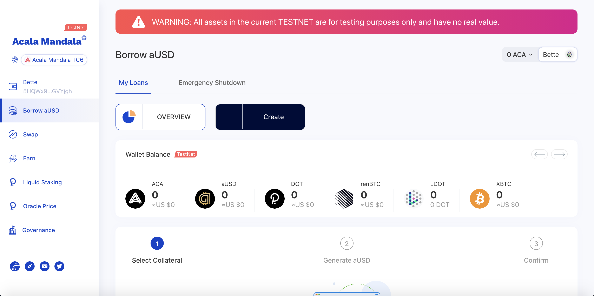

# Try Acala DApp

You can try Acala's DeFi Suite on the live testnet

* [Dapp](https://acala-dapp-git-update.acalanetwork.vercel.app/oracle-price): this deployment connects to the same network \(TC6\) used for ETHDenver hackathon 
* [ETHDenver Nodes](https://wiki.acala.network/learn/get-started/public-nodes#latest-ethdenver-nodes)
* Use this [Get Started guide](https://wiki.acala.network/learn/get-started) to get test tokens, and use the applications. Bear in mind ETHDenver DApp and Nodes are different as specified above.

