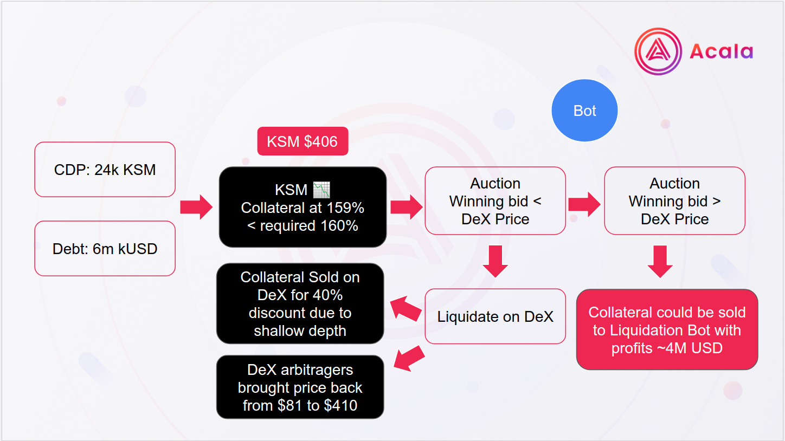

# Run a Liquidation Bot

### Motivation

You can read about the Acala stablecoin liquidation mechanism [here](../../learn/acala-introduction/#liquidation-process). The goal for liquidation is to sell off collateral assets from unsafe vaults and payback outstanding stablecoin debts. The collateral assets are sold on AcalaSwap first, then if unsuccessful, they will be sold on a Collateral Auction. There's usually great arbitrage opportunities to pick up collateral assets at a discount.&#x20;

Arbitragers (auction bids) profits from participating in the auctions, while help keep the protocol safe.

Below is an example from Acala stablecoin deployed on the Karura Network.

### Recent Event

In recent events, a collateralized debt position (CDP) of 24 thousand KSM for a debt of 6 million kUSD was liquidated. The collateral ratio fell below the required percentage and a liquidation was triggered.  The collateral was sold on the DeX for a 40 percent discount due to the shallow depth of the liquidity pool.  A liquidator Bot could have picked up this opportunity at a better rate for the vault holders before the DeX liquidation occured and capture the discounted price gains.

* [Chain Explorer Details of the Event](https://karura.subscan.io/extrinsic/915526-0?event=915526-18)

### Liquidation Bot Framework

We provide a collateral auction bot example and a monitoring framework as a starting point for you to develop with and enhance.&#x20;

### Strategy

Here is an example of a conservative strategy: KSM > LKSM (HODL) > kUSD (mint on the fly) > bid\
You can also make your own strategy.

### Reference Code

* [Collateral Auction Bot example](https://github.com/AcalaNetwork/collateral-auction-bot-example)&#x20;
* [Guardian (monitoring/alert framework tool)](https://github.com/AcalaNetwork/collateral-auction-bot-example)
