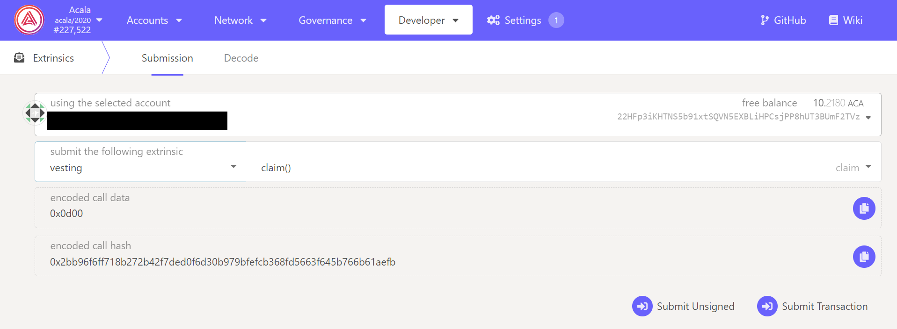

# Balance Type and Vesting

## Balance Types

On Acala there are the following steps balance types

* **Transferrable Balance**: as the name suggests, this balance can be used for transfers, paying fees and performing any actions on-chain.
* **Locked Balance:** this balance is frozen, depending on the scheme, it could be locked for a certain period of time before being transferrable, or it could be vested where a portion of the balance gradually becomes transferrable, or a combination of these. The tokens are released lazily, meaning you are required to perform a `claim` transaction to obtain it. The guide for claiming vested tokens is in the next section.
* **Total Balance:** is the sum of transferrable balance plus the locked balance. The entire balance can be used for governance operations such as voting.&#x20;

## Check & Claim Vested Tokens

### Claiming Vested ACA via Web App

You can claim your vested ACA here [https://apps.acala.network/](https://apps.acala.network/)

### Claiming Vested ACA

**Even though tokens may be vested (unlocked), you will still need to claim them before you can transfer them or use them in DeFi applications on the Acala platform.** You can learn how to claim your tokens by following the guide below:

1\) Go to your Polkadot.js **extension** and make sure it is set to `allow use on any chain`.


2\) Go to [Polkadot JS Apps](https://polkadot.js.org/apps/#/explorer) and connect to the Acala network. You can do this by clicking on the dropdown box in the upper left hand corner (shown below).

 (1).png>)

3\) Select an Acala node (any is fine) and click `Switch`.

.png>)

4\) Select `Accounts`. You should see your ACA amount. You can expand the balance in your account to see if there's a vested (locked) balance. If there's one, it will be displayed.


Go to the `Developer - Extrinsics` section, use the account that you want to claim the vested balance. Select `vesting` then `claim()` in the `submit the following extrinsics` field, then click the `Submit Transaction` button to complete the process.



### Claiming Vested ACA for Other Accounts

Users can also claim vested ACA for other accounts by going to the `Developer - Extrinsics` section. Select the account you'd like to use to initiate the claim in `using the selected account`. Submit the `vesting` then `claimFor(dest)` extrinsic and the account you'd like to claim **for** which is the account that has the locked tokens (shown at bottom of screenshot).

Note that submitting this transaction only makes the vested tokens transferrable. It does not transfer them to the account that initiates the claim.


### Check Vesting

Go to the `Developer - Chain state` section, select `vesting` then `vestingSchedules()` , then select your account, then click the `+` button to see what vesting schedule it has.


Below is an example result

* `start`: the tokens are locked until **Polkadot block #**
* `period`: release period e.g. release every block or every 432,000 block as in the example
* `periodCount`: how many vesting periods
* `perPeriod`: how much to release each period

```
[
  {
    start: 13,795,200
    period: 432,000
    periodCount: 12
    perPeriod: 100 ACA
  }
]
```

