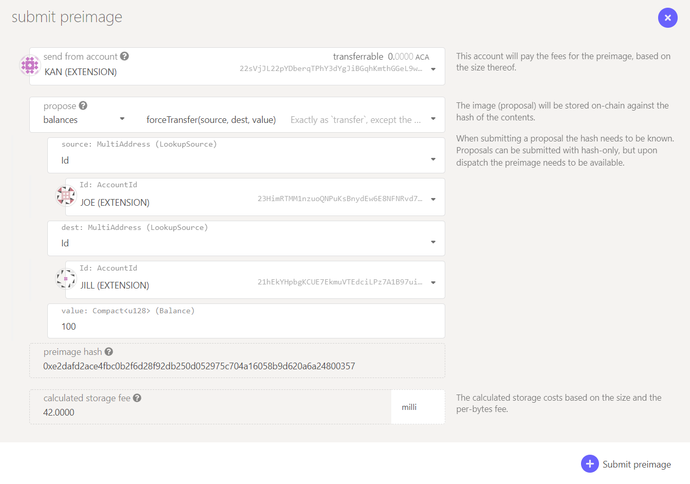
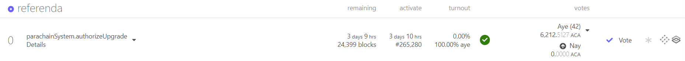
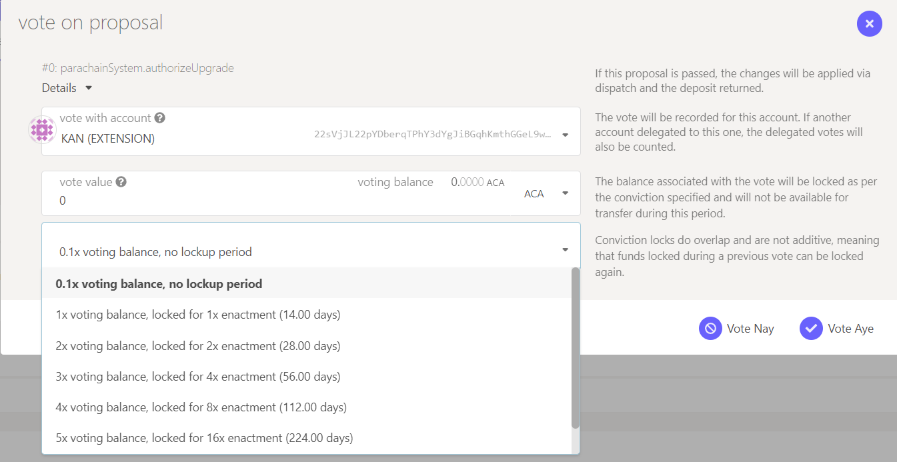
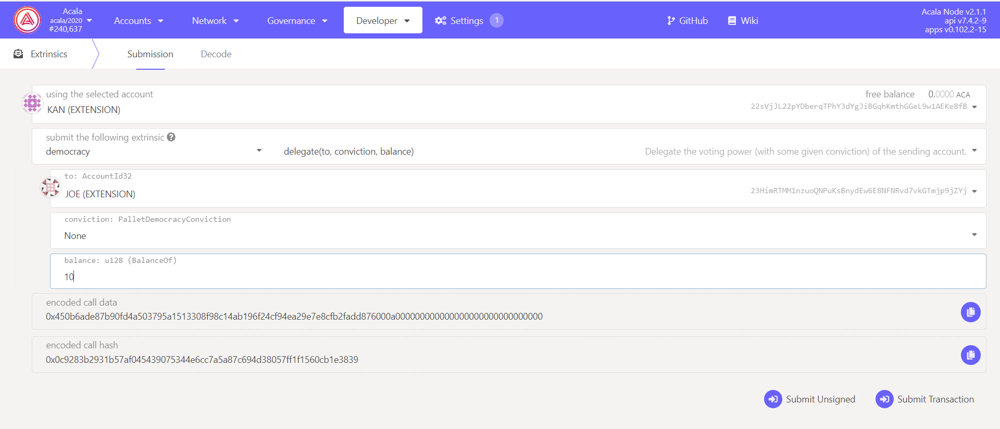

# Governance

Read Governance overview [here](../../learn/governance-overview/).

Below are governance discussion and proposal avenues:

* [Acala Subsquare - Discussion & View related on-chain Proposal](https://acala.subsquare.io)
* [Polkadot Web App - On-chain Voting](https://polkadot.js.org/apps/?rpc=wss%3A%2F%2Facala-rpc-0.aca-api.network#/extrinsics)
* [Acala Discourse Forum - long form, informal discussions](https://acala.discourse.group/c/acala/16)

## Governance Parameters

These are important governance parameters, which may change over time as we progress through the governance phases.

* Launch Period: Public referenda is every **5 days**
* Voting Period: Votes are tallied every **5 days**
* Emergency Voting Period: Voting period for fast-tracked emergency referendum is **3 Hours**
* Minimum Deposit: Proposing a referendum requires a minimum deposit of **200 ACA**
* Enactment Period: Minimum period for locking funds and the period between a proposal being approved and enacted is **2 days**
* Cool-off Period: Vetoed proposal may not be re-submitted within **7 days**

Most of these parameters are visible on the Polkadot App. You can also view upcoming governance events on `the Event Calendar`

## Propose a Referendum

A referendum consists of some action that you want to propose. If voted in by token holders, then the action will be enacted on-chain automatically. You are required to bond some tokens to propose an action. Once a proposal is submitted, it can not be canceled.&#x20;

On the [Polkadot Apps - Acala parachain](https://polkadot.js.org/apps/#/accounts), you can use the “Democracy” tab to make a new proposal. The action, such as 'force transfer balance from account A to account B', is encoded in a preimage, and the hash of the action is called preimage hash.&#x20;

Since the preimage can be quite large (hence costly to submit), you can submit a Proposal first which includes the preimage hash only, and submit the preimage (or have someone else submit it for you) later but before voting completes.

### Step 1: Submit a Proposal

#### Get the preimage hash&#x20;

By clicking on the `Submit preimage` button, then fill in the action you want to propose, copy and note down the preimage hash `0xe2dafd2ace4fbc0b2f6d28f92db250d052975c704a16058b9d620a6a24800357`. Once you noted down the hash, you can now cancel the prompt.&#x20;

#### Submit a proposal

Submit a proposal by clicking on the `Submit a proposal` button, and pasting in the preimage hash to submit it. Then the proposal shall appear in the proposal table.&#x20;

### Step 2: Submit a Preimage

Before voting of your proposal completes, you will need to submit the actual preimage. Otherwise, it cannot be enacted on-chain. You can repeat the ‘Submit a preimage’ process as previously mentioned, and click the ‘Submit preimage’ button to send the transaction.

## Vote on a Referenda

To Vote on Referenda, you must hold KAR tokens and these tokens must be held in a wallet that has the functionality to participate in Democracy like Polkadot.js. If you don't have your tokens in Polkadot.js wallet, you can read more about [account generation](https://wiki.acala.network/acala/acala-account#account-generation).

Once a proposal is in as a referendum, it will show up in the referenda table. You can navigate to the [Polkadot Apps - Acala Parachain Democracy](https://polkadot.js.org/apps/#/democracy) to cast your vote.

You can click on the ‘Vote’ button to vote. Select "Vote Aye" to support the proposal, and select "Vote Nay" to disapprove the proposal.&#x20;

You can also increase your conviction with the same number of tokens by locking them. The longer you are willing to lock your tokens, the stronger your vote will be weighted. Read more on [voting](https://wiki.polkadot.network/docs/maintain-guides-democracy/#voting-on-a-proposal) and [tallying](https://wiki.polkadot.network/docs/learn-governance#tallying).

## Unlock locked tokens

You will need to explicitly unlock these tokens once the locking period ends. You can go to the `Accounts` page, click the menu button for the voted account, and select the menu item`Clear expired democracy locks` to claim it back. Read more [here](https://wiki.polkadot.network/docs/maintain-guides-democracy/#unlocking-locked-tokens).&#x20;

### Check Locked Democracy Votes

Go to `Developer` - `Chain state`, then select `democracy` and `locks`. Select the account used for voting in the dropdown, and click the `+` button to see whether there's locked votes, and if any how long they are locked for.

## Delegate Vote

You can delegate your vote to others to vote on your behalf. On the [Polkadot Apps - Acala parachain](https://polkadot.js.org/apps/#/accounts), go to the `Developer` tab -- `Extrinsics` , then select `democracy.delegate` .

