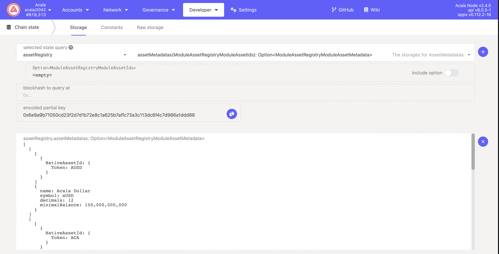

# Protocol Info

## Tokens

| Name                 | Symbol | Decimal | [ED](https://wiki.polkadot.network/docs/learn-accounts#existential-deposit-and-reaping) | Token Type           | Check Balance     | Total issuance         |
| -------------------- | ------ | ------- | --------------------------------------------------------------------------------------- | -------------------- | ----------------- | ---------------------- |
| Acala                | ACA    | 12      | 0.1                                                                                     | Native / Tokens(ACA) | `system.account`  | 1,000,000,000          |
| Acala USD            | aUSD   | 12      | 0.1                                                                                     | Tokens(AUSD)         | `tokens.accounts` | `tokens.totalIssuance` |
| Polkadot             | DOT    | 10      | 0.01                                                                                    | Tokens(DOT)          | `tokens.accounts` | `tokens.totalIssuance` |
| Liquid DOT           | LDOT   | 10      | 0.05                                                                                    | Tokens(LDOT)         | `tokens.accounts` | `tokens.totalIssuance` |
| Liquid Crowdloan DOT | LCDOT  | 10      |                                                                                         | LiquidCrowdloan(13)  | `tokens.accounts` | `tokens.totalIssuance` |
| Tapio DOT            | tDOT   | 10      | 0.01                                                                                    | StableAssetId(0)     | `tokens.accounts` | `tokens.totalIssuance` |
| Moonbeam             | GLMR   | 18      | 0.1                                                                                     | ForeignAssetId(0)    | `tokens.accounts` | `tokens.totalIssuance` |
| Parallel             | PARA   | 12      | 0.1                                                                                     | ForeignAssetId(1)    | `tokens.accounts` | `tokens.totalIssuance` |

## Account

### Address Format

Acala uses the [SS58 (Substrate) address format](https://github.com/paritytech/substrate/wiki/External-Address-Format-\(SS58\)). Relevant SS58 prefixes are:

* **Acala**: 10 ([ss58 registry details](https://github.com/paritytech/substrate/blob/df4a58833a650cf37fc97764bf6c9314435e3cb2/ss58-registry.json#L103-L111))
* **Karura**: 8 ([ss58 registry details](https://github.com/paritytech/substrate/blob/df4a58833a650cf37fc97764bf6c9314435e3cb2/ss58-registry.json#L85-L92))
* **Mandala**: 42

### Existential Deposit

Acala uses an _existential deposit_ (ED) to prevent dust accounts from bloating state. If an account drops below the ED, it will be removed from this account and be donated to the Treasury.

ED of native token ACA is configured in the runtime. Non-native tokens (DOT, aUSD, BTC etc) can be queried via SDK. The amount of ED can only be decreased, not increased, therefore it often starts with a higher number.

`transfer` and `deposit` in `pallet_balances` and `orml_tokens` will check the ED of the receiver account. A transaction may fail due to not meeting ED requirements, a typical one would be a user is swapping token A for token B, where token A balance no longer meets ED requirements. A front-end DApp shall perform checks and prompt user for such incidents.

Read more on ED [here](../../acala/get-started/acala-account/#existential-deposit).

## Protocol Fees

* **Mint aUSD with DOT & lDOT:**
  * **Liquidation penalty:** 12%
  * **Stability Fee:** 3%

## Transaction Fees

Acala uses weight-based fees, unlike gas, are predictable and charged pre-dispatch. See the [transaction fee](../../get-started/get-started/transaction-fees.md) page for more info.

## Types

Type definitions allow the SDK to know how to serialize / deserialize blocks, transactions and events.

Acala's type definition bundle can be found [here](https://unpkg.com/browse/@acala-network/type-definitions@latest/json/typesBundle.json).

## MultiLocation

You can use these MultiLocation to add Acala token assets to other parachains foreign token list.

Asset Name: Acala Dollar\
Asset Symbol: AUSD\
Decimals: 12\
existentialDeposit: 0.1

`{"parents": 1, "interior": {"X2": [{"Parachain": 2000}, {"GeneralKey": 0x0001} ]}}`

Asset Name: Liquid DOT\
Asset Symbol: LDOT\
Decimals: 10\
existentialDeposit: 0.05

`{"parents": 1, "interior": {"X2": [{"Parachain": 2000}, {"GeneralKey": 0x0003} ]}}`

Asset Name: Acala Native Token\
Asset Symbol: ACA\
Decimals: 12\
existentialDeposit: 0.1

`{"parents": 1, "interior": {"X2": [{"Parachain": 2000}, {"GeneralKey": 0x0000} ]}}`

### Autogenerated MultiLocations


Click Run to generate the current full list of MultiLocations


## JS SDK

Acala.js: [https://github.com/AcalaNetwork/acala.js](https://github.com/AcalaNetwork/acala.js)

Documentation: [https://github.com/AcalaNetwork/acala.js/wiki](https://github.com/AcalaNetwork/acala.js/wiki)

Please also refer to the [documentation of polkadot.js](https://polkadot.js.org/docs/api/).

## Telemetry

[https://telemetry.polkadot.io/#list/Acala](https://telemetry.polkadot.io/#list/Acala)

## Polkadot apps

[https://polkadot.js.org/apps/?rpc=wss%3A%2F%2Facala-rpc.dwellir.com#/explorer](https://polkadot.js.org/apps/?rpc=wss%3A%2F%2Facala-rpc.dwellir.com#/explorer)

## Explorer

[https://acala.subscan.io/](https://acala.subscan.io/)
