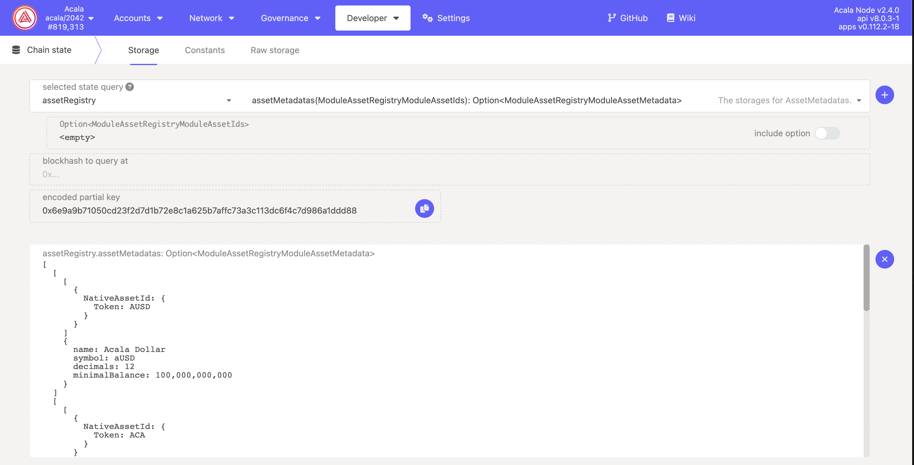

# Token Transfer

Acala supports different types of tokens than Polkadot, and allows various ways to transfer tokens. This guide will walk through tokens available on Acala, tools can be used for transfers, how to send transfer transactions, monitor and track these transactions.

## Token Types

### Token

| Symbol | Description                                           | CurrencyId  | Decimals | Minimal Balance |
| ------ | ----------------------------------------------------- | ----------- | -------- | --------------- |
| ACA    | native token of Acala network                         | Token(ACA)  | 12       | 0.1 ACA         |
| aUSD   | multi-collateralized stablecoin                       | Token(AUSD) | 12       | 0.1 aUSD        |
| DOT    | crossed to Acala from Polkadot Relay Chain            | Token(DOT)  | 10       | 0.01 DOT        |
| LDOT   | tokenized staked DOT from the Liquid Staking protocol | Token(LDOT) | 10       | 0.05 LDOT       |

`AssetRegistry` registered the metadata info of this type token.

### DexShare

The lp share token for the trading pair of Acala DEX. The CurrencyId type of Acala DEX's lp token are `CurrencyId::DexShare`, and the decimals and minimal balance of lp token are same as the first token in `DexShare`. For example, `CurrencyId::DexShare(Token(ACA), Token(AUSD))` is the CurrencyId of lp token of ACA/aUSD pair, its decimal is 12, and minimal balance is 0.1, these are same as ACA.

Currently, `AssetRegistry` does not register metadata info of any lp token.

### Erc20

Token issued by ERC20 contracts deployed in Acala EVM+. The CurrencyId type is `Erc20(Address)`, `Address` is the ERC20 contract address on EVM+.

### LiquidCrowdloan

| Symbol | Description                                 | CurrencyId          | Decimals | Minimal Balance |
| ------ | ------------------------------------------- | ------------------- | -------- | --------------- |
| LcDOT  | tokenized liquid receipt of crowdloaned DOT | LiquidCrowdloan(13) | 10       | 0.01 LcDOT      |

`AssetRegistry` registered the metadata info of this type token.

### ForeignAsset

Tokens originated from other parachains.

`AssetRegistry` registered the metadata info of this type token.

## Query token's metadata on assetRegistry

## Tools

* JS/TS SDK: [https://github.com/AcalaNetwork/acala.js](https://github.com/AcalaNetwork/acala.js)
* Blockchain explorer: [http://acala.subscan.io](http://acala.subscan.io)
* api-sidecar: [https://github.com/paritytech/substrate-api-sidecar](https://github.com/paritytech/substrate-api-sidecar)
* txwrapper: [https://github.com/AcalaNetwork/txwrapper](https://github.com/AcalaNetwork/txwrapper)
* SubQuery: [https://github.com/AcalaNetwork/acala-subql-services](https://github.com/AcalaNetwork/acala-subql-services)

## Token balances

Query chain state to get token balances.

### Native token (ACA) balances

Query `system` module to get native token (ACA) balances data.

#### system.account

* Returns the `AccountInfo` of given account. For different types of balances, check the fields in `AccountInfo.data`
  * `free`: the free balance.
  * `reserve`: the reserved balance.

### Other tokens

For non-native tokens, like DOT, LDOT, aUSD, query `tokens` module to get balances info.

#### tokens.accounts

* Returns the `OrmlAccountData` of given account and currency ID. For different types of balances, check the fields:
  * `free`: the free balance.
  * `reserved`: the reserved balance.

#### tokens.lock

* Returns the `BalanceLock` of given account and currency ID. `BalanceLock` has two fields:
  * `id`: the lock identifier.
  * `amount.` the locked amount.
* Note locks could be overlapped, and the same amount of tokens could be under locked by multiple locks.

## Send Tokens

### Transactions

#### currencies.transfer

* [https://acala.subscan.io/extrinsic?module=Currencies\&call=transfer](https://acala.subscan.io/extrinsic?module=Currencies\&call=transfer)
* This can be used to send any supported tokens in the network, including ACA, DOT, LDOT, LCDOT, aUSD etc.

#### currencies.transferNativeCurrency

* [https://acala.subscan.io/extrinsic?module=Currencies\&call=transfer\_native\_currency](https://acala.subscan.io/extrinsic?module=Currencies\&call=transfer\_native\_currency)
* This can be used to send native token (ACA). It has slightly cheaper transaction fees compare to currencies.transfer

#### balances.transfer

* [https://acala.subscan.io/extrinsic?module=Balances\&call=transfer](https://acala.subscan.io/extrinsic?module=Balances\&call=transfer)
* Same as `currencies.transferNativeCurrency`, only for native token (ACA).
* Compatible with Polkadot / Polkadot and most other Substrate-based chains.

#### xtokens transfer by XCM&#x20;

* ORML's [Xtokens Module](https://github.com/open-web3-stack/open-runtime-module-library/blob/master/xtokens) supports token transfer by cross-consensus messages (XCM), and has a number of dispatchable functions to support different use cases.
*   **xtokens transfer functions:**\
    xtokens.transfer\
    xtokens.transfer\_multiasset\
    xtokens.transfer\_with\_fee

    xtokens.transfer\_multiasset\_with\_fee

    xtokens.transfer\_multicurrencies

    xtokens.transfer\_multiassets
* [https://acala.subscan.io/extrinsic?address=\&module=xtokens](https://acala.subscan.io/extrinsic?address=\&module=xtokens)
* Can be used to send any supported tokens in the source and destination networks, including ERC20 tokens.

## Receive Tokens

There are multiple ways to detect incoming balance transfers:

* Monitor events
* Subscribe storage changes
* Monitor transactions

### Monitor Events

Monitoring events is a recommended way to track incoming balance transfers. It can handle **ALL** types of transfer transactions including the one that is not initiated by a transaction directly (e.g. delayed proxy).

#### balances.transfer

* [https://acala.subscan.io/event?module=Balances\&event=Transfer](https://acala.subscan.io/event?module=Balances\&event=Transfer)
* Emitted when a native token (ACA) transfer happened.

#### currencies.transfer

* [https://acala.subscan.io/event?module=Currencies\&event=Transferred](https://acala.subscan.io/event?module=Currencies\&event=Transferred)
* Emitted when a token transfer happened.
* NOTE: This is not emitted when balances.transfer is used to make a transfer.

#### currencies.deposit

* [https://acala.subscan.io/event?module=Currencies\&event=Deposited](https://acala.subscan.io/event?module=Currencies\&event=Deposited)
* Emitted when a token is minted to an account. This could happen when it is a cross-chain transfer or it is a transaction minting stablecoins.
  * For cross-chain transfer, there would be `ExecutedDownward` event along with the deposit. [https://acala.subscan.io/event?address=\&module=dmpqueue\&event=executeddownward](https://acala.subscan.io/event?address=\&module=dmpqueue\&event=executeddownward)

#### xtokens.transferredmultiassets

* [https://acala.subscan.io/event?address=\&module=xtokens\&event=transferredmultiassets](https://acala.subscan.io/event?address=\&module=xtokens\&event=transferredmultiassets)
* Emitted when a cross-chain transfer happened from Karura to other chains.
* Triggered by`xtokens.transfer, xtokens.transfer_multiasset, xtokens.transfer_with_fee, xtokens.transfer_multiasset_with_fee, xtokens.transfer_multicurrencies, xtokens.transfer_multiassets` extrinsics .

### Storage changes RPC

* [state\_subscribeStorage](https://polkadot.js.org/docs/substrate/rpc#subscribestoragekeys-vecstoragekey-storagechangeset)
  * Subscribe to a list of account balances. However, it does not guarantee subscription delivery due to connection errors or blockchain reorg.

### Monitor Transactions

It is possible to fetch transactions in every block, check for transfer transactions, and check if the transfer transaction is successful. However, this may likely yield false-negative results i.e. deposit received but failed to recognize, due to the various ways for transfer.

Refer to Send Tokens section for direct transfer transactions. In additional, to sending transfer transactions individually, there are common utility methods to batch send transfer transactions:

#### utility.batch

* [https://acala.subscan.io/extrinsic?module=Utility\&call=batch](https://acala.subscan.io/extrinsic?module=Utility\&call=batch)
* This can be used to send batch transaction
* NOTE: batched transactions will always emit success events.
  * `utility.BatchCompleted` event indicates that all transactions are successful
  * `utility.BatchInterrupted` event indicates which transaction failed. Transactions before the failed transaction are executed successfully and will not be reverted.

#### utility.batchAll

* [https://acala.subscan.io/extrinsic?module=Utility\&call=batch\_all](https://acala.subscan.io/extrinsic?module=Utility\&call=batch\_all)
* This is similar to utility.batch but will revert all transactions upon failed transaction.

## [Transfer Code Samples](https://github.com/AcalaNetwork/acala-js-example/blob/21a3be3538260cc8a047856bf163dad75de1db3a/src/transfer-examples/readme.md)
