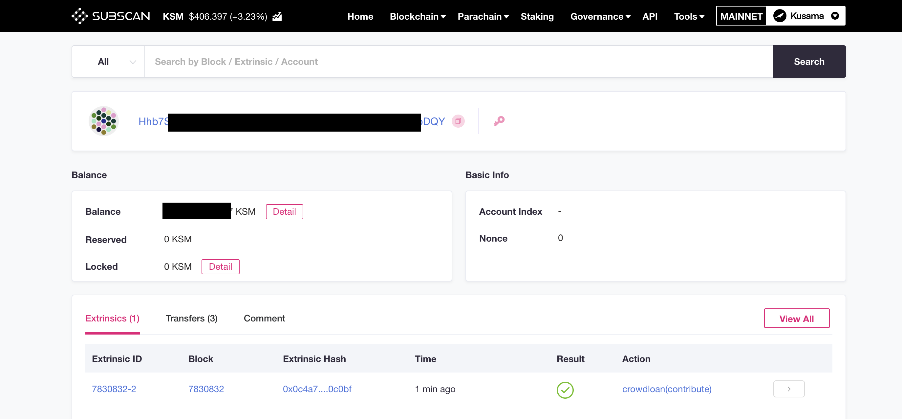

# Crowdloan

## Key Points

* \*\*\*\*[**Check rewards**](crowdloan-rewards.md) 🔥
* The Kusama parachain auction & Karura crowdloan event is happening soon, [register now,](https://acala.network/karura/join-karura) **get your KSM ready to bond**. Expect chaos & unpredictable announcements 🚀
* The Karura Crowdloan Event is an experiment to crowdsource network security and a community-backed launch for individuals looking to contribute to the evolution of Kusama’s network and parachains.
* **For** **every 1 KSM contributed, a minimum of 12 KAR will be rewarded**. The lease period \(KSM locked period\) is 48 weeks. 
* Contributed KSM will be returned at the end of Karura parachain lease.
* KAR will be distributed after the mainnet launch of Karura.
* [Karura Launch Phases](https://www.notion.so/acala/dcabf9ba7c6246c69b913d5972503227?v=4121894373fd43d98ffcac260803928d).

## **1. About Karura**

### 1.1 Overview

[Karura](https://acala.network/karura) is the decentralized financial hub of Kusama, a scalable multi-chain network for radical innovation and early stage Polkadot deployments. Karura serves as the sister network to Acala, and offers a suite of financial primitives, including: a trustless staking derivative \(liquid KSM - LKSM\), a multi-collateralized stablecoin backed by cross-chain assets \(kUSD\), and an AMM DEX –  all with micro gas fees that can be paid in any token. Karura is a blockchain platform custom-built for DeFi and powered by KAR. 

### 1.2 KAR Token

* **KAR** is the native token of the[ Karura](https://acala.network/kar-crowdloan).
* **KAR** has a fixed supply of 100,000,000.
* **KAR** can be used for paying transaction fees, staking to deploy smart contracts and pallets, node incentivization, algorithmic risk adjustment, and governing the network and protocols.
* Learn more about [KAR token](https://acala.network/karura/token) here.

## **2. Crowdloan Overview**

The crowdloan event is an important milestone for launching the Karura network. Read more on the Karura launch phases [here](https://www.notion.so/acala/dcabf9ba7c6246c69b913d5972503227?v=4121894373fd43d98ffcac260803928d).

### **2.1 Parachain Auction**

Kusama is a sharded, multi-chain network that allows blockchains to connect for interoperability, scalability, and plug-and-play network security. Kusama is the cousin network of Polkadot. To join Kusama’s network, all parachains must participate in and win a unpermissioned candle auction to secure a slot on the network. Parachains can choose to raise KSM in a variety of ways in order to participate in the auction.

### **2.2 Purpose of Karura Crowdloan**

Karura has chosen to host a Crowdloan to trustlessly crowdsource KSM, which will be used to participate in the Kusama parachain auction. These KSM will be bonded, or ‘locked’, in the Kusama Relay Chain for the duration of Karura’s parachain lease.

**Crowdsourced Network Security**  
  
KSM holders lock their tokens on Kusama for a period of time \(48 weeks for the first parachain auction\) to help Karura lease a parachain slot and gain access to Kusama’s plug-and-play security. In return for KSM holders’ loan, KAR \(Karura’s native token\) will be distributed to participants.

**Community-backed Launch**

KSM tokens will be returned to holders following parachain lease, with a guarantee of receiving the KSM principal back. It can be seen as a community-backed launch for individuals looking to contribute to the evolution of Kusama’s network and parachains.

**Fair Network Bootstrapping**

The KAR distributed to participants will be vested over a period of time, but the full balance can be used to participate in governance and other activities besides transferring. This helps us to build a strong and well-intentioned community from the ground up.

## **3. Karura Crowdloan Details**

### **3.1 Key Details**

* **Lease Period:** 48 Weeks.
* **Reward:** 12 KAR for every 1 KSM contributed.
* **Vesting:** 30% liquid upfront, 70% vest over lease period.
* **Referral Bonus:** Referral code recipients will receive 10% additional KAR to split between referrer and referee.
* **Eligibility:** no KYC is required, but participants must agree to Terms & Conditions where participants from certain jurisdictions are excluded

### 3.2 Ways to Participate

Crowdloan is a permissionless event, so you can make your own judgement on how you'd like to participate. We recommend the following ways to participate:

1. Participate via [Karura official website](https://acala.network/karura/join-karura) using Polkadot{.js} browser extension. Use a referral link to get an extra 5% bonus. Wallet setup guide [here](https://wiki.acala.network/karura/ksm-address/create-new-ksm-account). 
2. Participate via partner exchanges.
3. Participate via partner mobile wallets.

Follow the [`How to Crowdloan`](https://wiki.acala.network/karura/crowdloan/how-to-crowdloan) guide to participate via Karura official website and Polkawallet.

#### Partner Exchanges 

* [Kraken](https://www.kraken.com/learn/parachain-auctions): check with Kraken for the bonus amount.
* [OKEx](https://www.okex.com/): check with OKEx for how to participate and bonus amount.
* [Huobi](https://www.huobi.com/): check with Huobi for how to participate and bonus amount.
* KuCoin: coming soon

#### & Mobile Wallets

* [Polkawallet](https://polkawallet.io/): non-custodial wallet, supports the Karura referral program. 
* [MathWallet](https://mathwallet.org/en-us/): both cloud and non-custodial wallet. Check with MathWallet for promotions. 
* [Fearless Wallet](https://fearlesswallet.io/): non-custodial wallet, supports Karura referral program.

More partners to come...

**Disclaimer:** Crowdloan via exchange or mobile wallet is provided by a third party, not Acala. Acala does not guarantee and does not assume any responsibility for, the acts or omissions of the third party, the performance of their products or services.

### 3.3 Prepare your KSM

In order to participate in the crowdloan, KSM must be unbonded. If you are already staking KSM, please begin the process of unstaking now to ensure that you can observe the 7-day cooldown. The following guides are available:

* [Unstaking Your KSM Tokens on Polkadot.{js} Extension](https://wiki.acala.network/karura/ksm-address/unstaking-your-ksm-tokens-on-polkadot.-js-extension)
* [Unstaking Your KSM Tokens on Polkawallet](https://wiki.acala.network/karura/ksm-address/unstake-polkawallet)

### 3.4 Check Contribution

You can enter your KSM address in [Subscan explorer](https://kusama.subscan.io/), the `Extrinsics` table at the bottom should show all your transactions including crowdloan contribution transactions. 

## **4. Post-Crowdloan/Auction**

After Karura has won the parachain auction, it will launch network Genesis on Kusama. The KAR rewards will be distributed after the network is launched. For those who did not participate via the Karura website \(without agreeing to the T&C\), there will be a KAR claim process upon launch.

If Karura does not win the initial auction, it will continue to bid in the subsequent auctions. If Karura fails to win any auction for six weeks after the beginning of the crowdloan, then it will end the crowdloan and return all funds to holders.

### 4.1 Check Rewards

[Check crowdloan rewards](crowdloan-rewards.md).

