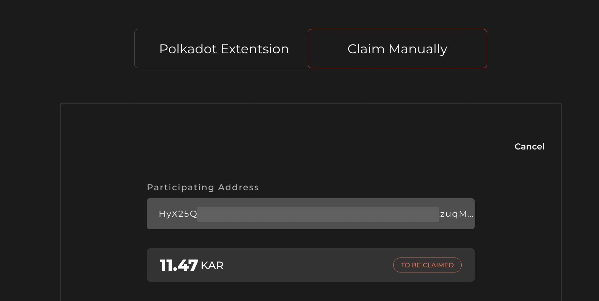
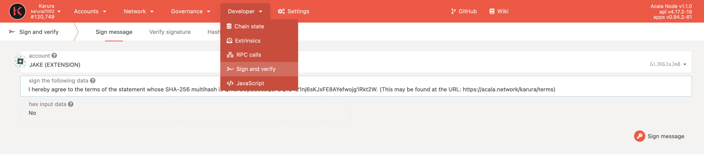
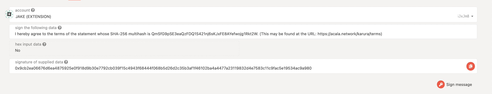

# Claim KAR

If you participated in Karura crowdloan from channels other than the officially supported ones, you will need to read and agree to our Terms and Conditions to claim your tokens. You can check if you need to claim KAR [here](https://distribution.acala.network/).

## Using Polkadot{js} Extension

You can navigate to the Claim Website from the Distribution site or directly [here](https://distribution.acala.network/claim). Connect your Polkadot{js} Extension, **using the same account that participated in the crowdloan event,** and follow the prompts to complete the process. 

It requires you to use the extension to sign a message, but it does not cost any transaction fees. Once the process is completed, it may take up to 48 hours for distribution to be scheduled. 

## Manual Claim

You can navigate to the Claim Website from the Distribution site or directly [here](https://distribution.acala.network/claim). If you did not participate in the crowdloan event with the Polkadot{js} extension, then select `Claim Manually` and enter the address you used to participate in the Karura crowdloan.



There are two ways to claim

1. Send a System Remark on Kusama with a specific message OR
2. Use Sign and Verify to sign the specific message

Below are the guides for how to use either to claim.

### Using System Remark

### Use Sign and Verify

You can go to the [Polkadot App - Developer - Sign and Verify](https://polkadot.js.org/apps/#/signing) \(using either Polkadot, Kusama, or Karura are all fine\).

1. You must select **the same account that was used in the Karura crowdloan**.



2. In the `sign the following data` field, copy and paste in the required message to sign \(shown on the Claim website\).

```text
I hereby agree to the terms of the statement whose SHA-256 multihash is QmSfG9pSE3eaQzFDQ1S421nj6sKJxFE8AYefwojg1Rkt2W. (This may be found at the URL: https://acala.network/karura/terms)
```

3. Sign, copy the hash and paste it back to the Claim website to complete the process



Once the process is completed, it may take up to 48 hours for distribution to be scheduled. 


