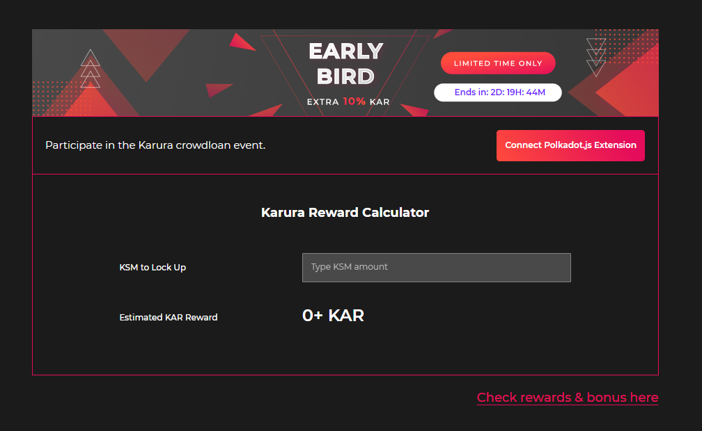

# FAQ

## **Ways to Participate**

### **How can I create my own referral code?**

You can't. The referral codes were given to those who registered on the Karura waiting list. The registration for Karura Waiting List was finished on 31 March 2021.

However, you can still use another person’s referral code to receive a 5% bonus, you just won’t be able to use that code to refer other people.

### **Which wallets can I use for the Karura crowdloan?**

Please check this section: [Crowdloan Ways to Participate](https://wiki.acala.network/karura/crowdloan#3-2-ways-to-participate)

### **How do I create a Kusama wallet?**

By creating a wallet through the Polkawallet mobile app or the Polkadot{.js} browser extension. Guides to setting up these wallets can be found [here](https://wiki.acala.network/karura/ksm-address/create-new-ksm-account).

### **Is Ledger compatible with the crowdloan?**

No. Check the ways to participate here: [Crowdloan Ways to Participate](https://wiki.acala.network/karura/crowdloan#3-2-ways-to-participate)

### **How do I find my Kusama address if I already have a wallet?**

You can find your Kusama address by referring to our guide found [here](https://wiki.acala.network/karura/ksm-address/check-ksm-addr).

### **Is there a step-by-step guide on how to participate in the Karura crowdloan?**

A step-by-step guide on how to participate through Polkadot{.js} browser extension and Polkawallet can be found [here](https://wiki.acala.network/karura/crowdloan/how-to-crowdloan).

### How can I track my rewards?

You can track your rewards by entering your Kusama address on the [Karura site](https://acala.network/karura/join-karura) under the "Check rewards & bonus here" link \(screenshot below\).

### How do I unbond my KSM?

We've created guides for unbonding your KSM in Polkadot{.js} and Polkawallet. Look here for more information:

* Unstaking Guide [Polkadot.{js} extension](https://wiki.acala.network/karura/ksm-address/unstaking-your-ksm-tokens-on-polkadot.-js-extension)  
* Unstaking Guide [Polkawallet](https://wiki.acala.network/karura/ksm-address/unstake-polkawallet)

### **What is the minimum amount I can contribute?**

0.1 KSM if participating from Karura website  
1 KSM if participating from Polkawallet mobile app  
If you are participating from other apps, check their local policy for minimum contribution.

### Am I allowed to contribute to the crowdloan multiple times?

Yes. As long as the auction has not expired, you are allowed to contribute.

### **How do I participate in the referral program?**

Those who participated in our waitlist promotion will be able to share referral links once they receive them. For each referral you make, you and your referee will both receive a 5% bonus on the amount they contribute to the Karura crowdloan. For example, if Alice shares her referral link with Bob, and Bob contributes 10 KSM to the crowdloan module, both will receive 6 KAR as a bonus \(10 KSM x 12KAR:1KSM reward ratio x 5%\).

Referral program is supported on:

* On Karura official website
* Polkawallet
* Fearlesswallet

### **Where can I track my referral bonus?**

You can track your referral bonus on the Karura crowdloan.

### **Can I make multiple referrals and get a bonus for each one?**

Yes. For each referral you make, you and your referee will both receive a 5% bonus on the amount they contribute to the Karura crowdloan. For example, if Alice shares her referral link with Bob and Carl, Alice's bonus is equivalent to 5% of Bob's contribution plus 5% of Carl's contribution.

### Do referrals work if I'm participating through an exchange?

Exchanges may have different promotion schemes. The following exchanges will be supporting Karura crowdloan. Please contact them to find out.

* Kraken
* OKEx
* Kucoin
* Huobi \(TBD\)

### **Can I refer to my own KSM address and still qualify for bonuses?**

Yes, you can self-refer and earn 5% bonus rewards in KAR as both the referrer and the referee.

### **How can I check what Kusama address is associated with my referral code?**

Your referral code is the public key of your account, additionally registered in our system. You can use[ subscan transform](https://acala-testnet.subscan.io/tools/ss58_transform) to find the associated Kusama address. You need to paste your referral code in the input field. Press "Transform" and find the corresponding Kusama address in the appeared list on the right. Note, the format of the referral code is 0x0000000000000000000000000000, it’s the part of the link that we sent you.

### **How long will my tokens be locked if I participate in the crowdloan?**

Your KSM tokens will be locked for the full duration of Karura’s parachain lease, which is 48 weeks since the launch of the Karura network.

### **Will my KSM be returned after the parachain lease ends?**

Yes, your KSM tokens will be automatically returned to you when the parachain lease ends.

Karura never has custody of your KSM tokens. Your KSM tokens are bonded to the crowdloan module, which lives on the Kusama Relay Chain, and remain visible within your wallet.

### **How can I withdraw my KSM from the crowdloan?**

All submissions to the crowdloan module are final and cannot be withdrawn. You will automatically receive your funds at the end of the parachain lease.

### **Will I get my KSM tokens back if Karura doesn’t win the auction?**

If Karura does not win the initial auction, it will continue to bid in the subsequent auctions. If Karura fails to win any auction for six weeks after the beginning of the crowdloan, then it will end the crowdloan and return all funds to holders.

### **Can I earn KSM staking rewards while my KSM are locked?**

No. KSM contributed to the crowdloan are locked on the Kusama Relay Chain. You will however receive KAR tokens based on your contribution, once Karura wins the auction and launches mainnet.

## KAR Tokens

### **How many KAR tokens will I receive for participating in the crowdloan?**

Karura will distribute KAR tokens to crowdloan supporters at a ratio of at least 12 KAR for every 1 KSM.

### **What is the KAR token supply?**

There are 100,000,000 KAR tokens.

### **How many KAR tokens will be distributed in the crowdloan?**

11 million KAR tokens, which is equivalent to 11% of the token supply, will be distributed to contributors of the crowdloan module.

### What happens if **there is more KSM bonded than the amount allocated for the crowdloan?**

If there're more KSM bonded than the amount allocated for the crowdloan, we will increase the KAR reward allocation. This will allow us to honor the 12 KAR for every 1 KSM reward.

### Is there a vesting period on KAR tokens?

Yes. Upon receipt of your KAR tokens, 30% will be unlocked and transferrable, while the remaining 70% will be vested and gradually unlocked over the lease period. However, the full balance can be used to participate in governance.

### Where can I buy KAR tokens?

No exchanges currently list KAR tokens. However, you can receive KAR tokens by contributing KSM to the crowdloan module in the Karura Parachain Auction.

### What is the price of the KAR token?

The price will be defined by the open market after the Karura launch.

### **Will I receive KAR tokens for participating in the testnet?**

No.

## **Accessing Your KAR Tokens**

### **Is KAR a stablecoin?**

No. The Karura Dollar \(kUSD\) is a stablecoin. KAR is the native token of the Karura network.

### **When will I receive my KAR tokens from the crowdloan?**

Tokens will be distributed after the Karura network goes live.

### **Where will I receive my KAR tokens from the crowdloan?**

After Karura has won the parachain auction, it will launch network Genesis on Kusama. The KAR rewards will be distributed after the network is launched. For those who did not participate via the Karura website \(without agreeing to the T&C\), there will be a KAR claim process upon launch. Learn more on Karura launch process [here](https://www.notion.so/acala/dcabf9ba7c6246c69b913d5972503227?v=4121894373fd43d98ffcac260803928d).

**Didn't find the answer? Ask our support team: support@acala.network**

