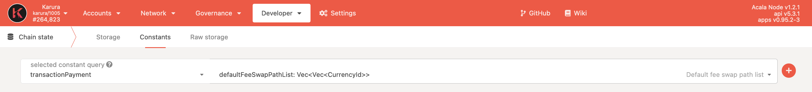
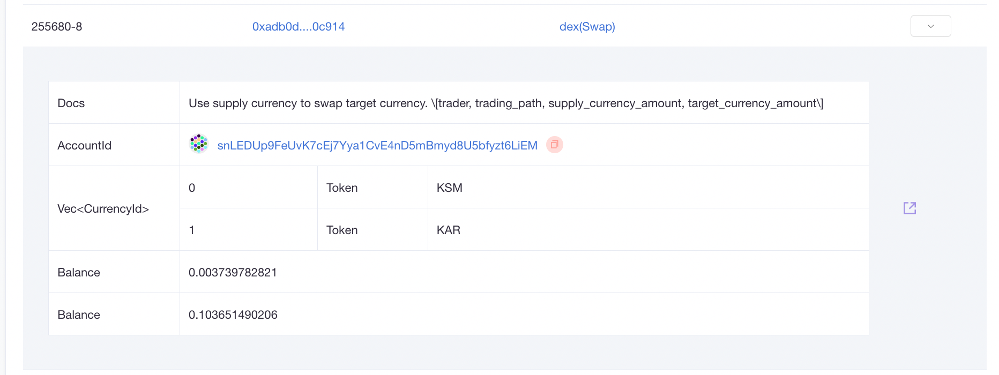
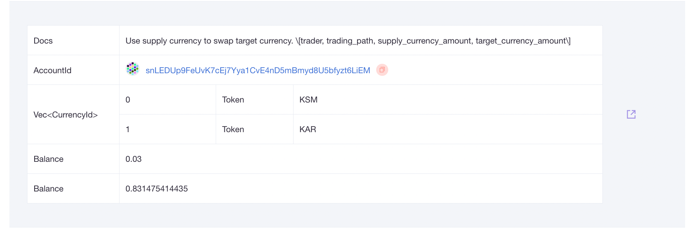

# Flexible Fee

## Available Fee Tokens

* **KAR** is the default fee token on Karura.&#x20;
* **KSM** is now enabled also as a fee token on Karura.

## Default Fee Token

The default fee token on Karura is KAR. The system will automatically find the next available and supported fee token if the default token has zero balance. The default order is as follows


KAR > kUSD > KSM > LKSM


You can check this on-chain `Chain state` > `Constants` >`transactionPayment defaultFeeSwapPathList`



For example, if a user has no KAR balance and no kUSD balance, but some KSM balance, then the system will automatically use KSM as fee token.

Users can set their next default fee token to tokens other than kUSD e.g. KSM by executing the following transaction:

```
transactionPayment.setAlternativeFeeSwapPath(fee_swap_path)
```

## How it works

You do NOT need KAR in the balance to perform any transactions on Karura. If you hold only KSM (or other supported fee tokens) on the Karura network, you can still trade KSM on [Karura Swap](../developer-guide/swap/) and [mint kUSD](kusd-stablecoin/mint-kusd.md) without holding KAR.

This is what happens behind the scene if you trade KSM on Karura Swap without KAR in balance

1. User has a brand new account, with some KSM just [cross-chain transferred KSM](inter-kusama-transfer.md) from the Kusama network
2. User trades 0.03 KSM for KAR on [Karura App](https://apps.karura.network/swap), it is seamless without extra user action
3. Behind the scene&#x20;
   * a small amount of KSM is swapped to KAR on Karura Swap&#x20;
   * part of it was used to pay for [transaction fees](../get-started/transaction-fees.md)
   * part of it - [`Existential Amount`](../get-started/karura-account/#existential-deposit) of KAR was saved to the brand new account

This is [an example transaction](https://karura.subscan.io/extrinsic/255680-3) illustrated the above process. There are two `dex(Swap)` events

#### 1st `dex(Swap)` event&#x20;

It traded `0.003739782821 KSM`  for `0.103651490206 KAR` , where `0.1 KAR` was the Existential Deposit amount, and `0.003651490206 KAR` was the transaction fee.



#### 2nd `dex(Swap)` event

This is the actual Swap event.



