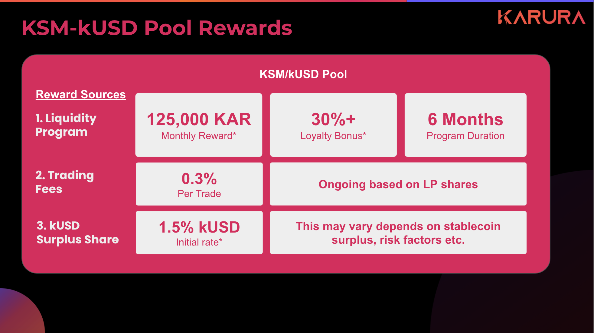
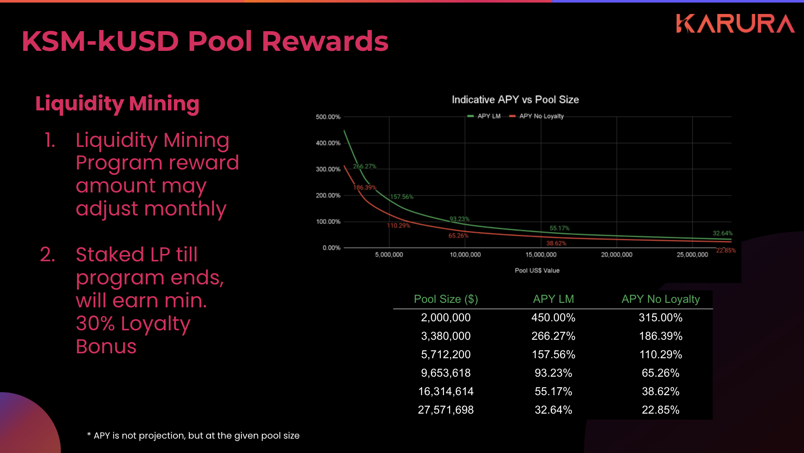
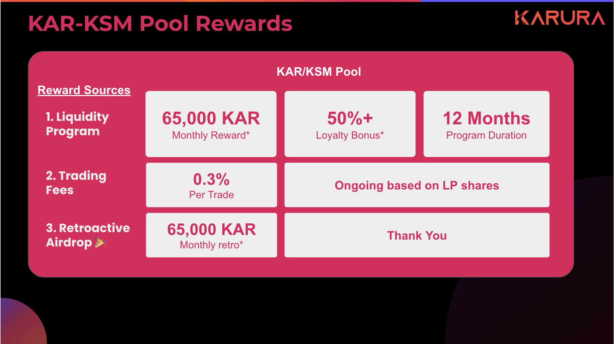
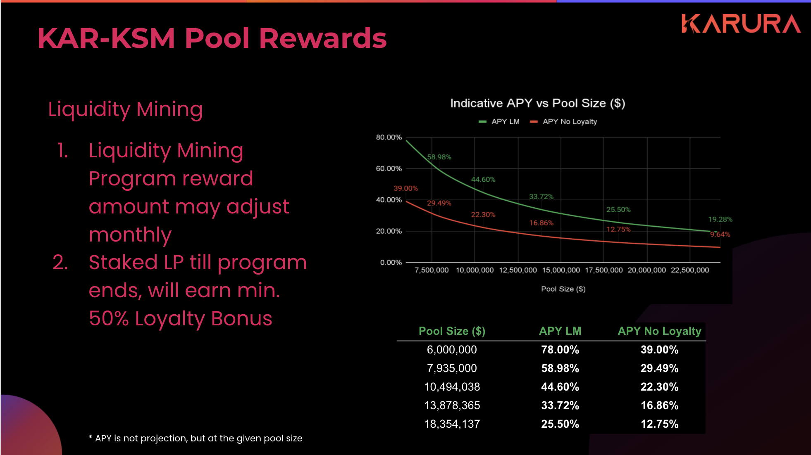
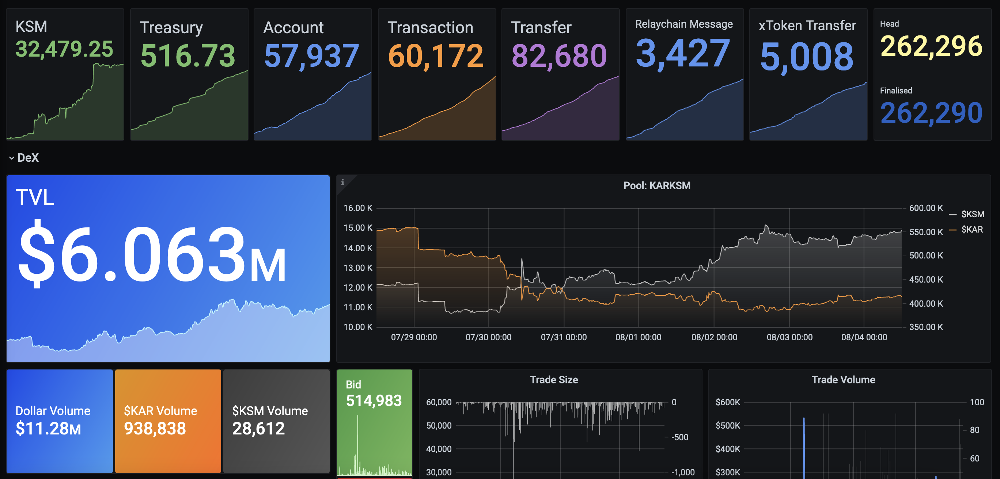
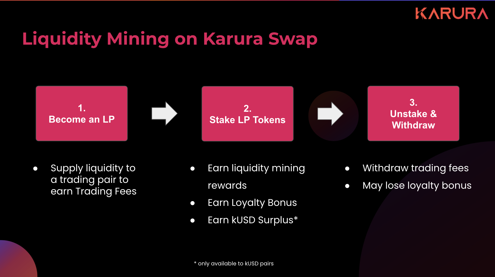

# Incentive Program

## Why Liquidity Incentive Program?

Our protocols shall provide real utility and built-in incentive mechanisms to run autonomously even without additional incentives. For example, great liquidity and trading volume shall generate reasonable trading fees to keep both liquidity providers and traders happy. Liquidity Incentive programs shall act as short-term catalysts to accelerate this adoption and achieve this goal faster.

Specifically, the Liquidity Incentive Program is set out to achieve the following

1. **Create Liquidity Virtuous Cycle:** better liquidity, better slippage, better trading experience, more fees for LPs who would bring more liquidity to attract more traders
2. **Create Inter-protocol Virtuous Cycle:** better liquidity, better stability support for kUSD \(as Karura Swap is used for kUSD collateral liquidation\), more stablecoin surplus share for LPs who would bring more liquidity
3. **Foster a long-term, sustainable and coherent community ❤️**

### Loyalty Bonus

We implement a Loyalty Bonus mechanism to achieve the following

* To avoid hot bags mining and dumping, hence encouraging more sustainable, longer-term farming for the benefit of the protocol and the entire network
* To share more rewards for longer-term LPs compared to just vesting

## KSM-kUSD Pool Rewards

2021-08-05

* Total ~125,000 KAR rewards per month \(inclusive of Royalty Bonus provision\)
* 87,500 KAR \(70%\) is the base reward pool, and 37,500 \(30%\) is Royalty Bonus provision
* Base reward is calculated and earned per period \(every 5 blocks\)
* Staked LP tokens at any time during the program, and start earning incentive rewards

### Loyalty Bonus

* If some LPs claim rewards earlier than the mining program ends, then their Loyalty Bonus will be added back to the reward pool and shared amongst all other LPs
* Overtime, longer-term LPs may enjoy higher rewards than their standard rewards
* [Here's a detailed simulation ](https://wiki.acala.network/karura/defi-hub/swap/lp-returns-and-risks#reward-simulation)of how this may turn out.

### LP Triple Dip

A kUSD pool LP would enjoy rewards from three different sources:

1. reward \(in KAR\) from liquidity incentive program as outlined above \(limited time only\)
2. earn on-going trading fees \(in respective pairs\) \(long term sustainable\)
3. earn kUSD surplus share \(in kUSD\) as it supports stability of kUSD \(long term variable\)

### KSM

Learn how to cross KSM from Kusama to Karura [here](../inter-kusama-transfer.md).

### kUSD

* Why mint kUSD, read more [here](https://wiki.acala.network/karura/defi-hub/kusd-stablecoin/protocol-overview)
* How to mint kUSD [here](https://wiki.acala.network/karura/defi-hub/kusd-stablecoin/mint-kusd)
* Understand risks and stability mechanisms [here ](https://wiki.acala.network/karura/defi-hub/kusd-stablecoin/stability-and-liquidation)


Please be fully aware of [the risks of becoming a liquidity](../swap/lp-returns-and-risks.md#impermanent-loss) provider before participating.

The APR's are entirely indicative, based upon assumptions of the exchange rate at the time. Depends on the pool size when you staked LP tokens, the APR would also change accordingly. 


## KSM-KAR Pool Rewards

2021-08-05

* Total ~65,000 KAR rewards per month \(inclusive of Loyalty Bonus provision\)
* 32,500 KAR \(50%\) is the base reward pool, and 32,500 KAR \(50%\) is Loyalty Bonus provision
* Base reward is calculated and earned per period \(every 5 blocks\)
* Staked LP tokens at any time during the program, and start earning incentive rewards


Please be fully aware of [the risks of becoming a liquidity](../swap/lp-returns-and-risks.md#impermanent-loss) provider before participating.

The APR's are entirely indicative, based upon assumptions of the exchange rate at the time. Depends on the pool size when you staked LP tokens, the APR would also change accordingly. 


### Retro Airdrop

While this is not mandated on-chain, but for completeness of the incentive program, there is also a provision to retrospectively airdrop KAR rewards for those who have provided liquidity prior to a certain block number.

* 65,000 KAR per month is provisioned for retro airdrop, LPs will be rewarded pro-rata for their contribution amount and period

The KAR/KSM pool is opened without additional incentive on purpose, that is to verify the protocol’s built-in ongoing incentive scheme - relying on trading volume and trading fees. The result has been promising:

* 7d Trading Volume: $11.28 M
* 7d fee earned: $33,840
* TVL: $6 M
* Extrapolated APR: 29%

This retro airdrop is a way to say thank you to the early adopters and chaos embraces. More details will be disclosed.

## How to Liquidity Mine on Karura Swap

#### 0. Need KSM on Karura

Learn how to cross KSM from Kusama to Karura [here](https://wiki.acala.network/karura/defi-hub/inter-kusama-transfer).

#### 0.1 Need kUSD

* How to mint kUSD [here](https://wiki.acala.network/karura/defi-hub/kusd-stablecoin/mint-kusd)
* mint [here](https://apps.karura.network/vault)

#### 1. Become a liquidity provider

By supplying liquidity to a trading pair, you own LP tokens and earn trading fees. Learn about liquidity providers [here](../../../learn/basics/dex/provide-liquidity.md).

Add liquidity [here](https://apps.karura.network/swap/liquidity).

#### 2. Stake LP Tokens

LP tokens are liquid, transferrable, and withdrawable. The incentive program requires you to stake/lock LP tokens so that the liquidity stays in the relative pool.

* I**f you participated in the Karura Swap Bootstrap**, you will need to claim LP tokens and stake them \(read about Bootstrap [here](../swap/bootstrap-a-pool.md) & claim LP tokens [here](../swap/bootstrap-a-pool.md#claim-lp-tokens)\)
* Otherwise, you can stake the LP tokens as you add liquidity.

Stake LP tokens [here](https://apps.karura.network/earn).

#### 3. Unstake and Withdraw Liquidity

You can unstake LP tokens at any time. Then LP tokens are unlocked, and become transferrable. You can then withdraw liquidity \(withdraw respective token pairs\) out of the pool. 

* Trading fees are calculated and withdrawn at the same time as liquidity is withdrawn. 
* Your rewards are withdrawn when unstake, Loyalty Bonus if any will be forgone 

