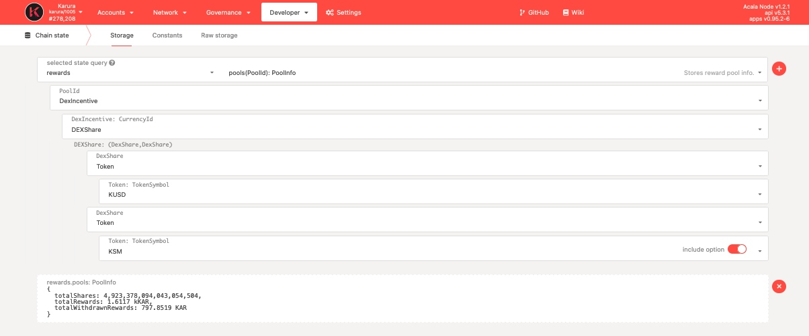
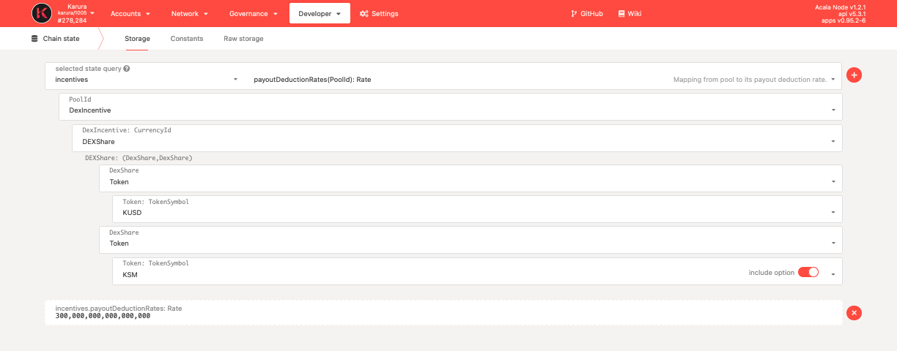
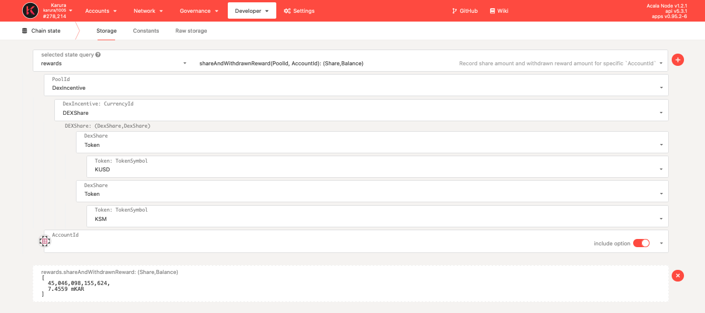

# Check Rewards

## LP Mining Reward

Rewards are calculated and accumulated every period \(every 5 blocks\). You can check rewards for a particular pool via `Chain state` &gt;&gt; `rewards.pools` 

* totalShares: total LP tokens
* totalRewards: total rewards calculated and accumulated till this moment
* totalWithdrawnRewards: rewards been claimed aka withdrawn

## Loyalty Bonus

You can check Loyalty Bonus rate for a particular pool via `Chain state` &gt;&gt; `incentives.payoutDeductionRates` 

note: it's in 18 decimal

## Individual Mining Rewards

You can check individual rewards for a particular pool via `Chain state` &gt;&gt; `shareAndWithdrawnReward(PoolId, AccountId)` 

$$
Individual~LP~Share = Share / totalShares
$$

$$
Individual~Reward~with~Bonus = Individual~LP~Share * totalReward
$$

$$
Withdraw~Now~Reward = Individual~Reward~with~Bonus * (1 - Loyalty~ Bonus)
$$

