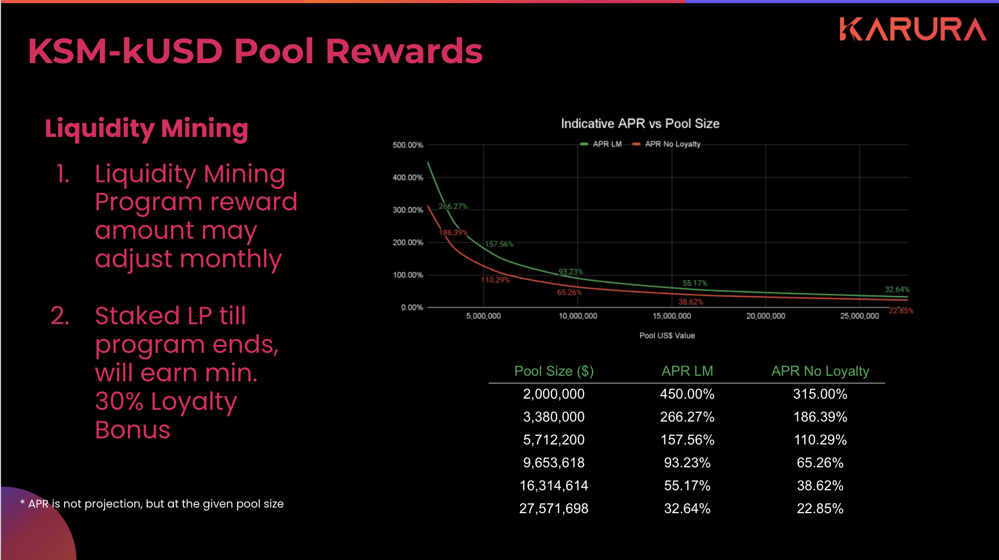
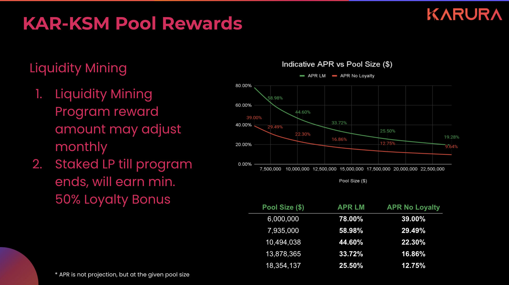

# KSM-kUSD & KAR-KSM Pool Rewards

## KSM-kUSD Pool Rewards

2021-08-05

* Total ~125,000 KAR rewards per month \(inclusive of Loyalty Bonus provision\)
* 87,500 KAR \(70%\) is the base reward pool, and 37,500 \(30%\) is Loyalty Bonus provision
* Base reward is calculated and earned per period \(every 5 blocks\)
* Staked LP tokens at any time during the program, and start earning incentive rewards

### Loyalty Bonus

* If some LPs claim rewards earlier than the mining program ends, then their Loyalty Bonus will be added back to the reward pool and shared amongst all other LPs
* Overtime, longer-term LPs may enjoy higher rewards than their standard rewards
* [Here's a detailed simulation ](https://wiki.acala.network/karura/defi-hub/swap/lp-returns-and-risks#reward-simulation)of how this may turn out.

### LP Triple Dip

A kUSD pool LP would enjoy rewards from three different sources:

1. reward \(in KAR\) from liquidity incentive program as outlined above \(limited time only\)
2. earn on-going trading fees \(in respective pairs\) \(long term sustainable\)
3. earn kUSD surplus share \(in kUSD\) as it supports stability of kUSD \(long term variable\)

### KSM

Learn how to cross KSM from Kusama to Karura [here](../inter-kusama-transfer.md).

### kUSD

* Why mint kUSD, read more [here](https://wiki.acala.network/karura/defi-hub/kusd-stablecoin/protocol-overview)
* How to mint kUSD [here](https://wiki.acala.network/karura/defi-hub/kusd-stablecoin/mint-kusd)
* Understand risks and stability mechanisms [here ](https://wiki.acala.network/karura/defi-hub/kusd-stablecoin/stability-and-liquidation)


Please be fully aware of [the risks of becoming a liquidity](../swap/lp-returns-and-risks.md#impermanent-loss) provider before participating.

The APR's are entirely indicative, based upon assumptions of the exchange rate at the time. Depends on the pool size when you staked LP tokens, the APR would also change accordingly.


## KSM-KAR Pool Rewards

2021-08-05

* Total ~65,000 KAR rewards per month \(inclusive of Loyalty Bonus provision\)
* 32,500 KAR \(50%\) is the base reward pool, and 32,500 KAR \(50%\) is Loyalty Bonus provision
* Base reward is calculated and earned per period \(every 5 blocks\)
* Staked LP tokens at any time during the program, and start earning incentive rewards


Please be fully aware of [the risks of becoming a liquidity](../swap/lp-returns-and-risks.md#impermanent-loss) provider before participating.

The APR's are entirely indicative, based upon assumptions of the exchange rate at the time. Depends on the pool size when you staked LP tokens, the APR would also change accordingly.


### Retro Airdrop

While this was not mandated on-chain, but for completeness of the incentive program, there was also a provision to retrospectively airdrop KAR rewards for those who have provided liquidity prior to a certain block number.

* Eligible users **were retro airdropped a one-time reward \(the airdrop is not ongoing or monthly\).** The total reward amount for all users was equivalent to a prorated portion of one month's 65,000 KAR rewards. Eligible LPs were rewarded pro-rata for their contribution amount and period.

The KAR/KSM pool was opened without additional incentive on purpose, that was to verify the protocol’s built-in ongoing incentive scheme - relying on trading volume and trading fees. The result was promising:

* 7d Trading Volume: $11.28 M
* 7d fee earned: $33,840
* TVL: $6 M
* Extrapolated APR: 29%

This retro airdrop was a way to say thank you to the early adopters and chaos embraces. More details will be disclosed.

