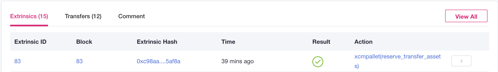

# Inter Kusama Transfer

🚨Karura is a "canary network" for Acala, an early unaudited release of the code that is available first and holds real economic value. It is highly experimental.

## Why Transfer KSM to Karura

KSM is the native token of Kusama. It is used as the fee token, staking token to provide network security and governance token on the Kusama Relay chain. The launch of Karura's parachain unlocks new use cases for KSM:

* Participate in trustless trading with other tokens via [Karura Swap](swap/)
* Use as liquidity for KSM-based trading pairs in Karura Swap, use KSM to power the KAR/KSM pair \(learn about becoming a liquidity provider & risks involved [here](swap/)\). This will also enable KSM as transaction fees on Karura. Read more [here](https://wiki.acala.network/karura/get-started/transaction-fees).
* Use as a collateral asset to mint the kUSD stablecoin, which can then be used for leveraged trades and other use cases.
* Stake in Karura's Liquid KSM staking pool to mint LKSM, which can then be used as collaterals, transferred, or traded.
  * LKSM is a programmable staking asset as the building block for many other protocols and applications
* Liquidity mining program coming soon.

## Cross-chain Fungible Token Transfer 

Cross-chain transfer uses the Polkadot’s [Cross-chain Message Passing \(XCMP\)](https://wiki.polkadot.network/docs/learn-crosschain) technology, specifically the [Horizontal Relay-routed Message Passing \(HRMP\)](https://wiki.polkadot.network/docs/learn-crosschain#horizontal-relay-routed-message-passing-hrmp) as the basis for sending and receiving generic cross-chain messages. For sending and receiving fungible tokens, Karura has used the xtokens fungible token transfer implementation developed by Acala. 

You can find the source code: [xtokens](https://github.com/open-web3-stack/open-runtime-module-library/tree/3bf16d6efc8c35039a062748ff20fa6db6e8faa0/xtokens) and [xcm-support](https://github.com/open-web3-stack/open-runtime-module-library/tree/3bf16d6efc8c35039a062748ff20fa6db6e8faa0/xcm-support). 

You can also find the Cross-chain Message \(XCM\) Format developed by Parity [here](https://github.com/paritytech/xcm-format).

## Transfer KSM from Kusama to Karura

Use the [Karura App](https://apps.karura.network/portfolio), go to `Cross Chain` tab then select `Inter Kusama Transfer`. 

**Note:** The account you logged into the Karura App must have some KSM \(also be mindful of Existential Deposits\).

Select `Kusama` as the `From Chain`, and `Karura` as the `To Chain`. Your KSM balance \(on Kusama\) shall be displayed then. Then select the `To Account`, which can be the current account that you logged in to the Karura App. 

There are two parts to the transaction fees \(read more on fees [here](../get-started/transaction-fees.md)\)

* The `Origin Chain Transfer Fee` is charged by Kusama
* The `Destination Chain Transfer Fee` is charged by Karura, modeled closely with the Statemine chain

Then click \`Transfer\`, please be patient and it might take a few moments for the Kusama Relay chain to send and confirm your KSM to Karura 🚀

### Check Transactions

There are two transactions involved, one was on Kusama sending the KSM to parachain, the second is on Karura sending the KSM to the designated account.

**On Kusama Side**

Go to the [Kusama Subscan Explorer](https://kusama.subscan.io/), search with your Kusama account, and you shall see the relevant `xcmpallet` transaction in the Extrinsics table.

**On Karura Side**

A Subquery will be implemented to make it easier to search and find your cross-chain transactions. Right now you can go to Karura Subscan to search Events where `module = parachainsystem` and `event = downwardmessagesprocessed`. OR [use this link](https://karura.subscan.io/event?address=&module=parachainsystem&event=downwardmessagesprocessed&startDate=&endDate=) to navigate there.

[Example Transaction on Subscan](https://karura.subscan.io/extrinsic/135672-1?event=135672-1)

## Transfer KSM from Karura to Kusama

Use the [Karura App](https://apps.karura.network/portfolio), goto `Cross Chain` tab then select `Inter Kusama Transfer`. 

Select `Karura` as the `From Chain`, and `Kusama` as the `To Chain`. Your KSM balance \(on Karura\) shall be displayed then. Then select the `To Account`, which can be the current account that you logged in to the Karura App. Make sure your account is set as `Allow use on any chain` on the Polkadot{js} extension.

There are two parts to the transaction fee \(read more on fees [here](../get-started/transaction-fees.md)\)

* The ‘Origin Chain Transfer Fee\` is charged by Karura
* The \`Destination Chain Transfer Fee\` is charged by Kusama

Then click \`Transfer\`, please be patient and it might take a few moments for your KSM arrive back to Kusama 🚀

### Check Transactions

There are two transactions involved, one was on Karura sending the KSM to Kusama Relay chain, the second is on Kusama sending the KSM to the designated account.

**On Karura Side**

A Subquery will be implemented to make it easier to search and find your cross-chain transactions. Right now you can go to [Karura Subscan Explorer](https://karura.subscan.io) to search Events where `module = xtoken` and `account = sender account`. OR [use this link](https://karura.subscan.io/event?address=&module=xtokens&event=all) to navigate there.

[Example Transaction on Subscan](https://karura.subscan.io/extrinsic/0x259558bf1a18f19c88915324d69fb5b7d7399ca4d382d651979d18d8cd0e5334?event=135681-3)

**On Kusama Side**

Go to the [Kusama Subscan Explorer](https://kusama.subscan.io/), search with your Kusama account, and you shall see the relevant `xcmpallet` transaction in the Extrinsics table.

[Example Transaction on Subscan](https://kusama.subscan.io/extrinsic/8338413-2)

\*\*\*\*

