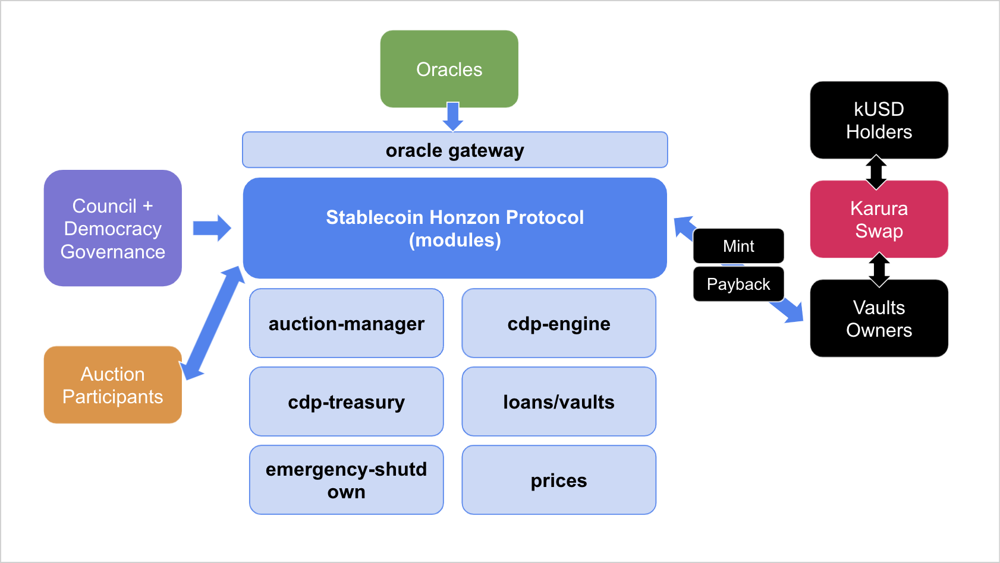

# Key Actors

## Vault Holders

Vault Holders deposit collaterals to mint kUSD. They are responsible to keep the vault at a safe level i.e. keep collateral ratio above the liquidation ratio. They pay a stability fee for the kUSD minted until they repay all outstanding kUSD. They will be charged a liquidation fee if their vault ever gets liquidated. Read why some’d want to mint kUSD [here](protocol-overview.md).

## kUSD Holders

Users can hold kUSD without minting them directly, but get them from exchanges like Karura Swap. Read why some’d want to hold kUSD [here](protocol-overview.md).

## Auction Participants

If a vault is unsafe, that is its current collateral ratio (minted kUSD / dollar value of collateral deposited) is below the liquidation ratio, then the system will automatically liquidate this vault. The system will sell the collaterals on the Karura Swap first with accepted slippage, otherwise it will start an auction to auction off the collaterals for kUSD to pay back the vault.

Collateral auctions are usually great opportunities to get the collateral assets at discounted prices. You can monitor auction events and bid in the auctions to take the price advantages. In return, the system can repay its debt efficiently. Read more on auctions [here](stability-and-liquidation/participate-in-collateral-auctions.md).

Collateral auctions are usually great opportunities to get the collateral assets at discounted prices. You can monitor auction events and bid in the auctions to take the price advantages. In return, the system can repay its debt efficiently. Read more on auctions here.

## Oracle Operators

The stablecoin protocol currently uses the Acala Oracle for real-time price feed. Oracle operators are whitelisted and managed via governance. All valid feeds will be refunded with the transaction fees incurred, essentially making oracle feeds FREE for providers while preventing spam and ensuring integrity. Read more on oracles [here](stability-and-liquidation/oracles.md).

The stablecoin protocol currently uses the Acala Oracle for real-time price feed. Oracle operators are whitelisted and managed via governance. All valid feeds will be refunded with the transaction fees incurred, essentially making oracle feeds FREE for providers while preventing spam and ensuring integrity. Read more on oracles here.

## No Liquidators/Keepers

There is no external party for triggering liquidation on-chain like Keepers. Liquidations are managed by scheduler, which makes the process more secured.
