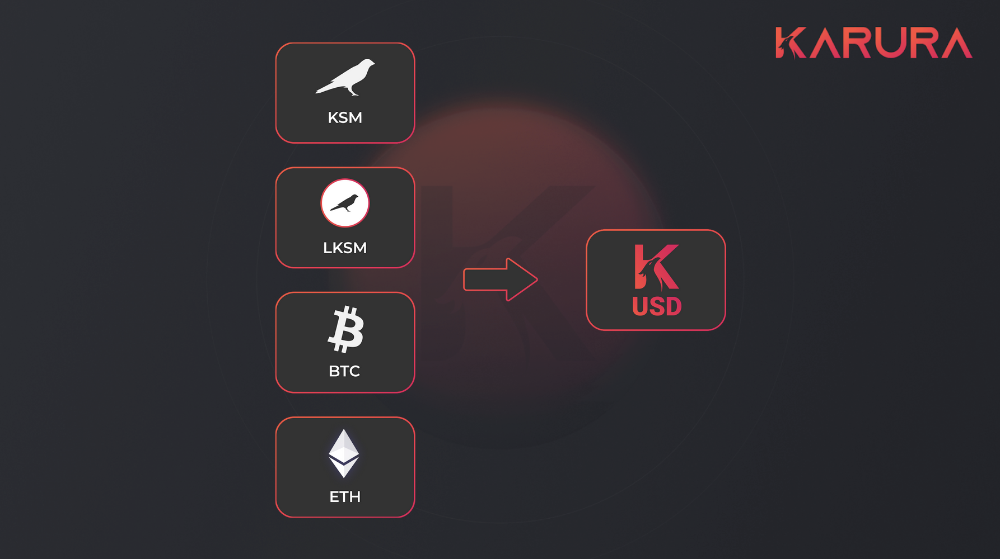

# Protocol Overview

Karura Dollar (kUSD) stablecoin protocol is a dynamic decentralized system that allows users to autonomously generate kUSD stablecoin (stabilized against the US Dollar) using crypto assets in excess of value as collateral. Karura Dollar (kUSD) will be available as an ERC20 token, and the stablecoin protocol will be available as pre-compiled contracts on Acala EVM once enabled on the Karura Network.&#x20;

The stablecoin protocol supports (technically) native Substrate tokens such as KSM and LKSM, and cross-chain tokens such as BTC as collateral. The decisions of adding new collateral assets and updating relevant risk parameters are in the realm of Karura Governance.&#x20;

## **Why kUSD?**

Stablecoin since its inception to widespread popularity has proven its utility beyond speculation: they have been used in alleviating economic and political hardship, as a hedging mechanism for traders, and to release liquidity of underlying crypto assets without foregoing ownership of those assets.

Users can get kUSD via [Karura Swap](../swap/) or generate kUSD by depositing collaterals to a kUSD vault. kUSD supports multiple cross-chain assets as collaterals.

These are some of the use cases for kUSD:

* Minting kUSD is **trustless, sovereign and liberating** act of the minter
* Without foregoing ownership of the underlying asset, business operators may collateralize them to mint kUSD to **hedge volatility, pay for goods and services**
* Traders may **leveraged long the underlying asset** by depositing the underlying asset to kUSD vault, minting kUSD, and swap more underlying assets
* Liquidity Providers to kUSD-paired pools in Karura Swap will **earn a portion of the stablecoin surplus** (from stability fees and liquidation fees) in addition to trading fees and liquidity mining programs
* kUSD is designed to be stable, and an **ideal choice for medium of exchange**. Fees on Karura can be paid in kUSD. It can also be used for remittance, on-and-off ramps as it integrates with more partners.&#x20;
* kUSD **as a DeFi primitive**, together with the yield-bearing LKSM as collateral, they will empower more ecosystem growth and new product innovations
