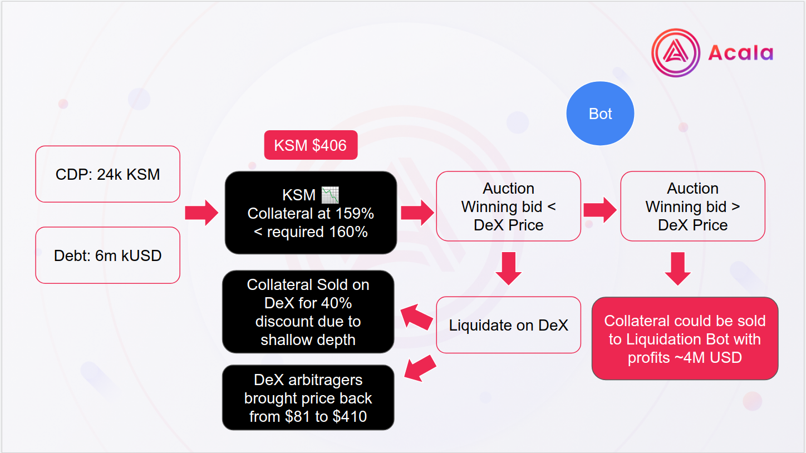

# Liquidation Bot

### Read up on Liquidations&#x20;


[liquidation.md](liquidation.md)


### Goals & Roles

The goal of a liquidation is to sell off collateral to pay back outstanding kUSD/aUSD debt.\
\
The protocol has an automatic strategy to liquidate on DeX & a collateral auction process.

The liquidator bids in the auction to get collateral at a discount and help keep the protocol safe.

### Recent Event

In recent events, a collateralized debt position (CDP) of 24 thousand KSM for a debt of 6 million kUSD was liquidated. The collateral ratio fell below the required percentage and a liquidation was triggered.  The collateral was sold on the DeX for a 40 percent discount due to the shallow depth of the liquidity pool.  A liquidator Bot could have picked up this opportunity at a better rate for the vault holders before the DeX liquidation occured and capture the discounted price gains.

* [Chain Explorer Details of the Event](https://karura.subscan.io/extrinsic/915526-0?event=915526-18)

### Liquidation Bot Framework

We provide a collateral auction bot example and a monitoring framework as a starting point for you to develop with and enhance.&#x20;

### Strategy

Here is an example of a conservative strategy: KSM > LKSM (HODL) > kUSD (mint on the fly) > bid\
You can also make your own strategy.

### Reference Code

* [Collateral Auction Bot example](https://github.com/AcalaNetwork/collateral-auction-bot-example)&#x20;
* [Guardian (monitoring/alert framework tool)](https://github.com/AcalaNetwork/collateral-auction-bot-example)
