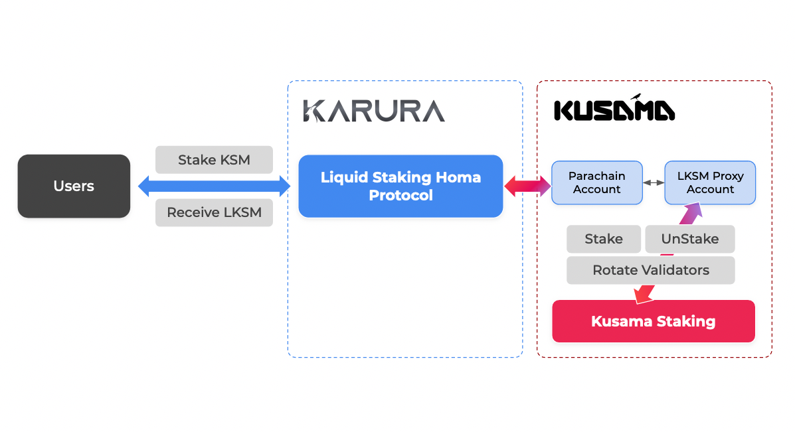

# LKSM

## Staking

When you stake your KSM through Karura Liquid Staking, you will receive a share representation in LKSM account balance, which entitles the owner to a likely increasing quantity of underlying assets. These staked KSMs are used to stake would earn Kusama nominator rewards, and incur punishment (e.g. KSM being slashed) in case of validator found to be misbehaving (e.g. not maintaining required uptime).

The balance of the two would increase or decrease the amount of the underlying asset of LKSM. This means **earning staking reward is as simple as holding an LKSM token**, while LKSM is cross-chain capable and can be used to participate in other network activities such as lending or as collaterals to mint kUSD.

### Proxy Account

Proxy staking is used before XCM-enabled fully autonomous staking is ready. LKSM Proxy account operated by the Karura Council can perform a limited number of actions: stake, unstake and rotate validators on behalf of the trustless Parachain Reserve account (and subaccounts). However it cannot perform transfer or other operations which help safeguard the LKSM protocol. Read more on Proxy Accounts [here](https://wiki.polkadot.network/docs/learn-proxies).

Currently reward and exchange rate update is once a day.

## Redeeming

Due to limitation of XCM implementation, currently redemption request is queued, matched with minting request and then batched sent across to Kusama for unbounding. This may result in varied unbounding period. LKSM v2 that is currently under development, will streamline the XCM cross-chain operation, result in more efficient unbounding.

## Tokenized Staked KSM: LKSM

LKSM is essentially tokenized staked KSM that is fungible and liquid. LKSM exploits the derivative value of the KSMs fueling and powering more applications without sacrificing the security of the whole network.

The exchange rate between LKSM and the underlying KSM are likely to increase over time, as staking rewards are accrued by validating and nominating, and is equal to

Note: users do need to pay for the cross-chain transaction fees incurred. When a user mints LKSM, Kusama staking rewards from the last era are deducted as the user starts to earn rewards from the next era after they stake.

## APR

Currently the Annual Percentage Rate is an indicative rate based on the [average return](https://polkadot.js.org/apps/?rpc=wss%3A%2F%2Fkusama-rpc.polkadot.io#/staking/targets) for Kusama validators that meet our staking strategy. Generally the Liquid Staking pool aims to balance (slashing risks) and staking reward, while able to provide early withdraw liquidity.

## Staking Nomination Strategy

The initial nomination strategies are as follows:

* With an on-chain identity&#x20;
* No slash history
* Validator history on Kusama / Polkadot
* Commission Rate
* Slash Cover (off-chain)
* Prefer dedicated validators for LKSM/LDOT

You can read more on considerations when nominating [here](https://wiki.polkadot.network/docs/learn-nominator#what-to-take-into-consideration-when-nominating). At this stage, the strategy is executed by Karura Council via the LKSM Proxy account on Kusama.

[Here's a list](https://kusama.subscan.io/account/HTAeD1dokCVs9MwnC1q9s2a7d2kQ52TAjrxE1y5mj5MFLLA?tab=vote) of validators to which the liquid staking protocol nominates.

## Slashing Risks

The Liquid Staking protocol essentially runs a pool of KSM and nominates them to validators on behalf of LKSM holders. LKSM holders are exposed to the same level of risks as being a nominator, and if the validators do not behave properly, they will get slashed and KSMs will be lost.

Read more on Slashing [here](https://wiki.polkadot.network/docs/learn-staking#slashing).
