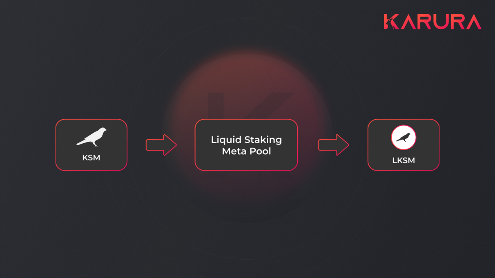

# Protocol Overview

Unlike Bitcoin-like Proof-of-Work (PoW) chains, which uses computing power to secure the network while consuming large amounts of energy, Proof-of-Stake networks uses stake aka its network token and variations of the Byzantine Fault Tolerant (BFT) algorithm to secure the network. Polkadot uses NPoS (Nominated Proof-of-Stake) as its mechanism for selecting the validator set. It is designed with the roles of validators and nominators, to maximize chain security.

Polkadot network targets 50% active DOT staking with annual nominal return from taking reward. Effectively this creates an **opportunity cost for using DOT** in other applications versus staking. If DeFi applications provide a better yield than staking, it could motivate the collective movement of funds from staking to lending, **causing a 'bank run' and risking the security of the entire network**.

Karura’s Liquid Staking protocol is to solve the **illiquidity challenge of staked assets**. The protocol establishes a staking pool, where users can stake KSM and mint LKSM, which is Kusama staking yield-bearing, while fungible, tradable and usable in other protocols and parachains.

## Rollout roadmap

### Phase #1 (We are here)

* (✅) Minting LKSM
* (✅) Proxy staking is used before XCM-enabled fully autonomous staking is ready
* (✅) Low Staking Cap: 3000 KSM and increase gradually daily, staking reward accrued, public access. Access app [here](https://apps.karura.network/homa).
* (✅) LKSM as collateral for kUSD
* (✅) LKSM pools

### Phase #2

* (✅)Redemption is available
* LKSM v2 is under development - XCM-enabled autonomous staking/unstaking
* Indicative voting on Validator selection

### Phase #3

* Enable XCM-powered autonomous cross-chain staking
* On-chain voting on Validator selection
* Validator slash insurance
