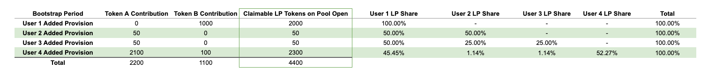
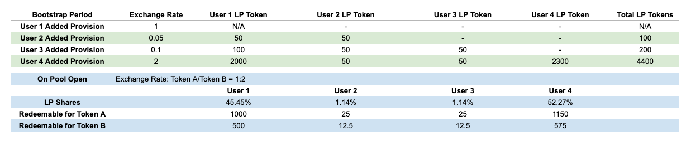
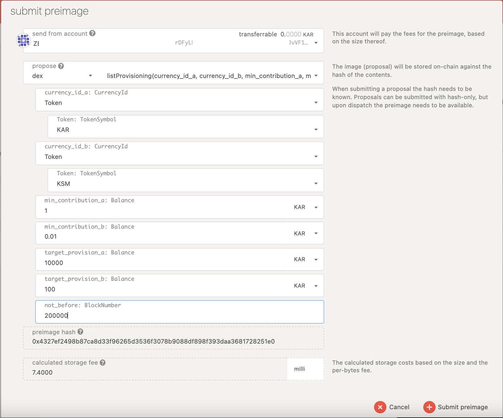

# Bootstrap a Pool

**\(**[**Source**](https://github.com/AcalaNetwork/Acala/blob/master/modules/dex/src/lib.rs#L462)**\)**

## **Bootstrap Parameters & Process**

One can bootstrap a liquidity pool with the following parameters

* **Not Before**: pool cannot be started before a particular block number
* **Target Provision for Token A**: minimum requirement of liquidity for Token A 
* **Target Provision for Token B**: minimum requirement of liquidity for Token B
* **Minimum contribution for Token A**: each contribution requires a minimum amount of Token A 
* **Minimum contribution for Token B**: each contribution requires a minimum amount of Token B

A liquidity pool can only be started once the following criteria are met:

* The **`Not Before`** block has passed AND
* Either **`Target Provision for Token A`** OR **`Target Provision for Token B`** has been met AND
* Both Token A and Token has &gt;0 liquidity

## **During Bootstrap**

During the Bootstrap period:

* **NO trading is allowed**, therefore the exchange rate can be consolidated
* You can contribute liquidity for Token A, or Token B, or Token A and B at the same time. The actual exchange rate of Token A and B can only be known once the Bootstrap is completed.
* At the time of your contribution, you are allocated a number of LP tokens, and indicative LP shares of the pool, which are subject to change as more liquidity is added.
* **You should only participate if you want to become a liquidity provider for the pool. Please be aware of** [**various risks**](lp-returns-and-risks.md) **associated with being a liquidity provider**.

### LP Token & LP Shares

LP tokens are receipts of liquidity contributed to a pool. LP Shares \(= LP Tokens / Total LP Tokens\) are pro-rata representations of the liquidity contribution of a particular pool e.g. Token A-Token B pool. 

The following formula is used to calculate LP Tokens after a contribution for Token A-Token B pool:

$$
LP Tokens = Token A Contribution * 1 + Token B Contribution * Exchange Rate
$$

Below is a simulation of how a user’s LP Shares of the pool might change as more liquidity is added to the pool during the Bootstrap period:

* User 1 only contributes 1000 Token B. LP Tokens can only be calculated once both sides of the pool have some liquidity. 
* After User 2 added his/her liquidity \(User 2 only contributes 50 Token A\), 
  * The exchange rate of Token A-Token B is 0.05 \(=50/1000 based on [constant product](https://wiki.acala.network/karura/defi-hub/swap/protocol-overview#trading-and-lps)\)
  * User 2's LP Token is 50 \(=50\*1 + 0 \* 0.05\)
  * User 1's LP Token is also 50 \(=1\*0 + 1000 \* 0.05\)
  * User 2 LP Share is 50% \(=50/\(50+50\)\)
  * User 1's LP Shares is also 50%
* After User 4 added his/her liquidity \(User 4 contributes both Token A & B\)
  * The exchange rate of Token A-Token B is 2 \(=2200/1100\)
  * User 4's LP Share is 52.27%
  * User 2's LP Shares drop to 1.14%.
  * User 1's LP Shares drop to 45.45%.
* If Bootstrap completes at this point
  * User 1 can redeem 1000 Token A \(= 2200\*45.45%\) and 500 Token B \(= 1100\*45.45%\).
  * User 2 can redeem 25 Token A and 12.5 Token B
  * User 4 can redeem 1,150 Token A and 575 Token B
  * LPs may or may not redeem right after Bootstrap, as most returns come from trading fees. Read more [here](lp-returns-and-risks.md).

**So if you are contributing only one side of the pool \(say Token A\), you are effectively converting 50% Token A into Token B based on the exchange rate when Bootstrap ends \(and the pool opens for trading\).**

## **After Bootstrap**

Let's assume the pool Bootstrap completes after the 4th user's contribution \(as illustrated above\), then the LP tokens are allocated to each liquidity provider. LP Shares \(= LP Tokens / Total LP Tokens\) is a pro-rata representation of LP's contribution to the overall liquidity of a given pool. LP Tokens can then be redeemed for underlying assets \(Token A and B\) at any time. As an example, User 1 can redeem  45.45% of Token A \(1000 Token A = 2200\*45.45%\) and 45.45% of Token B \(500 Token B = 1100\*45.45%\).

* You need to claim your LP tokens after Bootstrap completes
* The Token A-Token B pool will be enabled for trading

Here is an example to illustrate this:

### Claim LP Tokens

LP tokens are allocated once Bootstrap ends, and are claimable via 

* the [Karura App here](https://apps.karura.network/swap/bootstrap) OR
* `dex.claimDexShare` directly on Polkadot Web App - Karura parachain 

## **Submit a Proposal to Bootstrap a Pool**

This is the preimage of proposing to bootstrap a pool. Read more on how to submit a proposal [here](../../get-started/governance/participate-in-democracy.md).

