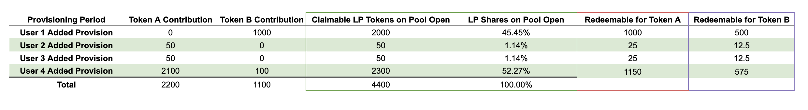

# Bootstrap a Pool

**\(**[**Source**](https://github.com/AcalaNetwork/Acala/blob/master/modules/dex/src/lib.rs#L462)**\)**

## **Bootstrap Parameters & Process**

One can bootstrap a liquidity pool with the following parameters

* **Not Before**: pool cannot be started before a particular block number
* **Target Provision for Token A**: minimum requirement of liquidity for Token A 
* **Target Provision for Token B**: minimum requirement of liquidity for Token B
* **Minimum contribution for Token A**: each contribution requires a minimum amount of Token A 
* **Minimum contribution for Token B**: each contribution requires a minimum amount of Token B

A liquidity pool can only be started once the following criteria are met:

* The **`Not Before`** block has passed AND
* Either **`Target Provision for Token A`** OR **`Target Provision for Token B`** has been met

## **During Bootstrap**

During the Bootstrap period:

* **NO trading is allowed**, therefore the exchange rate can be consolidated
* You can contribute liquidity for Token A, or Token B, or Token A and B at the same time. The actual exchange rate of Token A and B can only be known once the Bootstrap is completed.
* At the time of your contribution, you are provided an indicative LP share, which are subject to change as more liquidity are added.
* **You should only participate if you want to become a liquidity provider for the pool. Please be aware of** [**various risks**](lp-returns-and-risks.md) **associated with being a liquidity provider**.

Below is a simulation of how a user’s LP share might change as more liquidity is added to the pool during the Bootstrap period:

* When User 1 is the only liquidity provider, it has 100% of the LP shares
* After User 2 added his/her liquidity, User 1's LP shares drops to 50%, while User 1 still holds the same amount of LP tokens.
* After User 4 added his/her liquidity, User 1's LP shares drops to 45.45%.
* If Bootstrap completes at this point, User 1 can redeem  45.45% of Token A \(1000 Token A = 2200\*45.45%\) and 45.45% of Token B \(500 Token B = 1100\*45.45%\).

## **After Bootstrap**

Let's assume the pool Bootstrap completes after the 4th user's contribution \(as illustrated above\), then the LP shares allocated to each liquidity provider is finalized. LP Shares is a pro-rata representation of LP's contribution to the overall liquidity of a given pool. LP shares can then be redeemed for underlying assets \(Token A and B\) at any time.

* You need to claim your LP tokens after Bootstrap completes
* The Token A-Token B pool will be enabled for trading

Here is an example to illustrate this:

## **Submit a Proposal to Bootstrap a Pool**

**TBD**  

