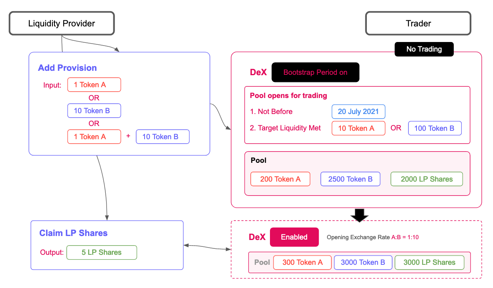
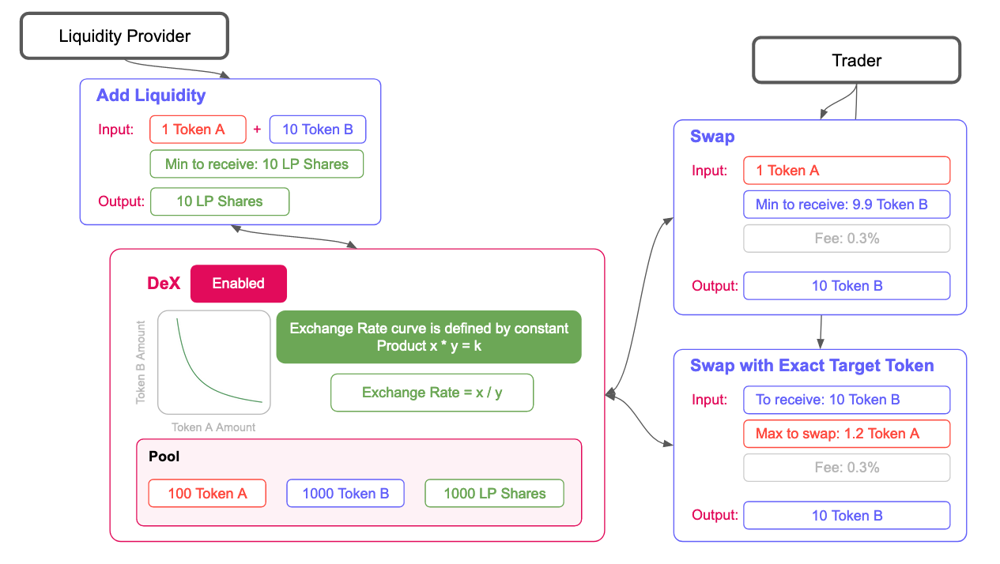

# Protocol Overview

🚨Karura is a "canary network" for Acala an early unaudited release of the code that is available first and holds real economic value. It is highly experimental and unstable.

No promise, and expect chaos. 

## Protocol Overview 

Karura Swap is an automated market maker \(AMM\) styled decentralized exchange protocol implemented and deployed as upgradable runtime modules on the Karura network. Karura Swap will be available as pre-compiled Smart Contracts on Acala EVM once enabled on the Karura network. The Swap supports both native Substrate tokens and ERC-20 tokens.

The Swap contains multiple liquidity pools each of which is made up of two different tokens e.g. Token A-Token B pool and Token B-Token C pool. Users can swap any token to any other token in a single transaction provided there is a path between them e.g. even if there's no Token A-Token C pool, users can still swap Token A for Token C, given they have a common path via Token B. 

## Bootstrap a Pool

Anyone can submit an on-chain proposal to list a new token pair \(aka start a new pool\). The **“Something at Stake” approach** of listing retains the ethos of decentralization, while to a large extent minimizing scam listings.  

A listing can be started with or without a Bootstrap period. In most cases, the Bootstrap period would be beneficial, as trading is frozen for a period of time and until certain liquidity requirements are met to have reasonable slippage, to allow a reasonable exchange ratio to be consolidated and avoid adversarial operations such as front-running.

During the Bootstrap period, anyone who wants to become a liquidity provider \(LP\) can provide liquidity for one side e.g. Token A or both sides \(Token A and B\) of the trading pair. The Bootstrap period ends once the time and liquidity requirements are met, and an opening exchange ratio will then be settled. 

Then the LP tokens are allocated to each liquidity provider. LP Shares \(= LP Tokens / Total LP Tokens\) is a pro-rata representation of LP's contribution to the overall liquidity of a given pool. LP shares can then be redeemed for underlying assets \(Token A and B\) at any time.

Here is an example to illustrate this:

[Read more on Bootstrap a Pool.](bootstrap-a-pool.md)

## Trading & LPs

The Swap design was inspired by the “constant product formula” first introduced by Uniswap. The exchange rate curve is defined by x \* y = k. At any given time, the exchange rate would be x/y. There is a 0.3% fee applicable to every trade, which does increase the constant k, and is shared amongst all LPs based on their shares of the pool. LPs can realize the gain when redeeming the underlying tokens \(and essentially burning their LP shares\).

When a trader wants to swap Token A for Token B, he/she can either aim to swap all X numbers of Token A for a minimum of Y number of Token B, or aim to get Y number of Token B with maximum X number Token A available. This to some degree provides a protective ceiling for potential exploits e.g. from front-running. 

When LPs add liquidity, they can aim to get a minimum of LP shares; when LPs withdraw liquidity, they can aim to redeem a certain minimum number of token A and Token B. This again to some degree provides a protective ceiling for potential exploits e.g. from

Read more on Trading & LPs [here](trading-and-lps.md).

Please be aware of various risks of being a liquidity provider and trading with the Karura Swap, read more on [LP Risks here](lp-returns-and-risks.md) and [Price Risks here](price-risks.md).

