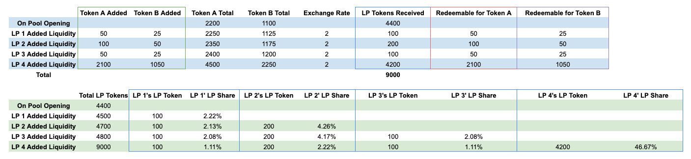
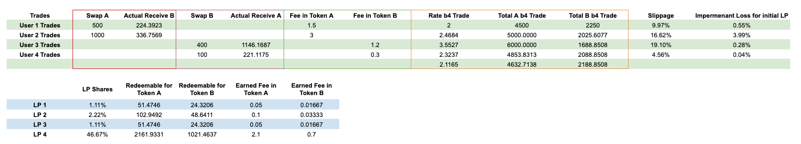

# Trading & LPs

The exchange rate curve is defined by  

$$
x*y = k
$$

At any given time, the exchange rate would be x/y. There is a trading fee applicable to every trade, which does increase the constant k, and is shared amongst all LPs based on their shares of the pool. 

## **LP Simulations**

When adding liquidity to the pool

* LPs are required to add both Token A and Token B in a ratio equal to the current rate, meaning adding liquidity would have no impact on the exchange rate. 
* LP tokens are minted to the Liquidity Provider’s balance after adding liquidity. LP shares, as the pro-rata contribution, may change as the total liquidity in the pool changes. 
* LPs can realize the gain/loss when redeeming the underlying tokens (and essentially burning their LP shares). 

$$
LP~Tokens = Token~A~Contribution + Token~B~Contribution * Exchange~Rate
$$

$$
LP~Shares = LP~Tokens / Total~LP~Tokens
$$

Below is a simulation of this:

Assume the pool opens with 2,200 Token A and 1,100 Token B, these LPs added liquidity, and for simplicity sake, there are no trades happening in between these liquidity addition transactions.

* LP 1 adds 50 Token A and 25 Token B, as the current exchange rate is 2
  * LP tokens = 50\*1 + 25 \*2 = 100
* LP Shares, as the pro-rata liquidity an LP contributed, keep changing as new liquidity is added. 
  * LP 1’s LP Shares = 100/4500 = 2.22%

### **Trading Simulation**

Trading fees are added to the liquidity pool and shared amongst all LPs. The trading fees do increase the constant product and affect the actual number of tokens received. For demonstration purposes, the four trades are relatively large trades that would impact exchange rate and trading fees in a visible way.

$$
Actual Token B Received = Total Token B - (Total Token B * Total Token A / (Total Token A + Token A Swapped - Fees in Token A))
$$

$$
Slippage = Actual Token B Received / Total Token B
$$

* User 1 swaps 500 token A using `swapWithExactSupply`
  * Trading fees are payable in the supply token (Token A): 500\*0.3% = 1.5
  * Actual Token B received, taking into account of changed constant product, given by the formula above = 2250-(4500\*2250/(4500+500-1.5)) = 224.39
  * Slippage = 9.97%
  * Exchange rate after the trade = 5000/2025.6077 = 2.4684
* User 2 swaps 1000 token A (=20% of Total Token A)
  * It has a significant impact on the exchange rate, resulting in a high slippage
  * The more liquidity (higher TVL) in the pool relative to the trade size, the lower the slippage
* After 4 trades
  * LP1 still has 100 LP Tokens, which amounts to 1.11% of LP shares
  * LP1 earned 0.05 Token A and 0.01667 Token B
  * Since the exchange rate has deviated from 2 to 2.1165, impermanent loss exists. 
  * However, the loss is only realized when the liquidity provider withdraws their liquidity. Read more here.

Generally speaking, the more liquidity in the pool (TVL), the less impact a particular trade has on the exchange rate (hence less slippage). Trading volume is a good indicator of fees earned.

Learn various sources of LP returns [here](https://wiki.acala.network/karura/defi-hub/swap/lp-returns-and-risks#returns) & impermanent loss [here](https://wiki.acala.network/karura/defi-hub/swap/lp-returns-and-risks#impermanent-loss).\
\
