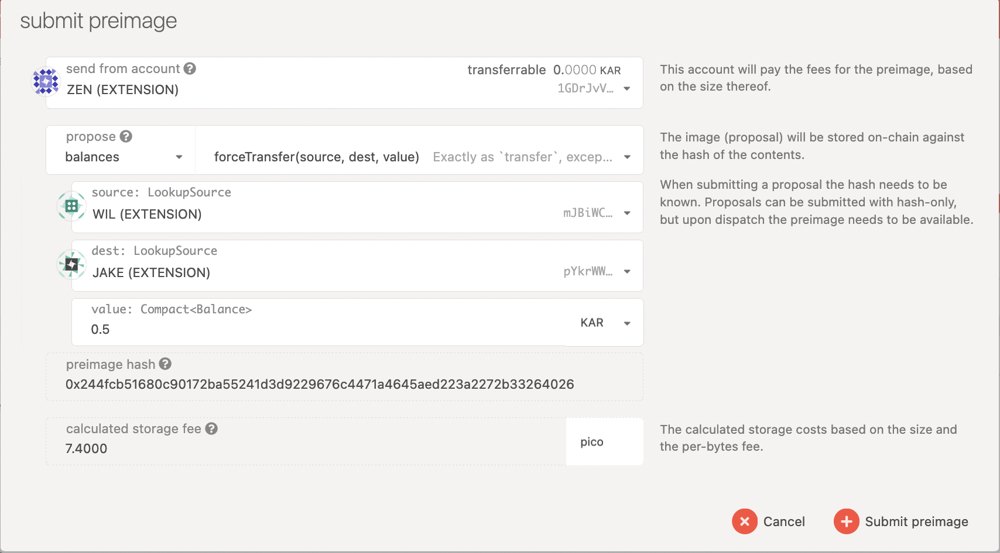
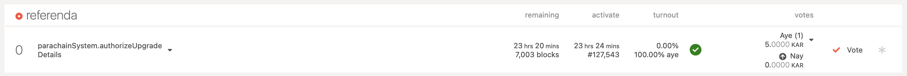

# Participate in Democracy

The public Referenda Chamber is one of the three bodies alongside the General Council \(and its sub-councils\) and the Technical Committee governing the Karura network. Public referenda can be proposed and voted by any token holder with a bond. Every voting period, one proposal with the most support \(via seconds\) will be moved to the referenda table for public voting. Voters who are willing to lock up tokens for a greater duration of time can have their votes amplified. This is largely modeled from the [Polkadot governance system](https://wiki.polkadot.network/docs/learn-governance) with Karura/Acala customization. 

## Governance Parameters

These are important governance parameters, which may change over time as we progress through the governance phases.

* Launch Period: Public referenda is every **2 days**
* Voting Period: Votes are tallied every **2 days**
* Emergency Voting Period: Voting period for fast-tracked emergency referendum is **3 Hours**
* Minimum Deposit: Propose a referendum requires a minimum deposit of **1000 KAR**
* Enactment Period: Minimum period for locking funds and the period between a proposal being approved and enacted is **1 day**
* Colloff Period: Vetoed proposal may not be re-submitted within **7 days**

## Propose a Referendum

A referendum consists of some action that you want to propose, if voted in by token holders then the action will be enacted on-chain automatically. You are required to bond some tokens to propose action. Once a proposal is submitted, it can not be canceled. 

On the [Polkadot Apps - Karura parachain](https://polkadot.js.org/apps/?rpc=wss%3A%2F%2Fkarura-rpc-1.aca-api.network#/democracy), you can use the “Democracy” tab to make a new proposal. The action e.g. force transfer balance from account A to account B, is encoded in a preimage, and the hash of the action is called preimage hash. 

Since the preimage can be quite large \(hence costly to submit\), you can submit a Proposal first which includes the preimage hash only, and submit the preimage \(or have someone else submit it for you\) later but before voting completes.

### Step 1 Submit a Proposal

#### Get the preimage hash 

by clicking on the `Submit preimage` button, then fill in the action you want to propose, copy and note down the preimage hash `0x244fcb51680c90172ba55241d3d9229676c4471a4645aed223a2272b33264026`. Once you noted down the hash, you can now cancel the prompt. 

#### Submit a proposal

By click on the `Submit a proposal` button, and paste in the preimage hash to submit it. Then the proposal shall appear in the proposal table. 

### Step 2 Submit a Preimage

Before voting of your proposal completes, you will need to submit the actual preimage otherwise it cannot be enacted on-chain. You can repeat the ‘Submit a preimage’ process as previously mentioned, and click the ‘Submit preimage’ button to send the transaction.

## Vote on a Referenda

Once a proposal is stabled in as a referendum, it will show up in the referenda table. You can navigate to the [Polkadot Apps - Karura Parachain Democracy](https://polkadot.js.org/apps/?rpc=wss%3A%2F%2Fkarura-rpc-1.aca-api.network#/democracy) to cast your vote.

You can click on the ‘Vote’ button to vote. Select "Vote Aye" to support the proposal, and select "Vote Nay" to disapprove the proposal. 

You can also increase your conviction with the same number of tokens by locking them. The longer you are willing to lock your tokens, the stronger your vote will be weighted. Read more on [voting](https://wiki.polkadot.network/docs/maintain-guides-democracy/#voting-on-a-proposal) and [tallying](https://wiki.polkadot.network/docs/learn-governance#tallying).

## Unlock locked tokens

You will need to explicitly unlock these tokens once the locking period ends. You can go to the `Accounts` page, click the menu button for the voted account, and select the menu item`Clear expired democracy locks` to claim it back. Read more [here](https://wiki.polkadot.network/docs/maintain-guides-democracy/#unlocking-locked-tokens). 

## Delegate Vote

You can delegate your vote to others to vote on your behalf. On [the Polkadot Apps - Karura parachain,](https://polkadot.js.org/apps/?rpc=wss%3A%2F%2Fkarura-rpc-1.aca-api.network#/extrinsics) go to the `Developer` tab -- `Extrinsics` , then select `democracy.delegate` .

