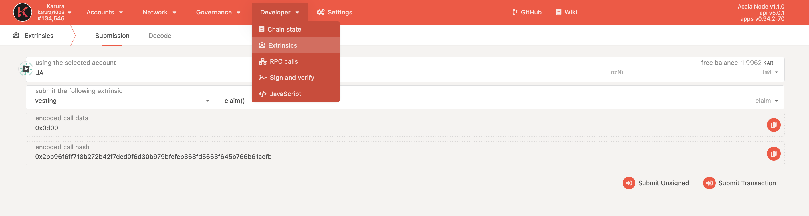
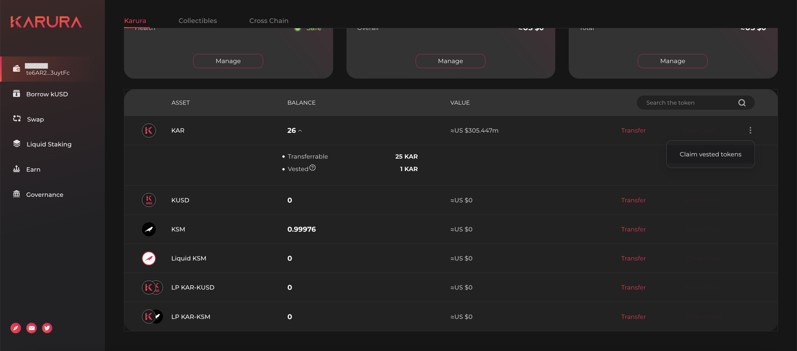

# Balance Type & Vesting

## Balance Types

On Karura there are the following steps balance types

* **Transferrable Balance**: as the name suggests, this balance can be used for transfers, paying fees and performing any actions on-chain.
* **Locked Balance:** this balance is frozen, depending on the scheme, it could be locked for a certain period of time before being transferrable, or it could be vested where a portion of the balance gradually becomes transferrable, or a combination of these. The tokens are released lazily, meaning you are required to perform a `claim` transaction to obtain it. The guide for claiming vested tokens is in the next section.
* **Total Balance:** is the sum of transferrable balance plus the locked balance. The entire balance can be used for governance operations such as voting. 

## Check & Claim Vested Tokens

### On Polkadot App

Go to the [Polkadot App - Karura Parachain - Accounts section](https://polkadot.js.org/apps/?rpc=wss%3A%2F%2Fkarura-rpc-1.aca-api.network#/accounts), expand the balance of your account, if there's a vested \(locked\) balance, it will be displayed.

Go to the `Developer - Extrinsics` section, use the account that you want to claim the vested balance. Select `vesting` then `claim()` in the `submit the following extrinsics` filed, then click the `Submit Transaction` button to complete the process.

### On Karura App

You can claim the released portion of vested KAR on the [Karura App](https://apps.karura.network/).

