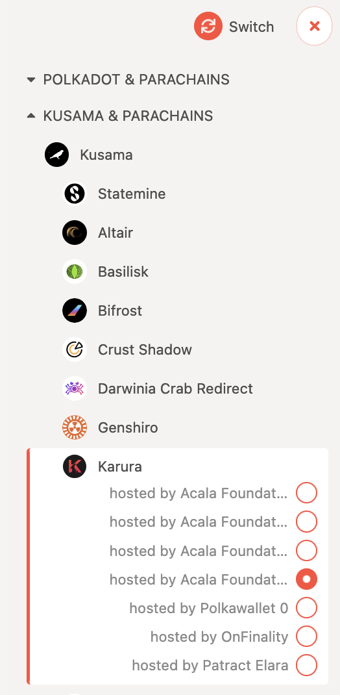
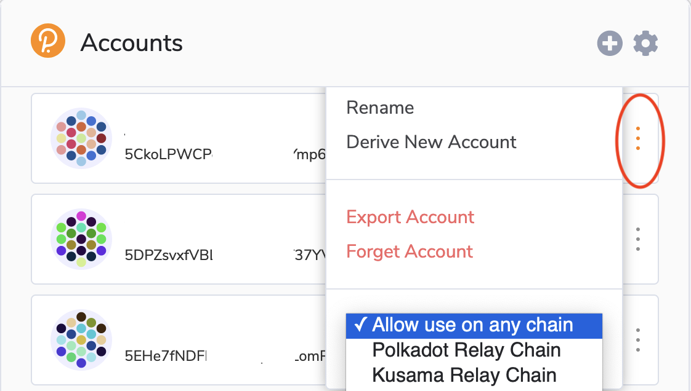
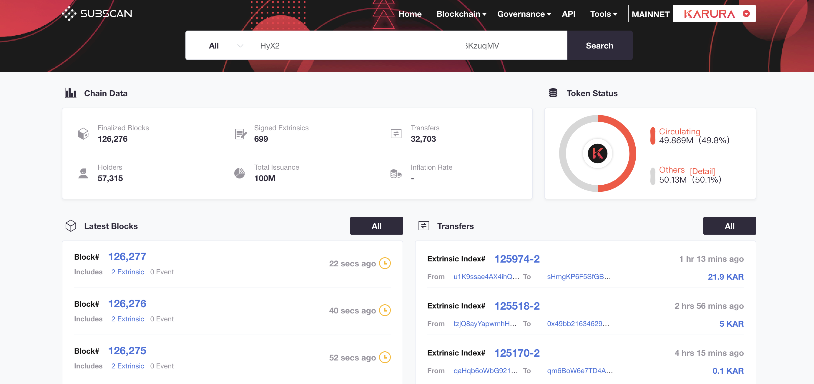

# Check Distribution

Rewards to be distributed are all recorded on the [`Distribution Website`](https://distribution.acala.network)

Most of the KAR rewards for Karura crowdloan event and Build Acala \#1  have been distributed \(except for the ones that need to be claimed\). You can check your balances in the following ways:

* on the [Polkadot Apps - Karura parachain - Accounts](https://polkadot.js.org/apps/#/accounts) \(you need to switch to the Karura parachain under Kusama\) OR
* on [Karura Subscan explorer](https://karura.subscan.io/)
* If you participated via exchanges, all participated exchange rewards have been distributed to them, so please contact them directly

If your rewards are marked as `To be Claimed`, please [follow the guide here](../../crowdloan/claim-kar.md) to claim.

## Check on Polkadot Apps

Go to [Polkadot Apps - Karura parachain - Accounts](https://polkadot.js.org/apps/#/accounts), you need to switch to the Karura parachain and go to the Accounts page.

Make sure your account in the Polkadot{js} extension is switched to **`Allow use on any chain`** 

## Check on Karura Subscan Explorer

Go to the [Karura Subscan Explorer](https://karura.subscan.io/), and search your address to see details of balances.

