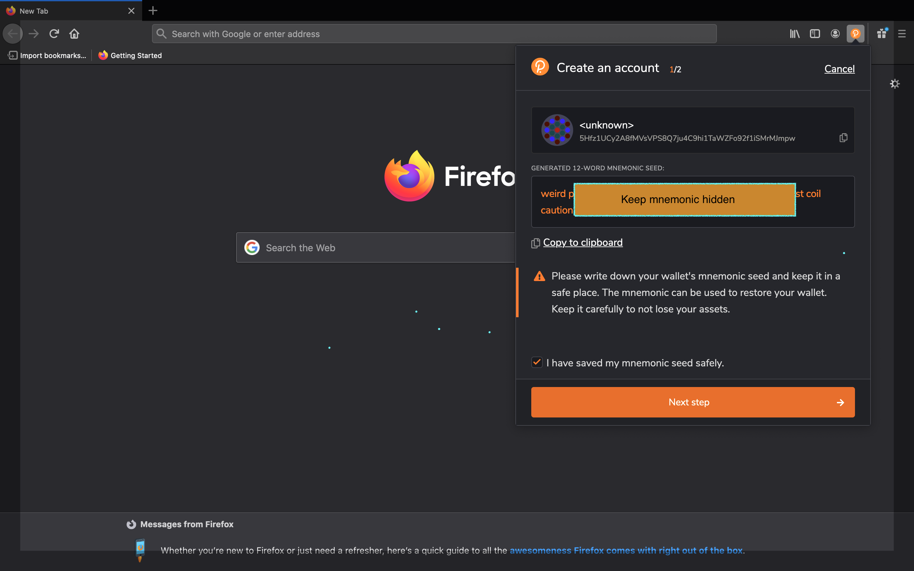
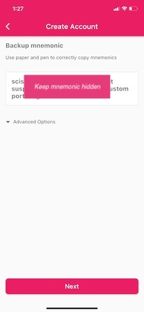
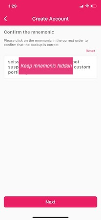

# Creating a New KSM Account

While there are several wallets that support Kusama, **we've found that the Polkadot.{js} browser extension best serves most desktop users and the Polkawallet mobile app best serves most mobile users.** Follow the guides below based on your wallet preference.

## Step 1: Creating a wallet through Polkadot{.js} browser extension

1\) Type polkadot.js.org/extension in the address bar of your web browser.

2\) Select download for your respective browser and follow the download prompts. Brave users should click on the "Download for Chrome" button.

Chrome and Brave users will know if the download was successful when they click on the Extension button \(puzzle piece\) in the right-hand corner of their browser and the orange circle with a "P" appears. Chrome users can pin the extension into their toolbar by clicking on the pin icon \(see screenshot\). Firefox users will know if the download was successful because the orange circle with a "P" will appear in the top right-hand corner of their browser.

3\) Click on the Polkadot logo in your browser. A welcome dialogue box will appear. Click "Understood, let me continue."

4\) Click on the "+" in the center of the circle to add an account.

5\) A box will appear with your address along with your mnemonic seed phrase. Record the mnemonic phrase and store it somewhere safe. Don't share it with anyone. Your seed phrase can be used to recover your account if you forget your password or if you want to import your account.

Click "I have saved my mnemonic seed safely" and proceed to the next step.

6\) The next prompt will allow you to select a network, name your account and create a password for the account. Because you are creating a Kusama account, select the "Kusama Relay Chain" from the dropdown box. Also ensure that you use a strong password \(at least 6 characters\).

Click on the "Add the account with the generated seed" button to create your account.

7\) Your Polkadot.{js} browser extension is now set up! You should see your account in the browser extension.

## Step 2: Managing your account through the Polkadot UI

1\) Now it's time to connect the browser extension to the Polkadot-JS UI \(user interface\) to manage your account.

Type "polkadot.js.org/apps" in your search bar.

2\) A dialogue box will appear asking you to authorize website access. Click on the button that says "Yes, allow this application access."

3\) To switch networks, look towards the left-hand side of the navigation ribbon \(pink in this example\) and select the dropdown near the network logo \(Polkadot logo in this example\).

Click on "Kusama" and select the option "hosted by Parity." Click on the pink "Switch" button.

4\) You should see the account you established in your Polkadot.{js} extension listed in the accounts. You can use the Polkadot UI to send KSM, stake and participate in governance. Consult our other guides on these topics if you are interested in any of those areas.

## Creating a wallet through Polkawallet

1\) Download the Polkawallet app through the Apple App Store for iOS devices and Google Play for Android devices.

2\) Click on the "Create Account" button.

3\) A new screen will appear explaining the importance of recording your mnemonic phrase in a safe place. Click the "Next" button.

4\) Your mnemonic phrase will appear. Write the mnemonic on a piece of paper and store it somewhere safe. Click on the "Next" button.

5\) Confirm your mnemonic by entering the words in the correct order. Click on the "Next" button when completed.

6\) Name your account and create a strong password \(at least 6 characters\). Click on the "Next" button when completed.

7\) Your wallet is now set up! The screen will default to the Polkadot network. You can determine which network you're connected to by looking at the grey text under the account name. In the case of this screenshot, it says "Polkadot."

Click on the hamburger \(three lines\) in the right-hand corner.

8\) A series of logos showing the networks that you can connect to will appear on the left-hand side. Select the Kusama logo \(circle with a bird\) and then click on the box with the account name.

9\) The page will reload, and you will be connected to the Kusama network.

