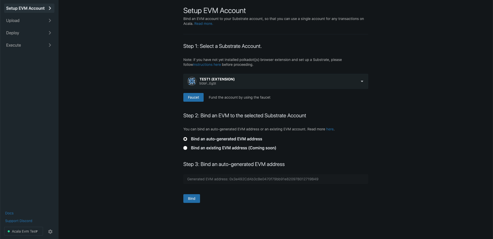
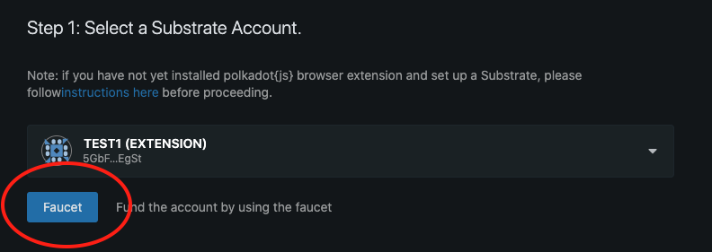
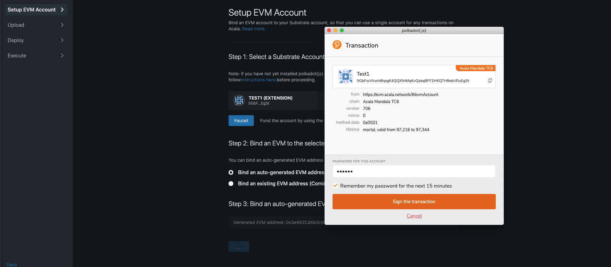
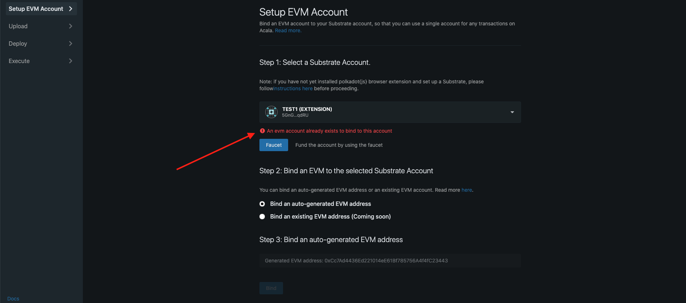

# Setup EVM Account

## **Single Wallet, Single Account Experience**

Users can use **one extension/wallet**, and **a single Substrate account** to interact with the Substrate runtime, contracts in EVM, and wasm contracts or a hybrid of these. If a user wants to use a particular Ethereum address, then simply link it with his/her Substrate address \(basically proving the user owns both addresses\), thereafter the user can just use the Substrate account with [Polkadot{js} extension](https://wiki.polkadot.network/docs/en/learn-account-generation) or alike to sign any Ehtereum transactions seamlessly.

This allows users to use all functionalities within Acala and cross-chain capabilities without managing multiple accounts or wallets.

## Setup EVM Account

A user on Acala will always have a Substrate-based account that enables users to easily navigate multiple blockchains and sign any \(EVM and Susbtrate\) transactions with a single account. Read more on Acala Substrate Account [here](https://wiki.acala.network/learn/basics/acala-account). Follow the guide [here](https://wiki.acala.network/learn/get-started#create-a-polkadot-account) or [here](https://wiki.polkadot.network/docs/en/learn-account-generation) to generate a Substrate account.  

To enable Single Account and use Acala EVM, you either

1. Bind an auto-generated Ethereum address OR
2. Bind an existing Ethereum account to the Substrate account

### **1. Bind an auto-generate EVM Account**

A user can generate an EVM address for each Substrate account. The user then can bind the EVM address to the Substrate account, so balances of native tokens e.g. DOT, renBTC, aUSD etc. on the Substrate account, are then available on the EVM address to use. 

In the Acala EVM, if funds are sent to a Substrate account without an associated EVM address,  an EVM address will be automatically generated and bound with the Substrate account.

Balances are automatically synchronized between the Substrate account and the associated EVM address. For example, a user teleports 10 renBTC to Acala, his/her balance will be shown in the Substrate account, the balance will also be shown and transferrable in the EVM address.

#### EVM Address Generation

The EVM Address is generated using the `blake2_256` hash function with a prefix `evm` and the associated Substrate account as input. Check out the source code [here](https://github.com/AcalaNetwork/Acala/blob/master/modules/evm-accounts/src/lib.rs#L185-L186).

```text
blake2_256(“evm:” ++ account_id)[0..20]
```

#### Generate an EVM Address via EVM Playground

Navigate to the [EVM Playground](https://evm.acala.network/#/evmAccount) \(a web app to test various Acala EVM functionalities\).

Navigate to the `Setup EVM Account` tab if you are not already on it.



**Step 1: Select a Substrate Account**

If you have yet installed the Polkadot{js} extension and created an account, please do so by following the steps [here](https://wiki.polkadot.network/docs/en/learn-account-generation#polkadotjs-browser-plugin).

If the account is created and the extension is installed correctly, the account should be available in the dropdown.

Click on the `Faucet` Button to fund the account, as it will need to send a transaction to the Acala blockchain later to bind the accounts. 



**Step 2: Choose Option 1 to Bind an auto-generated EVM address**

**Step 3: Bind**

You can see the generated EVM address under Step 3, and click the `Bind` button.

Polkadot{js} extension will prompt you to enter a password or use the saved password, and click the `Sign the transaction` Button.



If the `Bind` transaction was successful, you will get a message `An evm account already exists to bind this account` basically means the binding was recorded on-chain, and you can use the Polkadot extension for any EVM transactions. 

_Please excuse the UX as the Playground is mostly used for dev testing._



### **2. Bind an Existing Ethereum Account**

In any case, if users want to use an existing Ethereum account in Acala EVM, this address will need to be claimed and bound to their Subatrate account.

_**One Substrate account can only be associated with one Ethereum address.**_ A Substrate address already linked to a generated EVM address can no longer link to an existing Ethereum address and vice versa.

Binding an existing Ethereum account requires users to prove they own the Ethereum account private key, by signing a message, include it in a `claim` transaction and send it to the Acala network. 

This feature is coming soon in our next release. 

#### Use Cases

Below are two potential use cases of binding an existing Ethereum address.

**Use Case 1**

For example, a DeFi protocol on Ethereum is now expanding its operation to Polkadot, by deploying their contracts on the Acala network. They will this new branch by airdropping tokens to their existing users if they also use the protocols on Acala.

The easiest way is to airdrop tokens to existing Ethereum addresses on Acala. Hence users would just bind their current Ethereum address to a Substrate address, use it for any EVM transactions, and receive airdrops.

**Use Case 2**

For DApps like [Linkdrop](https://linkdrop.io/), users are required to sign messages using Ethereum private key. Using Linkdrop on Acala, would require users to claim their existing Ethereum address, and bind it to their Substrate account. Thereafter they can send transactions on behalf of the Ethereum account.

