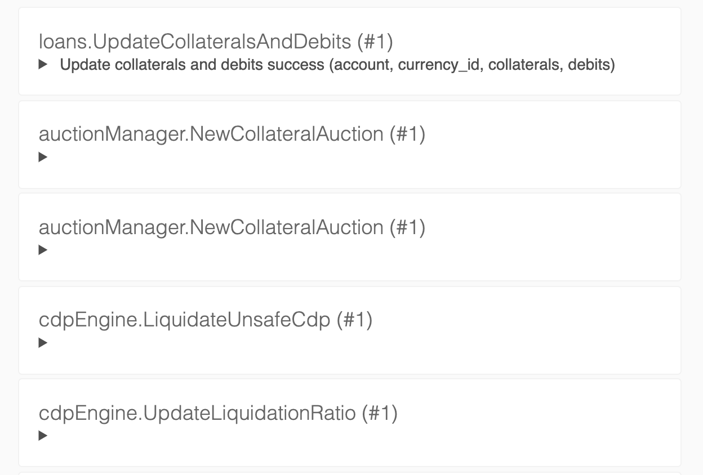

# Auctions

* [Overview](https://wiki.acala.network/learn/basics/auctions#overview)
* [Mandala Test Network](https://wiki.acala.network/learn/basics/auctions#mandala-test-network)
  * [Surplus Auction](https://wiki.acala.network/learn/basics/auctions#surplus-auction)
    * [Start an Auction](https://wiki.acala.network/learn/basics/auctions#start-an-auction)
    * [Liquidator](https://wiki.acala.network/learn/basics/auctions#liquidator)
    * [Closing an Auction](https://wiki.acala.network/learn/basics/auctions#closing-an-auction)
  * [Debit Auction](https://wiki.acala.network/learn/basics/auctions#debit-auction)
  * [Collateral Auction](https://wiki.acala.network/learn/basics/auctions#collateral-auction)

## Overview

Auctions are one of the stability mechanisms employed by the Honzon protocol to maintain a strong peg between aUSD and US Dollar.

**Surplus Auction** When business as usual, the Honzon protocol through the `CDP Treasury` would accrue interests in aUSD from each loan. This surplus will firstly cover any outstanding debt in the system. Whenever this surplus reaches a predefined limit, the surplus in aUSD will be auctioned off for ACA which will then be burnt.

**Debt Auction** The `CDP Treasury` also keeps account of the system debt, that is if unsafe loans cannot be fully liquidated and debt cannot be fully repaid. If system surplus cannot cover the debt, then the `Debt Auction` will be triggered, and additional ACA could be minted to auction off to pay back outstanding aUSD debt.

**Collateral Auction** Each aUSD loan is created with a `required collateral ratio`, and its collateral ratio needs to be above the `liquidation ratio` to stay `safe`. The `liquidation ratio` is lower than the `required collateral ratio` to create a safety zone for each loan and avoid immediate liquidation upon creation. If the price of a collateral drops to a point where a loan's collateral ratio is less than the `liquidation ratio`, then a `Collateral Auction` is triggered to sell off the collaterals to pay off the aUSD debt.

## Mandala Test Network

### Surplus Auction

#### Start an Auction

Surplus auction criteria

```text
 1. Outstanding debt is cleared: debitPool = 0
 2. Surplus is over certain limit:  surplusPool > surplusBufferSize + surplusAuctionFixedSize
```


This is checked each block. Whenever the criteria is met, a new auction is created.  External actors e.g. liquidators can monitor the `NewSurplusAuction` event.


#### Liquidator

Use `Extrinsics` - `auction.Bid` to participate in auction.  The Console UI is more as an illustration than useful, as liquidators would be more likely as a bot or participate via a DApp UI \(coming soon\).


#### Closing an Auction

 Every new bid will increment bidding price more than the `minimumIncrementSize`, and extend auction time by the `auctionTimeToClose`. Until then if there is no more new bidders, the auction will close with the highest bidder winning. If the overall auction time reaches the `auctionDurationSoftCap`, then the `auctionTimeToClose` will half, and the `minimumIncrementSize` will double to expedite the process.


 Monitor the `AuctionDealed` event for closing an auction. \[TODO\] More events will be added.


### Debit Auction

Debit auction criteria

```text
1. surplusPool == 0
2. debitPool >= totalDebitInAuction + get_total_target_in_auction + debit_auction_fixed_size
```

\[TODO\] more details

### Collateral Auction

If a loan is unsafe, that is the collateral ratio of this loan is below the `liquidation ratio`, then it is deem to be liquidated by anyone with a reward.

 Use `Chain state` -&gt; `cdpEngine` -&gt; `liquidationRatio` to check.


Use `Extrinsics` -&gt; `honzon` -&gt; `liquidationPenalty` to check penalty. As an example, the `liquidation ratio` is 10%. It is applied on top of the debit amount and paid to the liquidator.

 Use `Extrinsics` -&gt; `honzon` -&gt; `liquidate` to liquidate a loan at danger. The liquidation action might trigger a collateral auction if it cannot complete the liquidation via Acala DeX within required slippage. \[TODO\] more details on DeX.


You can monitor the `NewCollateralAuction` to participate in one. 



The `target price` for the auction is made of `amount owed` + `penalty`. If bid price is greater than the `target`, then a reverse auction is triggered. Bidders would bid for the same price, how little asset they are willing to accept.

