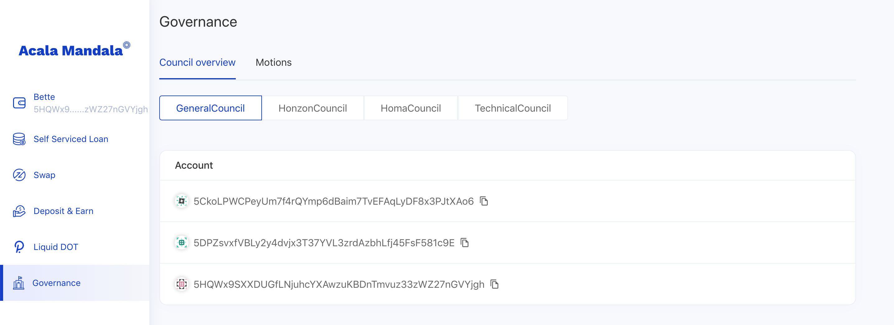
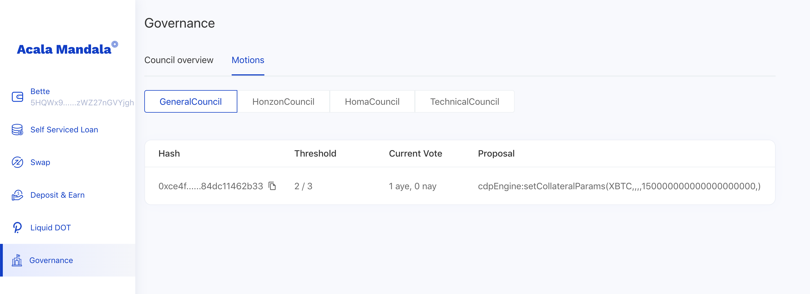

# Governance

* [Governance](https://wiki.acala.network/maintain/governance-guides/governance-overview#governance)
  * [Chambers of Acala Governance](https://wiki.acala.network/maintain/governance-guides/governance-overview#chambers-of-acala-governance)
  * [Progressive Decentralization](https://wiki.acala.network/maintain/governance-guides/governance-overview#progressive-decentralization)
    * [Phase I: Council Governance](https://wiki.acala.network/maintain/governance-guides/governance-overview#phase-i-council-governance)
      * [Implementation](https://wiki.acala.network/maintain/governance-guides/governance-overview#implementation)
        * [Mandala TC3](https://wiki.acala.network/maintain/governance-guides/governance-overview#mandala-tc3)
    * [Phase II: Elected Council + Referendum Governance](https://wiki.acala.network/maintain/governance-guides/governance-overview#phase-ii-elected-council-referendum-governance)
  * [Jurisdictions](https://wiki.acala.network/maintain/governance-guides/governance-overview#jurisdictions)
    * [Honzon Council Jurisdictions](https://wiki.acala.network/maintain/governance-guides/governance-overview#honzon-council-jurisdictions)
    * [Homa Council Jurisdictions](https://wiki.acala.network/maintain/governance-guides/governance-overview#homa-council-jurisdictions)
    * [General Council Jurisdiction](https://wiki.acala.network/maintain/governance-guides/governance-overview#general-council-jurisdiction)
  * [Under Discussion & Development](https://wiki.acala.network/maintain/governance-guides/governance-overview#under-discussion-and-development)

## Governance

Acala takes a phased approach to employ various governance mechanisms that will allow it to progressively decentralize and ultimately be commanded by the majority network stakeholders.

We take much inspiration from Polkadot for technical and governance mechanism design, and adapt it to best serve the Acala Network.

### Chambers of Acala Governance

The General Council and ACA Referendum are the overarching chambers that govern the Acala Network. The General Council appoints these specialist councils to manage aspects of the network: the Honzon \(Financial\) Council, the Homa \(Staking Liquidity\) Council and the Technical Council. The L-DOT Referendum chamber together with the Homa Council would govern the staking liquidity protocol related affairs.

### Progressive Decentralization

#### Phase I: Council Governance

The earliest stage of developing the Acala Network is led by the Acala Foundation, in a way not much different from a normal startup: a great team, lean development, tight execution, and quick learning. **There should be no pretense of decentralization**

At this stage, decisions of the Acala Foundation regarded the network is made transparent on-chain via appointed General Council voting. All the other councils are appointed by the General Council.

**Proposals & Motions**

* **Submission**: only council members can submit a proposal at this phase, and it will be open to the public in the next phase.
* **Voting**: is continuous \(no set time\) through motions that comprise of a proposal and required approvals.
* **Execution**: if a motion is approved, it can be executed using one of the following strategies, made possible by [Open Web3 Stack](https://github.com/open-web3-stack/open-runtime-module-library):
  * immediately: a super majority is required.
  * at a delayed time: specialist councils can cancel an uncontroversially dangerous or malicious motion before it is applied. A simple majority is required.
  * gradually: numeric value change motions e.g. increase stability fee can be applied gradually over time reduce disruption. A simple majority is required.
* **Durations**: all motion durations are set to 7 days in this phase.

**General Council**

* **Desired membership**: of the General Council is 5 in this phase, and will be increased in the next phase.
* **Tallying**: A simple majority of the council can decide the next non-immediately executable motion, a super majority is required otherwise.
* **Selection**: Appointed by the Acala Foundation.
* **Proposals/Motions**: Only members of the General Council can submit root call propose e.g. runtime upgrade. Can cancel any uncontroversially dangerous motions via unanimous vote.

**Honzon Council**

* **Desired membership**: of the Honzon Council is 5 in this phase, and will be increased in the next phase.
* **Tallying**: a simple majority of the council can decide the next motion.
* **Selection**: elected by the General Council via simple majority.
* **Proposals/Motions**: members can submit Honzon related parameter change proposals. All motions are executed at a delayed time, during which the General Council or Technical Council can uncontroversially dangerous motions.

**Homa Council**

* **Desired membership**: of the Homa Council is 3 in this phase, and will be increased in the next phase.
* **Tallying**: a simple majority of the council can decide the next motion.
* **Selection**: elected by the General Council via simple majority.
* **Proposals/Motions**: members can submit Homa related parameter change proposals. All motions are executed at a delayed time, during which the General Council or Technical Council can uncontroversially dangerous

**L-DOT Chamber**

* **Proposals/Motions**: L-DOT holders can vote to select desired validators every certain period e.g. every era.
* **Scheme**: L-DOT holders can vote for 16 candidates based on a scheme similar to Phragmen election \[https://wiki.polkadot.network/docs/en/learn-phragmen\].

**Technical Council**

* **Desired membership**: of the Technical Council is 3 in this phase, and will be increased in the next phase.
* **Selection**: elected by the General Council via simple majority.
* **Proposals/Motions**: can cancel any uncontroversially dangerous motions via unanimous vote.

#### **Implementation**

#### **Mandala TC6**

Four council chambers have been implemented: General Council, Honzon Council, Homa Council, Technical Council. They currently work alongside with `sudo` for functionality testing purposes only. 'Real' governance will take effect in our canary network **Karura** with real stake.

**Council Chambers** 

**Council Motions** 

We are watching closely good practices and tools for documenting governance proposals, gathering opinions and debates, publishing voting result and execution status etc. As an example, [Polkassembly](https://kusama.polkassembly.io/) seems to be good place to start, and we might consider integrating or using similar approach for Acala governance.

#### Phase II: Elected Council + Referendum Governance

Coming soon...

### Jurisdictions

#### Honzon Council Jurisdictions

**Loan related parameters**

| Parameter | Type | Description | Example |
| :--- | :--- | :--- | :--- |
| InterestRatePerSec | Rate | The extra interest rate per second for specific collateral type. \( the interest rate of BTC = `InterestRatePerSec` of BTC + `GlobalInterestRatePerSec` \) | BTC: 0.000000001 |
| LiquidationRatio | Ratio | Liquidation ratio for specific collateral type. | BTC: 150% |
| LiquidationPenalty | Rate | Liquidation penalty rate for specific collateral type. | BTC: 13% |
| RequiredCollateralRatio | Ratio | Required collateral ratio for opening an loan for a given collateral type. | BTC: 180% |
| MaximumTotalDebitValue | Balance | Debt ceiling in stable coin(aUSD) for a given collateral type. | BTC: 100,000,000 |
| GlobalInterestRatePerSec | Rate | Base interest rate per second for all collateral types. | 0.0000000005 |

**Liquidation and CDP Treasury related parameters**

| Parameter | Type | Description | Example |
| :--- | :--- | :--- | :--- |
| ExpectedCollateralAuctionSize | Balance | The expected amount size for per lot collateral auction of specific collateral types. | BTC: 0.1 |

#### Homa Council Jurisdictions

* allocation slash compensation either via Homa treasury or validator bond
* blacklist validators through unanimously consent
* define validator selection criteria

#### General Council Jurisdiction

Less frequently changed parameters and other types of changes are executed via runtime upgrade, which are administered by the General Council for now.

**Acala DeX parameters**

| Parameter | Type | Description | Example |
| :--- | :--- | :--- | :--- |
| GetExchangeFee | (u32, u32) | Exchange fee rate(the first item in tuple is fee numerator, the second is denominator.) | (5, 1000) ,(ie. 5‰) |
| TradingPathLimit | u32 | The limit for length of trading path. | 3, means the trading path such as [BTC, AUSD], [BTC, AUSD, ACA] is valid, but [BTC, AUSD, ACA, DOT] is invalid |

**Global Stablecoin Parameters**

| parameter | type | description | example |
| :--- | :--- | :--- | :--- |
| CollateralCurrencyIds | Vec | The accepted collateral type list. | \[XBTC, DOT, LDOT\] |
| DefaultLiquidationRatio | Ratio | Default liquidation ratio if no liquidation ratio set for specific collateral type. | 150% |
| DefaultDebitExchangeRate | ExchangeRate | Initial exchange ratio of debit and aUSD for all collateral type. | 10:1 |
| DefaultLiquidationPenalty | Ratio | Default liquidation ratio if no liquidation ratio set for specific collateral type. | 15% |
| MinimumDebitValue | Balance | The min debit value \(in stable coin\) required by a CDP which has debit to avoid dust. | 1 |

**Liquidation and CDP treasury parameters**

| Parameter | Type | Description | Example |
| :--- | :--- | :--- | :--- |
| MaxSlippageSwapWithDEX | Ratio | During liquidation, if liquidate collateral on DeX incurs a slippage less than this value, then the system would execute the liquidation on DeX instead of create collateral auction. | 5% |

**Auction parameters**

| Parameter | Type | Description | Example |
| :--- | :--- | :--- | :--- |
| MinimumIncrementSize | Rate | Minimum price increment | 5% |
| AuctionTimeToClose | BlockNumber | Auction time to close after each new bid | 500 |
| AuctionDurationSoftCap | BlockNumber | When total auction duration exceeds this value, the system will double price increment, and halve auction time to close to expedite the auction | 5000 |
| GetAmountAdjustment | Rate | Adjust ACA amount if there is no successful bit in a debt auction | 10% |

**Homa staking liquidity parameters**

The Homa is still in draft!!!

| Parameter | Type | Description | Example |
| :--- | :--- | :--- | :--- |
| TargetMaxFreeUnbondedRatio | Ratio | The acceptable max ratio of communal free unbonded DOT amount to total communal DOT amount. | 10% |
| TargetMinFreeUnbondedRatio | Ratio | The acceptable min ratio of communal free unbonded DOT amount to total communal DOT amount. | 5% |
| TargetUnbondingToFreeRatio | Ratio | The target ratio of communal unbonding DOT amount to total communal DOT amount.  | 1‰ |
| BaseFeeRate | Rate | The base rate fee for `Immediately` and `Target` redemption. | 5% |
| DefaultExchangeRate | ExchangeRate | Initial L-DOT to DOT exchange rate | 10:1 |

**Validators selection parameters**: Note: some of the code is mocked right now until relay chain bridge is available

| Parameter | Type | Description | Example |
| :--- | :--- | :--- | :--- |
| MinBondThreshold | Balance | Minimum L-DOT bonded to elect validator to avoid dust | 1 LDOT |
| BondingDuration | Balance | Duration for unbonding L-DOT | 7 Era |
| MaxUnlockingChunks | u32 | Maximum number of unbonding events at a pointing time | 7 |
| NominateesCount | u32 | Number of validators can be nominated | 7 |

### Under Discussion & Development

* Next phase of the governance will involve elected councils and referendum chambers in action, details of which are being designed.More details on treasury will be released as we progress.
* Acala will have multiple treasuries and funds that manage the welfare of the network.
  * ACA Treasury holds genesis ACA, manages network income and expenses
  * each protocol will have their own treasury for income and expenses
  * the Sovereign Wealth Fund will hold surplus contributed from treasuries and purchase reserve according to investment strategies.
* The details of the Homa liquidity staking protocol is being fleshed out, which will have implication on governance.

