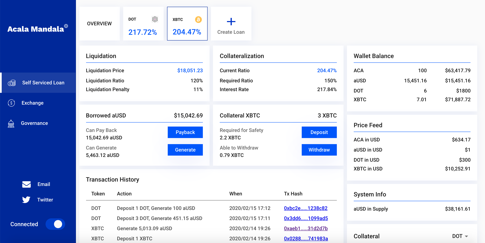

# Honzon Stablecoin

* [Overview](https://wiki.acala.network/learn/basics/honzon-stablecoin#overview)
* [Honzon on Mandala Test Network](https://wiki.acala.network/learn/basics/honzon-stablecoin#honzon-on-mandala-test-network)
  * [Via Acala DApp](https://wiki.acala.network/learn/basics/honzon-stablecoin#via-acala-dapp)
    * [Liquidation & Collateralization](https://wiki.acala.network/learn/basics/honzon-stablecoin#liquidation-and-collateralization)
    * [Create Loan](https://wiki.acala.network/learn/basics/honzon-stablecoin#create-loan)
    * [Update Loan](https://wiki.acala.network/learn/basics/honzon-stablecoin#update-loan)
  * [Via Polkadot UI](https://wiki.acala.network/learn/basics/honzon-stablecoin#via-polkadot-ui)
    * [Check Required Collateral Ratio](https://wiki.acala.network/learn/basics/honzon-stablecoin#check-required-collateral-ratio)
    * [Check Token Prices](https://wiki.acala.network/learn/basics/honzon-stablecoin#check-token-prices)
    * [Create a Self Serviced Loan for aUSD](https://wiki.acala.network/learn/basics/honzon-stablecoin#create-a-self-serviced-loan-for-ausd)
    * [Check Loan Status](https://wiki.acala.network/learn/basics/honzon-stablecoin#check-loan-status)
    * [Withdraw Residual Collateral & Payback Loan](https://wiki.acala.network/learn/basics/honzon-stablecoin#withdraw-residual-collateral-and-payback-loan)
  * [SDK \(Coming soon\)](https://wiki.acala.network/learn/basics/honzon-stablecoin#sdk-coming-soon)
  * [Check Transaction Details](https://wiki.acala.network/learn/basics/honzon-stablecoin#check-transaction-details)

## Overview

The Honzon Protocol is a set of mechanisms to manage aUSD loans with multiple collaterals, monitor and adjust stability of aUSD based on various risk parameters such as collateral ratio, interest rates, debt level etc. We outline a user guide per below to use the Honzon protocol.

## Honzon on Mandala Test Network

If you have yet had an account and test tokens, please refer to the [Get Started Guide](https://wiki.acala.network/learn/get-started).

The guide below will illustrate the following functionalities

1. Check Required Collateral Ratio
2. Check Token Prices
3. Create a Self Serviced Loan for aUSD
4. Check Loan Status
5. Withdraw Residual Collateral & Payback Loan

Mandala Test Network available test tokens

| Currency ID | Symbol | Description |
| :--- | :--- | :--- |
| 0 | ACA | Acala network token for fees, rewards etc. |
| 1 | aUSD | Acala USD stablecoin |
| 2 | DOT | Polkadot network token DOT |
| 3 | XBTC | ChainX bridged Bitcoin |
| 4 | LDOT | Liquid DOT accounts for DOT and staking reward |

### Via Acala DApp

#### Liquidation & Collateralization

Check important figures for a particular loan:

* `liquidation price`: if a collateral price drops to or under the `liquidation price`, then the loan is unsafe
* `liquidation ratio`: if the collateral ratio of a loan is below this ratio, then the loan is unsafe
* `liquidation penalty`: it is applied on top of the debit amount and paid to the liquidator.
* `current ratio`: current collateral ratio
* `required ratio`: required collateral ratio for borrowing \(additional\) aUSD, this is usually higher than `liquidation ratio` to maintain a safety vault
* `interest rate`: annualized interest rate for the loan, this is indicative of course, as rates are calculated each block

#### Create Loan

Click the `Create Loan` button, follow the prompt to select a collateral type, and the amount of aUSD to generate. [Create Loan Video](http://www.youtube.com/watch?v=CjwJgm_yz-I)

#### Update Loan

For the aUSD borrowed, you can pay back, and generate more if there is enough collateral. For the collateral asset, you can deposit more \(but not immediately generate aUSD\), or withdraw available collateral. [Update Loan Video](http://www.youtube.com/watch?v=iEWlY5Kosp8)

### Via Polkadot UI

#### Check Required Collateral Ratio

Use `Chain state` -&gt; `cdpEngine` -&gt; `requiredCollateralRatio` to check required collateral ratio for a given token.

On `Mandala Test Network`, DOT at 160%, and BTC at 150%.

#### Check Token Prices

Use `Chain state` -&gt; `oracle` -&gt; `values` to check price for a given token. Convert the hex value to number.

#### Create a Self Serviced Loan for aUSD

Use `Extrinsics` -&gt; `honzon` -&gt; `updateVault` to loan out aUSD.

* `currency_id`: asset used as collateral
* `collateral`: amount to deposit as collateral for this loan
* `debit`: the amount to loan out, note this is not aUSD amount, but a debit unit to account for aUSD owed plus accumulated interest etc.

To get debit to aUSD exchange rate, use `Chain state` -&gt; `cdpEngine` -&gt; `debitExchangeRate`. On `Mandala Test Network`, the debit to aUSD exchange rate starts at `0.1`.

As for the above aUSD example

* 1 DOT is deposited as collateral for the loan
* 1500 debit units equivalent to 150.736577445027942000 aUSD will be loaned out
* with DOT value at about $300, the actual collateral ratio was about 199.02%

#### Check Loan Status

Use `Chain state` -&gt; `loan` -&gt; `collaterals` to check collaterals locked in the loan.

Use `Chain state` -&gt; `loan` -&gt; `debits` to check amount owing, again this is not aUSD amount, but a debit unit to account for aUSD owed plus accumulated interest etc. See above section for obtaining debit to aUSD exchange rate.

#### Withdraw Residual Collateral & Payback Loan

Use `Extrinsics` -&gt; `honzon` -&gt; `updateVault` to withdraw collateral and/or payback aUSD loan.

* `collateral`: a negative amount means a withdraw
* `debit`: a negative amount means paying back aUSD, again this is not aUSD amount, but a debit unit to account for aUSD owed plus accumulated interest etc. See above section for obtaining debit to aUSD exchange rate.

### SDK \(Coming soon\)

### Check Transaction Details

For `Mandala Test Network`, you can use [Polkascan](https://polkascan.io/pre/acala-mandal) to check transaction details, and perform various queries.

