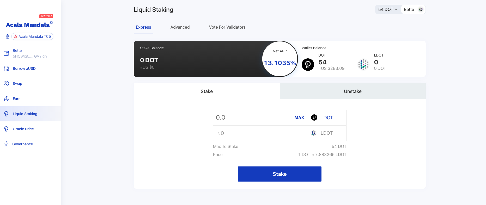

# Liquid DOT

* [Overview](https://wiki.acala.network/learn/basics/homa-liquid-dot#overview)
  * [Liquid DOT](https://wiki.acala.network/learn/basics/homa-liquid-dot#liquid-dot)
  * [Early Unbonding](https://wiki.acala.network/learn/basics/homa-liquid-dot#early-unbonding)
  * [Staking Pool](https://wiki.acala.network/learn/basics/homa-liquid-dot#staking-pool)
  * [L-DOT Holder Voting for Validators](https://wiki.acala.network/learn/basics/homa-liquid-dot#l-dot-holder-voting-for-validators)
* [Mandala Test Network](https://wiki.acala.network/learn/basics/homa-liquid-dot#mandala-test-network)
  * [Via Web DApp](https://wiki.acala.network/learn/basics/homa-liquid-dot#via-web-dapp)
    * [Deposit DOT](https://wiki.acala.network/learn/basics/homa-liquid-dot#deposit-dot)
    * [Redeem DOT](https://wiki.acala.network/learn/basics/homa-liquid-dot#redeem-dot)

## Overview

In a Proof-of-Stake (PoS) network, there will be **natural competition** between assets being used in **staking (for yields)** and assets being **invested in DeFi (for returns)**. This results in a tension between security and liquidity. For example, Polkadot intends to have 50% of the DOTs staked, the rest in circulation would be used for bonding, paying transaction fees and other. **Can we have both security and liquidity at the same time?** The 'Homa' staking liquidity protocol solves this dilemma.

### Liquid DOT

Users can stake DOTs **trustlessly** with the 'Homa' staking pool, and in return you receive Liquid DOT (L-DOT) accounting for both the DOT amount and on-going staking reward earned. **L-DOT is fungible, can be traded, used for payment, in DeFi e.g. as collateral to generate aUSD stablecoin.** L-DOT as a derivative of DOT would extract residual value of it without compromising or competing for network security. Meanwhile it releases much liquidity for other use cases of a PoS network token.

Homa is designed as a generic staking liquidity protocol, and firstly implemented for Polkadot and DOT as staking asset.

Note: user would transfer DOTs from Polkadot Relaychain account to Acala via a bridge, this is being mocked until cross-chain message passing (XCMP) facility is ready.

### Early Unbonding

Once DOTs are staked, there is a **28-day unbonding period** which in principle reduces liquidity and improves security and stability of assets at stake. Yet some users may want to have their DOTs back earlier. Homa fills this need by providing **immediate withdrawn and early unbonding services** in addition to the standard 28-day bonding period. Users are required to pay a higher premium for a shorter wait time (or NO wait time!) to compensate the loss reward of free liquidity.

* **Immediate Withdraw**: a rather high premium is required, as it draws DOTs from the `Free Pool` where liquidity is reserved by foregoing staking rewards.
* **Targeted Unbonding**: user can specify when (in unit of Era) the DOTs need to be released, where a relatively lower fees are charge. The protocol maintains a targeted range of DOTs being unbonded to meet the demands.

Fees are paid in L-DOT and managed by the Homa Treasury.

### Staking Pool

The protocol uses the `Maximum Bond Ratio` and `Minimum Bond Ratio` to gauge how much of the deposited DOTs should be staked and how much should be kept in liquidity. The re-balance happens every Era. In addition it manages balances, rewards, slashes, unbonding claims on Relaychain via the bridge, this again is being mocked until cross-chain message passing facility is ready.

### L-DOT Holder Voting for Validators

L-DOT holders have rights to vote for favorite validators using a selection mechanism similar to Phragmen election to choose (for now) maximum of 16 validators. L-DOTs are required to lock their L-DOTs for voting rights and power.

## Mandala Test Network

### Via Web DApp

#### Express Staking

1-Click express staking for Kusama or Polkadot through the Homa Liquid KSM/DOT protocol. This is a trustless protocol to stake KSM/DOT, and get LKSM/LDOT tokens back as receipts. LKSM and LDOT can be freely transferrable, used as collaterals to borrow aUSD or other DeFi use cases.

#### Deposit DOT

#### Redeem DOT

