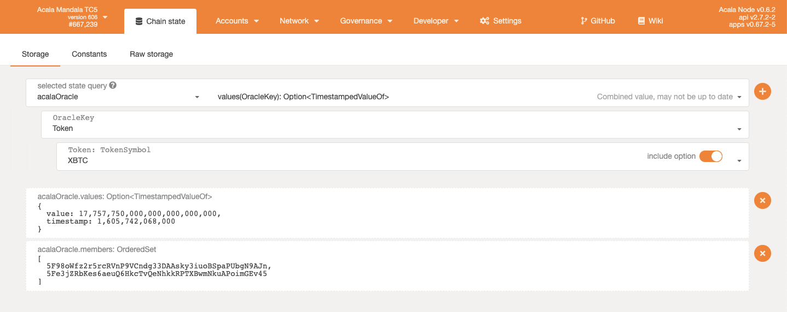

# Oracle on Mandala Testnet

## Existing Oracles

* You can find currently available Oracle Providers [here](https://github.com/AcalaNetwork/Acala/blob/master/primitives/src/lib.rs#L106-L110)
* Acala Oracle running on the Mandala Test Network [here](https://acala-testnet.subscan.io/runtime/OperatorMembershipAcala?version=606)
* One of the Acala Oracle Operators feeding prices on-chain [here](https://acala-testnet.subscan.io/account/5Fe3jZRbKes6aeuQ6HkcTvQeNhkkRPTXBwmNkuAPoimGEv45)

## Check States of an Oracle

As an example, checking Acala Oracle states, go to [Polkadot JS App](https://polkadot.js.org/apps/?rpc=wss%3A%2F%2Fnode-6714447553211260928.rz.onfinality.io%2Fws#/chainstate) --&gt; Developer --&gt; Chainstate, select 'acalaOracle' and other query parameters to check operator membership, token prices etc.

