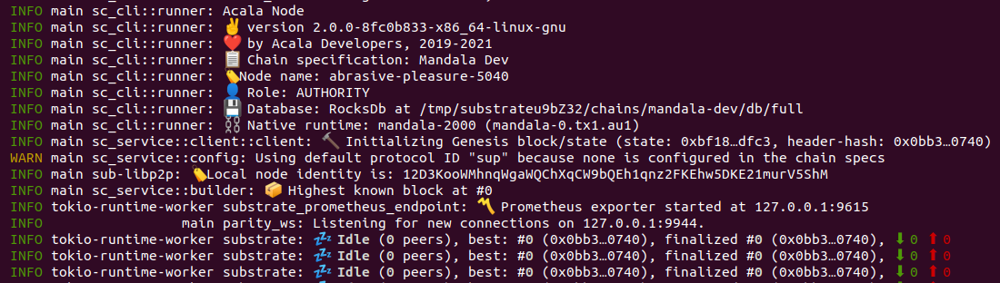

# How to run a standard RPC archive node

Running an archive node is usefull if you want query the blockchain on your local network, most likely because you're developing a dApp that needs to have unlimited requests, to constantly parse the blockchain or to get all the history of blocks to make statistics. For example to build a bridge or an arbitrage bot.



**Using Docker**

Install docker with Linux:  
`wget -qO- https://get.docker.com/ | sh`

#### For Karura 

```text
docker run -d --restart=always -p 30333:30333 -p 9933:9933 -p 9944:9944 \
  -v /root/acala-node:/acala/data acala/karura-node:latest \
  --chain karura --execution=wasm  --pruning=archive
```

#### For Acala \(Coming Soon\)

```text
docker run -d --restart=always -p 30333:30333 -p 9933:9933 -p 9944:9944 \
  -v /root/acala-node:/acala/data acala/acala-node:latest \
  --chain acala --execution=wasm  --pruning=archive
```

You can look at those flags in detail in the [Node Command Line Argument page](node-cli.md)

## Watching for New Releases

Node runners needs to watch [Acala's repository](https://github.com/AcalaNetwork/Acala/releases/) for new releases (and only upgrade for client release).

Please join our [Discord Server](https://discord.gg/vdbFVCH) and watch the `#📢┃announcement` channel under the `NODE OPERATOR` category to be alerted when mandatory updates are announced.

[Contact us](mailto:hello@acala.network?subject=Private-Node-Tech-Support-Access) for an invite to the private `#tech-support` channel
