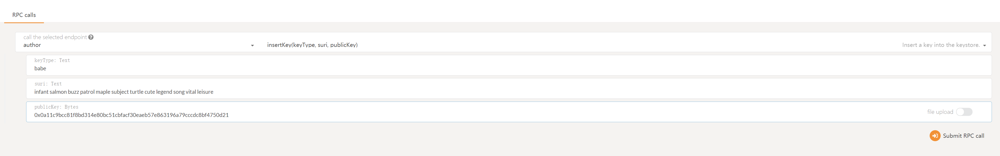
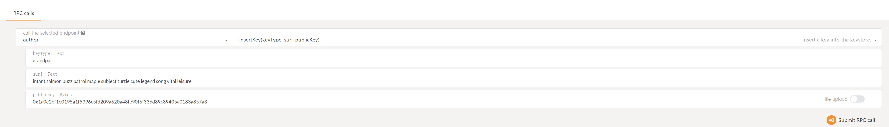

# Node Management

This page contains basic information about running a Acala client. There are a lot of ways to obtain/run a client, e.g. compiling from source, running in Docker, or downloading a binary. This guide will always refer to the executable as `acala`.

**Always refer to the client's help `acala --help` for the most up-to-date information.**

## **Run as Full Node** 

#### Build

**Install Rust**

Once you choose your cloud service provider and set-up your new server, the first thing you will do is install Rust.

If you have never installed Rust, you should do this first. This command will fetch the latest version of Rust and install it.

```text
# Install
curl https://sh.rustup.rs -sSf | sh
# Configure
source ~/.cargo/env
```

Otherwise, if you have already installed Rust, run the following command to make sure you are using the latest version.

```text
rustup update
```

Configure the Rust toolchain to default to the latest stable version:

```text
rustup update stable
rustup default stable
```

If the compilation fails, you can try to switch to nightly

```text
rustup update nightly
rustup default nightly
```

**Clone and Build**

The [AcalaNetwork/acala](https://github.com/AcalaNetwork/Acala) repo's master branch contains the latest Acala code.

```text
git clone https://github.com/AcalaNetwork/Acala.git
cd Acala 
make init
make build
```

Alternatively, if you wish to use a specific release, you can check out a specific tag \(`v0.5.1` in the example below\):

```text
git clone https://github.com/AcalaNetwork/Acala.git
cd Acala 
git checkout tags/v0.5.1
make init
make build
```

**Development**

To type check:

```text
make check
```

To purge old chain data:

```text
make purge
```

To purge old chain data and run

```text
make restart
```

Update ORML

```text
make update
```

When running as a simple sync node \(above\), only the state of the past 256 blocks will be kept. When validating, it defaults to archive mode. To keep the full state use the `--pruning` flag:

```text
./target/release/acala --name "My node's name" --pruning archive --chain mandala
```

It is possible to almost quadruple synchronization speed by using an additional flag: `--wasm-execution Compiled`. Note that this uses much more CPU and RAM, so it should be turned off after the node is in sync.

#### **Using Docker**

Finally, you can use Docker to run your node in a container. Doing this is a bit more advanced so it's best left up to those that either already have familiarity with docker, or have completed the other set-up instructions in this guide. If you would like to connect to your node's WebSockets ensure that you run you node with the `--rpc-external` and `--ws-external` commands.

```text
docker pull acala/acala-node:latest
docker run -p 9944:9944 acala/acala-node:latest --name "calling_home_from_a_docker_con
```

### For karura

#### **Using Docker**

```text
docker run -d --restart=always -p 30334:30333 -p 9934:9933 -p 9945:9944 -v /root/aca-node:/acala/data acala/acala-node:latest --chain karura
```

### For Acala

#### **Using Docker**

```text
docker run -d --restart=always -p 30334:30333 -p 9934:9933 -p 9945:9944 -v /root/aca-node:/acala/data acala/acala-node:latest --chain acala
```

### For  Mandala

#### **Using Docker**

```text
docker run -d --restart=always -p 30334:30333 -p 9934:9933 -p 9945:9944 -v /root/aca-node:/acala/data acala/acala-node:latest --chain acala
```

### Run as local testnet

**Alice and Bob Start Blockchain**

Before we generate our own keys, and start a truly unique Acala network, let's learn the fundamentals by starting with a pre-defined network specification called `local` with two pre-defined \(and definitely not private!\) keys known as Alice and Bob.

**Alice Starts First**

Alice \(or whomever is playing her\) should run these commands from node-template repository root.

```text
./acala --base-path /tmp/alice --chain local --alice --port 30333 --ws-port 9944 --rpc-port 9933  --validator --rpc-methods=Unsafe --ws-external --rpc-external --ws-max-connections 1000 --rpc-cors=all --unsafe-ws-external --unsafe-rpc-external
```

Let's look at those flags in detail:

| Flags | Descriptions |
| :--- | :--- |
| `--base-path` | Specifies a directory where Acala should store all the data related to this chain. If this value is not specified, a default path will be used. If the directory does not exist it will be created for you. If other blockchain data already exists there you will get an error. Either clear the directory or choose a different one. |
| `--chain local` | Specifies which chain specification to use. There are a few prepackaged options including `local`, `development`, and `staging` but generally one specifies their own chain spec file. We'll specify our own file in a later step. |
| `--alice` | Puts the predefined Alice keys \(both for block production and finalization\) in the node's keystore. Generally one should generate their own keys and insert them with an RPC call. We'll generate our own keys in a later step. This flag also makes Alice a validator. |
| `--port 30333` | Specifies the port that your node will listen for p2p traffic on. `30333` is the default and this flag can be omitted if you're happy with the default. If Bob's node will run on the same physical system, you will need to explicitly specify a different port for it. |
| `--ws-port 9945` | Specifies the port that your node will listen for incoming WebSocket traffic on. The default value is `9944`. This example uses a custom web socket port number \(`9945`\). |
| `--rpc-port 9933` | Specifies the port that your node will listen for incoming RPC traffic on. `9933` is the default, so this parameter may be omitted. |
| `--node-key` | The Ed25519 secret key to use for `libp2p` networking. The value is parsed as a hex-encoded Ed25519 32 byte secret key, i.e. 64 hex characters. WARNING: Secrets provided as command-line arguments are easily exposed. Use of this option should be limited to development and testing. |
| `--telemetry-url` | Tells the node to send telemetry data to a particular server. The one we've chosen here is hosted by Parity and is available for anyone to use. You may also host your own \(beyond the scope of this article\) or omit this flag entirely. |
| `--validator` | Means that we want to participate in block production and finalization rather than just sync the network. |

When the node starts you should see output similar to this.

```text
2020-09-03 16:08:05.098 main INFO sc_cli::runner  Acala Node
2020-09-03 16:08:05.098 main INFO sc_cli::runner  ✌️  version 0.5.4-12db4ee-x86_64-linux-gnu
2020-09-03 16:08:05.098 main INFO sc_cli::runner  ❤️  by Acala Developers, 2019-2020
2020-09-03 16:08:05.098 main INFO sc_cli::runner  📋 Chain specification: Local
2020-09-03 16:08:05.098 main INFO sc_cli::runner  🏷  Node name: Alice
2020-09-03 16:08:05.098 main INFO sc_cli::runner  👤 Role: AUTHORITY
2020-09-03 16:08:05.098 main INFO sc_cli::runner  💾 Database: RocksDb at /tmp/node01/chains/local/db
2020-09-03 16:08:05.098 main INFO sc_cli::runner  ⛓  Native runtime: acala-504 (acala-0.tx1.au1)
2020-09-03 16:08:05.801 main WARN sc_service::builder  Using default protocol ID "sup" because none is configured in the chain specs
2020-09-03 16:08:05.801 main INFO sub-libp2p  🏷  Local node identity is: 12D3KooWNHQzppSeTxsjNjiX6NFW1VCXSJyMBHS48QBmmGs4B3B9 (legacy representation: Qmd49Akgjr9cLgb9MBerkWcqXiUQA7Z6Sc1WpwuwJ6Gv1p)
2020-09-03 16:08:07.117 main INFO sc_service::builder  📦 Highest known block at #3609
2020-09-03 16:08:07.119 tokio-runtime-worker INFO substrate_prometheus_endpoint::known_os  〽️ Prometheus server started at 127.0.0.1:9615
2020-09-03 16:08:07.128 main INFO babe  👶 Starting BABE Authorship worker
2020-09-03 16:08:09.834 tokio-runtime-worker INFO sub-libp2p  🔍 Discovered new external address for our node: /ip4/192.168.145.129/tcp/30333/p2p/12D3KooWNHQzppSeTxsjNjiX6NFW1VCXSJyMBHS48QBmmGs4B3B9
2020-09-03 16:08:09.878 tokio-runtime-worker INFO sub-libp2p  🔍 Discovered new external address for our node: /ip4/127.0.0.1/tcp/30333/p2p/12D3KooWNHQzppSeTxsjNjiX6NFW1VCXSJyMBHS48QBmmGs4B3B9
```

> **Notes**
>
> * `🏷 Local node identity is: 12D3KooWNHQzppSeTxsjNjiX6NFW1VCXSJyMBHS48QBmmGs4B3B9...` shows the Peer ID that Bob will need when booting from Alice's node. This value was determined by the `--node-key` that was used to start Alice's node.

You'll notice that no blocks are being produced yet. Blocks will start being produced once another node joins the network.

**Bob Joins**

Now that Alice's node is up and running, Bob can join the network by bootstrapping from her node. His command will look very similar.

```text
./acala --base-path /tmp/bob --chain local --bob --port 30334 --ws-port 9945 --rpc-port 9934  --validator --bootnodes /ip4/127.0.0.1/tcp/30333/p2p/12D3KooWNHQzppSeTxsjNjiX6NFW1VCXSJyMBHS48QBmmGs4B3B9
```

* Because these two nodes are running on the same physical machine, Bob must specify different `--base-path`, `--port`, `--ws-port`, and `--rpc-port` values.
* Bob has added the `--bootnodes`

  flag and specified a single boot node, namely Alice's. He must correctly specify these three pieces of information which Alice can supply for him.

  * Alice's IP Address, probably `127.0.0.1`
  * Alice's Port, she specified `30333`
  * Alice's Peer ID, copied from her log output.

If all is going well, after a few seconds, the nodes should peer together and start producing blocks. You should see some lines like the following in the console that started Alice node.

```text
2020-09-03 16:24:45.733 main INFO babe  👶 Starting BABE Authorship worker
2020-09-03 16:24:50.734 tokio-runtime-worker INFO substrate  💤 Idle (0 peers), best: #3807 (0x0fe1…13fa), finalized #3804 (0x9de1…1586), ⬇ 0 ⬆ 0
2020-09-03 16:24:52.667 tokio-runtime-worker INFO sub-libp2p  🔍 Discovered new external address for our node: /ip4/192.168.145.129/tcp/30334/p2p/12D3KooWNNioz32H5jygGeZLH6ZgJvcZMZR4MawjKV9FUZg6zBZd
2020-09-03 16:24:55.736 tokio-runtime-worker INFO substrate  💤 Idle (1 peers), best: #3807 (0x0fe1…13fa), finalized #3805 (0x9d23…20f1), ⬇ 1.2kiB/s ⬆ 1.4kiB/s
2020-09-03 16:24:56.077 tokio-runtime-worker INFO sc_basic_authorship::basic_authorship  🙌 Starting consensus session on top of parent 0x0fe19cbd2bae491db76b6f4ab684fcd9c98cdda70dd4a301ae659ffec4db13fa
```

These lines shows that Bob has peered with Alice \(**`1 peers`**\), they have produced some blocks \(**`best: #3807 (0x0fe1…13fa)`**\), and blocks are being finalized \(**`finalized #3805 (0x9d23…20f1)`**\).

Looking at the console that started Bob's node, you should see something similar.

**Generate Your Own Keys**

**Option 1: Subkey**

Subkey is a tool that generates keys specifically designed to be used with Substrate.

Begin by compiling and installing the utility. This may take up to 15 minutes or so.

```text
git clone https://github.com/paritytech/substrate
cd substrate
cargo build -p subkey --release --target-dir=../target
cp -af ../target/release/subkey ~/.cargo/bin
```

We will need to generate at least **2** keys from each type. Every node will need to have its own keys.

Generate a mnemonic and see the `sr25519` key and address associated with it. This key will be used by Aura for block production.

```text
subkey generate --scheme sr25519 
Secret phrase `infant salmon buzz patrol maple subject turtle cute legend song vital leisure` is account:  
Secret seed:      0xa2b0200f9666b743402289ca4f7e79c9a4a52ce129365578521b0b75396bd242  
Public key (hex): 0x0a11c9bcc81f8bd314e80bc51cbfacf30eaeb57e863196a79cccdc8bf4750d21  
Account ID:       0x0a11c9bcc81f8bd314e80bc51cbfacf30eaeb57e863196a79cccdc8bf4750d21  
SS58 Address:     5CHucvTwrPg8L2tjneVoemApqXcUaEdUDsCEPyE7aDwrtR8D
```

Now see the `ed25519` key and address associated with the same mnemonic. This key will be used by grandpa for block finalization.

```text
subkey inspect-key --scheme ed25519 "infant salmon buzz patrol maple subject turtle cute legend song vital leisure" 
Secret phrase `infant salmon buzz patrol maple subject turtle cute legend song vital leisure` is account:  
Secret seed:      0xa2b0200f9666b743402289ca4f7e79c9a4a52ce129365578521b0b75396bd242  
Public key (hex): 0x1a0e2bf1e0195a1f5396c5fd209a620a48fe90f6f336d89c89405a0183a857a3  
Account ID:       0x1a0e2bf1e0195a1f5396c5fd209a620a48fe90f6f336d89c89405a0183a857a3  
SS58 Address:     5CesK3uTmn4NGfD3oyGBd1jrp4EfRyYdtqL3ERe9SXv8jUHb
```

**Option 2: Acala-JS Apps**

The same UI that we used to see blocks being produced can also be used to generate keys. This option is convenient if you do not want to install Subkey. It can be used for production keys, but the system should not be connected to the internet when generating such keys.

On the "Accounts" tab, click "Add account". You do not need to provide a name, although you may if you would like to save this account for submitting transaction in addition to validating.

Generate an `sr25519` key which will be used by Aura for block production. Take careful note of the menmonic phrase, and the SS58 address which can be copied by clicking on the identicon in the top left.

Then generate an `ed25519` key which will be used by grandpa for block finalization. Again, note the menmonic phrase and ss58 address.

**Create a Custom Chain Spec**

Now that each participant has their own keys generated, you're ready to create a custom chain specification. We will use this custom chain spec instead of the built-in `local` spec that we used previously.

In this example we will create a two-node network, but the process generalizes to more nodes in a straight-forward manner.

**Create a Chain Specification**

Last time around, we used `--chain local` which is a predefined "chain spec" that has Alice and Bob specified as validators along with many other useful defaults.

Rather than writing our chain spec completely from scratch, we'll just make a few modifications to the one we used before. To start, we need to export the chain spec to a file named `customSpec.json`. Remember, further details about all of these commands are available by running `node-template --help`.

```text
./acala build-spec --disable-default-bootnode --chain local > customSpec.json
```

We need to change the fields under stakers and palletSession，That section looks like this

```text
    "stakers": [
      [
        "5GxjN8Kn2trMFhvhNsgD5BCDKJ7z5iwRsWvJpiKY6zvxk3ij",
        "5FeBfmXBdoqdTysYex8zAGinb3xLeRSG95dnWyo8zYzaH24s",
        100000000000000000000000,
        "Validator"
      ],
      [
        "5FeBfmXBdoqdTysYex8zAGinb3xLeRSG95dnWyo8zYzaH24s",
        "5EuxUQwRcoTXuFnQkQ2NtHBiKCWVEWG1TskHcUxatbuXSnAF",
        100000000000000000000000,
        "Validator"
      ],
      [
        "5GNod3xkEzrUTaHeWGUMsMMEgsUb3EWEyCURzrYvYjrnah9n",
        "5D4TarorfXLgDc1txxuHJnD8pCPG6emmtQETb5DKkNHJsFmt",
        100000000000000000000000,
        "Validator"
      ]
    ]
  },
  "palletSession": {
    "keys": [
      [
        "5GxjN8Kn2trMFhvhNsgD5BCDKJ7z5iwRsWvJpiKY6zvxk3ij",
        "5GxjN8Kn2trMFhvhNsgD5BCDKJ7z5iwRsWvJpiKY6zvxk3ij",
        {
          "grandpa": "5CpwFsV8j3k68fxJj6NLT2uFs26DfokVpqxQLXuNuQs5Wku4",
          "babe": "5CFzF2tGAcqUvxTd2afZCCnhUSXyWUaa2N1KymcmXECR5Tqh"
        }
      ],
      [
        "5FeBfmXBdoqdTysYex8zAGinb3xLeRSG95dnWyo8zYzaH24s",
        "5FeBfmXBdoqdTysYex8zAGinb3xLeRSG95dnWyo8zYzaH24s",
        {
          "grandpa": "5EcKEGQAciYNtu4TKZgEbPtiUrvZEYDLARQfj6YMtqDbJ9EV",
          "babe": "5EuxUQwRcoTXuFnQkQ2NtHBiKCWVEWG1TskHcUxatbuXSnAF"
        }
      ],
      [
        "5GNod3xkEzrUTaHeWGUMsMMEgsUb3EWEyCURzrYvYjrnah9n",
        "5GNod3xkEzrUTaHeWGUMsMMEgsUb3EWEyCURzrYvYjrnah9n",
        {
          "grandpa": "5EU3jqPSF5jmnTpRRiFCjh1g5TQ47CJKBkxiHTHeN4KBpJUC",
          "babe": "5D4TarorfXLgDc1txxuHJnD8pCPG6emmtQETb5DKkNHJsFmt"
        }
      ]
    ]
  }
```

All we need to do is change the authority addresses listed \(currently Alice and Bob\) to our own addresses that we generated in the previous step. The **sr25519** addresses go in the **babe** section, and the **ed25519** addresses in the **grandpa** section. You may add as many validators as you like. For additional context, read about [keys in Substrate](https://substrate.dev/docs/en/knowledgebase/advanced/cryptography#public-key-cryptography).

For the address in `babe`, you also need to add it to `ormlTokens` and `palletBalances`

In addition, you can also change the address in stakes to your own validator address

Once the chain spec is prepared, convert it to a "raw" chain spec. The raw chain spec contains all the same information, but it contains the encoded storage keys that the node will use to reference the data in its local storage. Distributing a raw spec ensures that each node will store the data at the proper storage keys.

```text
./acala build-spec --chain customSpec.json --raw --disable-default-bootnode > customSpecRaw.json
```

Finally share the `customSpecRaw.json` with your all the other validators in the network.

**Creating Your Private Network**

**First Participant Starts a Bootnode**

You've completed all the necessary prep work and you're now ready to launch your chain. This process is very similar to when you launched a chain earlier, as Alice and Bob. It's important to start with a clean base path, so if you plan to use the same path that you've used previously, please delete all contents from that directory.

The first participant can launch her node with:

```text
./acala --base-path /tmp/node01 --chain ./customSpecRaw.json --alice --port 30333 --ws-port 9944 --rpc-port 9933  --validator ----rpc-methods=Unsafe --ws-external --rpc-external --ws-max-connections 1000 --rpc-cors=all --unsafe-ws-external --unsafe-rpc-external
```

Here are some differences from when we launched as Alice.

* I've omitted the `--alice` flag. Instead we will insert our own custom keys into the keystore through the RPC shortly.
* The `--chain` flag has changed to use our custom chain spec.
* I've added the optional `--name` flag. You may use it to give your node a human-readable name in the telemetry UI.
* The optional `--rpc-methods=Unsafe` flag has been added. As the name indicates, this flag is not safe to use in a production setting, but it allows this tutorial to stay focused on the topic at hand.

**Add Keys to Keystore**

Once your node is running, you will again notice that no blocks are being produced. At this point, you need to add your keys into the keystore. Remember you will need to complete these steps for each node in your network. You will add two types of keys for each node: babe and grandpa keys. babe keys are necessary for block production; grandpa keys are necessary for block finalization.

**Option 1: Use the Acala-JS Apps UI**

You can use the Apps UI to insert your keys into the keystore. Navigate to the "Toolbox" tab and the "RPC Call" sub-tab. Choose "author" and "insertKey". The fields can be filled like this:



```text
keytype: babe 
​
suri: <your mnemonic phrase> 
(eg. infant salmon buzz patrol maple subject turtle cute legend song vital leisure) 
​
publicKey: <your raw sr25519 key> (eg.0x0a11c9bcc81f8bd314e80bc51cbfacf30eaeb57e863196a79cccdc8bf4750d21)
```

If you generated your keys with the Apps UI you will not know your raw public key. In this case you may use your SS58 address \(`5CHucvTwrPg8L2tjneVoemApqXcUaEdUDsCEPyE7aDwrtR8D`\) instead.

You've now successfully inserted your babe key. You can repeat those steps to insert your grandpa key \(the **ed25519** key\)



```text
keytype: grandpa 
​
suri: <your mnemonic phrase> 
(eg. infant salmon buzz patrol maple subject turtle cute legend song vital leisure) 
​
publicKey: <your raw ed25519 key> (eg.0x1a0e2bf1e0195a1f5396c5fd209a620a48fe90f6f336d89c89405a0183a857a3)
```

> If you generated your keys with the Apps UI you will not know your raw public key. In this case you may use your SS58 address \(`5CesK3uTmn4NGfD3oyGBd1jrp4EfRyYdtqL3ERe9SXv8jUHb`\) instead.
>
> If you are following these steps for the _second_ node in the network, you must connect the UI to the second node before inserting the keys.

**Option 2: Use curl**

You can also insert a key into the keystore by using [`curl`](https://curl.haxx.se/) from the command line. This approach may be preferable in a production setting, where you may be using a cloud-based virtual private server.

Because security is of the utmost concern in a production environment, it is important to take every precaution possible. In this case, that means taking care that you do not leave any traces of your keys behind, such as in your terminal's history. Create a file that you will use to define the body for your `curl` request:

```text
{
  "jsonrpc":"2.0",
  "id":1,
  "method":"author_insertKey",
  "params": [
    "<babe/grandpa>",
    "<mnemonic phrase>",
    "<public key>"
  ]
}
```

```text
# Submit a new key via RPC, connect to where your `rpc-port` is listening
curl http://localhost:9933 -H "Content-Type:application/json;charset=utf-8" -d "@/path/to/file"
```

If you enter the command and parameters correctly, the node will return a JSON response as follows.

```text
{ "jsonrpc": "2.0", "result": null, "id": 1 }
```

Make sure you delete the file that contains the keys when you are done.

**Subsequent Participants Join**

Subsequent validators can now join the network. This can be done by specifying the `--bootnodes` parameter as Bob did previously.

```text
./acala --base-path /tmp/node02 --chain ./customSpecRaw.json --name MyNode02 --port 30334 --ws-port 9945 --rpc-port 9934  --validator --bootnodes /ip4/127.0.0.1/tcp/30333/p2p/12D3KooWPcd2fQhT2HVGeUg9JSR6Ct3PqqxUjzjhvM1YZsjRo9Pu
```

Now you're ready to add keys to its keystore by following the process \(in the previous section\) just like you did for the first node.

> If you're inserting keys with the UI, you must connect the UI to the second node's WebSocket endpoint before inserting the second node's keys.
>
> A node will not be able to produce blocks if it has not added its babe key.
>
> Block finalization can only happen if more than two-thirds of the validators have added their grandpa keys to their keystores. Since this network was configured with two validators \(in the chain spec\), block finalization can occur after the second node has added its keys \(i.e. 50% &lt; 66% &lt; 100%\).
>
> Reminder: All validators must be using identical chain specifications in order to peer. You should see the same genesis block and state root hashes.

You will notice that even after you add the keys for the second node no block finalization has happened \(**`finalized #0 (0x0ded…9b9d)`**\). Substrate nodes require a restart after inserting a grandpa key. Kill your nodes and restart them with the same commands you used previously. Now blocks should be finalized.

## Run as local parachain

### Building a Relay Chain Node <a id="building-a-relay-chain-node"></a>

First, you need to confirm the commits of polkadot in the [Cargo.lock ](https://github.com/AcalaNetwork/Acala/blob/master/Cargo.lock)file， this commits are used by Acala collator. Other commit may or may not work.

Clone the Polkadot repository, and build the node.

```text
# Clone the Polkadot Repository
git clone https://github.com/paritytech/polkadot.git

# Switch into the Polkadot directory
cd polkadot

# Checkout the proper commit
git checkout 6b5b4a58a3f6a3fb647fec926609e04b7d5a336a

# Build the Relay Chain Node
cargo build --release --features=real-overseer

# Print the help page to ensure the node build correctly
./target/release/polkadot --help
```

If the help page prints, you have succeeded in building a Polkadot node.

After build, export new chain spec json file

```text
# Create the starting point that we will modify
polkadot build-spec --chain rococo-local --disable-default-bootnode > rococo-local-cfde-real-overseer.json
```

That file contains most of the information we need already. Rococo is a permissioned chain, so we just need to add an authority and its session keys. The snippet below shows the relevant part of the generated spec file. All keys in the generated file belong to the usual well known accounts used in other tutorials.

```text
"palletSession": {
  "keys": [
    [
      "5GNJqTPyNqANBkUVMN1LPPrxXnFouWXoe2wNSmmEoLctxiZY",
      "5GNJqTPyNqANBkUVMN1LPPrxXnFouWXoe2wNSmmEoLctxiZY",
      {
        "grandpa": "5FA9nQDVg267DEd8m1ZypXLBnvN7SFxYwV7ndqSYGiN9TTpu",
        "babe": "5GrwvaEF5zXb26Fz9rcQpDWS57CtERHpNehXCPcNoHGKutQY",
        "im_online": "5GrwvaEF5zXb26Fz9rcQpDWS57CtERHpNehXCPcNoHGKutQY",
        "para_validator": "5GrwvaEF5zXb26Fz9rcQpDWS57CtERHpNehXCPcNoHGKutQY",
        "para_assignment": "5GrwvaEF5zXb26Fz9rcQpDWS57CtERHpNehXCPcNoHGKutQY",
        "authority_discovery": "5GrwvaEF5zXb26Fz9rcQpDWS57CtERHpNehXCPcNoHGKutQY"
      }
    ],
    [
      "5HpG9w8EBLe5XCrbczpwq5TSXvedjrBGCwqxK1iQ7qUsSWFc",
      "5HpG9w8EBLe5XCrbczpwq5TSXvedjrBGCwqxK1iQ7qUsSWFc",
      {
        "grandpa": "5GoNkf6WdbxCFnPdAnYYQyCjAKPJgLNxXwPjwTh6DGg6gN3E",
        "babe": "5FHneW46xGXgs5mUiveU4sbTyGBzmstUspZC92UhjJM694ty",
        "im_online": "5FHneW46xGXgs5mUiveU4sbTyGBzmstUspZC92UhjJM694ty",
        "para_validator": "5FHneW46xGXgs5mUiveU4sbTyGBzmstUspZC92UhjJM694ty",
        "para_assignment": "5FHneW46xGXgs5mUiveU4sbTyGBzmstUspZC92UhjJM694ty",
        "authority_discovery": "5FHneW46xGXgs5mUiveU4sbTyGBzmstUspZC92UhjJM694ty"
      }
    ]
  ]
},
```

### Launch Relay Chain

#### Start Alice's Node

```text
./target/release/polkadot \
  --chain ./rococo-local-cfde-real-overseer.json \
  --tmp \
  --ws-port 9944 \
  --port 30333 \
  --rpc-port 9933 \
  --alice \
  --rpc-methods=Unsafe \
  --ws-external \
  --rpc-external \
  --rpc-cors=all \
  --unsafe-ws-external \
  --unsafe-rpc-external 
```

#### Connect Apps UI <a id="connect-apps-ui"></a>

 To explore and interact with the network, you can use the Polkadot JS Apps UI. If you've started this node using the command above, you can access the node as [https://polkadot.js.org/apps/\#/?rpc=ws://localhost:9944](https://polkadot.js.org/apps/#/?rpc=ws://localhost:9944)

#### Start Bob's Node

```text
./target/release/polkadot \
  --chain ./rococo-local-cfde-real-overseer.json \
  --tmp \
  --ws-port 9955 \
  --port 30334 \
  --rpc-port 9934 \
  --bob \
  --bootnodes /ip4/<Alice IP>/tcp/30333/p2p/<Alice Peer ID>
```

 Bob's command is perfectly analogous to Alice's. It differs concretely from Alice's in that Bob has specified his own base path, provided his own valiator keys \(`--bob`\), and used his own ports. Finally he has added a `--bootnodes` flag. This bootnodes flag is not strictly necessary if you are running the entire network on a single local system, but it is necessary when operating over the network, so I've chosen to leave it in.

### Launch Parachains

#### Generate Genesis State

To register a parachain, the relay chain needs to know the parachain's genesis state. The collator node can export that state to a file for us. The following command will create a file containing the parachain's entire genesis state, hex-encoded.

```text
# Export genesis state
# --parachain-id 666 as an example that can be chosen freely. Make sure to everywhere use the same parachain id
./target/debug/acala export-genesis-state --parachain-id 666 --chain dev > genesis-state
```

#### Obtain Wasm Validation Function

The relay chain also needs the parachain-specific validation logic to validate parachain blocks. The collator node also has a command to produce this wasm blob.

```text
# Export genesis wasm
./target/debug/acala export-genesis-wasm --chain dev > genesis-wasm
```

> The Wasm blob does not depend on the parachain id, so we do not provide that flag. If you are launching multiple parachains using the exact same runtime, you do not need to regenerate the Wasm blob each time \(although it is fast and harmless to do so\).

### Start the Collator Node <a id="start-the-collator-node"></a>

We can now start the collator node with the following command. Notice that we need to supply the same relay chain spec we used when launching relay chain nodes.

```text
# Collator1
./target/debug/acala \
	--collator \
	--tmp \
	--chain=dev \
	--parachain-id 666 \
	-lruntime=trace \
	--rpc-methods=Unsafe \
  --ws-external \
  --rpc-external \
  --rpc-cors=all \
  --unsafe-ws-external \
  --unsafe-rpc-external \
	--port 30335 \
	--rpc-port 9935 \
	--ws-port 9966 \
	-- \
	--execution wasm \
	--chain ../polkadot/rococo-local-cfde-real-overseer.json \
	--port 20335
```

 The first thing to notice about this command is that several arguments are passed before the lone `--`, and several more arguments are passed after it. A cumulus collator contains the actual collator node, and also an embedded relay chain node. The arguments before the `--` are for the collator, and the arguments after the `--` are for the embedded relay chain node.

We give the collator a base path and ports as we did for the relay chain node previously. We also specify the parachain id. Remember to change these collator-specific values if you are executing these instructions a second time for a second parachain. Then we give the embedded relay chain node the relay chain spec we are using. Finally, we give the embedded relay chain node some peer addresses.

 At this point you should see your collator node running and peering with the relay-chain nodes. You should not see it authoring parachain blocks yet. Authoring will begin when the collator is actually registered on the relay chain \(the next step\).

### Parachain Registration

#### Registration Transaction

The transaction can be submitted from `Apps > Sudo > parasSudoWrapper > sudoScheduleParaInitialize` with the following parameters:

* id: `666`
* genesisHead: upload the file `genesis-state` \(from the previous step\)
* validationCode: upload the file `genesis-wasm` \(from the previous step\)
* parachain: Yes


The collator should start producing parachain blocks \(aka collating\) once the registration is successful.

### Interact with your Parachain

The entire point of launching and registering parachains is that we can submit transactions to the parachains and interact with them.

#### Connecting the Apps UI

 We've already connected the Apps UI to the relay chain node. Now we can also connect to the parachain collator. Open another instance of Apps in a new browser window, and connect it to the appropriate endpoint. If you have followed these instructions so far, you can connect to the parachain node at [https://console.acala.network/\#/explorer/\#/?rpc=ws://localhost:9966](https://console.acala.network/#/explorer/#/?rpc=ws://localhost:9966)


