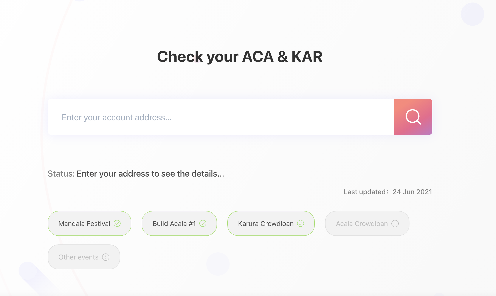

# Crowdloan Rewards

**🔥Base reward**: **19.95 KAR for every 1 KSM contributed 🔥**Check your rewards [here](https://distribution.acala.network).

## 1. Crowdloan Stats

* **Total KSM locked: 501k\~ KSM**
* **Number of Contributions:** 14.2k on-chain unique accounts; estimated 20k\~ accounts if accounted for exchange/agency individual participants
* **Contribution channels:** majority contributed directly
  * **13.2% via exchange**
  * **86.8% via non-custodial wallets** e.g. Polkadot{js} extension, Polkawallet, Fearless Wallet, MathWallet etc.
* **Contribution distribution**
  * **<1 KSM:**   2,893 (20.43%)
  * **<10 KSM**: 7,843 (55.4%)
  * **<50 KSM**: 2,383 (16.83%)
  * **<1k KSM**: 983 (6.94%)
  * **1,001-9,999 KSM:** 50 (0.35%)
  * **>10k KSM:** 6 (0.04%)

## 2. Reward Stats

* **Total base KAR reward**: 10,000,000 (10% of total fixed supply)
* **Total bonuses:** 1,548,000\~ (1.5% of total fixed supply)
* **Total KAR reward to be distributed:** 11.5%
* **🔥Base reward**: **19.95 KAR for every 1 KSM contributed 🔥**

## 3. Individual Reward Details

* **Base reward**: **19.95 KAR for every 1 KSM contributed**
* **Referral bonus**: 5% additional KAR for the referee, 5% for the referrer when a referral link used
* **Early Bird bonus (**Block **** 7830327-7873712**):** 10% additional KAR for contribution during the first 3 days of the Karura crowdloan
* **Auction Kickoff bonus (**Block **** 7923125-7920725**):** 5% additional KAR for contributing between 4 hours before the auction and the end of auction phase one
* **Other:**&#x20;
  * 5% referral bonuses is given to the keen ones who contributed in the first 2 hours of Karura crowdloan without a referral

## 4. Check Rewards

Rewards to be distributed are all recorded on the [`Distribution Website`](https://distribution.acala.network)

Most of the KAR rewards have been distributed (except for the ones that need to be claimed). You can check your balances&#x20;

* on the [Polkadot Apps - Karura parachain - Accounts](https://polkadot.js.org/apps/#/accounts) (you need to switch to the Karura parachain under Kusama) OR
* on [Karura Subscan explore](https://karura.subscan.io)
* If you participated via exchanges, all participated exchange rewards have been distributed to them, so please contact them directly

If your rewards are marked as `To be Claimed`, please [follow the guide here](claim-kar.md) to claim.

