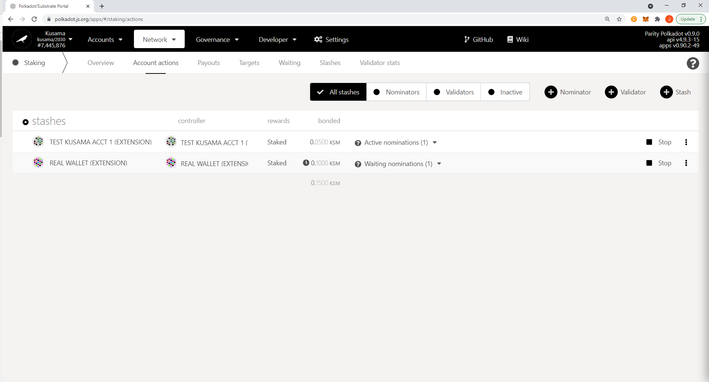
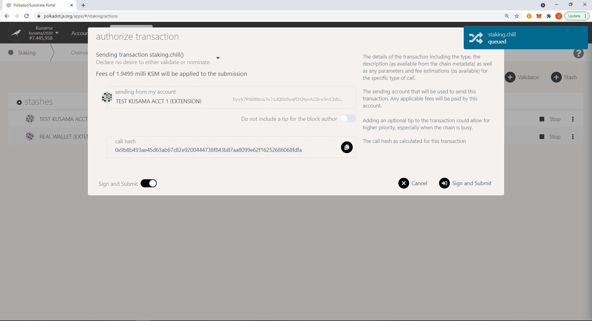
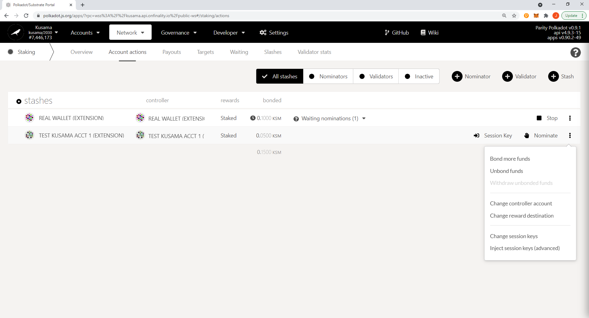
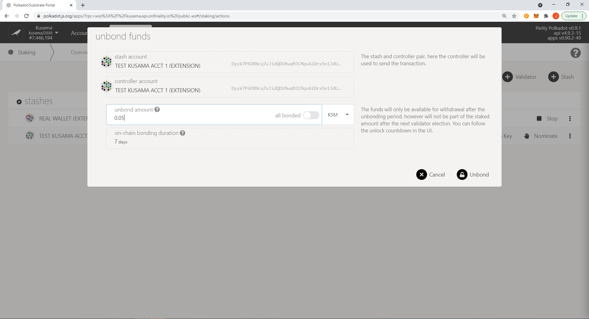
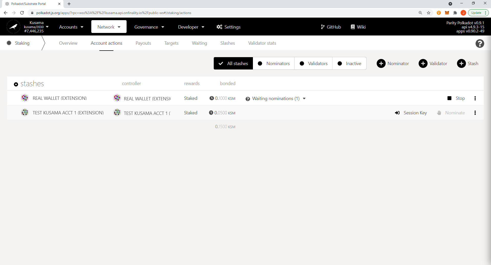

# Unstaking Your KSM Tokens on Polkadot.{js} Extension

You will need to unstake your KSM tokens prior to bonding them to the [crowdloan module](../../). For recently unstaked KSM tokens, Kusama has a delayed exit period (7 days), which serves as cooldown. During this period, you will not be able to transfer your tokens.



### Step 1: Stop nominating (staking) 

1.Open [Polkadot{.js}](https://polkadot.js.org/apps/#/explorer) and connect to the Kusama network. Then in the navigation bar at the top of the page, click on the “Network” dropdown and select “Staking.”

 (1).png>)

2\. Click on “Account actions” in the white sub-header towards the top of the screen. Then click “Stop” (towards the right of the screen) on the account that you’d like to unstake.

3\. Click “Sign and Submit” in the bottom right corner to authorize the transaction. Your browser extension will prompt you to enter your password and sign the transaction. You have now stopped nominating, but your tokens remain bonded.

### Step 2: Unbonding 

4.To unbond your tokens, click on the ellipses (three dots) on the right-hand side of the page and click “Unbond funds.”

5\. Enter the amount you’d like to unbond and then click “Unbond.” Sign and submit the transaction.

6\. If done successfully, there should be a clock icon next the amount you requested to be unbonded. You can hover over the icon to see how much longer until the tokens are fully unlocked, which is approximately 7 days.

7\. Once the 7 days have passed, return to the account actions tab, click on the three ellipses, and select “Withdraw unbonded funds.” This will make your KSM transferable. Even though it says “withdraw,” they won’t be leaving your account.

 (1).png>)

8\. Sign and submit the transaction.

.png>)

9\. You can return to “My Accounts” and select the dropdown next to balance to see that your KSM is now transferable.

.png>)
