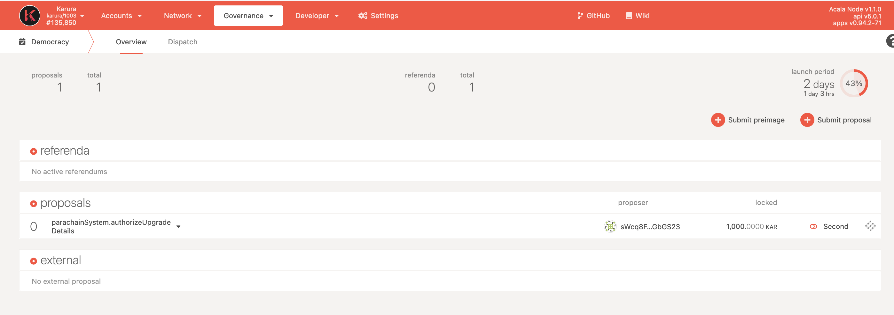

# How to Verify a Runtime Upgrade

This guide uses the runtime upgrade release 1.1.3 as an example.

Once the upgrade is proposed, you shall see it on the [Polkadot App - Karura parachain - Democracy section](https://polkadot.js.org/apps/?rpc=wss%3A%2F%2Fkarura-rpc-2.aca-api.network%2Fws#/democracy).

## Upgrade Preimage Info

Expand the proposal, and find the Preimage info.

* Preimage: `parachainSystem.authorizeUpgrade(0xd9660e7d73163f7b2e1591c08c60e68f4b47cb85dcba54d55c53b9573876f55e)`\
  &#x20;
* Hash: `0x4f8bf2c02c5a1e8cdcf7a94dabf2805c563c46a87876c684c5d79ffb745db115`

## Verify against code

In the discussion post of the proposal, it shall provide the release tag, runtime WASM file and other necessary information for others to verify it against the preimage proposed.

* Release page: [https://github.com/AcalaNetwork/Acala/releases/tag/1.1.3](https://github.com/AcalaNetwork/Acala/releases/tag/1.1.3)
* Runtime Wasm: [https://gateway.pinata.cloud/ipfs/QmTrUJragkgGrp3eNyun7n7p5zT8MFLE3s87o3ZJSyj4wf](https://gateway.pinata.cloud/ipfs/QmTrUJragkgGrp3eNyun7n7p5zT8MFLE3s87o3ZJSyj4wf)

### Take the following step to verify

#### 1. Build your own Wasm Runtime for the release

* srtool is used to build wasm
  * More about srtool:
    * [https://www.chevdor.com/post/2019/12/06/srtool/](https://www.chevdor.com/post/2019/12/06/srtool/)
    * [https://github.com/paritytech/srtool](https://github.com/paritytech/srtool)
* follow these steps to build
  * Install Docker
    * [https://docs.docker.com/get-docker/](https://docs.docker.com/get-docker/)
  * Clone Acala repo
    * `git clone https://github.com/AcalaNetwork/Acala.git`
  * Checkout release branch
    * `git checkout release-karura-1.1.3`
  * Build with srtool
    * `make srtool-build-wasm-karur`
  * Wait for compiling done and your wasm is built

#### 2. Generate hash & compare

In the `Developer - Extrinsics` tab, use the following and upload the wasm to generate the call hash. Compare this with the preimage hash proposed.&#x20;

.png>)
