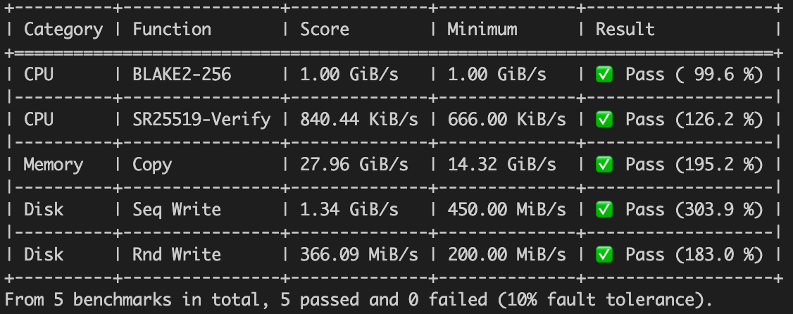

# Full Node

## Spec Requirement

You can check if your machine satisfy the spec requirement by using the following make command to benchmark your machine.

```
// If you are running docker image:
docker run acala/karura-node:latest benchmark machine --chain=karura

// If you are using dev environment:
make benchmark-machine
```

Note:

You need to setup your dev environment first for make commands to work.

The benchmark result will look similar to this: 

## Run from Source Code

* Clone the repo: [https://github.com/AcalaNetwork/Acala](https://github.com/AcalaNetwork/Acala)
* Checkout tag here: [https://github.com/AcalaNetwork/Acala/tags](https://github.com/AcalaNetwork/Acala/tags)
* Install dependencies
* Build Karura: `cargo build --release --features with-karura-runtime`
* Run `./target/release acala --chain=karura`

## Using Docker

* Image: `acala/karura-node:latest` or `acala/karura-node:[version number]`
* `docker run acala/karura-node:latest --chain=karura`

## Common CLI

* CLI is mostly the same as any Substrate-based chain such as Polkadot and Kusama
* Because there are two node services are running, `--` is used to split the CLI. Arguments before `--` are passed to the parachain full-node service and arguments after `--` is passed to the Relay Chain full-node service.
  * For example `--chain=parachain.json --ws-port=9944 -- --chain=relaychain.json --ws-port=9945` means
    * The parachain service is using `parachain.json` as the chain spec and the web socket RPC port is 9944
    *   The Relay Chain service is using `relaychain.json` as the chain spec and the web socket

        RPC port is 9945
* It is recommended to explicitly specify the ports for both services to avoid confusion
  * For example `--listen-addr=/ip4/0.0.0.0/tcp/30333 --listen-addr=/ip4/0.0.0.0/tcp/30334/ws -- --listen-addr=/ip4/0.0.0.0/tcp/30335 --listen-addr=/ip4/0.0.0.0/tcp/30336/ws`
* It is recommended to add `--execution=wasm` for parachain service to avoid syncing issues.

## Example CLI

### Archive PRC Node

```
--base-path=/acala/data
--chain=karura
--name=rpc-1
--pruning=archive
--ws-external
--rpc-external
--rpc-cors=all
--ws-port=9944
--rpc-port=9933
--ws-max-connections=2000
--execution=wasm
--
--chain=kusama
```
