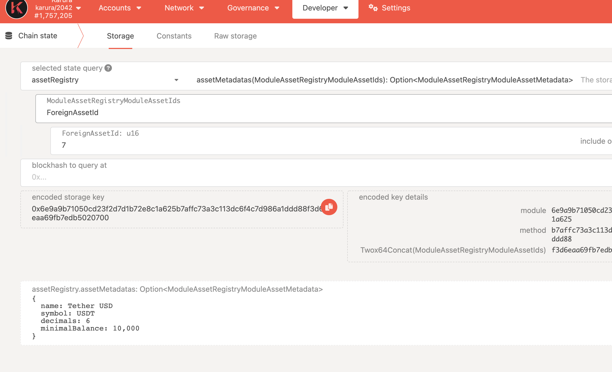

# Token Transfer

Karura supports different types of tokens than Kusama, and allows various ways to transfer tokens. This guide will walk through tokens available on Karura, tools can be used for transfers, how to send transfer transactions, monitor and track these transactions.

## Token Types
### Token
  
| Symbol | Description | CurrencyId | Decimals | Minimal Balance |
| --- | --- | --- | --- | --- |
| KAR | native token of Karura network | Token(KAR) | 12 | 0.1 KAR |
| aUSD | multi-collateralized stablecoin | Token(KUSD) | 12 | 0.01 aUSD |
| KSM | crossed to Karura from Kusama Relay Chain | Token(KSM) | 10 | 0.01 KSM |
| LKSM | tokenized staked LKSM from the Liquid Staking protocol | Token(LKSM) | 10 | 0.05 LKSM |
| BNC | Bifrost Native Token | Token(BNC) | 12 | 0.008 BNC |
| TAI | Taiga | Token(TAI) | 12 | 1 TAI |
| PHA | Phala Native Token | Token(PHA) | 12 | 0.04 PHA |
| KINT | Kintsugi Native Token | Token(KINT) | 12 | 0.00013333 KINT |
| VSKSM | Bifrost Voucher Slot KSM | Token(VSKSM) | 12 | 0.0001 VSKSM |
| KBTC | Kintsugi Wrapped BTC | Token(KBTC) | 8 | 0.00000066 KBTC |

 `AssetRegistry` registered the metadata info of this type token.

### DexShare
The lp share token for the trading pair of Karura DEX. The CurrencyId type of Karura DEX's lp token are `CurrencyId::DexShare`, and the decimals and minimal balance of lp token are same as the first token in `DexShare`.
For example, `CurrencyId::DexShare(Token(KAR), Token(KSM))` is the CurrencyId of lp token of KAR/KSM pair, its decimal is 12, and minimal balance is 0.1, these are same as KAR.

Currently,  `AssetRegistry` does not register metadata info of any lp token.

### Erc20
Token issued by ERC20 contracts deployed in Karura EVM+. The CurrencyId type is `Erc20(Address)`, `Address` is the ERC20 contract address on EVM+.

### StableAssetPoolToken

| Symbol | Description | CurrencyId | Decimals | Minimal Balance |
| --- | --- | --- | --- | --- |
| taiKSM | Taiga KSM | StableAssetPoolToken(0) | 12 | 0.0001 taiKSM |

 `AssetRegistry` registered the metadata info of this type token.

### ForeignAsset
| Symbol | Description | CurrencyId | Decimals | Minimal Balance |
| --- | --- | --- | --- | --- |
| RMRK | RMRK | ForeignAsset(0) | 10 | 0.01 RMRK |
| ARIS | PolarisDAO | ForeignAsset(1) | 8 | 0.001 ARIS |
| QTZ | Quartz | ForeignAsset(2) | 18 | 1 QTZ |
| MOVR | Moonriver | ForeignAsset(3) | 18 | 0.001 MOVR |
| HKO | Heiko | ForeignAsset(4) | 12 | 0.1 HKO |
| CSM | Crust Shadow Native Token | ForeignAsset(5) | 12 | 1 CSM |
| KICO | KICO | ForeignAsset(5) | 14 | 1 KICO |
| USDT | Tether USD | ForeignAsset(5) | 6 | 0.01 USDT |

Tokens originated from other parachains. 
 `AssetRegistry` registered the metadata info of this type token.

## Query token's metadata on assetRegistry

* **Native Network Token**
  * KAR
* **Native Protocol Tokens**
  * LKSM: tokenized staked KSM from the Liquid Staking protocol
  * kUSD: multi-collateralized stablecoin
* **Foreign Tokens**
  * KSM: crossed to Karura from Kusama Relay Chain
  * Tokens originated from other parachains
  * Tokens crossed from other blockchains such as ETH, renBTC or Compound CASH
* **ERC20 Tokens**
  * Token issued by ERC20 contracts deployed in Karura EVM

## Tools

* JS/TS SDK: [https://github.com/AcalaNetwork/acala.js](https://github.com/AcalaNetwork/acala.js)
* Blockchain explorer: [http://karura.subscan.io](http://karura.subscan.io)
* api-sidecar: [https://github.com/paritytech/substrate-api-sidecar](https://github.com/paritytech/substrate-api-sidecar)
* txwrapper: [https://github.com/AcalaNetwork/txwrapper](https://github.com/AcalaNetwork/txwrapper)
* SubQuery: [https://github.com/AcalaNetwork/acala-subql](https://github.com/AcalaNetwork/acala-subql)

## Token balances

Query chain state to get token balances.

### Native token (KAR) balances

Query `system` module to get native token (KAR) balances data.

#### system.account

* Returns the `AccountInfo` of given account. For different types of balances, check the fields in `AccountInfo.data`
  * `free`: the free balance.
  * `reserve`: the reserved balance.

### Other tokens

For non-native tokens, like KSM, LKSM, kUSD, query `tokens` module to get balances info.

#### tokens.accounts

* Returns the `OrmlAccountData` of given account and currency ID. For different types of balances, check the fields:
  * `free`: the free balance.
  * `reserved`: the reserved balance.

#### tokens.lock

* Returns the `BalanceLock` of given account and currency ID. `BalanceLock` has two fields:
  * `id`: the lock identifier.
  * `amount.` the locked amount.
* Note locks could be overlapped, and the same amount of tokens could be under locked by multiple locks.

## Send Tokens

### Transactions

#### currencies.transfer

* [https://karura.subscan.io/extrinsic?module=Currencies\&call=transfer](https://karura.subscan.io/extrinsic?module=Currencies\&call=transfer)
* This can be used to send any supported tokens in the network, including KAR, KSM, LKSM, kUSD etc.

#### currencies.transferNativeCurrency

* [https://karura.subscan.io/extrinsic?module=Currencies\&call=transfer\_native\_currency](https://karura.subscan.io/extrinsic?module=Currencies\&call=transfer\_native\_currency)
* This can be used to send native token (KAR). It has slightly cheaper transaction fees compare to currencies.transfer

#### balances.transfer

* [https://karura.subscan.io/extrinsic?module=Balances\&call=transfer](https://karura.subscan.io/extrinsic?module=Balances\&call=transfer)
* Same as `currencies.transferNativeCurrency`, only for native token (KAR).
* Compatible with Polkadot / Kusama and most other Substrate-based chains.

## Receive Tokens

There are multiple ways to detect incoming balance transfers:

* Monitor events
* Subscribe storage changes
* Monitor transactions

### Monitor Events

Monitoring events is a recommended way to track incoming balance transfers. It can handle **ALL** types of transfer transactions including the one that is not initiated by a transaction directly (e.g. delayed proxy).

#### balances.transfer

* [https://karura.subscan.io/event?module=Balances\&event=Transfer](https://karura.subscan.io/event?module=Balances\&event=Transfer)
* Emitted when a native token (KAR) transfer happened.

#### currencies.transfer

* [https://karura.subscan.io/event?module=Currencies\&event=Transferred](https://karura.subscan.io/event?module=Currencies\&event=Transferred)
* Emitted when a token transfer happened.
* NOTE: This is not emitted when balances.transfer is used to make a transfer.

#### currencies.deposit

* [https://karura.subscan.io/event?module=Currencies\&event=Deposited](https://karura.subscan.io/event?module=Currencies\&event=Deposited)
* Emitted when a token is minted to an account. This could happen when it is a cross-chain transfer or it is a transaction minting stablecoins.
  * For cross-chain transfer, there would be `ExecutedDownward` event along with the deposit. [https://karura.subscan.io/event?address=\&module=dmpqueue\&event=executeddownward](https://karura.subscan.io/event?address=\&module=dmpqueue\&event=executeddownward)

#### xtokens.transferred

* [https://karura.subscan.io/event?address=\&module=xtokens\&event=transferred](https://karura.subscan.io/event?address=\&module=xtokens\&event=transferred)
* Emitted when a cross-chain transfer happened from Karura to other chains.
* Triggered by `xtokens.transfer` extrinsic.

#### xtokens.transferredmultiasset

* [https://karura.subscan.io/event?address=\&module=xtokens\&event=transferredmultiasset](https://karura.subscan.io/event?address=\&module=xtokens\&event=transferredmultiasset)
* Emitted when a cross-chain transfer happened from Karura to other chains.
* Triggered by `xtokens.transfer_multiasset` extrinsic.

### Storage changes RPC

* [state\_subscribeStorage](https://polkadot.js.org/docs/substrate/rpc#subscribestoragekeys-vecstoragekey-storagechangeset)
  * Subscribe to a list of account balances. However, it does not guarantee subscription delivery due to connection errors or blockchain reorg.

### Monitor Transactions

It is possible to fetch transactions in every block, check for transfer transactions, and check if the transfer transaction is successful. However, this may likely yield false-negative results i.e. deposit received but failed to recognize, due to the various ways for transfer.

Refer to Send Tokens section for direct transfer transactions. In additional, to sending transfer transactions individually, there are common utility methods to batch send transfer transactions:

#### utility.batch

* [https://karura.subscan.io/extrinsic?module=Utility\&call=batch](https://karura.subscan.io/extrinsic?module=Utility\&call=batch)
* This can be used to send batch transaction
* NOTE: batched transactions will always emit success events.
  * `utility.BatchCompleted` event indicates that all transactions are successful
  * `utility.BatchInterrupted` event indicates which transaction failed. Transactions before the failed transaction are executed successfully and will not be reverted.

#### utility.batchAll

* [https://karura.subscan.io/extrinsic?module=Utility\&call=batch\_all](https://karura.subscan.io/extrinsic?module=Utility\&call=batch\_all)
* This is similar to utility.batch but will revert all transactions upon failed transaction.

## [Transfer Code Samples](https://github.com/AcalaNetwork/acala-js-example/blob/21a3be3538260cc8a047856bf163dad75de1db3a/src/transfer-examples/readme.md)
